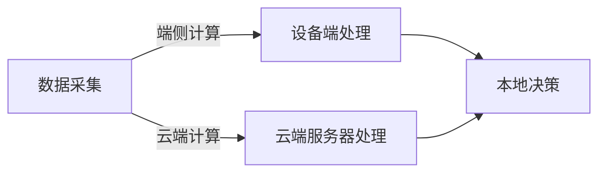

                 

端侧计算、云端计算、大模型、边缘计算、模型压缩、模型量化、模型分布式、模型并行、模型推理

## 1. 背景介绍

随着深度学习和大模型的发展，计算资源需求呈指数级增长。传统的云端计算模式面临着成本高、延时大、隐私泄露等挑战。端侧计算以其低延时、低成本、高隐私的优势，成为大模型计算的重要方向之一。本文将从端侧计算和云端计算的对比入手，分析大模型计算的未来走向。

## 2. 核心概念与联系

### 2.1 端侧计算与云端计算

端侧计算（Edge Computing）指的是将计算任务从云端转移到设备端，在设备端进行数据处理和决策。云端计算（Cloud Computing）则是将计算任务上传到云端，由云端服务器进行处理。二者的区别如下：



### 2.2 大模型计算

大模型计算指的是利用大规模的模型进行计算任务，如语言模型、图像识别模型等。大模型计算的特点是模型参数量大、计算复杂度高、内存需求大。

### 2.3 端侧计算与大模型计算的联系

端侧计算与大模型计算的联系在于，端侧计算可以解决大模型计算面临的成本高、延时大、隐私泄露等挑战。端侧计算可以将大模型推理任务下沉到设备端，减少数据传输量，降低延时，保护隐私数据。

## 3. 核心算法原理 & 具体操作步骤

### 3.1 算法原理概述

大模型计算的核心是模型推理，即利用训练好的模型进行预测。端侧计算需要解决的关键问题是如何将大模型部署到设备端，并进行高效的推理。

### 3.2 算法步骤详解

端侧计算的关键步骤包括：

1. 模型压缩：将大模型压缩成小模型，以适应设备端有限的计算资源。
2. 模型量化：将模型参数量化为低精度数据类型，进一步减小模型大小和计算开销。
3. 模型分布式：将模型分布式部署到多个设备端，利用并行计算提高推理效率。
4. 模型并行：在单个设备端内，利用并行计算加速模型推理。

### 3.3 算法优缺点

端侧计算的优点包括低延时、低成本、高隐私。缺点包括设备端资源有限、模型压缩和量化可能导致精度下降。

### 3.4 算法应用领域

端侧计算的应用领域包括自动驾驶、物联网、视频监控、语音识别等实时性要求高、隐私保护要求高的场景。

## 4. 数学模型和公式 & 详细讲解 & 举例说明

### 4.1 模型压缩

模型压缩的目的是将大模型压缩成小模型，以适应设备端有限的计算资源。常用的模型压缩方法包括剪枝（Pruning）、量化（Quantization）、 Knowledge Distillation 等。

### 4.2 模型量化

模型量化的目的是将模型参数量化为低精度数据类型，进一步减小模型大小和计算开销。常用的模型量化方法包括整数量化（Integer Quantization）、对数量化（Logarithmic Quantization）等。

### 4.3 案例分析与讲解

例如，在自动驾驶场景中，需要实时进行物体检测和跟踪。如果将模型部署到云端，则需要将感知数据上传到云端，进行推理后再下发决策，延时过大。如果将模型部署到设备端，则需要解决模型大小和计算开销的问题。通过模型压缩和量化，可以将大模型压缩为小模型，并将模型参数量化为低精度数据类型，从而满足设备端的计算资源需求。

## 5. 项目实践：代码实例和详细解释说明

### 5.1 开发环境搭建

端侧计算的开发环境包括设备端开发环境和云端开发环境。设备端开发环境需要支持端侧计算框架，如 TensorFlow Lite、PyTorch Mobile 等。云端开发环境需要支持云端计算平台，如 AWS、Google Cloud、Azure 等。

### 5.2 源代码详细实现

以模型压缩为例，以下是模型剪枝的 Python 代码实现：

```python
import tensorflow as tf

# 加载模型
model = tf.keras.models.load_model('model.h5')

# 设置剪枝阈值
pruning_threshold = 0.1

# 进行剪枝
pruning_filter = tf.math.greater(tf.abs(model.weights[0]), pruning_threshold)
model.weights[0] = tf.boolean_mask(model.weights[0], pruning_filter)

# 保存模型
model.save('pruned_model.h5')
```

### 5.3 代码解读与分析

上述代码首先加载模型，然后设置剪枝阈值，进行剪枝，最后保存模型。剪枝的原理是将权重值小于阈值的权重剪掉，从而减小模型大小。

### 5.4 运行结果展示

剪枝后的模型大小会减小，但精度可能会略微下降。通过调整剪枝阈值，可以平衡模型大小和精度。

## 6. 实际应用场景

### 6.1 自动驾驶

自动驾驶需要实时进行物体检测和跟踪，端侧计算可以满足实时性要求，并保护隐私数据。

### 6.2 物联网

物联网需要对海量数据进行实时处理，端侧计算可以减轻云端服务器的压力，提高系统吞吐量。

### 6.3 视频监控

视频监控需要实时进行目标检测和跟踪，端侧计算可以降低延时，提高系统响应速度。

### 6.4 未来应用展望

端侧计算的未来应用包括智能城市、智能工厂、智能医疗等领域。随着物联网的发展，端侧计算将成为大模型计算的主流方向之一。

## 7. 工具和资源推荐

### 7.1 学习资源推荐

推荐阅读以下文献：

* "Edge Computing: Vision and Challenges" (IEEE Access, 2019)
* "Deep Learning on Resource-Constrained Devices: A Survey" (IEEE Transactions on Neural Networks and Learning Systems, 2020)
* "Model Compression: A Survey of Techniques, Tools, and Applications" (arXiv preprint arXiv:1902.08155, 2019)

### 7.2 开发工具推荐

推荐使用以下开发工具：

* 端侧计算框架：TensorFlow Lite、PyTorch Mobile、NNAdapter、TVM
* 云端计算平台：AWS、Google Cloud、Azure、Alibaba Cloud
* 模型压缩工具：TensorFlow Model Optimization Toolkit、NVIDIA TensorRT、Intel Distribution for Python

### 7.3 相关论文推荐

推荐阅读以下论文：

* "MobileNetV2: Inverted Residuals and Linear Bottlenecks" (arXiv preprint arXiv:1801.04381, 2018)
* "GhostNet: More Features from Cheap Operations" (arXiv preprint arXiv:1912.03242, 2019)
* "EdgeML: A Deep Learning Framework for Edge Devices" (IEEE Access, 2020)

## 8. 总结：未来发展趋势与挑战

### 8.1 研究成果总结

端侧计算是大模型计算的重要方向之一，可以解决云端计算面临的成本高、延时大、隐私泄露等挑战。端侧计算的关键技术包括模型压缩、模型量化、模型分布式、模型并行等。

### 8.2 未来发展趋势

端侧计算的未来发展趋势包括：

* 模型压缩和量化技术的进一步发展，以满足设备端计算资源需求。
* 模型分布式和并行技术的发展，以提高推理效率。
* 端侧计算和云端计算的结合，以实现端云协同。

### 8.3 面临的挑战

端侧计算面临的挑战包括：

* 设备端资源有限，模型压缩和量化可能导致精度下降。
* 模型分布式和并行技术的开发和部署成本高。
* 端侧计算和云端计算的协同开发和部署挑战。

### 8.4 研究展望

端侧计算的研究展望包括：

* 模型压缩和量化技术的进一步发展，以满足设备端计算资源需求。
* 模型分布式和并行技术的发展，以提高推理效率。
* 端侧计算和云端计算的结合，以实现端云协同。
* 端侧计算和边缘计算的结合，以实现边缘端云协同。

## 9. 附录：常见问题与解答

### 9.1 端侧计算和云端计算有什么区别？

端侧计算和云端计算的区别在于计算任务的执行地点不同。端侧计算将计算任务下沉到设备端，云端计算则将计算任务上传到云端服务器。

### 9.2 端侧计算适合哪些场景？

端侧计算适合实时性要求高、隐私保护要求高的场景，如自动驾驶、物联网、视频监控等。

### 9.3 端侧计算面临哪些挑战？

端侧计算面临的挑战包括设备端资源有限、模型压缩和量化可能导致精度下降、模型分布式和并行技术的开发和部署成本高等。

## 作者：禅与计算机程序设计艺术 / Zen and the Art of Computer Programming

