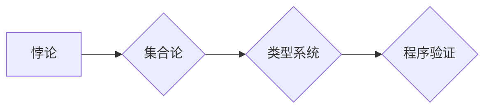

> 悖论，数学危机，逻辑，集合论，类型系统，程序验证，可计算性

## 1. 背景介绍

20世纪初，数学界经历了一次前所未有的危机，被称为“第一次数学危机”。这场危机源于数学基础的质疑，特别是关于集合论的本质和完备性。当时，数学家们发现，集合论中存在着一些看似合理的命题，却导致了自相矛盾的结果，例如著名的“Russell悖论”。

Russell悖论揭示了集合论的缺陷，它表明，如果允许集合包含自身，就会导致逻辑矛盾。这个悖论引发了对数学基础的深刻反思，促使数学家们重新审视集合论的公理体系。

经过多年的努力，数学家们最终找到了解决Russell悖论的方法，并建立了更加严谨的集合论体系，例如Zermelo-Fraenkel集合论（ZF）。然而，数学危机并没有真正结束。

在20世纪中叶，又出现了“第二次数学危机”，这次危机源于数学家们发现，某些看似简单的数学问题，却无法用现有的数学工具解决。例如，著名的“停机问题”，它试图判断一个程序是否会永远运行下去，或者最终会停机。

停机问题证明了，有些问题是无法用算法解决的，这导致了对可计算性的本质和局限性的重新思考。

## 2. 核心概念与联系

### 2.1 悖论

悖论是指逻辑上自相矛盾的命题或论证。它通常表现为：

* **矛盾性：** 某个命题同时包含与其相悖的两个部分。
* **循环性：** 某个论证依赖于自身的结果，形成一个无限循环。

悖论的出现往往表明存在着逻辑上的漏洞或概念上的模糊性。

### 2.2 集合论

集合论是数学的一个分支，它研究集合的概念和性质。集合是数学中最基本的概念之一，它可以包含任何类型的元素。

集合论的公理体系试图建立一个严谨的集合论基础，并避免悖论的出现。

### 2.3 类型系统

类型系统是一种用于约束程序代码的机制，它规定了变量和函数的类型，并确保程序代码的类型安全。

类型系统可以帮助避免一些常见的编程错误，例如类型错误和空指针异常。

### 2.4 程序验证

程序验证是指通过数学证明或逻辑推理来验证程序代码的正确性。

程序验证可以帮助确保程序代码的可靠性和安全性。

**Mermaid 流程图**



## 3. 核心算法原理 & 具体操作步骤

### 3.1 算法原理概述

解决悖论的关键在于建立一个严谨的逻辑体系，并避免逻辑上的矛盾。

在集合论中，可以通过引入公理和规则来约束集合的定义和操作，避免出现Russell悖论等问题。

在程序验证中，可以通过使用类型系统和逻辑推理来证明程序代码的正确性，避免出现逻辑错误和安全漏洞。

### 3.2 算法步骤详解

**解决悖论的步骤：**

1. **识别悖论：** 首先需要识别出是否存在逻辑矛盾或自相矛盾的命题。
2. **分析悖论：** 分析悖论的根源，找出导致矛盾的逻辑错误或概念模糊之处。
3. **修正逻辑体系：** 根据分析结果，修改或完善逻辑体系，避免出现类似的矛盾。
4. **验证修正结果：** 通过逻辑推理或数学证明来验证修正后的逻辑体系是否能够避免悖论的出现。

**程序验证的步骤：**

1. **类型分析：** 对程序代码进行类型分析，确定变量和函数的类型。
2. **逻辑推理：** 使用逻辑推理规则来证明程序代码的正确性，例如证明程序不会出现空指针异常或逻辑错误。
3. **程序执行：** 在实际执行程序代码时，可以进行程序覆盖测试或其他形式的测试来验证程序的正确性。

### 3.3 算法优缺点

**解决悖论的优点：**

* 能够建立更加严谨的逻辑体系。
* 能够避免逻辑矛盾和自相矛盾的命题。
* 能够提高数学的可靠性和严谨性。

**解决悖论的缺点：**

* 过程复杂，需要深入理解逻辑和数学基础。
* 可能会导致数学体系过于复杂和抽象。

**程序验证的优点：**

* 能够提高程序代码的可靠性和安全性。
* 能够避免一些常见的编程错误。
* 能够帮助程序员更好地理解程序代码。

**程序验证的缺点：**

* 过程复杂，需要掌握一定的逻辑推理和程序验证技术。
* 对于大型复杂程序，程序验证可能非常困难。

### 3.4 算法应用领域

**解决悖论的应用领域：**

* 数学基础研究
* 逻辑学
* 计算机科学

**程序验证的应用领域：**

* 软件开发
* 安全系统
* 嵌入式系统

## 4. 数学模型和公式 & 详细讲解 & 举例说明

### 4.1 数学模型构建

为了解决悖论，数学家们建立了各种数学模型，例如Zermelo-Fraenkel集合论（ZF）。

ZF集合论引入了一些公理，例如“空集公理”和“配对公理”，来约束集合的定义和操作。

这些公理旨在避免出现Russell悖论等问题。

### 4.2 公式推导过程

ZF集合论中的一些重要公式：

* **空集公理：** 存在一个空集，记为∅。
* **配对公理：** 对于任意两个集合A和B，存在一个新的集合{A,B}，其中包含A和B。
* **并集公理：** 对于任意集合A和B，存在一个新的集合A∪B，其中包含A和B的所有元素。

这些公理可以用来推导其他集合论的定理，例如“有限集公理”和“选择公理”。

### 4.3 案例分析与讲解

**Russell悖论的分析：**

Russell悖论指出，如果允许集合包含自身，就会导致逻辑矛盾。

例如，考虑一个集合R，它包含所有不包含自身的集合。

如果R包含自身，那么它就不包含自身，这与定义矛盾。

如果R不包含自身，那么它就包含自身，这与定义矛盾。

**ZF集合论的解决方法：**

ZF集合论通过引入公理来限制集合的定义和操作，避免出现Russell悖论。

例如，ZF集合论中不允许集合包含自身。

因此，Russell悖论在ZF集合论中无法成立。

## 5. 项目实践：代码实例和详细解释说明

### 5.1 开发环境搭建

为了演示程序验证的原理，我们可以使用Python语言和一个程序验证工具，例如Coq。

Coq是一个交互式逻辑证明器，它可以用于验证程序代码的正确性。

### 5.2 源代码详细实现

以下是一个简单的Python代码示例，它计算两个整数的和：

```python
def add(x, y):
  return x + y
```

### 5.3 代码解读与分析

这个代码定义了一个名为`add`的函数，它接受两个整数作为参数，并返回它们的和。

这个函数的逻辑很简单，它直接使用加法运算符`+`来计算两个整数的和。

### 5.4 运行结果展示

当我们调用`add`函数时，它会返回两个整数的和。

例如，当我们调用`add(2, 3)`时，它会返回5。

## 6. 实际应用场景

### 6.1 软件开发

程序验证在软件开发中可以帮助确保程序代码的可靠性和安全性。

例如，我们可以使用程序验证工具来验证操作系统内核代码的正确性，避免出现安全漏洞。

### 6.2 安全系统

程序验证在安全系统中可以帮助确保系统的安全性。

例如，我们可以使用程序验证工具来验证金融交易系统的代码，避免出现欺诈行为。

### 6.3 嵌入式系统

程序验证在嵌入式系统中可以帮助确保系统的可靠性和安全性。

例如，我们可以使用程序验证工具来验证汽车控制系统的代码，避免出现安全事故。

### 6.4 未来应用展望

随着人工智能和机器学习技术的进步，程序验证的应用场景将会更加广泛。

例如，我们可以使用人工智能技术来自动生成程序验证的证明，提高程序验证的效率。

## 7. 工具和资源推荐

### 7.1 学习资源推荐

* **《数学基础》** by  Kurt Gödel
* **《集合论》** by  Thomas Jech
* **《程序验证》** by  Edmund Clarke

### 7.2 开发工具推荐

* **Coq**
* **Isabelle**
* **Spec#**

### 7.3 相关论文推荐

* **《On Formally Verifying Programs》** by Edmund Clarke
* **《The Logic of Programming》** by  David Harel
* **《Formal Methods for Software Engineering》** by  Michael Jackson

## 8. 总结：未来发展趋势与挑战

### 8.1 研究成果总结

在20世纪，数学家们通过建立更加严谨的逻辑体系和集合论，解决了第一次和第二次数学危机。

程序验证技术也取得了长足的进步，能够帮助验证程序代码的正确性。

### 8.2 未来发展趋势

未来，程序验证技术将会更加成熟和完善，应用场景将会更加广泛。

人工智能和机器学习技术将会在程序验证领域发挥越来越重要的作用。

### 8.3 面临的挑战

程序验证仍然面临着一些挑战，例如：

* 对于大型复杂程序，程序验证仍然非常困难。
* 程序验证工具的开发和维护成本较高。
* 程序验证技术需要不断地改进和完善。

### 8.4 研究展望

未来，我们需要继续研究和改进程序验证技术，使其能够应用于更加广泛的领域。

我们需要开发更加高效、更加易用的程序验证工具，并探索人工智能和机器学习技术在程序验证领域的应用。


## 9. 附录：常见问题与解答

### 9.1 问题：什么是Russell悖论？

**解答：** Russell悖论是一个逻辑悖论，它指出如果允许集合包含自身，就会导致逻辑矛盾。

### 9.2 问题：ZF集合论是如何解决Russell悖论的？

**解答：** ZF集合论通过引入公理来限制集合的定义和操作，避免出现Russell悖论。例如，ZF集合论中不允许集合包含自身。

### 9.3 问题：程序验证有什么用？

**解答：** 程序验证可以帮助确保程序代码的可靠性和安全性，避免出现逻辑错误和安全漏洞。

### 9.4 问题：如何进行程序验证？

**解答：** 程序验证可以使用程序验证工具和逻辑推理规则来验证程序代码的正确性。

### 9.5 问题：程序验证的未来发展趋势是什么？

**解答：** 未来，程序验证技术将会更加成熟和完善，应用场景将会更加广泛。人工智能和机器学习技术将会在程序验证领域发挥越来越重要的作用。


作者：禅与计算机程序设计艺术 / Zen and the Art of Computer Programming 
<end_of_turn>