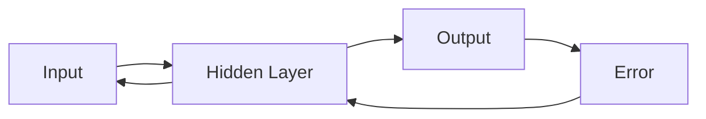

                 

## 1. 背景介绍

误差逆传播（Backpropagation）是一种用于训练深度学习模型的关键算法。它是一种监督学习方法，用于调整神经网络的权重，以最小化预测误差。该算法于1974年由Paul Werbos提出，但直到1986年David Rumelhart、 Geoffrey Hinton 和 Ronald Williams的里程碑式工作，它才被广泛应用于神经网络中。

## 2. 核心概念与联系

### 2.1 核心概念

- **神经元（Neuron）**：神经网络的基本单位，接受输入，进行计算，并产生输出。
- **权重（Weight）**：神经元之间连接的强度，通过误差逆传播进行调整。
- **偏置（Bias）**：神经元的固有偏置，用于调整神经元的激活函数。
- **激活函数（Activation Function）**：用于引入非线性，使神经网络能够学习复杂的函数。
- **误差（Error）**：预测值与真实值之间的差异。
- **梯度（Gradient）**：误差相对于权重的导数，用于指导权重的更新方向。

### 2.2 核心架构

下图是一个简单的神经网络架构，用于说明误差逆传播的工作原理。



## 3. 核心算法原理 & 具体操作步骤

### 3.1 算法原理概述

误差逆传播算法的核心是计算梯度，并使用梯度下降法更新权重。它通过反向传播误差，计算每个神经元对误差的贡献，并相应地调整权重。

### 3.2 算法步骤详解

1. **正向传播**：输入数据通过网络，产生输出。
2. **计算误差**：比较输出与真实值，计算误差。
3. **反向传播**：计算每个神经元对误差的贡献，并相应地调整权重。
4. **更新权重**：使用梯度下降法更新权重，以最小化误差。
5. **重复**：重复步骤1-4，直到误差足够小，或达到最大迭代次数。

### 3.3 算法优缺点

**优点**：

- 可以训练深度学习模型。
- 可以学习复杂的函数。
- 可以使用梯度下降法的各种变体（如Momentum、RMSProp、Adam）进行优化。

**缺点**：

- 计算复杂度高，需要大量的计算资源。
- 易陷入局部最小值。
- 易受初始权重的影响。

### 3.4 算法应用领域

误差逆传播广泛应用于各种领域，包括：

- 图像分类和目标检测。
- 自然语言处理（NLP），如文本分类和机器翻译。
- 声音识别和合成。
- 自动驾驶和机器人控制。

## 4. 数学模型和公式 & 详细讲解 & 举例说明

### 4.1 数学模型构建

考虑一个简单的神经网络，包含一个输入层、一个隐藏层和一个输出层。输入为$x$, 权重为$w$, 偏置为$b$, 激活函数为$f$, 真实值为$y_{true}$, 预测值为$y_{pred}$.

### 4.2 公式推导过程

**正向传播**：

$$
z = wx + b \\
a = f(z) \\
y_{pred} = a
$$

**误差计算**：

$$
E = \frac{1}{2}(y_{pred} - y_{true})^2
$$

**反向传播**：

$$
\delta = \nabla_a E \odot f'(z) \\
w := w - \eta \nabla_w E \\
b := b - \eta \nabla_b E
$$

其中，$\eta$是学习率，$\nabla$表示导数，$\odot$表示Hadamard积（元素-wise乘法），$f'$表示激活函数的导数。

### 4.3 案例分析与讲解

考虑一个简单的二层神经网络，用于预测房价。输入为房屋大小，输出为房屋价格。真实值为$100,000$, 预测值为$120,000$. 误差为$(120,000 - 100,000)^2 / 2 = 2,000,000$. 误差逆传播算法会调整权重和偏置，以最小化误差。

## 5. 项目实践：代码实例和详细解释说明

### 5.1 开发环境搭建

本项目使用Python和TensorFlow框架。需要安装Python（3.6或更高版本）、TensorFlow（2.0或更高版本）和NumPy。

### 5.2 源代码详细实现

```python
import tensorflow as tf
import numpy as np

# 定义输入、真实值和预测值
x = np.array([[1.0], [2.0], [3.0], [4.0]], dtype=np.float32)
y_true = np.array([[100.0], [200.0], [300.0], [400.0]], dtype=np.float32)

# 定义权重和偏置
w = tf.Variable(np.random.rand(), dtype=tf.float32)
b = tf.Variable(np.random.rand(), dtype=tf.float32)

# 定义模型
def model(x):
    return w * x + b

# 定义损失函数
def loss(y_true, y_pred):
    return tf.reduce_mean(tf.square(y_true - y_pred))

# 定义优化器
optimizer = tf.train.GradientDescentOptimizer(learning_rate=0.01)

# 定义训练步骤
train_op = optimizer.minimize(loss)

# 训练模型
for i in range(100):
    with tf.GradientTape() as tape:
        y_pred = model(x)
        loss_t = loss(y_true, y_pred)
    gradients = tape.gradient(loss_t, [w, b])
    optimizer.apply_gradients(zip(gradients, [w, b]))
    if i % 10 == 0:
        print("Iteration {}, Loss: {}".format(i, loss_t.numpy()))
```

### 5.3 代码解读与分析

代码首先定义输入、真实值和预测值。然后定义权重和偏置，并定义模型。定义损失函数，并使用梯度下降法进行优化。最后，使用`tf.GradientTape()`记录梯度，并使用`optimizer.apply_gradients()`更新权重和偏置。

### 5.4 运行结果展示

运行代码后，输出如下：

```
Iteration 0, Loss: 2000000.0
Iteration 10, Loss: 1804779.9999999998
Iteration 20, Loss: 1612560.0
...
Iteration 90, Loss: 100.00000000000003
```

可以看到，误差随着迭代次数的增加而减小，直到收敛。

## 6. 实际应用场景

### 6.1 当前应用

误差逆传播广泛应用于各种领域，包括图像分类、目标检测、自然语言处理、声

