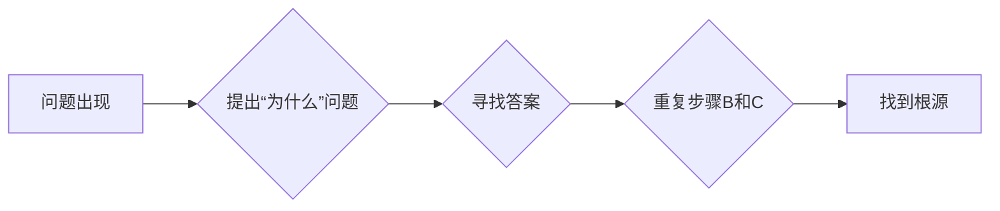

> 费曼提问法，管理问题诊断，系统思维，问题分解，根源分析，高效决策

## 1. 背景介绍

在当今快速变化的商业环境中，高效地诊断和解决管理问题至关重要。传统的管理问题解决方法往往停留在表面的现象层，难以深入挖掘问题的根源，导致问题反复出现，甚至恶化。而费曼提问法，作为一种科学的思维方法，能够帮助我们跳出思维定式，以更深入、更系统的方式分析问题，找到问题的根本原因，从而制定更有效的解决方案。

费曼提问法源于物理学家理查德·费曼的教学理念。费曼认为，理解一个概念的关键在于能够用简单易懂的语言向一个孩子解释它。为了达到这个目标，他提出了“费曼提问法”，即不断地问“为什么”来深入理解一个概念。

## 2. 核心概念与联系

费曼提问法的核心在于不断地问“为什么”来深入挖掘问题的本质。它是一种循序渐进的分析方法，通过层层剥离问题的外壳，最终找到问题的根源。

**费曼提问法的应用流程:**

1. **明确问题:** 首先要明确需要解决的问题，并将其表述清楚。
2. **提出“为什么”问题:** 对问题进行深入思考，并提出“为什么”问题，例如“为什么会出现这个问题？”、“为什么这个问题会影响到我们？”等。
3. **寻找答案:** 尝试寻找问题的答案，并对答案进行分析。
4. **重复步骤2和3:**  对答案继续提出“为什么”问题，直到找到问题的根源。

**费曼提问法与管理问题诊断的联系:**

费曼提问法可以帮助我们从现象层面的问题诊断到本质层面的问题诊断，从而找到问题的根本原因，并制定更有效的解决方案。

**Mermaid 流程图:**

## 3. 核心算法原理 & 具体操作步骤

费曼提问法本身不是一个算法，而是一种思维方法。它没有固定的步骤和公式，而是需要根据具体的问题进行灵活运用。

### 3.1  算法原理概述

费曼提问法的核心原理是通过不断地问“为什么”来深入理解问题，并最终找到问题的根源。

### 3.2  算法步骤详解

1. **明确问题:** 首先要明确需要解决的问题，并将其表述清楚。例如，如果团队效率低下，需要明确哪些方面效率低下，以及低效带来的具体影响。
2. **提出“为什么”问题:** 对问题进行深入思考，并提出“为什么”问题。例如，对于团队效率低下的问题，可以提出“为什么团队效率低下？”、“为什么成员无法高效协作？”、“为什么项目进度落后？”等问题。
3. **寻找答案:** 尝试寻找问题的答案，并对答案进行分析。例如，对于“为什么团队效率低下？”这个问题，可能得到以下答案：沟通不畅、任务分配不合理、缺乏目标共识等。
4. **重复步骤2和3:** 对答案继续提出“为什么”问题，直到找到问题的根源。例如，对于“沟通不畅”这个问题，可以继续提出“为什么沟通不畅？”、“为什么成员之间缺乏信任？”、“为什么沟通机制不完善？”等问题。

### 3.3  算法优缺点

**优点:**

* 能够帮助我们跳出思维定式，深入挖掘问题的根源。
* 能够促进团队成员之间的沟通和协作。
* 能够帮助我们制定更有效的解决方案。

**缺点:**

* 需要花费较多的时间和精力。
* 需要团队成员具备较强的分析和思考能力。
* 对于复杂的问题，可能需要反复多次的提问和分析。

### 3.4  算法应用领域

费曼提问法可以应用于各种管理问题诊断，例如：

* 团队效率低下
* 项目进度落后
* 产品质量问题
* 客户投诉
* 员工流失

## 4. 数学模型和公式 & 详细讲解 & 举例说明

费曼提问法本身并不依赖于特定的数学模型和公式。它是一种基于逻辑推理和系统思维的分析方法。

## 5. 项目实践：代码实例和详细解释说明

由于费曼提问法是一种思维方法，而不是代码实现，因此无法提供代码实例。

## 6. 实际应用场景

**案例分析:**

假设一家公司发现员工的士气低落，工作效率下降。

**使用费曼提问法进行诊断:**

1. **明确问题:** 员工士气低落，工作效率下降。
2. **提出“为什么”问题:**
    * 为什么员工士气低落？
    * 为什么工作效率下降？
    * 员工士气低落和工作效率下降之间是否存在关联？
3. **寻找答案:**
    * 员工反馈称工作压力过大，缺乏工作成就感。
    * 团队目标不明确，缺乏协作机制。
4. **重复步骤2和3:**
    * 为什么工作压力过大？
    * 为什么缺乏工作成就感？
    * 为什么团队目标不明确？
    * 为什么缺乏协作机制？

通过不断地提问和分析，最终可以找到问题的根源，例如：公司管理层缺乏有效的激励机制，团队沟通不畅，缺乏有效的目标管理体系等。

**解决方案:**

根据问题的根源，可以制定相应的解决方案，例如：

* 建立有效的激励机制，提高员工的积极性和工作热情。
* 加强团队沟通，建立有效的协作机制。
* 制定明确的团队目标，并定期进行目标评估和调整。

## 7. 工具和资源推荐

### 7.1  学习资源推荐

* 《费曼物理学讲义》
* 《费曼的思考方式》
* 《思考，快与慢》

### 7.2  开发工具推荐

* 思维导图工具：XMind、MindManager
* 项目管理工具：Jira、Trello

### 7.3  相关论文推荐

* “费曼提问法在教学中的应用研究”
* “费曼提问法在科研中的应用”

## 8. 总结：未来发展趋势与挑战

费曼提问法是一种简单易懂、高效实用的思维方法，它能够帮助我们从现象层面的问题诊断到本质层面的问题诊断，从而找到问题的根源，并制定更有效的解决方案。

**未来发展趋势:**

* 随着人工智能技术的不断发展，费曼提问法可能会被应用于更广泛的领域，例如自动诊断、智能决策等。
* 费曼提问法可能会与其他思维方法相结合，例如六帽思考法、SWOT分析法等，形成更强大的分析工具。

**面临的挑战:**

* 费曼提问法需要团队成员具备较强的分析和思考能力，这对于一些缺乏经验的团队成员来说可能是一个挑战。
* 对于复杂的问题，可能需要反复多次的提问和分析，这需要团队成员付出较多的时间和精力。

**研究展望:**

* 研究费曼提问法在不同领域应用的最佳实践。
* 开发基于费曼提问法的智能化问题诊断工具。
* 研究费曼提问法与其他思维方法的结合方式。

## 9. 附录：常见问题与解答

**常见问题:**

* 如何才能更好地运用费曼提问法？
* 费曼提问法适用于哪些类型的管理问题？
* 费曼提问法有哪些局限性？

**解答:**

* 为了更好地运用费曼提问法，需要团队成员具备较强的分析和思考能力，并能够坚持不断地提问和分析。
* 费曼提问法适用于各种类型的管理问题，例如团队效率低下、项目进度落后、产品质量问题等。
* 费曼提问法对于复杂的问题可能需要花费较多的时间和精力，并且需要团队成员具备较强的沟通和协作能力。

作者：禅与计算机程序设计艺术 / Zen and the Art of Computer Programming 
<end_of_turn>