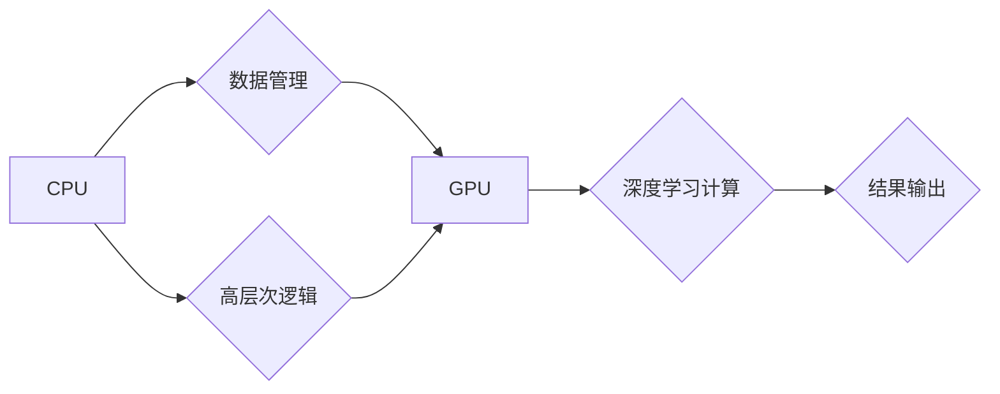

> GPU, AI, 计算架构, 深度学习, 并行计算, 异构计算, 高性能计算

## 1. 背景介绍

近年来，人工智能（AI）技术蓬勃发展，深度学习算法取得了令人瞩目的成就，推动了计算机视觉、自然语言处理、语音识别等领域的革命性进展。然而，深度学习算法的训练和推理过程对计算资源的需求量巨大，传统的CPU架构已难以满足其高性能计算需求。

GPU（图形处理单元）凭借其并行计算能力和高带宽内存，在深度学习领域展现出强大的优势。从最初的CUDA平台到如今的TensorFlow和PyTorch等深度学习框架，GPU已成为深度学习训练和推理的必备硬件。

然而，随着AI技术的不断发展，GPU架构也面临着新的挑战。传统的GPU架构主要面向图形渲染任务，其计算单元和内存组织结构并非最优的深度学习计算模式。为了更好地适应AI时代的新型计算需求，我们需要对GPU架构进行重塑，探索更有效的计算模型和算法。

## 2. 核心概念与联系

### 2.1  深度学习计算模式

深度学习算法的核心是多层神经网络，其计算模式主要包括：

* **前向传播:** 将输入数据通过多层神经网络传递，最终得到输出结果。
* **反向传播:** 计算误差，并根据误差反向调整神经网络权重，以最小化误差。

深度学习计算的特点是：

* **数据并行:** 训练数据可以并行处理，每个计算单元处理一部分数据。
* **计算密集型:** 深度学习算法包含大量的矩阵运算和激活函数计算，对计算资源需求量大。
* **内存访问密集型:** 深度学习模型参数和中间结果需要频繁访问内存，对内存带宽要求高。

### 2.2  GPU架构演进

传统的GPU架构主要由流处理器（Streaming Multiprocessor，SM）组成，每个SM包含多个计算单元（CUDA core）。流处理器通过并行执行多个线程，实现数据并行计算。

为了适应深度学习的计算模式，GPU架构不断演进，主要包括以下方面：

* **增加计算单元数量:** 提升计算能力，支持更大的模型训练。
* **提高内存带宽:** 缩短数据访问时间，提升计算效率。
* **优化内存组织结构:** 采用更高效的内存层次结构，减少内存访问延迟。
* **引入专门的深度学习加速器:** 例如Tensor Core，专门针对深度学习算法进行优化。

### 2.3  异构计算

异构计算是指利用不同类型的处理器协同工作，以提高计算效率。在AI领域，异构计算通常指CPU和GPU的协同工作。

CPU负责处理高层次的逻辑和数据管理，而GPU负责执行大量的数据并行计算。通过将任务分配到不同的处理器，可以充分利用各自的优势，提高整体计算效率。

**Mermaid 流程图**



## 3. 核心算法原理 & 具体操作步骤

### 3.1  算法原理概述

深度学习算法的核心是神经网络，其原理是通过多层神经元网络模拟人类大脑的学习过程。每个神经元接收输入信号，经过激活函数处理后输出信号，信号传递到下一层神经元。通过训练，神经网络的权重不断调整，以最小化预测误差。

常见的深度学习算法包括：

* **卷积神经网络（CNN）:** 用于图像识别、物体检测等任务，擅长提取图像特征。
* **循环神经网络（RNN）:** 用于序列数据处理，例如自然语言处理、语音识别等任务，擅长捕捉时间序列信息。
* **Transformer:** 用于自然语言处理任务，例如机器翻译、文本摘要等，擅长处理长距离依赖关系。

### 3.2  算法步骤详解

深度学习算法的训练过程通常包括以下步骤：

1. **数据预处理:** 将原始数据转换为深度学习模型可以处理的格式，例如图像归一化、文本编码等。
2. **模型构建:** 根据任务需求选择合适的深度学习模型架构，并定义模型参数。
3. **模型训练:** 使用训练数据训练模型，通过反向传播算法调整模型参数，以最小化预测误差。
4. **模型评估:** 使用测试数据评估模型性能，例如准确率、召回率等指标。
5. **模型调优:** 根据评估结果调整模型参数、学习率等超参数，以提高模型性能。
6. **模型部署:** 将训练好的模型部署到实际应用场景中，例如服务器、移动设备等。

### 3.3  算法优缺点

**优点:**

* **高精度:** 深度学习算法在许多任务上取得了超越人类水平的精度。
* **自动化特征提取:** 深度学习模型可以自动学习数据特征，无需人工特征工程。
* **可扩展性:** 深度学习模型可以轻松扩展到更大的数据集和更复杂的模型架构。

**缺点:**

* **计算资源需求量大:** 深度学习模型训练和推理需要大量的计算资源，例如GPU和内存。
* **数据依赖性强:** 深度学习模型的性能取决于训练数据的质量和数量。
* **可解释性差:** 深度学习模型的决策过程难以解释，缺乏透明度。

### 3.4  算法应用领域

深度学习算法已广泛应用于各个领域，例如：

* **计算机视觉:** 图像识别、物体检测、图像分割、人脸识别等。
* **自然语言处理:** 机器翻译、文本摘要、情感分析、对话系统等。
* **语音识别:** 语音转文本、语音助手等。
* **医疗诊断:** 病理图像分析、疾病预测等。
* **金融分析:** 欺诈检测、风险评估等。

## 4. 数学模型和公式 & 详细讲解 & 举例说明

### 4.1  数学模型构建

深度学习模型的核心是神经网络，其数学模型可以表示为多层函数的复合。

假设一个神经网络有L层，每层有N个神经元，输入数据为x，输出为y，则神经网络的数学模型可以表示为：

$$y = f_L(f_{L-1}(...f_2(f_1(x))))$$

其中，$f_i$表示第i层的激活函数，例如ReLU、Sigmoid等。

### 4.2  公式推导过程

深度学习模型的训练过程基于梯度下降算法，其目标是找到最优的模型参数，以最小化预测误差。

预测误差通常使用均方误差（MSE）来衡量：

$$MSE = \frac{1}{N} \sum_{i=1}^{N} (y_i - \hat{y}_i)^2$$

其中，$y_i$为真实值，$\hat{y}_i$为预测值。

梯度下降算法通过计算误差对模型参数的梯度，并根据梯度更新模型参数，以逐步降低误差。

梯度更新公式为：

$$\theta = \theta - \alpha \frac{\partial MSE}{\partial \theta}$$

其中，$\theta$为模型参数，$\alpha$为学习率。

### 4.3  案例分析与讲解

以线性回归为例，假设模型参数为$\theta = (w, b)$，输入数据为$x$，输出为$y$，则模型预测公式为：

$$\hat{y} = wx + b$$

预测误差为：

$$MSE = \frac{1}{N} \sum_{i=1}^{N} (y_i - \hat{y}_i)^2$$

梯度更新公式为：

$$w = w - \alpha \frac{1}{N} \sum_{i=1}^{N} (y_i - \hat{y}_i) x_i$$

$$b = b - \alpha \frac{1}{N} \sum_{i=1}^{N} (y_i - \hat{y}_i)$$

通过迭代更新模型参数，最终可以找到最优的模型参数，使得预测误差最小。

## 5. 项目实践：代码实例和详细解释说明

### 5.1  开发环境搭建

深度学习开发环境通常需要以下软件：

* **操作系统:** Linux、macOS或Windows。
* **编程语言:** Python。
* **深度学习框架:** TensorFlow、PyTorch等。
* **GPU驱动程序:** CUDA、cuDNN等。

### 5.2  源代码详细实现

以下是一个使用PyTorch实现线性回归的简单代码示例：

```python
import torch
import torch.nn as nn
import torch.optim as optim

# 定义线性回归模型
class LinearRegression(nn.Module):
    def __init__(self):
        super(LinearRegression, self).__init__()
        self.linear = nn.Linear(1, 1)

    def forward(self, x):
        return self.linear(x)

# 创建模型实例
model = LinearRegression()

# 定义损失函数和优化器
criterion = nn.MSELoss()
optimizer = optim.SGD(model.parameters(), lr=0.01)

# 训练数据
x_train = torch.randn(100, 1)
y_train = 2 * x_train + 1 + torch.randn(100, 1)

# 训练模型
for epoch in range(100):
    # 前向传播
    outputs = model(x_train)
    loss = criterion(outputs, y_train)

    # 反向传播
    optimizer.zero_grad()
    loss.backward()

    # 更新参数
    optimizer.step()

    if (epoch + 1) % 10 == 0:
        print(f'Epoch [{epoch+1}/{100}], Loss: {loss.item():.4f}')

# 测试数据
x_test = torch.randn(10, 1)
y_test = 2 * x_test + 1 + torch.randn(10, 1)

# 预测结果
outputs = model(x_test)

# 打印预测结果
print(f'预测结果: {outputs}')
```

### 5.3  代码解读与分析

这段代码实现了线性回归模型的训练和预测过程。

* **模型定义:** 使用PyTorch的`nn.Module`类定义线性回归模型，包含一个线性层`nn.Linear(1, 1)`。
* **损失函数和优化器:** 使用均方误差损失函数`nn.MSELoss()`和随机梯度下降优化器`optim.SGD()`。
* **训练数据:** 使用随机生成的训练数据`x_train`和`y_train`。
* **训练过程:** 迭代训练模型，计算损失，反向传播梯度，更新模型参数。
* **测试数据:** 使用随机生成的测试数据`x_test`和`y_test`。
* **预测结果:** 使用训练好的模型预测测试数据`x_test`的输出结果。

### 5.4  运行结果展示

运行这段代码后，会输出训练过程中的损失值，以及测试数据预测结果。

## 6. 实际应用场景

### 6.1  图像识别

深度学习算法在图像识别领域取得了突破性进展，例如：

* **人脸识别:** 用于身份验证、人脸搜索等应用。
* **物体检测:** 用于自动驾驶、安防监控等应用。
* **图像分类:** 用于医学图像诊断、产品分类等应用。

### 6.2  自然语言处理

深度学习算法在自然语言处理领域也取得了显著成果，例如：

* **机器翻译:** 将一种语言翻译成另一种语言。
* **文本摘要:** 自动生成文本的简短摘要。
* **情感分析:** 分析文本的情感倾向，例如正面、负面、中性。

### 6.3  语音识别

深度学习算法在语音识别领域也取得了重要进展，例如：

* **语音转文本:** 将语音信号转换为文本。
* **语音助手:** 例如Siri、Alexa等，