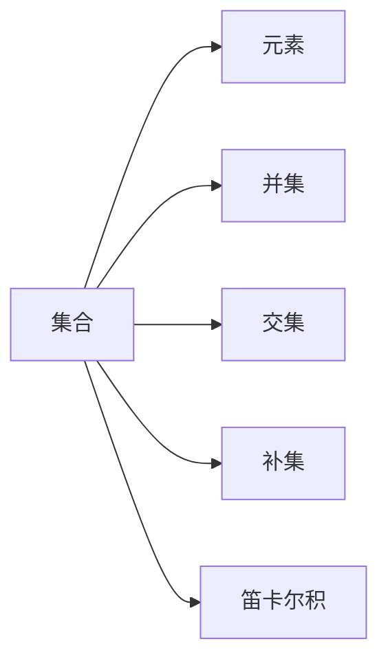

                 

集合论、形式表达式、解析表达式、语法分析、自动机、正则表达式

## 1. 背景介绍

集合论是数学的一个分支，它研究集合及其运算。形式表达式和解析表达式是计算机科学中的重要概念，它们用于描述和分析计算机程序的输入和输出。本文将介绍集合论的基本概念，并探讨形式表达式和解析表达式的定义、应用和算法。

## 2. 核心概念与联系

### 2.1 集合论基础

集合是数学中最基本的概念之一。一个集合是其元素的集合。集合的元素可以是任何对象，包括数字、字符串、函数甚至其他集合。集合的运算包括并集、交集、补集和笛卡尔积。



### 2.2 形式表达式

形式表达式是一个字符串，它由终结符（terminal symbols）和非终结符（non-terminal symbols）组成。终结符是有意义的字符，而非终结符则用于表示更复杂的结构。形式表达式用于描述语言（language）的结构，即一组合法的字符串。

### 2.3 解析表达式

解析表达式是一种形式表达式，它描述了如何将输入字符串分析成语法树。语法树是一个树形结构，它表示了输入字符串的结构。解析表达式用于语法分析，即将输入字符串转换成语法树的过程。

## 3. 核心算法原理 & 具体操作步骤

### 3.1 算法原理概述

形式表达式和解析表达式的算法原理基于自动机（automata）和正则表达式（regular expressions）。自动机是一种抽象机器，它用于模拟计算机程序的行为。正则表达式是一种描述字符串模式的方法。

### 3.2 算法步骤详解

#### 3.2.1 正则表达式匹配

正则表达式匹配算法用于检查输入字符串是否匹配给定的正则表达式。算法步骤如下：

1. 定义正则表达式的模式。
2. 定义输入字符串。
3. 使用匹配函数（如`match()`）检查输入字符串是否匹配模式。
4. 如果匹配，则返回`true`；否则，返回`false`。

#### 3.2.2 语法分析

语法分析算法用于将输入字符串转换成语法树。算法步骤如下：

1. 定义语法规则（grammar rules），描述语言的结构。
2. 定义输入字符串。
3. 使用语法分析器（parser）将输入字符串转换成语法树。
4. 如果语法分析成功，则返回语法树；否则，返回错误信息。

### 3.3 算法优缺点

优点：

* 形式表达式和解析表达式的算法简单明确，易于实现。
* 正则表达式匹配算法效率高，常用于字符串搜索和替换。
* 语法分析算法用于生成语法树，有助于理解输入字符串的结构。

缺点：

* 正则表达式匹配算法的复杂性随着输入字符串和模式的长度而增加。
* 语法分析算法的复杂性随着语法规则的数量而增加。

### 3.4 算法应用领域

形式表达式和解析表达式的算法应用于各种领域，包括：

* 编译器设计：语法分析算法用于将源代码转换成中间代码。
* 文本处理：正则表达式匹配算法用于搜索和替换文本。
* 数据库查询：正则表达式匹配算法用于搜索和过滤数据。

## 4. 数学模型和公式 & 详细讲解 & 举例说明

### 4.1 数学模型构建

形式表达式和解析表达式的数学模型基于正则表达式和上下文无关文法（context-free grammar）。正则表达式用于描述字符串模式，上下文无关文法用于描述语言的结构。

### 4.2 公式推导过程

正则表达式的运算包括并集（`|`）、交集（`.`）、星号（`*`）、加号（`+`）和问号（`?`）。这些运算可以组合起来表示更复杂的模式。例如，表达式`a(b|c)*`表示一个以字符`a`开头，后跟零个或多个`b`或`c`的字符串。

上下文无关文法的运算包括终结符（`a`）、非终结符（`S`）和-production rules（`S → aSb`）。这些运算可以组合起来表示语言的结构。例如，文法`S → aSb | ε`表示一组以字符`a`开头，后跟一个`b`，再跟一个`a`的字符串，或空字符串`ε`。

### 4.3 案例分析与讲解

例如，考虑以下正则表达式和上下文无关文法：

* 正则表达式：`a(b|c)*`
* 上下文无关文法：`S → aSb | ε`

这两个模型描述了相同的语言：一组以字符`a`开头，后跟零个或多个`b`或`c`的字符串，或空字符串`ε`。例如，字符串`abba`和`ac`都属于这个语言，而字符串`bb`和`a`不属于这个语言。

## 5. 项目实践：代码实例和详细解释说明

### 5.1 开发环境搭建

本项目使用Python作为编程语言，并使用`re`模块实现正则表达式匹配，使用`pyparsing`库实现语法分析。

### 5.2 源代码详细实现

#### 5.2.1 正则表达式匹配

```python
import re

def match_regex(pattern, string):
    if re.match(pattern, string):
        return True
    else:
        return False

# 示例：检查字符串是否以"http"开头
print(match_regex(r'^http', 'http://example.com'))  # True
print(match_regex(r'^http', 'https://example.com'))  # False
```

#### 5.2.2 语法分析

```python
from pyparsing import Word, alphas, Suppress, Forward

# 定义语法规则
S = Forward()
S << Suppress('S') + Word(alphas) + S + Word(alphas) + Suppress('S')
S << Suppress('S') + Word(alphas) + Suppress('ε')

# 定义输入字符串
input_string = 'aSbbSa'

# 使用语法分析器将输入字符串转换成语法树
parse_result = S.parseString(input_string)

# 打印语法树
print(parse_result)
```

### 5.3 代码解读与分析

#### 5.3.1 正则表达式匹配

`match_regex()`函数使用`re.match()`函数检查输入字符串是否匹配给定的正则表达式。如果匹配，则返回`True`；否则，返回`False`。

#### 5.3.2 语法分析

`pyparsing`库用于实现语法分析。首先，定义语法规则，然后使用`parseString()`函数将输入字符串转换成语法树。语法树表示了输入字符串的结构。

### 5.4 运行结果展示

#### 5.4.1 正则表达式匹配

* `match_regex(r'^http', 'http://example.com')`返回`True`，因为字符串以"http"开头。
* `match_regex(r'^http', 'https://example.com')`返回`False`，因为字符串以"https"开头。

#### 5.4.2 语法分析

输入字符串`aSbbSa`被转换成语法树：

```
['a', 'S', 'bb', 'Sa']
```

语法树表示了输入字符串的结构：一个`a`，后跟一个`S`，再跟两个`b`，最后跟一个`a`和一个`S`。

## 6. 实际应用场景

### 6.1 编译器设计

形式表达式和解析表达式的算法用于编译器设计，特别是语法分析阶段。语法分析器使用上下文无关文法将源代码转换成中间代码。

### 6.2 文本处理

正则表达式匹配算法用于搜索和替换文本。例如，可以使用正则表达式搜索和替换HTML标签，或搜索和替换特定格式的日期。

### 6.3 数据库查询

正则表达式匹配算法用于搜索和过滤数据。例如，可以使用正则表达式搜索包含特定关键字的文档，或过滤包含特定格式的电子邮件地址的记录。

### 6.4 未来应用展望

形式表达式和解析表达式的算法将继续应用于各种领域，包括人工智能、自然语言处理和计算生物学。此外，新的算法和数据结构将被开发，以提高形式表达式和解析表达式的处理效率。

## 7. 工具和资源推荐

### 7.1 学习资源推荐

* "正则表达式"在线教程：<https://regexone.com/>
* "计算机程序的构造和解释"（Compilers: Principles, Techniques, and Tools）一书：<https://www.amazon.com/Compilers-Principles-Techniques-Tools-2nd/dp/0130467198>
* "形式语言与自动机"（Formal Languages and Automata）一书：<https://www.amazon.com/Formal-Languages-Automata-Johnson-Books/dp/013046718X>

### 7.2 开发工具推荐

* Python `re`模块：<https://docs.python.org/3/library/re.html>
* `pyparsing`库：<https://pyparsing.wikispaces.com/>
* Java `java.util.regex`包：<https://docs.oracle.com/javase/8/docs/api/java/util/regex/package-summary.html>

### 7.3 相关论文推荐

* "Regular Expression Matching Can Be Simple And Efficient"：<https://swtch.com/~rsc/regexp/regexp1.html>
* "Earley's Algorithm for Parsing Context-Free Grammars"：<https://www.cs.utexas.edu/users/flp/Courses/Cs381T/Readings/earley.pdf>

## 8. 总结：未来发展趋势与挑战

### 8.1 研究成果总结

本文介绍了集合论的基本概念，并探讨了形式表达式和解析表达式的定义、应用和算法。此外，本文还提供了正则表达式匹配和语法分析的代码实例。

### 8.2 未来发展趋势

形式表达式和解析表达式的算法将继续应用于各种领域，包括人工智能、自然语言处理和计算生物学。此外，新的算法和数据结构将被开发，以提高形式表达式和解析表达式的处理效率。

### 8.3 面临的挑战

形式表达式和解析表达式的算法面临的挑战包括：

* 正则表达式匹配算法的复杂性随着输入字符串和模式的长度而增加。
* 语法分析算法的复杂性随着语法规则的数量而增加。
* 形式表达式和解析表达式的算法需要与其他算法和数据结构集成，以实现更复杂的应用。

### 8.4 研究展望

未来的研究将集中在以下领域：

* 开发新的算法和数据结构，以提高形式表达式和解析表达式的处理效率。
* 研究形式表达式和解析表达式的应用，包括人工智能、自然语言处理和计算生物学。
* 研究形式表达式和解析表达式的算法与其他算法和数据结构的集成。

## 9. 附录：常见问题与解答

### 9.1 什么是集合论？

集合论是数学的一个分支，它研究集合及其运算。集合是其元素的集合，集合的运算包括并集、交集、补集和笛卡尔积。

### 9.2 什么是形式表达式？

形式表达式是一个字符串，它由终结符（terminal symbols）和非终结符（non-terminal symbols）组成。终结符是有意义的字符，而非终结符则用于表示更复杂的结构。形式表达式用于描述语言（language）的结构，即一组合法的字符串。

### 9.3 什么是解析表达式？

解析表达式是一种形式表达式，它描述了如何将输入字符串分析成语法树。语法树是一个树形结构，它表示了输入字符串的结构。解析表达式用于语法分析，即将输入字符串转换成语法树的过程。

### 9.4 什么是正则表达式？

正则表达式是一种描述字符串模式的方法。正则表达式用于搜索和替换文本，以及语法分析。

### 9.5 什么是上下文无关文法？

上下文无关文法是一种描述语言结构的方法。上下文无关文法用于语法分析，即将输入字符串转换成语法树的过程。

---

作者：禅与计算机程序设计艺术 / Zen and the Art of Computer Programming

