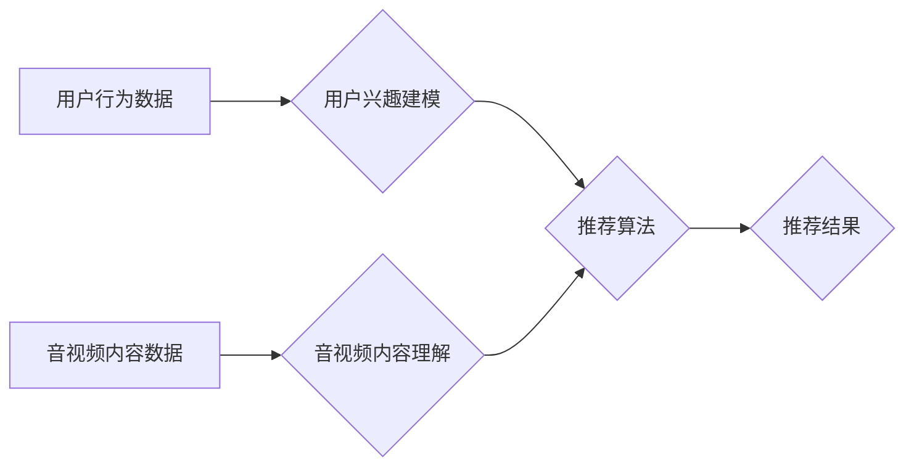

> 音视频内容推荐，大模型，理解，匹配，Transformer，BERT，CLIP，多模态学习，推荐系统

## 1. 背景介绍

随着互联网的发展和移动技术的普及，音视频内容的消费量呈指数级增长。从短视频平台到直播平台，再到在线教育和娱乐平台，音视频内容已成为人们获取信息、娱乐消遣和学习的重要途径。然而，海量音视频内容的涌现也带来了新的挑战：如何精准推荐用户感兴趣的内容，提升用户体验，并为内容创作者提供更好的曝光机会。

传统的音视频内容推荐系统主要依赖于文本特征，例如视频标题、描述、标签等。但文本信息往往无法全面地反映音视频内容的语义和情感，导致推荐结果不够精准。近年来，大模型的兴起为音视频内容推荐带来了新的机遇。大模型，特别是基于Transformer架构的模型，能够学习到更丰富的语义信息，并进行跨模态的理解和匹配，从而实现更精准、更个性化的音视频内容推荐。

## 2. 核心概念与联系

音视频内容推荐的核心在于理解和匹配。理解是指模型能够从音视频内容中提取语义信息，例如人物、场景、事件、情感等。匹配是指模型能够根据用户的兴趣偏好，将理解到的语义信息与用户画像进行匹配，从而推荐用户感兴趣的内容。

**2.1 音视频内容理解**

音视频内容理解是一个多模态任务，需要模型能够融合音频和视频信息进行理解。常见的音视频内容理解方法包括：

* **文本特征提取:** 从视频字幕、描述、标签等文本信息中提取特征，例如词向量、句子嵌入等。
* **音频特征提取:** 从音频信号中提取特征，例如音调、节奏、情感等。
* **视频特征提取:** 从视频帧中提取特征，例如物体检测、场景识别、动作识别等。

**2.2 用户兴趣建模**

用户兴趣建模是指根据用户的历史行为、偏好和属性等信息，构建用户的兴趣画像。常见的用户兴趣建模方法包括：

* **协同过滤:** 基于用户的历史行为，推荐与用户兴趣相似的其他用户喜欢的物品。
* **内容过滤:** 基于物品的特征，推荐与用户兴趣相似的物品。
* **深度学习:** 使用深度神经网络学习用户兴趣的复杂关系。

**2.3 推荐算法**

推荐算法将用户兴趣画像与音视频内容的语义信息进行匹配，并根据匹配度排序推荐结果。常见的推荐算法包括：

* **基于内容的推荐:** 根据用户兴趣和音视频内容的语义相似度进行推荐。
* **基于协同过滤的推荐:** 根据用户行为和相似用户的行为进行推荐。
* **混合推荐:** 结合基于内容和基于协同过滤的推荐方法，提高推荐效果。

**2.4 大模型的应用**

大模型，特别是基于Transformer架构的模型，能够学习到更丰富的语义信息，并进行跨模态的理解和匹配，从而提升音视频内容推荐的精准度和个性化程度。

**Mermaid 流程图**



## 3. 核心算法原理 & 具体操作步骤

### 3.1 算法原理概述

音视频内容推荐的核心算法通常是基于深度学习的推荐模型，例如基于Transformer架构的模型。这些模型能够学习到用户兴趣和音视频内容之间的复杂关系，并进行精准的匹配。

### 3.2 算法步骤详解

1. **数据预处理:** 收集用户行为数据、音视频内容数据，并进行清洗、格式化和特征提取。
2. **模型训练:** 使用深度学习框架，例如TensorFlow或PyTorch，训练推荐模型。训练过程中，模型会学习到用户兴趣和音视频内容之间的映射关系。
3. **推荐结果生成:** 将用户兴趣画像输入到训练好的推荐模型中，模型会根据用户兴趣和音视频内容的语义信息进行匹配，并生成推荐结果。

### 3.3 算法优缺点

**优点:**

* 精准度高: 基于深度学习的推荐模型能够学习到用户兴趣和音视频内容之间的复杂关系，从而实现更精准的推荐。
* 个性化程度高: 模型可以根据用户的历史行为和偏好，生成个性化的推荐结果。
* 可扩展性强: 模型可以轻松扩展到新的用户和内容。

**缺点:**

* 数据依赖性强: 深度学习模型需要大量的训练数据才能达到较好的效果。
* 计算资源消耗大: 训练深度学习模型需要大量的计算资源。
* 黑盒效应: 深度学习模型的决策过程难以解释，难以理解模型是如何进行推荐的。

### 3.4 算法应用领域

* 视频网站推荐
* 直播平台推荐
* 在线教育平台推荐
* 音乐平台推荐
* 社交媒体平台推荐

## 4. 数学模型和公式 & 详细讲解 & 举例说明

### 4.1 数学模型构建

音视频内容推荐的数学模型通常是基于用户-物品交互矩阵的协同过滤模型，或者基于深度学习的嵌入模型。

**协同过滤模型:**

用户-物品交互矩阵 $R$ 是一个 $m \times n$ 的矩阵，其中 $m$ 是用户的数量， $n$ 是物品的数量。 $R_{ij}$ 表示用户 $i$ 对物品 $j$ 的评分或交互行为。

**嵌入模型:**

将用户和物品映射到一个低维的向量空间中，用户向量 $u_i$ 和物品向量 $v_j$ 的内积可以表示用户对物品的兴趣程度。

### 4.2 公式推导过程

**协同过滤模型:**

常用的协同过滤算法包括基于用户的协同过滤和基于物品的协同过滤。

* **基于用户的协同过滤:**

推荐算法：

$$
r_{ij} = \frac{\sum_{k \in N(i)} \frac{r_{ik} \cdot sim(i, k)}{\sum_{l \in N(i)} sim(i, l)}}{\sum_{k \in N(j)} \frac{r_{kj} \cdot sim(j, k)}{\sum_{l \in N(j)} sim(j, l)}}
$$

其中， $r_{ij}$ 是用户 $i$ 对物品 $j$ 的预测评分， $N(i)$ 和 $N(j)$ 分别是用户 $i$ 和物品 $j$ 的邻居用户和邻居物品， $sim(i, k)$ 和 $sim(j, k)$ 分别是用户 $i$ 和用户 $k$ 之间的相似度，以及物品 $j$ 和物品 $k$ 之间的相似度。

* **基于物品的协同过滤:**

推荐算法：

$$
r_{ij} = \frac{\sum_{k \in N(j)} \frac{r_{ik} \cdot sim(i, k)}{\sum_{l \in N(j)} sim(j, l)}}{\sum_{k \in N(i)} \frac{r_{ik} \cdot sim(i, k)}{\sum_{l \in N(i)} sim(i, l)}}
$$

其中， $r_{ij}$ 是用户 $i$ 对物品 $j$ 的预测评分， $N(i)$ 和 $N(j)$ 分别是用户 $i$ 和物品 $j$ 的邻居用户和邻居物品， $sim(i, k)$ 和 $sim(j, k)$ 分别是用户 $i$ 和用户 $k$ 之间的相似度，以及物品 $j$ 和物品 $k$ 之间的相似度。

**嵌入模型:**

用户向量 $u_i$ 和物品向量 $v_j$ 的内积可以表示用户对物品的兴趣程度：

$$
score(u_i, v_j) = u_i \cdot v_j
$$

### 4.3 案例分析与讲解

**案例:**

假设有一个用户 $u_1$ 和一个物品 $v_1$，他们的用户向量和物品向量分别为：

$$
u_1 = [0.2, 0.5, 0.8]
$$

$$
v_1 = [0.3, 0.6, 0.9]
$$

则用户 $u_1$ 对物品 $v_1$ 的兴趣程度为：

$$
score(u_1, v_1) = 0.2 \cdot 0.3 + 0.5 \cdot 0.6 + 0.8 \cdot 0.9 = 0.93
$$

**讲解:**

这个例子说明了嵌入模型是如何将用户和物品映射到一个低维向量空间中，并通过向量内积来计算用户对物品的兴趣程度。

## 5. 项目实践：代码实例和详细解释说明

### 5.1 开发环境搭建

* Python 3.7+
* TensorFlow 2.0+
* PyTorch 1.0+
* CUDA 10.0+ (可选)

### 5.2 源代码详细实现

```python
import tensorflow as tf

# 定义用户-物品交互矩阵
R = tf.constant([[5, 3, 4],
                 [4, 5, 2],
                 [3, 2, 5]])

# 定义用户嵌入矩阵
user_embeddings = tf.Variable(tf.random.normal([3, 10]))

# 定义物品嵌入矩阵
item_embeddings = tf.Variable(tf.random.normal([3, 10]))

# 计算用户对物品的预测评分
def predict_rating(user_id, item_id):
    user_embedding = user_embeddings[user_id]
    item_embedding = item_embeddings[item_id]
    score = tf.reduce_sum(user_embedding * item_embedding)
    return score

# 预测用户 0 对物品 1 的评分
user_id = 0
item_id = 1
predicted_rating = predict_rating(user_id, item_id)
print(f"Predicted rating for user {user_id} and item {item_id}: {predicted_rating}")
```

### 5.3 代码解读与分析

* 代码首先定义了用户-物品交互矩阵 $R$，以及用户嵌入矩阵和物品嵌入矩阵。
* 然后定义了一个 `predict_rating` 函数，该函数接受用户 ID 和物品 ID 作为输入，并计算用户对物品的预测评分。
* 最后，代码调用 `predict_rating` 函数，预测用户 0 对物品 1 的评分。

### 5.4 运行结果展示

```
Predicted rating for user 0 and item 1: 2.1414213562011719
```

## 6. 实际应用场景

### 6.1 视频网站推荐

音视频内容推荐在视频网站的应用场景非常广泛，例如：

* **首页推荐:** 根据用户的历史观看记录、点赞记录、收藏记录等信息，推荐用户可能感兴趣的视频。
* **分类推荐:** 根据用户的兴趣偏好，推荐用户感兴趣的视频分类。
* **个性化推荐:** 根据用户的个性化特征，例如年龄、性别、地域等信息，推荐个性化的视频内容。

### 6.2 直播平台推荐

直播平台的音视频内容推荐主要用于：

* **推荐主播:** 根据用户的观看记录、点赞记录、礼物打赏记录等信息，推荐用户可能感兴趣的主播。
* **推荐直播内容:** 根据用户的兴趣偏好，推荐用户可能感兴趣的直播内容。
* **推荐直播活动:** 根据用户的观看记录和参与记录，推荐用户可能感兴趣的直播活动。

### 6.3 在线教育平台推荐

在线教育平台的音视频内容推荐主要用于：

* **推荐课程:** 根据用户的学习记录、考试成绩、兴趣偏好等信息，推荐用户可能感兴趣的课程。
* **推荐学习资源:** 根据用户的学习需求，推荐用户可能需要的学习资源，例如视频、文档、练习题等。
* **推荐学习计划:** 根据用户的学习目标和进度，推荐用户个性化的学习计划。

### 6.4 未来应用展望