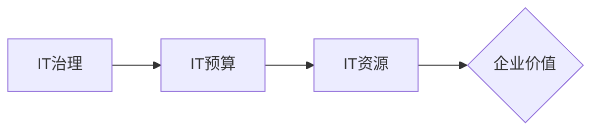

## 预算管理：制定并管理IT预算，确保资源高效分配，使IT投资为公司带来价值

**关键词：** IT预算、资源分配、价值投资、预算管理、IT治理

在当今数字化转型浪潮中，IT已经成为企业发展的核心驱动力。然而，IT投资往往伴随着高风险和高成本，如何制定合理的IT预算，并有效地管理和优化IT资源配置，使其最大限度地为公司创造价值，成为了每个企业管理者必须面对的挑战。

## 1. 背景介绍

随着信息技术的飞速发展，企业对IT的依赖程度越来越高。从传统的办公自动化到如今的云计算、大数据、人工智能等新兴技术，IT投资已经渗透到企业运营的各个环节。然而，IT投资并非多多益善，盲目投资不仅会造成资源浪费，还会降低企业的竞争力。因此，制定科学合理的IT预算，并对其进行有效的管理和优化，对于企业来说至关重要。

### 1.1 IT预算管理的重要性

有效的IT预算管理能够帮助企业：

* **控制成本：** 通过对IT资源进行合理的规划和分配，避免资源浪费，降低IT运营成本。
* **提高效率：** 将有限的IT资源投入到最需要的地方，提高IT资源的使用效率，提升企业的运营效率。
* **支持业务发展：** 通过IT投资支持企业的战略目标和业务发展，提升企业的核心竞争力。
* **降低风险：** 通过对IT投资进行风险评估和控制，降低IT投资失败的风险。

### 1.2 IT预算管理面临的挑战

在实际操作中，IT预算管理面临着诸多挑战：

* **IT需求难以量化：** IT需求往往与业务需求紧密相关，而业务需求的变化难以预测，导致IT需求难以准确量化。
* **IT成本难以核算：** IT成本构成复杂，包括硬件、软件、人员、维护等多个方面，难以准确核算。
* **IT价值难以评估：** IT投资的价值难以用传统的财务指标来衡量，需要结合企业的战略目标和业务发展进行综合评估。
* **缺乏有效的管理工具：** 许多企业缺乏有效的IT预算管理工具和平台，导致预算编制、执行、监控等环节难以有效进行。

## 2. 核心概念与联系

### 2.1 核心概念

* **IT预算：** 指企业在一定时期内，为了实现其IT战略目标，对IT资源的投入和分配进行规划和控制的管理活动。
* **IT资源：** 指企业用于支持IT服务的各种资源，包括硬件、软件、网络、数据、人员等。
* **IT治理：** 指企业为了确保IT投资能够支持和促进企业战略目标的实现，而建立的一套组织结构、流程、制度和标准。

### 2.2 概念间联系



IT治理为IT预算管理提供框架和指导，IT预算是IT资源配置的依据，合理的IT资源配置能够创造企业价值。

## 3. 核心流程 & 具体操作步骤

### 3.1 IT预算管理流程

IT预算管理一般包括以下几个阶段：


### 3.2  具体操作步骤

#### 3.2.1 预算编制

* **收集信息：** 收集企业战略规划、业务部门IT需求、IT部门资源状况等信息。
* **需求分析：** 对收集到的信息进行分析，识别和评估IT需求的优先级和重要性。
* **预算测算：** 根据需求分析结果，对IT资源进行成本测算，制定初步的IT预算方案。
* **方案调整：** 与相关部门沟通协调，对初步预算方案进行调整和优化。

#### 3.2.2 预算审批

* **方案评审：** 组织相关部门对IT预算方案进行评审，评估方案的可 feasibility 和合理性。
* **预算批准：** 根据评审结果，对IT预算方案进行批准或驳回。

#### 3.2.3 预算执行

* **资源采购：** 根据批准的IT预算，进行IT资源的采购和配置。
* **项目实施：** 启动和实施IT项目，确保IT资源的有效利用。

#### 3.2.4 预算监控

* **跟踪执行情况：** 定期跟踪IT预算的执行情况，及时发现和解决执行过程中出现的问题。
* **成本控制：** 对IT成本进行监控和分析，采取措施控制成本，避免超支。

#### 3.2.5 预算评估

* **评估预算效果：** 对IT预算的执行效果进行评估，分析预算目标是否达成，资源配置是否合理。
* **总结经验教训：** 总结IT预算管理过程中的经验教训，为下一年度的预算编制提供参考。

## 4. 数学模型和公式 & 详细讲解 & 举例说明

### 4.1 IT投资回报率(ROI)

IT投资回报率(ROI)是评估IT投资效益的重要指标之一，用于衡量IT投资带来的收益与成本之间的关系。

$$ ROI = (IT投资收益 - IT投资成本) / IT投资成本 * 100% $$

* **IT投资收益：** 指IT投资带来的收入增加、成本降低、效率提升等方面的收益。
* **IT投资成本：** 指IT投资所需的硬件、软件、人员、维护等方面的成本。

**举例说明：**

某企业投资100万元建设了新的电商平台，预计每年可以带来200万元的销售收入，同时可以节省50万元的运营成本。则该项目的ROI为：

$$ ROI = (200 + 50 - 100) / 100 * 100% = 150% $$

### 4.2  净现值(NPV)

净现值(NPV)是评估IT投资长期效益的重要指标之一，用于衡量IT投资在未来一段时间内产生的现金流入现值与现金流出现值之间的差额。

$$ NPV = \sum_{t=1}^n \frac{CF_t}{(1+r)^t} - C_0 $$

* **CFt：** 指第t年产生的现金净流量。
* **r：** 指折现率。
* **C0：** 指初始投资成本。

**举例说明：**

某企业计划投资500万元建设新的数据中心，预计该项目可以使用5年，每年可以产生200万元的现金净流量，折现率为10%。则该项目的NPV为：

$$ NPV = \frac{200}{(1+0.1)^1} + \frac{200}{(1+0.1)^2} + \frac{200}{(1+0.1)^3} + \frac{200}{(1+0.1)^4} + \frac{200}{(1+0.1)^5} - 500 = 124.18 万元 $$

## 5. 项目实践：代码实例和详细解释说明

### 5.1 开发环境搭建

本案例使用Python语言和相关库进行IT预算管理系统的开发，需要安装以下软件：

* Python 3.7+
* Django 3.0+
* Django REST framework 3.11+
* PostgreSQL 12+

### 5.2 源代码详细实现

```python
# models.py

from django.db import models

class Department(models.Model):
    name = models.CharField(max_length=100)

class Budget(models.Model):
    department = models.ForeignKey(Department, on_delete=models.CASCADE)
    year = models.IntegerField()
    amount = models.DecimalField(max_digits=10, decimal_places=2)

class Expense(models.Model):
    budget = models.ForeignKey(Budget, on_delete=models.CASCADE)
    date = models.DateField()
    description = models.CharField(max_length=200)
    amount = models.DecimalField(max_digits=10, decimal_places=2)

# serializers.py

from rest_framework import serializers

class DepartmentSerializer(serializers.ModelSerializer):
    class Meta:
        model = Department
        fields = '__all__'

class BudgetSerializer(serializers.ModelSerializer):
    class Meta:
        model = Budget
        fields = '__all__'

class ExpenseSerializer(serializers.ModelSerializer):
    class Meta:
        model = Expense
        fields = '__all__'

# views.py

from rest_framework import viewsets

class DepartmentViewSet(viewsets.ModelViewSet):
    queryset = Department.objects.all()
    serializer_class = DepartmentSerializer

class BudgetViewSet(viewsets.ModelViewSet):
    queryset = Budget.objects.all()
    serializer_class = BudgetSerializer

class ExpenseViewSet(viewsets.ModelViewSet):
    queryset = Expense.objects.all()
    serializer_class = ExpenseSerializer
```

### 5.3 代码解读与分析

* **models.py:** 定义了部门、预算、支出的数据模型。
* **serializers.py:** 定义了数据模型的序列化器，用于将数据模型转换成JSON格式。
* **views.py:** 定义了视图集，用于处理API请求。

### 5.4 运行结果展示

启动Django开发服务器，访问API接口，可以对部门、预算、支出进行增删改查操作。

## 6. 实际应用场景

### 6.1 企业IT部门

企业IT部门可以使用IT预算管理系统来编制、执行、监控和评估IT预算，优化IT资源配置，提高IT投资回报率。

### 6.2 政府机构

政府机构可以使用IT预算管理系统来规范IT投资行为，提高财政资金的使用效率，提升政府信息化水平。

### 6.3 教育机构

教育机构可以使用IT预算管理系统来规划和管理IT建设，提高教育信息化水平，促进教育公平。

### 6.4 未来应用展望

随着云计算、大数据、人工智能等新技术的快速发展，IT预算管理将更加智能化、自动化和数据化。未来，IT预算管理系统将更加注重对IT资源的精细化管理，以及对IT投资价值的评估和预测。

## 7. 工具和资源推荐

### 7.1 学习资源推荐

* **IT预算管理最佳实践：** https://www.gartner.com/en/finance/insights/it-budgeting
* **IT预算管理工具：** https://en.wikipedia.org/wiki/Comparison_of_IT_budgeting_software

### 7.2 开发工具推荐

* **Django REST framework：** https://www.django-rest-framework.org/
* **PostgreSQL：** https://www.postgresql.org/

### 7.3 相关论文推荐

* **IT预算管理研究综述：** [https://www.sciencedirect.com/science/article/pii/S096980431930153X](https://www.sciencedirect.com/science/article/pii/S096980431930153X)

## 8. 总结：未来发展趋势与挑战

### 8.1 研究成果总结

IT预算管理是企业IT治理的重要组成部分，对于提高IT投资回报率、促进企业发展具有重要意义。

### 8.2 未来发展趋势

* **智能化：** 利用人工智能技术，实现IT预算的智能编制、执行、监控和评估。
* **自动化：** 利用自动化技术，简化IT预算管理流程，提高工作效率。
* **数据化：** 利用大数据技术，对IT资源进行精细化管理，提高IT资源的使用效率。

### 8.3 面临的挑战

* **IT需求变化快：** 新技术不断涌现，企业IT需求变化快，给IT预算管理带来挑战。
* **IT成本难以控制：** 云计算、大数据等新技术的应用，使得IT成本更加复杂，难以控制。
* **IT价值难以评估：** IT投资的价值难以用传统的财务指标来衡量，需要结合企业的战略目标和业务发展进行综合评估。

### 8.4 研究展望

未来，IT预算管理需要更加注重对IT资源的精细化管理，以及对IT投资价值的评估和预测。同时，需要利用新技术手段，提高IT预算管理的智能化、自动化和数据化水平。

## 9. 附录：常见问题与解答

### 9.1 如何确定IT预算的规模？

IT预算的规模应该根据企业的战略目标、业务发展需求、IT现状等因素综合确定。

### 9.2 如何评估IT投资的价值？

IT投资的价值可以从财务效益、运营效率、客户满意度、风险控制等多个维度进行评估。

### 9.3 如何有效地控制IT成本？

可以通过优化IT资源配置、加强IT成本管理、采用云计算等新技术来控制IT成本。

## 作者：禅与计算机程序设计艺术 / Zen and the Art of Computer Programming