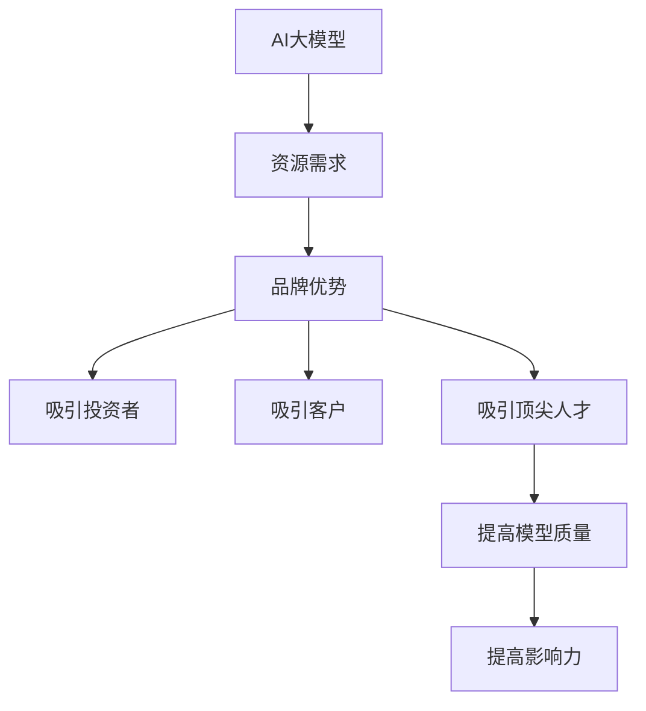

                 

## 1. 背景介绍

在当今快速发展的AI时代，大模型已成为关注的焦点。这些模型在各种任务中表现出色，从自然语言处理到图像和视频理解。然而，创建和部署大模型需要大量的资源和专业知识。因此，如何利用品牌优势创立成功的AI大模型创业公司变得至关重要。

## 2. 核心概念与联系

### 2.1 AI大模型的定义

AI大模型是指具有数十亿甚至数千亿参数的模型，能够在各种任务上表现出色。它们的规模和复杂性使其能够学习和推广更抽象的表示，从而提高泛化能力。

### 2.2 品牌优势的定义

品牌优势是指品牌在市场上建立的信誉、声誉和知名度，它有助于吸引客户，提高销售额，并最终提高利润。

### 2.3 核心概念联系

AI大模型创业需要大量的资金和资源，品牌优势可以帮助创业公司吸引投资者和客户，从而获取这些资源。此外，品牌优势还可以帮助创业公司建立信任，吸引顶尖人才，并最终提高其模型的质量和影响力。

## 3. 核心算法原理 & 具体操作步骤

### 3.1 算法原理概述

创建成功的AI大模型创业公司需要遵循一套系统的步骤。这些步骤包括市场调查、模型开发、品牌建设和商业化。

### 3.2 算法步骤详解

1. **市场调查**：首先，创业公司需要对目标市场进行详细的调查，以确定客户需求和竞争格局。这有助于创业公司确定其模型应该解决的问题，并找到其独特的卖点。
2. **模型开发**：一旦确定了目标市场，创业公司需要开发其大模型。这涉及到数据收集、模型架构设计、训练和评估。
3. **品牌建设**：品牌建设是关键步骤，它包括确定品牌名称、logo、使命宣言和价值观。创业公司还需要建立网站、社交媒体账号和内容营销策略。
4. **商业化**：最后，创业公司需要将其模型商业化。这涉及到确定商业模式、定价策略和销售渠道。

### 3.3 算法优缺点

优点：

* 系统化的步骤有助于创业公司遵循一条清晰的路径。
* 关注品牌建设有助于创业公司建立信誉和声誉。
* 商业化步骤有助于创业公司盈利。

缺点：

* 这些步骤需要大量的时间和资源。
* 创业公司可能会面临来自竞争对手的压力。
* 创业公司可能会面临技术挑战。

### 3.4 算法应用领域

AI大模型创业公司可以应用于各种领域，从自然语言处理到图像和视频理解。它们还可以应用于金融、医疗保健、零售和制造等行业。

## 4. 数学模型和公式 & 详细讲解 & 举例说明

### 4.1 数学模型构建

在开发大模型时，创业公司需要构建数学模型。例如，在自然语言处理任务中，创业公司可能会使用循环神经网络（RNN）或转换器模型。

### 4.2 公式推导过程

例如，在构建循环神经网络时，创业公司需要推导其权重和偏置项。这可以使用反向传播算法来完成。

### 4.3 案例分析与讲解

例如，创业公司可以使用转换器模型来开发一个高质量的机器翻译系统。转换器模型使用注意力机制来关注输入序列的不同部分，从而提高翻译质量。

## 5. 项目实践：代码实例和详细解释说明

### 5.1 开发环境搭建

创业公司需要搭建开发环境，包括安装必要的软件和库。例如，创业公司可能需要安装Python、TensorFlow和PyTorch。

### 5.2 源代码详细实现

创业公司需要编写代码来开发其大模型。例如，创业公司可能需要编写代码来收集数据、设计模型架构、训练模型和评估模型。

### 5.3 代码解读与分析

创业公司需要仔细分析其代码，以确保其高效和准确。例如，创业公司可能需要分析其模型的计算复杂性，并优化其代码以提高性能。

### 5.4 运行结果展示

创业公司需要展示其模型的运行结果。例如，创业公司可以展示其机器翻译系统的翻译结果，并与人类翻译进行比较。

## 6. 实际应用场景

### 6.1 当前应用

AI大模型创业公司的模型可以应用于各种当前的场景，从自然语言处理到图像和视频理解。它们还可以应用于金融、医疗保健、零售和制造等行业。

### 6.2 未来应用展望

未来，AI大模型创业公司的模型可能会应用于更复杂的任务，如自动驾驶和人工智能助手。它们还可能会应用于新的行业，如农业和环境保护。

## 7. 工具和资源推荐

### 7.1 学习资源推荐

创业公司可以学习各种在线课程和文献，以提高其AI大模型开发技能。例如，创业公司可以学习Andrew Ng的机器学习课程，或阅读“深度学习”一书。

### 7.2 开发工具推荐

创业公司可以使用各种开发工具来开发其大模型。例如，创业公司可以使用TensorFlow或PyTorch来开发其模型，或使用Jupyter Notebook来分析其数据。

### 7.3 相关论文推荐

创业公司可以阅读各种相关论文，以获取最新的AI大模型开发技术。例如，创业公司可以阅读“Attention is All You Need”论文，或“BERT: Pre-training of Deep Bidirectional Transformers for Language Understanding”论文。

## 8. 总结：未来发展趋势与挑战

### 8.1 研究成果总结

AI大模型创业公司的模型在各种任务上表现出色，从自然语言处理到图像和视频理解。它们还可以应用于金融、医疗保健、零售和制造等行业。

### 8.2 未来发展趋势

未来，AI大模型创业公司可能会开发更大、更复杂的模型，并将其应用于更多的任务和行业。它们还可能会开发新的模型架构和训练技术，以提高模型的质量和效率。

### 8.3 面临的挑战

AI大模型创业公司面临的挑战包括资源需求、竞争压力和技术挑战。它们还需要关注模型的解释性和可靠性，以建立客户信任。

### 8.4 研究展望

未来，AI大模型创业公司可能会开发更大、更复杂的模型，并将其应用于更多的任务和行业。它们还可能会开发新的模型架构和训练技术，以提高模型的质量和效率。此外，它们还需要关注模型的解释性和可靠性，以建立客户信任。

## 9. 附录：常见问题与解答

**Q1：如何选择合适的模型架构？**

A1：创业公司需要考虑其模型的任务、数据规模和计算资源，并测试各种模型架构，以选择最佳架构。

**Q2：如何评估模型质量？**

A2：创业公司可以使用各种评估指标，如准确性、精确度、召回率和F1分数，来评估其模型的质量。它们还可以使用交叉验证技术来评估模型的泛化能力。

**Q3：如何商业化模型？**

A3：创业公司需要确定其商业模式、定价策略和销售渠道。它们还需要考虑其模型的可扩展性和可靠性，以满足客户需求。

**作者：禅与计算机程序设计艺术 / Zen and the Art of Computer Programming**

