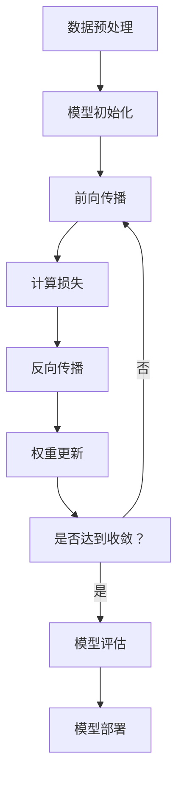

                 

## 1. 背景介绍

当前，人工智能（AI）大模型已经成为AI领域的热点之一。这些模型具有强大的学习和推理能力，可以在各种任务中取得出色的表现。然而，开发和部署大模型需要大量的资源和专业知识，这使得创业者面临着巨大的挑战。本文将讨论如何利用社会优势来创业，以开发和部署大模型。

## 2. 核心概念与联系

在讨论如何利用社会优势之前，我们需要先理解大模型的核心概念和架构。大模型通常由大量的神经网络层组成，这些层通过权重参数连接在一起。大模型的训练过程涉及到优化这些权重参数，以便模型能够在给定的任务上表现出色。

下面是大模型训练过程的Mermaid流程图：



## 3. 核心算法原理 & 具体操作步骤

### 3.1 算法原理概述

大模型的核心算法是神经网络，其中包括全连接层、卷积层、池化层等。这些层通过非线性激活函数连接在一起，以便模型能够学习复杂的表示。

### 3.2 算法步骤详解

大模型的训练过程包括以下步骤：

1. 数据预处理：收集和预处理训练数据，以便模型可以学习。
2. 模型初始化：初始化模型的权重参数。
3. 前向传播：将输入数据通过模型的各个层，生成输出。
4. 计算损失：计算模型输出和真实值之间的差异。
5. 反向传播：计算模型权重参数的梯度。
6. 权重更新：使用梯度下降等优化算法更新模型的权重参数。
7. 模型评估：在验证集上评估模型的性能。
8. 模型部署：将模型部署到生产环境中。

### 3.3 算法优缺点

大模型的优点包括：

* 可以学习复杂的表示，从而在各种任务中取得出色的表现。
* 可以通过-transfer learning和fine-tuning等技术进行快速训练。

大模型的缺点包括：

* 需要大量的计算资源和数据。
* 训练过程需要大量的时间和专业知识。
* 模型的解释性较差，难以理解模型的决策过程。

### 3.4 算法应用领域

大模型的应用领域包括：

* 图像和语音识别。
* 自然语言处理（NLP），如机器翻译和文本分类。
* 自动驾驶和机器人控制。
* 财务预测和风险评估。

## 4. 数学模型和公式 & 详细讲解 & 举例说明

### 4.1 数学模型构建

大模型的数学模型可以表示为：

$$y = f(x; \theta)$$

其中，$x$是输入数据，$y$是输出数据，$\theta$是模型的权重参数，$f$是模型的非线性激活函数。

### 4.2 公式推导过程

模型的损失函数可以表示为：

$$L(\theta) = \frac{1}{N}\sum_{i=1}^{N}l(y_i, \hat{y}_i)$$

其中，$N$是训练数据的数量，$l$是损失函数，$y_i$是真实值，$\hat{y}_i$是模型输出。

模型的梯度可以表示为：

$$\nabla_{\theta}L(\theta) = \frac{1}{N}\sum_{i=1}^{N}\nabla_{\theta}l(y_i, \hat{y}_i)$$

### 4.3 案例分析与讲解

例如，在图像分类任务中，输入数据$x$是图像，输出数据$y$是图像的类别。模型的损失函数可以使用交叉熵函数：

$$l(y, \hat{y}) = -\sum_{c=1}^{C}y_c\log(\hat{y}_c)$$

其中，$C$是类别的数量。

## 5. 项目实践：代码实例和详细解释说明

### 5.1 开发环境搭建

开发大模型需要一个强大的开发环境，包括GPU和大量的内存。推荐使用TensorFlow或PyTorch等深度学习框架。

### 5.2 源代码详细实现

下面是一个简单的大模型实现示例，使用TensorFlow和MNIST数据集进行手写数字识别：

```python
import tensorflow as tf
from tensorflow.keras.datasets import mnist

# Load data
(x_train, y_train), (x_test, y_test) = mnist.load_data()
x_train, x_test = x_train / 255.0, x_test / 255.0

# Define model
model = tf.keras.models.Sequential([
  tf.keras.layers.Flatten(input_shape=(28, 28)),
  tf.keras.layers.Dense(128, activation='relu'),
  tf.keras.layers.Dropout(0.2),
  tf.keras.layers.Dense(10, activation='softmax')
])

# Compile model
model.compile(optimizer='adam',
              loss='sparse_categorical_crossentropy',
              metrics=['accuracy'])

# Train model
model.fit(x_train, y_train, epochs=5)

# Evaluate model
test_loss, test_acc = model.evaluate(x_test, y_test, verbose=2)
print('\nTest accuracy:', test_acc)
```

### 5.3 代码解读与分析

代码首先加载MNIST数据集，然后定义一个简单的全连接神经网络模型。模型使用ReLU激活函数和Dropout正则化技术来防止过拟合。然后，代码编译模型，使用Adam优化器和交叉熵损失函数。最后，代码训练模型并评估其在测试集上的性能。

### 5.4 运行结果展示

运行代码后，模型在测试集上的准确率约为98%。

## 6. 实际应用场景

大模型的实际应用场景包括：

### 6.1 图像和语音识别

大模型可以用于图像和语音识别任务，如手写数字识别、人脸识别和语音转写。

### 6.2 自然语言处理（NLP）

大模型可以用于NLP任务，如机器翻译、文本分类和问答系统。

### 6.3 自动驾驶和机器人控制

大模型可以用于自动驾驶和机器人控制任务，如路径规划和动作预测。

### 6.4 未来应用展望

未来，大模型可能会应用于更多的领域，如医疗诊断和金融风险评估。此外，大模型可能会与其他技术结合，如区块链和物联网，以开发新的应用程序。

## 7. 工具和资源推荐

### 7.1 学习资源推荐

推荐以下资源学习大模型：

* 深度学习书籍：[Deep Learning](https://www.deeplearningbook.org/)和[Hands-On Machine Learning with Scikit-Learn, Keras, and TensorFlow](https://www.oreilly.com/library/view/hands-on-machine-learning/9781492032632/)
* 在线课程：[Stanford CS231n](https://www.coursera.org/learn/machine-learning)和[Fast.ai](https://course.fast.ai/)

### 7.2 开发工具推荐

推荐以下工具开发大模型：

* 深度学习框架：TensorFlow和PyTorch
* GPU加速：NVIDIA CUDA
* 云平台：Google Colab和Amazon SageMaker

### 7.3 相关论文推荐

推荐以下论文学习大模型：

* [Attention Is All You Need](https://arxiv.org/abs/1706.03762)
* [BERT: Pre-training of Deep Bidirectional Transformers for Language Understanding](https://arxiv.org/abs/1810.04805)
* [DALL-E: Generating Images from Textual Descriptions](https://arxiv.org/abs/2102.00247)

## 8. 总结：未来发展趋势与挑战

### 8.1 研究成果总结

本文讨论了大模型的核心概念、算法原理、数学模型和实际应用场景。我们还提供了一个简单的大模型实现示例，并推荐了学习和开发大模型的资源。

### 8.2 未来发展趋势

未来，大模型的发展趋势包括：

* 模型规模的不断扩大。
* 多模式学习的发展，如视觉和语言的结合。
* 可解释性的提高，以便模型的决策过程更容易理解。

### 8.3 面临的挑战

大模型面临的挑战包括：

* 计算资源的需求。
* 数据的获取和标注。
* 模型的可解释性和安全性。

### 8.4 研究展望

未来的研究方向包括：

* 研究新的模型架构和训练算法。
* 研究多模式学习和跨模态推理。
* 研究模型的可解释性和安全性。

## 9. 附录：常见问题与解答

### 9.1 问：大模型需要多少计算资源？

答：大模型需要大量的计算资源，包括GPU和大量的内存。例如，训练一个大型语言模型可能需要数千个GPU的计算资源。

### 9.2 问：大模型需要多少数据？

答：大模型需要大量的数据来进行训练。例如，训练一个大型语言模型可能需要数千万甚至数十亿个单词的数据。

### 9.3 问：大模型的可解释性如何？

答：大模型的可解释性较差，难以理解模型的决策过程。未来的研究方向之一是提高模型的可解释性。

## 作者：禅与计算机程序设计艺术 / Zen and the Art of Computer Programming

