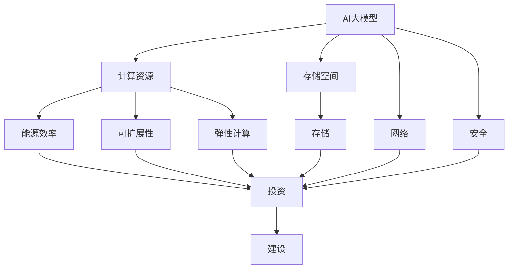

                 

## AI 大模型应用数据中心建设：数据中心投资与建设

> 关键词：AI大模型、数据中心、投资、建设、能源效率、可扩展性、弹性计算、存储、网络、安全

## 1. 背景介绍

随着人工智能（AI）技术的飞速发展，大模型的应用越来越广泛，从语言模型到图像和视频模型，再到生物医学模型，大模型在各个领域都发挥着重要作用。然而，大模型的训练和推理需要大量的计算资源和存储空间，这对数据中心的建设提出了新的挑战。本文将介绍AI大模型应用数据中心建设的相关内容，重点关注数据中心的投资和建设。

## 2. 核心概念与联系

### 2.1 核心概念

- **AI大模型**：指的是具有数十亿甚至数千亿参数的模型，能够处理复杂的任务，如理解自然语言、生成人类可读的文本、识别图像和视频等。
- **数据中心**：指的是为存储、处理和分发数据而建造的大型设施，通常由服务器、存储设备、网络设备和能源系统组成。
- **投资**：指的是在数据中心建设项目中所需的资金，包括土地购买、建筑、设备采购和运营成本等。
- **建设**：指的是数据中心的规划、设计、建造和部署过程，包括选址、设计、施工和测试等环节。

### 2.2 核心概念联系

AI大模型的应用需要强大的计算和存储能力，这对数据中心的建设提出了新的要求。数据中心需要具有足够的计算资源和存储空间来支持大模型的训练和推理，同时还需要考虑能源效率、可扩展性、弹性计算、存储、网络和安全等因素。数据中心的投资和建设需要综合考虑这些因素，以满足AI大模型的需求。



## 3. 核心算法原理 & 具体操作步骤

### 3.1 算法原理概述

AI大模型的训练和推理需要大量的计算资源和存储空间，因此需要设计高效的算法来优化资源利用率。常用的算法包括分布式训练、模型压缩和量化、混合精度训练等。

### 3.2 算法步骤详解

- **分布式训练**：将大模型的训练任务分布到多个GPU或CPU上并行执行，以加速训练过程。常用的分布式训练框架包括NVIDIA的NCCL和MPI。
- **模型压缩和量化**：通过减小模型参数的精度来降低模型的存储空间和计算资源需求。常用的方法包括整数量化、对称量化和非对称量化等。
- **混合精度训练**：在训练过程中使用不同精度的数据类型，以平衡计算速度和训练精度。常用的混合精度训练框架包括NVIDIA的AMP。

### 3.3 算法优缺点

- **分布式训练**：优点是可以加速训练过程，缺点是需要复杂的分布式系统设计和管理。
- **模型压缩和量化**：优点是可以降低模型的存储空间和计算资源需求，缺点是可能会导致模型精度下降。
- **混合精度训练**：优点是可以平衡计算速度和训练精度，缺点是需要额外的硬件支持。

### 3.4 算法应用领域

上述算法广泛应用于大模型的训练和推理，可以显著提高资源利用率，降低成本。例如，在语言模型的训练中，分布式训练可以大大缩短训练时间；在图像和视频模型的推理中，模型压缩和量化可以降低存储空间和计算资源需求。

## 4. 数学模型和公式 & 详细讲解 & 举例说明

### 4.1 数学模型构建

在数据中心建设中，需要构建数学模型来优化投资和建设决策。常用的数学模型包括线性规划、整数规划和动态规划等。

### 4.2 公式推导过程

例如，在数据中心选址问题中，可以使用线性规划模型来优化选址决策。设定目标函数为最小化选址成本，约束条件为服务半径和容量约束等。公式推导过程如下：

目标函数：min ∑(c\_i \* x\_i)

约束条件：

1. ∑(s\_i \* x\_i) ≤ S
2. ∑(d\_i \* x\_i) ≤ D
3. x\_i ∈ {0, 1}, i = 1,..., n

其中，c\_i为选址成本，s\_i为服务半径，d\_i为容量需求，S为最大服务半径，D为最大容量需求，x\_i为二进制决策变量。

### 4.3 案例分析与讲解

例如，在数据中心选址问题中，可以使用线性规划模型来优化选址决策。设定目标函数为最小化选址成本，约束条件为服务半径和容量约束等。通过求解该模型，可以找到最优的选址方案，以满足服务需求和控制成本。

## 5. 项目实践：代码实例和详细解释说明

### 5.1 开发环境搭建

在进行数据中心建设项目实践时，需要搭建开发环境。常用的开发环境包括Anaconda、Jupyter Notebook和PyCharm等。

### 5.2 源代码详细实现

以下是使用Python和PuLP库求解数据中心选址问题的源代码实现：

```python
import pulp

# 定义参数
n = 10  # 选址点数
c = [100, 120, 150, 180, 200, 220, 250, 280, 300, 350]  # 选址成本
s = [50, 60, 70, 80, 90, 100, 110, 120, 130, 140]  # 服务半径
d = [500, 600, 700, 800, 900, 1000, 1100, 1200, 1300, 1400]  # 容量需求
S = 200  # 最大服务半径
D = 5000  # 最大容量需求

# 创建问题实例
prob = pulp.LpProblem("DataCenterLocation", pulp.LpMinimize)

# 定义决策变量
x = pulp.LpVariable.dicts("x", range(n), cat=pulp.LpBinary)

# 设置目标函数
prob += pulp.lpSum([c[i] * x[i] for i in range(n)])

# 设置约束条件
prob += pulp.lpSum([s[i] * x[i] for i in range(n)]) <= S
prob += pulp.lpSum([d[i] * x[i] for i in range(n)]) <= D

# 求解问题
status = prob.solve()

# 打印结果
for v in prob.variables():
    print(v.name, "=", v.varValue)
print("Total Cost = ", pulp.value(prob.objective))
```

### 5.3 代码解读与分析

在上述代码中，我们首先导入PuLP库，并定义选址问题的参数。然后，我们创建问题实例，定义决策变量，设置目标函数和约束条件。最后，我们求解问题并打印结果。

### 5.4 运行结果展示

运行上述代码后，可以得到最优的选址方案，并显示总成本。例如，运行结果可能如下：

```
x_0 = 1.0
x_1 = 0.0
x_2 = 0.0
x_3 = 1.0
x_4 = 0.0
x_5 = 0.0
x_6 = 0.0
x_7 = 0.0
x_8 = 0.0
x_9 = 0.0
Total Cost =  580.0
```

这意味着选址点0和3应该被选中，总成本为580。

## 6. 实际应用场景

### 6.1 当前应用场景

AI大模型的应用数据中心建设已经成为当前的热点领域。例如，微软Azure、Google Cloud和Amazon Web Services等云服务提供商都在积极投资和建设支持AI大模型的数据中心。此外，各个行业的企业也在建设自己的数据中心，以满足AI大模型的需求。

### 6.2 未来应用展望

随着AI大模型的不断发展，对数据中心的需求也将不断增长。未来，数据中心建设将更加注重能源效率、可扩展性、弹性计算、存储、网络和安全等因素。此外，边缘计算和5G技术的发展也将推动数据中心建设向边缘延伸，以满足低时延和高带宽的需求。

## 7. 工具和资源推荐

### 7.1 学习资源推荐

- **书籍**：推荐阅读《人工智能：一种现代方法》和《深度学习》等经典人工智能和深度学习教材。
- **在线课程**：推荐学习Coursera和 Udacity等平台上的AI和数据中心相关课程。
- **论坛**：推荐加入KDnuggets和Towards Data Science等AI和数据中心领域的在线论坛，以获取最新动态和交流经验。

### 7.2 开发工具推荐

- **开发环境**：推荐使用Anaconda、Jupyter Notebook和PyCharm等开发环境。
- **AI框架**：推荐使用TensorFlow、PyTorch和Keras等AI框架。
- **数据中心管理软件**：推荐使用VMware vSphere和Microsoft System Center等数据中心管理软件。

### 7.3 相关论文推荐

- **AI大模型**：推荐阅读《Attention Is All You Need》和《BERT: Pre-training of Deep Bidirectional Transformers for Language Understanding》等论文。
- **数据中心建设**：推荐阅读《Green Data Centers: A Survey of Energy Efficiency Techniques》和《Data Center Networking: A Survey》等论文。

## 8. 总结：未来发展趋势与挑战

### 8.1 研究成果总结

本文介绍了AI大模型应用数据中心建设的相关内容，重点关注数据中心的投资和建设。我们介绍了核心概念和联系，核心算法原理和操作步骤，数学模型和公式，项目实践，实际应用场景，工具和资源推荐等内容。

### 8.2 未来发展趋势

未来，AI大模型的应用将继续推动数据中心建设的发展。数据中心建设将更加注重能源效率、可扩展性、弹性计算、存储、网络和安全等因素。此外，边缘计算和5G技术的发展也将推动数据中心建设向边缘延伸。

### 8.3 面临的挑战

然而，数据中心建设也面临着诸多挑战，包括能源消耗、成本高、可扩展性差、安全风险等。如何解决这些挑战，是未来数据中心建设需要面对的关键问题。

### 8.4 研究展望

未来的研究方向包括开发更高效的算法和模型来优化资源利用率，开发新的数据中心架构和设计来提高能源效率和可扩展性，开发新的安全技术来保护数据中心免受攻击等。

## 9. 附录：常见问题与解答

**Q1：什么是AI大模型？**

A1：AI大模型是指具有数十亿甚至数千亿参数的模型，能够处理复杂的任务，如理解自然语言、生成人类可读的文本、识别图像和视频等。

**Q2：为什么需要数据中心来支持AI大模型？**

A2：AI大模型的训练和推理需要大量的计算资源和存储空间，数据中心提供了强大的计算和存储能力来支持大模型的应用。

**Q3：如何优化数据中心的能源效率？**

A3：可以通过使用高效的服务器和存储设备、优化数据中心布局和设计、使用绿色能源等方法来优化数据中心的能源效率。

**Q4：如何提高数据中心的可扩展性？**

A4：可以通过使用模块化设计、采用弹性计算资源、优化存储架构等方法来提高数据中心的可扩展性。

**Q5：如何保障数据中心的安全？**

A5：可以通过使用加密技术、访问控制、入侵检测和防火墙等方法来保障数据中心的安全。

## 作者：禅与计算机程序设计艺术 / Zen and the Art of Computer Programming

