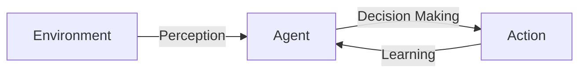

                 

**AI人工智能 Agent：真实世界的智能体应用案例**

**作者：禅与计算机程序设计艺术 / Zen and the Art of Computer Programming**

## 1. 背景介绍

在当今的数字化世界中，人工智能（AI）已经渗透到我们的日常生活中，从搜索引擎到自动驾驶汽车，再到智能家居。其中，AI人工智能 Agent（智能体）扮演着关键角色，它们能够感知环境、做出决策并采取行动，模拟人类的行为。本文将深入探讨AI人工智能 Agent的核心概念、算法原理、数学模型，并通过项目实践和实际应用场景进行详细讲解。

## 2. 核心概念与联系

AI人工智能 Agent是一种软件实体，它能够感知环境、做出决策并采取行动。Agent的核心概念包括：

- **感知（Perception）**：Agent感知环境的能力。
- **决策（Decision Making）**：Agent根据感知到的信息做出决策的能力。
- **行动（Action）**：Agent根据决策采取行动的能力。
- **学习（Learning）**：Agent从环境中学习并改进其行为的能力。

下图是Agent的核心概念和联系的Mermaid流程图：



## 3. 核心算法原理 & 具体操作步骤

### 3.1 算法原理概述

AI人工智能 Agent的核心算法是强化学习（Reinforcement Learning），它模拟了人类学习的过程。Agent通过与环境交互，学习到最优的行为策略。

### 3.2 算法步骤详解

1. **状态（State）**：Agent感知环境，获取当前状态。
2. **行动（Action）**：Agent根据当前状态选择行动。
3. **回报（Reward）**：环境根据Agent的行动提供回报。
4. **状态转移（State Transition）**：环境根据Agent的行动转移到新状态。
5. **学习（Learning）**：Agent根据回报更新其行为策略。

### 3.3 算法优缺点

**优点**：强化学习能够学习到最优策略，无需人工设计特定的规则。

**缺点**：强化学习需要大量的训练数据，且收敛速度慢。

### 3.4 算法应用领域

强化学习广泛应用于自动驾驶、游戏AI、机器人控制等领域。

## 4. 数学模型和公式 & 详细讲解 & 举例说明

### 4.1 数学模型构建

强化学习的数学模型包括状态空间、行动空间、回报函数和状态转移函数。

### 4.2 公式推导过程

强化学习的目标是学习到最优策略$\pi^*$, 使得期望回报最大化：

$$J(\pi) = E[R_t | \pi] = \sum_{t=0}^{\infty} \gamma^t E[R_{t+1} | S_t, \pi]$$

其中，$R_t$是回报，$S_t$是状态，$R_{t+1}$是下一时刻的回报，$\gamma$是折扣因子。

### 4.3 案例分析与讲解

例如，在自动驾驶领域，状态可以是车辆的位置和速度，行动可以是加速、减速或转向，回报可以是避免碰撞的奖励。

## 5. 项目实践：代码实例和详细解释说明

### 5.1 开发环境搭建

我们将使用Python和Stable Baselines3库实现一个简单的强化学习Agent。

### 5.2 源代码详细实现

```python
from stable_baselines3 import PPO
from stable_baselines3.common.policies import MlpPolicy
from stable_baselines3.common.vec_env import DummyVecEnv

env =...  # 环境实例
model = PPO(MlpPolicy, env, n_steps=2048)
model.learn(total_timesteps=10000)
```

### 5.3 代码解读与分析

我们使用PPO算法和多层感知机（Mlp）策略网络。`n_steps`参数控制了更新模型的频率，`total_timesteps`参数控制了训练的总步数。

### 5.4 运行结果展示

训练完成后，Agent可以在环境中学习到最优策略。

## 6. 实际应用场景

### 6.1 当前应用

AI人工智能 Agent已经广泛应用于各种领域，如自动驾驶、游戏AI、机器人控制等。

### 6.2 未来应用展望

未来，AI人工智能 Agent将会更加智能化、自适应化，能够在更复杂的环境中工作。

## 7. 工具和资源推荐

### 7.1 学习资源推荐

- 书籍：《强化学习》作者：Richard S. Sutton, Andrew G. Barto
- 课程：Stanford University的CS221强化学习课程

### 7.2 开发工具推荐

- Stable Baselines3：一个强化学习库，提供了多种算法和环境。
- Gym：一个开源的机器学习环境库。

### 7.3 相关论文推荐

- [Deep Reinforcement Learning Hands On](https://www.oreilly.com/library/view/deep-reinforcement-learning/9781492032009/)
- [Reinforcement Learning: An Introduction](https://incompleteideas.net/book/the-book.html)

## 8. 总结：未来发展趋势与挑战

### 8.1 研究成果总结

AI人工智能 Agent的研究取得了显著成果，强化学习算法的性能不断提高。

### 8.2 未来发展趋势

未来，AI人工智能 Agent将会更加智能化、自适应化，能够在更复杂的环境中工作。

### 8.3 面临的挑战

AI人工智能 Agent面临的挑战包括算法收敛速度慢、需要大量训练数据等。

### 8.4 研究展望

未来的研究方向包括算法改进、数据效率提高等。

## 9. 附录：常见问题与解答

**Q：强化学习需要大量的训练数据吗？**

**A：**是的，强化学习需要大量的训练数据。 Agent需要与环境交互，学习到最优策略。

**Q：强化学习能够学习到最优策略吗？**

**A：**在理想情况下，强化学习能够学习到最优策略。但是，实际情况可能会由于数据不足、算法收敛速度慢等原因而无法学习到最优策略。

**Q：AI人工智能 Agent有哪些应用领域？**

**A：**AI人工智能 Agent有广泛的应用领域，包括自动驾驶、游戏AI、机器人控制等。

**作者署名：作者：禅与计算机程序设计艺术 / Zen and the Art of Computer Programming**

