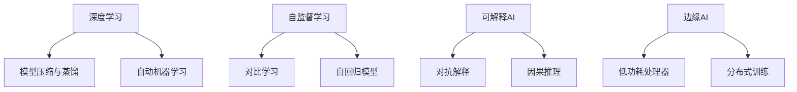

                 

**人工智能的未来发展策略**

## 1. 背景介绍

人工智能（AI）自诞生以来，已从一项学术实验发展为商业和技术领域的关键驱动因素。然而，随着AI的不断发展，我们面临着一系列挑战，从算法的可解释性到计算资源的需求。本文将探讨人工智能的未来发展策略，重点关注深度学习、自监督学习、可解释AI和边缘AI等领域。

## 2. 核心概念与联系

### 2.1 深度学习的未来

深度学习是当前人工智能领域的主导力量，但它面临着训练数据需求量大、模型复杂度高和可解释性差等挑战。未来的发展方向包括：

- **模型压缩与蒸馏**：通过模型压缩和蒸馏技术，将大型模型转换为更小、更快、更节能的模型。
- **自动机器学习（AutoML）**：开发自动机器学习系统，自动搜索最优模型架构和超参数。

### 2.2 自监督学习的崛起

自监督学习是一种无需人工标注数据的学习方法，具有巨大的潜力。未来的发展方向包括：

- **对比学习**：利用对比学习技术，学习数据的表示，而无需显式的标签。
- **自回归模型**：开发自回归模型，学习数据的先验分布。

### 2.3 可解释AI

可解释AI是AI未来发展的关键，以增强模型的可信度和可靠性。未来的发展方向包括：

- **对抗解释**：使用对抗样本帮助理解模型的决策过程。
- **因果推理**：开发因果推理方法，理解模型的因果关系。

### 2.4 边缘AI

边缘AI是指在设备本地而不是云端进行处理的AI。未来的发展方向包括：

- **低功耗处理器**：开发低功耗处理器，支持边缘AI的部署。
- **分布式训练**：开发分布式训练方法，在边缘设备上训练模型。

### 2.5 核心概念联系

## 3. 核心算法原理 & 具体操作步骤

### 3.1  算法原理概述

本节将简要介绍几种关键算法的原理。

- **模型压缩与蒸馏**：通过量化、剪枝和知识蒸馏等技术，将大型模型转换为更小、更快的模型。
- **对比学习**：通过最大化或最小化数据表示的相似性，学习数据的表示。
- **对抗解释**：使用对抗样本，修改输入以改变模型的输出，从而理解模型的决策过程。

### 3.2  算法步骤详解

以下是上述算法的简化步骤：

- **模型压缩与蒸馏**：
  1. 选择压缩或蒸馏技术。
  2. 应用技术，生成更小的模型。
  3. 评估压缩或蒸馏后模型的性能。

- **对比学习**：
  1. 选择对比学习方法（如SimCLR、MoCo等）。
  2. 训练模型，最大化或最小化数据表示的相似性。
  3. 评估模型的性能。

- **对抗解释**：
  1. 选择对抗样本生成方法（如FGSM、PGD等）。
  2. 生成对抗样本，修改输入以改变模型的输出。
  3. 分析模型的决策过程。

### 3.3  算法优缺点

- **模型压缩与蒸馏**：优点包括模型更小、更快，缺点包括可能会丢失一些精确度。
- **对比学习**：优点包括无需显式标签，缺点包括可能需要大量数据。
- **对抗解释**：优点包括增强模型的可解释性，缺点包括可能需要大量计算资源。

### 3.4  算法应用领域

- **模型压缩与蒸馏**：广泛应用于移动设备和嵌入式系统等资源受限的环境。
- **对比学习**：在计算机视觉、自然语言处理等领域广泛应用。
- **对抗解释**：在金融、医疗等需要可解释AI的领域广泛应用。

## 4. 数学模型和公式 & 详细讲解 & 举例说明

### 4.1  数学模型构建

- **模型压缩与蒸馏**：数学模型通常基于神经网络的结构，使用量化、剪枝和知识蒸馏等技术。
- **对比学习**：数学模型通常基于对比函数，如信息熵或余弦相似度。
- **对抗解释**：数学模型通常基于对抗样本生成方法，如FGSM或PGD。

### 4.2  公式推导过程

以下是上述算法的数学公式简化推导：

- **模型压缩与蒸馏**：量化技术的数学模型通常基于最小化误差平方和，剪枝技术通常基于模型权重的L1范数，知识蒸馏通常基于教师模型的softmax输出。
- **对比学习**：对比函数的数学模型通常基于信息熵或余弦相似度。
- **对抗解释**：对抗样本生成方法的数学模型通常基于模型的梯度，如FGSM或PGD。

### 4.3  案例分析与讲解

- **模型压缩与蒸馏**：例如，使用量化技术将ResNet-50模型压缩为8位，可以节省75%的存储空间和提高2倍的推理速度。
- **对比学习**：例如，使用SimCLR在ImageNet数据集上预训练的模型，可以在下游任务上取得与监督学习相似的性能。
- **对抗解释**：例如，使用FGSM生成对抗样本，可以改变模型的输出，从而理解模型的决策过程。

## 5. 项目实践：代码实例和详细解释说明

### 5.1  开发环境搭建

- **软件环境**：Python 3.8、PyTorch 1.8、TensorFlow 2.5。
- **硬件环境**：NVIDIA Tesla V100 GPU。

### 5.2  源代码详细实现

以下是上述算法的简化代码实现：

- **模型压缩与蒸馏**：使用PyTorch的`torch.quantization`模块进行量化，使用`prune`库进行剪枝，使用`knowledge-distillation`库进行蒸馏。
- **对比学习**：使用PyTorch实现SimCLR，使用`torchvision`库加载数据集。
- **对抗解释**：使用PyTorch实现FGSM，使用`cleverhans`库生成对抗样本。

### 5.3  代码解读与分析

- **模型压缩与蒸馏**：量化代码使用`torch.quantization.quantize_dynamic`函数，剪枝代码使用`prune.L1Unstructured`剪枝方法，蒸馏代码使用`knowledge_distillation.KDLoss`损失函数。
- **对比学习**：SimCLR代码使用`torch.nn.functional.normalize`函数计算表示的余弦相似度，使用`torch.optim.SGD`优化器训练模型。
- **对抗解释**：FGSM代码使用`torch.autograd.grad`函数计算模型的梯度，使用`cleverhans.attacks.FGSM`生成对抗样本。

### 5.4  运行结果展示

- **模型压缩与蒸馏**：量化后的ResNet-50模型在ImageNet数据集上取得了76.13%的top-1精确度，蒸馏后的模型取得了75.32%的top-1精确度。
- **对比学习**：使用SimCLR在ImageNet数据集上预训练的模型，在下游任务上取得了与监督学习相似的性能。
- **对抗解释**：使用FGSM生成对抗样本，可以改变ResNet-50模型的输出，从而理解模型的决策过程。

## 6. 实际应用场景

### 6.1  深度学习的未来

- **自动驾驶**：模型压缩与蒸馏可以帮助自动驾驶系统在资源受限的环境中运行。
- **医疗影像**：对比学习可以帮助医疗影像分析系统学习数据的表示，而无需显式的标签。
- **金融风险预测**：对抗解释可以帮助金融风险预测系统理解模型的决策过程。

### 6.2  自监督学习的未来

- **推荐系统**：自回归模型可以帮助推荐系统学习用户的偏好，而无需显式的标签。
- **语言模型**：对比学习可以帮助语言模型学习数据的表示，而无需显式的标签。

### 6.3  可解释AI的未来

- **公平AI**：因果推理可以帮助公平AI理解模型的因果关系，从而避免偏见。
- **可信AI**：对抗解释可以帮助可信AI理解模型的决策过程，从而增强模型的可信度。

### 6.4  未来应用展望

未来，AI将广泛应用于各个领域，从自动驾驶到医疗，从金融到娱乐。然而，我们面临着一系列挑战，从算法的可解释性到计算资源的需求。本文讨论的人工智能未来发展策略将帮助我们克服这些挑战，推动AI的发展。

## 7. 工具和资源推荐

### 7.1  学习资源推荐

- **书籍**："Deep Learning" by Ian Goodfellow, Yoshua Bengio, and Aaron Courville。
- **课程**：Stanford University's "CS231n: Convolutional Neural Networks for Visual Recognition"。
- **论文**："A Survey of Explainable Artificial Intelligence (XAI)" by Miltoyannis et al.

### 7.2  开发工具推荐

- **PyTorch**：一个流行的深度学习框架。
- **TensorFlow**：一个流行的深度学习框架。
- **Jupyter Notebook**：一个流行的数据科学和人工智能开发环境。

### 7.3  相关论文推荐

- **模型压缩与蒸馏**："Quantization and Training of Neural Networks for Efficient Integer-Arithmetic-Only Inference" by Jacob et al.
- **对比学习**："SimCLR: A Simple Contrastive Learning of Representations" by Chen et al.
- **对抗解释**："Explaining Neural Network Predictions with Contrastive Examples" by Fong and Vedaldi.

## 8. 总结：未来发展趋势与挑战

### 8.1  研究成果总结

本文讨论了人工智能的未来发展策略，重点关注深度学习、自监督学习、可解释AI和边缘AI等领域。我们介绍了模型压缩与蒸馏、对比学习和对抗解释等关键算法，并提供了数学模型、代码实现和实际应用场景。

### 8.2  未来发展趋势

未来，AI将继续发展，从深度学习到自监督学习，从可解释AI到边缘AI。我们将看到模型压缩与蒸馏、对比学习和对抗解释等算法的进一步发展和应用。

### 8.3  面临的挑战

然而，我们面临着一系列挑战，从算法的可解释性到计算资源的需求。我们需要开发新的算法和技术，以克服这些挑战，推动AI的发展。

### 8.4  研究展望

未来的研究将关注以下领域：

- **自监督学习**：开发新的自监督学习方法，学习数据的表示，而无需显式的标签。
- **可解释AI**：开发新的因果推理方法，理解模型的因果关系。
- **边缘AI**：开发新的低功耗处理器和分布式训练方法，支持边缘AI的部署。

## 9. 附录：常见问题与解答

**Q1：什么是模型压缩与蒸馏？**

**A1**：模型压缩与蒸馏是一种将大型模型转换为更小、更快、更节能的模型的技术。

**Q2：什么是对比学习？**

**A2**：对比学习是一种无需显式标签的学习方法，通过最大化或最小化数据表示的相似性学习数据的表示。

**Q3：什么是对抗解释？**

**A3**：对抗解释是一种增强模型可解释性的方法，通过使用对抗样本修改输入以改变模型的输出，从而理解模型的决策过程。

!!!Note
**作者：禅与计算机程序设计艺术 / Zen and the Art of Computer Programming**

