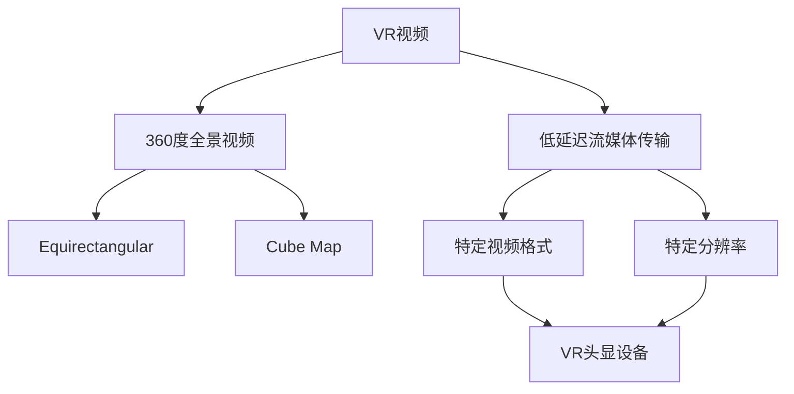

                 

## 1. 背景介绍

随着虚拟现实（VR）技术的不断发展，VR内容的创作和分享变得越来越重要。然而，VR视频的编码和流媒体传输面临着独特的挑战，因为它们需要处理高分辨率、低延迟的360度视频。FFmpeg是一个强大的开源工具，它提供了广泛的多媒体处理功能，包括编码和流媒体传输。本文将探讨如何使用FFmpeg在VR中进行编码和流媒体传输。

## 2. 核心概念与联系

在深入讨论FFmpeg在VR中的应用之前，我们需要理解一些核心概念。首先，VR视频通常是360度全景视频，它们需要使用特殊的编码格式，如Equirectangular或Cube Map。其次，VR视频需要低延迟的流媒体传输，以提供流畅的用户体验。最后，VR头显设备通常需要特定的视频格式和分辨率。

下面是这些概念的Mermaid流程图：



## 3. 核心算法原理 & 具体操作步骤

### 3.1 算法原理概述

FFmpeg使用各种编码标准（如H.264、H.265）编码视频，并支持多种流媒体协议（如RTMP、HTTP）。在VR应用中，FFmpeg通常使用Equirectangular或Cube Map格式编码360度视频，并使用低延迟的流媒体协议传输视频。

### 3.2 算法步骤详解

1. **视频编码**：使用FFmpeg编码360度视频时，需要指定编码标准、分辨率和帧率。例如，以下命令使用H.264编码标准编码一个Equirectangular格式的360度视频：

   ```
   ffmpeg -i input.mp4 -c:v libx264 -preset slow -tune grain -f mp4 -vf "scale=1920:960" output.mp4
   ```

   其中，`-c:v libx264`指定了H.264编码标准，`-preset slow -tune grain`指定了编码质量，`-f mp4`指定了输出格式，`-vf "scale=1920:960"`指定了视频分辨率。

2. **流媒体传输**：编码后的视频需要通过流媒体协议传输。FFmpeg支持多种流媒体协议，包括RTMP、HTTP和RTP。以下命令使用RTMP协议传输编码后的视频：

   ```
   ffmpeg -i output.mp4 -c copy -f flv "rtmp://server/live/stream"
   ```

   其中，`-c copy`指定了不重新编码视频，`-f flv`指定了输出格式，`"rtmp://server/live/stream"`指定了RTMP服务器地址。

### 3.3 算法优缺点

FFmpeg的优点包括：

- 开源且跨平台
- 支持广泛的编码标准和流媒体协议
- 丰富的命令行选项，允许用户自定义编码和传输参数

FFmpeg的缺点包括：

- 学习曲线陡峭，需要一定的技术水平
- 文档不够完善，需要花费时间查找和理解命令行选项

### 3.4 算法应用领域

FFmpeg在VR领域的应用包括：

- 360度视频编码和传输
- VR直播和会议
- VR视频分享和存档

## 4. 数学模型和公式 & 详细讲解 & 举例说明

### 4.1 数学模型构建

在VR视频编码中，一个关键的数学模型是编码率控制（Rate Control）模型。Rate Control模型用于控制编码视频的比特率，以平衡编码质量和传输延迟。

### 4.2 公式推导过程

Rate Control模型的目标是最小化编码视频的码率和失真。一个常用的Rate Control模型是Lagrangian模型，它使用以下公式推导码率和失真：

$$J = D + \lambda R$$

其中，$J$是编码视频的总成本，$D$是编码视频的失真，$R$是编码视频的码率，$\lambda$是Lagrangian乘子，它控制码率和失真之间的权衡。

### 4.3 案例分析与讲解

例如，假设我们想要编码一个360度视频，并将其传输给一个VR头显设备。我们需要平衡编码质量和传输延迟，以提供流畅的用户体验。我们可以使用Lagrangian模型来控制码率和失真，并选择合适的$\lambda$值来平衡这两个因素。

## 5. 项目实践：代码实例和详细解释说明

### 5.1 开发环境搭建

要使用FFmpeg编码和传输VR视频，我们需要在开发环境中安装FFmpeg。FFmpeg可以在其官方网站上下载，并支持多种平台，包括Windows、Linux和macOS。

### 5.2 源代码详细实现

以下是一个使用FFmpeg编码和传输360度视频的示例命令：

```bash
ffmpeg -i input.mp4 -c:v libx264 -preset slow -tune grain -f mp4 -vf "scale=1920:960" output.mp4
ffmpeg -i output.mp4 -c copy -f flv "rtmp://server/live/stream"
```

### 5.3 代码解读与分析

这两个命令分别用于编码和传输360度视频。第一个命令使用H.264编码标准编码输入视频，并指定了编码质量、分辨率和帧率。第二个命令使用RTMP协议传输编码后的视频，并指定了RTMP服务器地址。

### 5.4 运行结果展示

编码和传输后的视频可以在VR头显设备上播放，并提供流畅的用户体验。用户可以查看360度视频，并通过头

