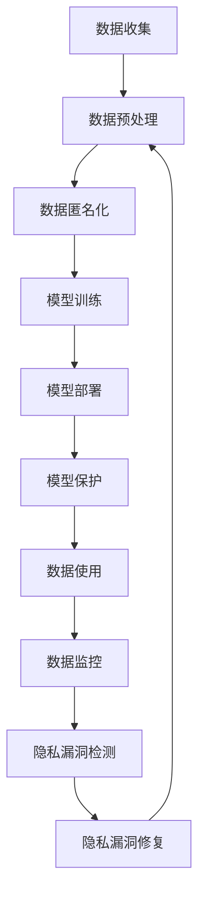

                 

**大语言模型（LLM）隐私保护：现状、漏洞与对策**

## 1. 背景介绍

随着大语言模型（LLM）的不断发展和应用，其在各个领域的影响力日益增强。然而，LLM在处理和生成大量用户数据的过程中，也面临着严峻的隐私保护挑战。本文将深入探讨LLM隐私保护的现状、存在的漏洞，并提出相应的对策。

## 2. 核心概念与联系

### 2.1 LLM隐私保护的定义

LLM隐私保护旨在保护用户数据和信息免受未经授权的访问、泄露、篡改或滥用。它涉及一系列技术和策略，旨在维护用户的隐私权和数据安全。

### 2.2 LLM隐私保护的关键概念

- **数据匿名化（Data Anonymization）**：删除或修改数据中的个人标识信息，以保护用户隐私。
- **差分隐私（Differential Privacy）**：一种保护隐私的技术，通过引入噪声来限制单个个体对数据集的影响。
- **联邦学习（Federated Learning）**：一种分布式机器学习方法，允许模型在客户端数据上训练，而无需共享或传输数据。
- **模型保护（Model Protection）**：保护模型结构和参数免受逆向工程和窃取的技术。

### 2.3 LLM隐私保护的架构



## 3. 核心算法原理 & 具体操作步骤

### 3.1 差分隐私算法原理

差分隐私通过向数据集添加噪声来保护隐私。给定ε和δ，如果算法A对数据集D的输出只在一个个体的删除或添加上改变ε，并且在任何可能的输出上改变不超过δ，则算法A具有（ε，δ）差分隐私。

### 3.2 差分隐私算法步骤

1. 选择ε和δ，根据隐私需求调整这两个参数。
2. 计算机器学习模型的敏感性。
3. 为模型添加噪声，以满足（ε，δ）差分隐私保证。

### 3.3 差分隐私算法优缺点

**优点**：差分隐私提供了严格的隐私保护保证，可以防止个体数据被重新识别。

**缺点**：差分隐私会导致模型精确度的下降，因为添加的噪声会干扰模型的学习过程。

### 3.4 差分隐私应用领域

差分隐私广泛应用于保护用户数据的隐私，如人口普查数据、医疗数据和金融数据等。

## 4. 数学模型和公式

### 4.1 差分隐私数学模型

给定ε和δ，如果对于任意两个数据集D和D'，其中D'是D的一个个体的删除或添加，我们有：

P[A(D) ∈ S] ≤ e^ε \* P[A(D') ∈ S] + δ

则算法A具有（ε，δ）差分隐私。

### 4.2 差分隐私公式推导

差分隐私的数学基础是信息论和概率论。通过构造适当的概率分布和应用信息论定理，可以推导出差分隐私的数学模型。

### 4.3 案例分析与讲解

假设我们有一个包含1000个个体的数据集，我们想要计算个体年龄的平均值，并使用差分隐私保护隐私。如果我们选择ε=1和δ=0.1，那么我们需要添加的噪声为：

噪声 = (ε \* ln(1/δ)) / (2 \*-sensitive) = (1 \* ln(1/0.1)) / (2 \* 100) ≈ 2.197

## 5. 项目实践：代码实例和详细解释说明

### 5.1 开发环境搭建

我们将使用Python和NumPy库来实现差分隐私算法。首先，安装必要的库：

```bash
pip install numpy
```

### 5.2 源代码详细实现

```python
import numpy as np

def add_noise(data, sensitivity, epsilon, delta):
    noise = np.random.laplace(scale=sensitivity / epsilon)
    return data + noise

def differential_privacy(data, sensitivity, epsilon, delta):
    noisy_data = add_noise(data, sensitivity, epsilon, delta)
    return noisy_data

# 示例数据
data = np.array([25, 30, 35, 40, 45])

# 参数设置
sensitivity = 1
epsilon = 1
delta = 0.1

# 应用差分隐私
noisy_data = differential_privacy(data, sensitivity, epsilon, delta)
print("Noisy data:", noisy_data)
```

### 5.3 代码解读与分析

在`add_noise`函数中，我们使用Laplace分布添加噪声。在`differential_privacy`函数中，我们应用噪声到数据集中。示例数据为个体年龄，我们应用差分隐私保护隐私。

### 5.4 运行结果展示

运行代码后，您将看到添加了噪声的数据集。请注意，添加的噪声会导致数据集的值发生变化。

## 6. 实际应用场景

### 6.1 LLM隐私保护的现状

当前，LLM在处理和生成大量用户数据的过程中，面临着严峻的隐私保护挑战。用户数据可能会被泄露、滥用或逆向工程，从而导致隐私泄露。

### 6.2 LLM隐私保护的漏洞

- **数据泄露**：未经授权的访问或共享用户数据。
- **模型窃取**：通过逆向工程获取模型结构和参数。
- **重新识别**：通过数据关联和推理重新识别用户。

### 6.3 LLM隐私保护的对策

- **数据匿名化**：删除或修改数据中的个人标识信息。
- **差分隐私**：向数据集添加噪声以保护隐私。
- **联邦学习**：在客户端数据上训练模型，而无需共享或传输数据。
- **模型保护**：保护模型结构和参数免受逆向工程和窃取。

### 6.4 未来应用展望

随着LLM技术的不断发展，隐私保护也将变得越来越重要。未来，我们预计会看到更多基于差分隐私、联邦学习和模型保护的LLM隐私保护解决方案。

## 7. 工具和资源推荐

### 7.1 学习资源推荐

- "Differential Privacy: A Survey of Results"（差分隐私：结果综述）
- "Federated Learning: Challenges, Methods, and Future Directions"（联邦学习：挑战、方法和未来方向）
- "Model Inversion Attacks: Implications and Countermeasures"（模型逆向工程攻击：影响和对策）

### 7.2 开发工具推荐

- TensorFlow Federated：一个用于联邦学习的开源框架。
- PySyft：一个用于差分隐私和联邦学习的开源库。
- ModelGuard：一个用于模型保护的开源库。

### 7.3 相关论文推荐

- "Privacy-Preserving Machine Learning with Differential Privacy"（基于差分隐私的隐私保护机器学习）
- "Federated Learning: Challenges, Methods, and Future Directions"（联邦学习：挑战、方法和未来方向）
- "Model Inversion Attacks: Implications and Countermeasures"（模型逆向工程攻击：影响和对策）

## 8. 总结：未来发展趋势与挑战

### 8.1 研究成果总结

本文介绍了LLM隐私保护的现状、漏洞和对策。我们讨论了差分隐私、联邦学习和模型保护等技术，并提供了差分隐私算法的实现示例。

### 8.2 未来发展趋势

LLM隐私保护将继续发展，以满足不断变化的隐私需求。我们预计会看到更多基于差分隐私、联邦学习和模型保护的解决方案。

### 8.3 面临的挑战

- **精确度与隐私的权衡**：隐私保护技术通常会导致模型精确度的下降。
- **实用性与可扩展性**：隐私保护技术需要在实用性和可扩展性方面进行平衡。
- **监管和法规**：隐私保护技术需要遵循不断变化的监管和法规。

### 8.4 研究展望

未来的研究将关注隐私保护技术的进一步改进，以提高模型精确度和实用性。此外，研究人员还将探索新的隐私保护技术和方法，以满足不断变化的隐私需求。

## 9. 附录：常见问题与解答

**Q：差分隐私和联邦学习有什么区别？**

A：差分隐私和联邦学习都是隐私保护技术，但它们侧重于不同的方面。差分隐私通过向数据集添加噪声来保护隐私，而联邦学习允许模型在客户端数据上训练，而无需共享或传输数据。

**Q：模型保护有哪些方法？**

A：模型保护包括一系列技术，旨在保护模型结构和参数免受逆向工程和窃取。这些技术包括模型加密、模型压缩和模型混淆等。

**Q：LLM隐私保护的未来发展方向是什么？**

A：LLM隐私保护的未来发展方向包括提高模型精确度和实用性、探索新的隐私保护技术和方法，以及满足不断变化的隐私需求。

---

**作者：禅与计算机程序设计艺术 / Zen and the Art of Computer Programming**

