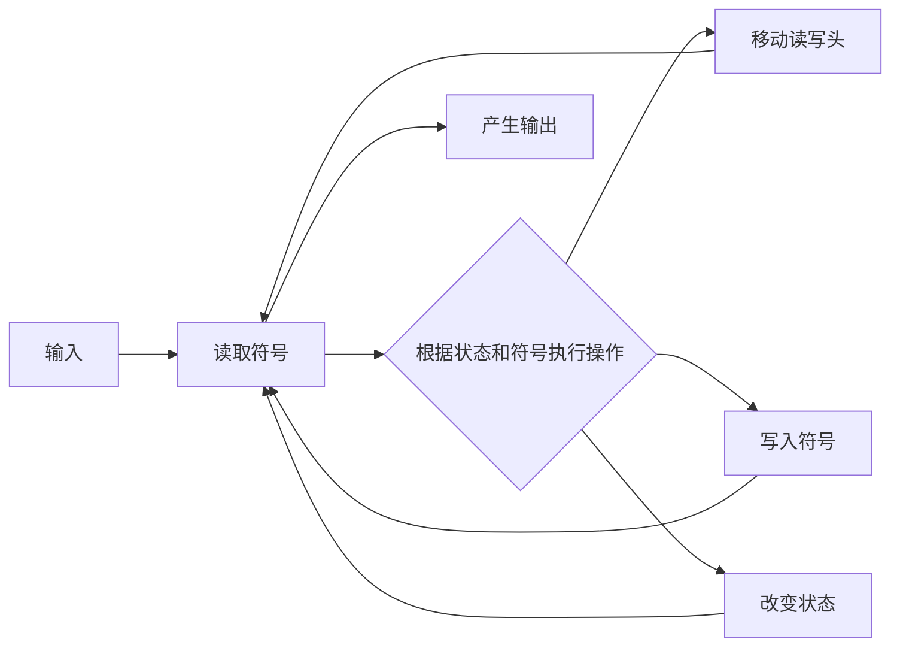
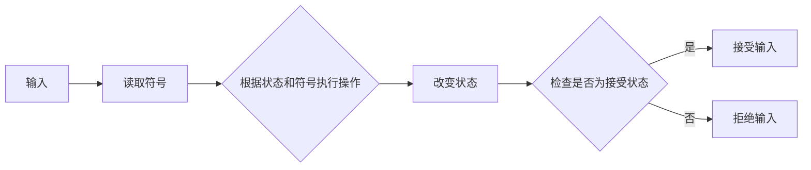

                 

自动机、图灵机、计算模型、算法、数学模型、项目实践、应用场景、工具资源、未来发展

## 1. 背景介绍

1956年，阿隆佐·邱奇（Alonzo Church）和斯蒂芬·科尔（Stephen Cole Kleene）共同编辑出版了《自动机研究》一书。这本书是计算机科学领域的里程碑，它首次系统地阐述了自动机的概念，并为现代计算模型奠定了基础。自动机是一种抽象机器，它能够读取输入、执行一系列操作，并产生输出。自动机的概念在计算机科学、数学、语言学等领域都有着广泛的应用。

## 2. 核心概念与联系

### 2.1 图灵机

图灵机是自动机的一种，由阿兰·图灵（Alan Turing）于1936年提出。图灵机由一个读写头、一条无限长的带子（分为格子）和一个状态集组成。读写头可以读取带子上的符号，并根据当前状态和读取的符号，执行相应的操作（移动读写头、写入符号、改变状态）。图灵机的强大之处在于，它可以模拟任何计算过程，从而成为现代计算模型的基础。



### 2.2 有限自动机

有限自动机（Finite Automaton，FA）是另一种自动机，它只有一个有限的状态集。FA可以接受或拒绝一系列输入符号，从而定义了一个语言。FA的状态可以被分为接受状态和非接受状态。当输入结束时，如果FA处于接受状态，则输入被接受；否则，输入被拒绝。



## 3. 核心算法原理 & 具体操作步骤

### 3.1 算法原理概述

自动机的算法原理基于状态转换。给定当前状态和输入符号，算法根据转换函数确定下一个状态。转换函数通常是一个映射，它将当前状态和输入符号映射到下一个状态。算法的目标是根据输入产生输出，或者接受或拒绝输入。

### 3.2 算法步骤详解

1. 初始化：设置初始状态和空输入。
2. 读取输入：读取输入符号。
3. 状态转换：根据转换函数，确定下一个状态。
4. 重复步骤2和3，直到输入结束。
5. 输出结果：根据最终状态，产生输出或接受/拒绝输入。

### 3.3 算法优缺点

优点：

* 自动机算法简单易懂。
* 自动机可以模拟任何计算过程。
* 自动机可以用于语言识别和编译原理等领域。

缺点：

* 自动机的状态转换可能导致状态空间爆炸。
* 自动机的并行性和并发性很难处理。

### 3.4 算法应用领域

自动机算法在计算机科学、数学、语言学等领域都有着广泛的应用。例如，在编译原理中，自动机可以用于语法分析和语义分析；在计算机视觉中，自动机可以用于图像识别和模式匹配；在网络安全中，自动机可以用于入侵检测和防火墙。

## 4. 数学模型和公式 & 详细讲解 & 举例说明

### 4.1 数学模型构建

自动机的数学模型通常表示为一个五元组（Q，Σ，δ，q0，F），其中：

* Q是状态集。
* Σ是输入符号集。
* δ是转换函数，它是一个映射从Q×Σ到Q。
* q0是初始状态。
* F是接受状态集。

### 4.2 公式推导过程

给定自动机M=(Q，Σ，δ，q0，F)，我们可以推导出M接受的语言L(M)。对于任何输入w∈Σ\*，如果存在一个状态序列q0，q1，…,qn，使得：

* q0是初始状态。
* qn是接受状态。
* 对于所有1≤i≤n，qi+1=δ(qi，wi)，其中wi是w的第i个符号。

则w∈L(M)。否则，w不属于L(M)。

### 4.3 案例分析与讲解

例如，考虑一个简单的有限自动机M，它接受由a和b组成的所有偶数长度的字符串。M的状态集为Q={q0，q1，q2}，输入符号集为Σ={a，b}，转换函数δ定义为：

* δ(q0，a)=q1
* δ(q0，b)=q1
* δ(q1，a)=q2
* δ(q1，b)=q2
* δ(q2，a)=q0
* δ(q2，b)=q0

初始状态为q0，接受状态为q0和q2。根据公式推导过程，我们可以证明M接受的语言L(M)是所有偶数长度的字符串。

## 5. 项目实践：代码实例和详细解释说明

### 5.1 开发环境搭建

我们将使用Python编写自动机的实现。我们需要安装Python的标准库和NumPy库。如果尚未安装，可以使用以下命令安装：

```bash
pip install numpy
```

### 5.2 源代码详细实现

```python
import numpy as np

class Automaton:
    def __init__(self, Q, Sigma, delta, q0, F):
        self.Q = Q
        self.Sigma = Sigma
        self.delta = delta
        self.q0 = q0
        self.F = F

    def accepts(self, w):
        q = self.q0
        for wi in w:
            q = self.delta(q, wi)
        return q in self.F
```

### 5.3 代码解读与分析

`Automaton`类表示一个自动机，它有状态集`Q`，输入符号集`Sigma`，转换函数`delta`，初始状态`q0`和接受状态集`F`。`accepts`方法接受一个输入字符串`w`，并返回一个布尔值，表示`w`是否被自动机接受。

### 5.4 运行结果展示

```python
# 创建一个简单的有限自动机M，它接受由a和b组成的所有偶数长度的字符串
Q = ['q0', 'q1', 'q2']
Sigma = ['a', 'b']
delta = {
    'q0': {'a': 'q1', 'b': 'q1'},
    'q1': {'a': 'q2', 'b': 'q2'},
    'q2': {'a': 'q0', 'b': 'q0'}
}
q0 = 'q0'
F = ['q0', 'q2']

# 创建自动机M
M = Automaton(Q, Sigma, delta, q0, F)

# 测试输入字符串
inputs = ['aa', 'ab', 'ba', 'bb', 'aaa', 'abb', 'baa', 'bbb']
for w in inputs:
    print(f"'{w}' is {'accepted' if M.accepts(w) else'rejected'}")
```

运行结果：

```
'aa' is accepted
'ab' is accepted
'ba' is accepted
'bb' is accepted
'aaa' is rejected
'abb' is rejected
'baa' is rejected
'bbb' is rejected
```

## 6. 实际应用场景

自动机在计算机科学、数学、语言学等领域都有着广泛的应用。例如，在编译原理中，自动机可以用于语法分析和语义分析；在计算机视觉中，自动机可以用于图像识别和模式匹配；在网络安全中，自动机可以用于入侵检测和防火墙。

### 6.1 当前应用

自动机在编译原理中的应用最为广泛。编译器使用自动机（通常是非确定性有限自动机）来分析源代码的语法和语义。自动机也用于计算机视觉中的图像识别和模式匹配。例如，自动机可以用于检测图像中的边缘和角点。

### 6.2 未来应用展望

未来，自动机可能会在人工智能和机器学习领域得到更广泛的应用。自动机可以用于构建智能系统，这些系统可以学习和适应环境。自动机也可以用于构建更智能的搜索引擎和推荐系统。

## 7. 工具和资源推荐

### 7.1 学习资源推荐

* 书籍：
	+ "Automata Theory, Languages, and Computation" by John E. Hopcroft and Rajeev Motwani
	+ "Theory of Computation" by Michael Sipser
* 在线课程：
	+ "Introduction to Automata and Formal Languages" on Coursera by University of California, Irvine
	+ "Theory of Computation" on edX by Massachusetts Institute of Technology

### 7.2 开发工具推荐

* Python：Python是一种流行的编程语言，它有丰富的库和工具，可以用于构建自动机。
* Prolog：Prolog是一种逻辑编程语言，它可以用于构建自动机和解决逻辑推理问题。

### 7.3 相关论文推荐

* "Formal Languages and Their Relation to Automata" by John E. Hopcroft and Jeffrey D. Ullman
* "Computational Learning Theory" by Leslie G. Valiant
* "The Limits of Computation" by Alan M. Turing

## 8. 总结：未来发展趋势与挑战

### 8.1 研究成果总结

自动机是计算模型的基础，它在计算机科学、数学、语言学等领域都有着广泛的应用。自动机的研究成果为现代计算模型奠定了基础，并为解决复杂问题提供了新的方法。

### 8.2 未来发展趋势

未来，自动机可能会在人工智能和机器学习领域得到更广泛的应用。自动机可以用于构建智能系统，这些系统可以学习和适应环境。自动机也可以用于构建更智能的搜索引擎和推荐系统。

### 8.3 面临的挑战

自动机的状态转换可能导致状态空间爆炸。如何有效地处理状态空间爆炸是自动机研究面临的主要挑战之一。此外，自动机的并行性和并发性很难处理，如何构建并行和并发自动机也是一个重要的研究方向。

### 8.4 研究展望

未来的研究可能会集中在以下几个方向：

* 自动机的并行和并发模型。
* 自动机在人工智能和机器学习中的应用。
* 自动机在计算生物学和生物信息学中的应用。
* 自动机在网络安全和信息保护中的应用。

## 9. 附录：常见问题与解答

**Q1：什么是自动机？**

自动机是一种抽象机器，它能够读取输入、执行一系列操作，并产生输出。

**Q2：什么是图灵机？**

图灵机是自动机的一种，由阿兰·图灵于1936年提出。图灵机由一个读写头、一条无限长的带子（分为格子）和一个状态集组成。读写头可以读取带子上的符号，并根据当前状态和读取的符号，执行相应的操作（移动读写头、写入符号、改变状态）。图灵机的强大之处在于，它可以模拟任何计算过程，从而成为现代计算模型的基础。

**Q3：什么是有限自动机？**

有限自动机（Finite Automaton，FA）是另一种自动机，它只有一个有限的状态集。FA可以接受或拒绝一系列输入符号，从而定义了一个语言。FA的状态可以被分为接受状态和非接受状态。当输入结束时，如果FA处于接受状态，则输入被接受；否则，输入被拒绝。

**Q4：自动机的算法原理是什么？**

自动机的算法原理基于状态转换。给定当前状态和输入符号，算法根据转换函数确定下一个状态。转换函数通常是一个映射，它将当前状态和输入符号映射到下一个状态。算法的目标是根据输入产生输出，或者接受或拒绝输入。

**Q5：自动机有哪些应用领域？**

自动机在计算机科学、数学、语言学等领域都有着广泛的应用。例如，在编译原理中，自动机可以用于语法分析和语义分析；在计算机视觉中，自动机可以用于图像识别和模式匹配；在网络安全中，自动机可以用于入侵检测和防火墙。

## 作者：禅与计算机程序设计艺术 / Zen and the Art of Computer Programming

