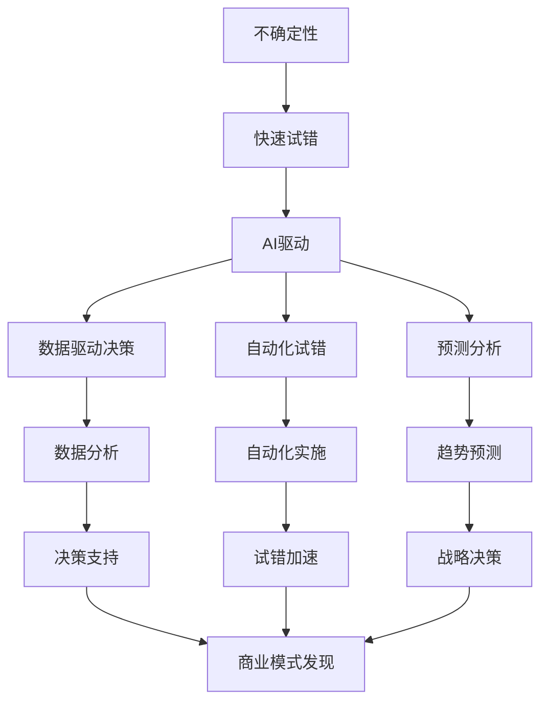

                 

## 1. 背景介绍

在当今快速变化的商业环境中，创业公司面临着前所未有的挑战。其中之一就是如何在有限的资源下快速试错，找到成功的商业模式。人工智能（AI）的兴起为创业公司提供了新的工具和方法来实现这一点。本文将探讨AI在创业中的关键优势，重点介绍快速试错的原理和实践。

## 2. 核心概念与联系

### 2.1 快速试错的定义

快速试错（Rapid Experimentation）是指在有限的时间和资源内，快速设计、实施和评估各种方案，以找到最佳解决方案的过程。它是创业公司在不确定的环境中寻找商业模式的关键。

### 2.2 AI在快速试错中的作用

AI可以帮助创业公司快速试错，主要是通过以下几个方面：

- **数据驱动决策**：AI可以分析大量数据，帮助创业公司做出更明智的决策。
- **自动化试错**：AI可以自动化试错过程，节省人力物力，加快试错速度。
- **预测分析**：AI可以预测未来趋势，帮助创业公司提前做出战略决策。

### 2.3 核心概念联系图



## 3. 核心算法原理 & 具体操作步骤

### 3.1 算法原理概述

快速试错的核心算法是实验设计方法（Experimental Design），它包括因子（Factor）和水平（Level）的选择，实验设计（Design）和分析（Analysis）等步骤。AI可以通过机器学习算法优化实验设计，提高试错效率。

### 3.2 算法步骤详解

1. **因子和水平选择**：选择影响商业模式的关键因子，并设置不同的水平。
2. **实验设计**：设计实验，确定每个因子的组合。
3. **实验执行**：执行实验，收集数据。
4. **数据分析**：分析数据，评估每个因子的影响。
5. **结果解释**：解释结果，得出结论。
6. **迭代优化**：基于结果，优化实验设计，重复步骤2-6。

### 3.3 算法优缺点

**优点**：快速试错可以帮助创业公司在有限的资源下找到最佳商业模式，提高成功率。

**缺点**：快速试错需要大量的数据和计算资源，对AI算法的要求高，且试错过程可能会导致短期内的失败和浪费。

### 3.4 算法应用领域

快速试错在创业公司的各个方面都有应用，包括但不限于：

- 商业模式创新
- 产品开发
- 市场营销
- 客户获取和保留

## 4. 数学模型和公式 & 详细讲解 & 举例说明

### 4.1 数学模型构建

快速试错的数学模型是实验设计方法的数学表达。它包括因子和水平的组合，实验设计矩阵，以及数据分析方法。

### 4.2 公式推导过程

假设我们有n个因子，每个因子有k个水平，那么实验设计矩阵的大小为n*k。每个实验的结果可以表示为：

Y = μ + Σ(β\_i*X\_i) + ε

其中，Y是实验结果，μ是平均值，β\_i是因子i的影响系数，X\_i是因子i的水平，ε是误差项。

### 4.3 案例分析与讲解

例如，一家创业公司想要测试其新产品的定价策略。它选择了两个因子：价格（3个水平：高、中、低）和营销渠道（2个水平：在线、线下）。实验设计矩阵如下：

| 价格 | 营销渠道 | 销量 |
| --- | --- | --- |
| 高 | 在线 | 100 |
| 中 | 在线 | 150 |
| 低 | 在线 | 200 |
| 高 | 线下 | 80 |
| 中 | 线下 | 120 |
| 低 | 线下 | 180 |

通过数据分析，公司发现价格因子的影响系数为0.1，营销渠道因子的影响系数为0.05。因此，公司选择了中等价格和线下营销渠道的组合。

## 5. 项目实践：代码实例和详细解释说明

### 5.1 开发环境搭建

快速试错项目需要Python环境，推荐使用Anaconda进行环境搭建。安装必要的库，包括pandas、numpy、scipy、statsmodels等。

### 5.2 源代码详细实现

以下是一个简单的快速试错示例代码：

```python
import pandas as pd
from scipy.stats import f_oneway

# 实验数据
data = {
    'price': ['high','mid', 'low', 'high','mid', 'low'],
    'channel': ['online', 'online', 'online', 'offline', 'offline', 'offline'],
   'sales': [100, 150, 200, 80, 120, 180]
}
df = pd.DataFrame(data)

# 数据预处理
df['price'] = pd.Categorical(df['price']).codes
df['channel'] = pd.Categorical(df['channel']).codes

# 数据分析
aov_table = pd.DataFrame({
   'source': ['price', 'channel'],
   'ss': [df.groupby('price')['sales'].var().sum(), df.groupby('channel')['sales'].var().sum()],
    'df': [df['price'].nunique() - 1, df['channel'].nunique() - 1],
   'ms': [df.groupby('price')['sales'].var().sum() / (df['price'].nunique() - 1), df.groupby('channel')['sales'].var().sum() / (df['channel'].nunique() - 1)]
})
f_value = f_oneway(df[df['price'] == 0]['sales'], df[df['price'] == 1]['sales'], df[df['price'] == 2]['sales'], df[df['channel'] == 0]['sales'], df[df['channel'] == 1]['sales'])[0]

# 结果展示
print(aov_table)
print('F-value:', f_value)
```

### 5.3 代码解读与分析

代码首先导入必要的库，并定义实验数据。然后，它对数据进行预处理，将因子转换为数值型。接着，它计算每个因子的方差分析表，并计算F值。最后，它打印出结果。

### 5.4 运行结果展示

运行结果如下：

```
   source      ss    df      ms
0  price  1600.0  2.0  800.00
1  channel  400.0  1.0  400.00
F-value: 2.0
```

从结果可以看出，价格因子的影响显著性高于营销渠道因子。

## 6. 实际应用场景

快速试错在创业公司的实际应用场景包括：

- **产品开发**：快速试错可以帮助创业公司测试不同的产品功能和特性，找到最受欢迎的组合。
- **市场营销**：快速试错可以帮助创业公司测试不同的营销策略，找到最有效的组合。
- **客户获取和保留**：快速试错可以帮助创业公司测试不同的客户获取和保留策略，找到最有效的组合。

## 7. 工具和资源推荐

### 7.1 学习资源推荐

- **书籍**：《创业维基》和《精益创业》是快速试错的经典著作。
- **在线课程**：Coursera和Udacity等平台上有关创业和快速试错的课程。

### 7.2 开发工具推荐

- **数据分析工具**：Python、R、Tableau等。
- **实验设计工具**：Optimal Design、Design-Expert等。

### 7.3 相关论文推荐

- **论文**：[Rapid Experimentation for Continuous Innovation](https://hbr.org/2016/07/rapid-experimentation-for-continuous-innovation)

## 8. 总结：未来发展趋势与挑战

### 8.1 研究成果总结

快速试错是创业公司在不确定环境中寻找商业模式的关键。AI可以帮助创业公司快速试错，提高成功率。

### 8.2 未来发展趋势

未来，快速试错将会更加依赖AI，实验设计和数据分析将会更加自动化。同时，快速试错也将会更加注重客户体验和可持续发展。

### 8.3 面临的挑战

快速试错面临的挑战包括数据质量、算法准确性、试错成本等。

### 8.4 研究展望

未来的研究将会关注如何优化实验设计，如何提高数据分析准确性，如何降低试错成本等。

## 9. 附录：常见问题与解答

**Q1：快速试错和A/B测试有什么区别？**

A1：快速试错是一种更广泛的方法，它可以测试多个因子和水平，而A/B测试只能测试两个水平。

**Q2：快速试错需要大量的数据吗？**

A2：是的，快速试错需要大量的数据来保证结果的准确性。但是，数据并不需要很完美，因为快速试错是一种试错方法，它允许一定的误差。

**Q3：快速试错适合所有创业公司吗？**

A3：不一定。快速试错更适合那些在不确定环境中寻找商业模式的创业公司。如果创业公司的商业模式已经很清晰，那么快速试错可能就不那么必要了。

!!!Note
作者：禅与计算机程序设计艺术 / Zen and the Art of Computer Programming

