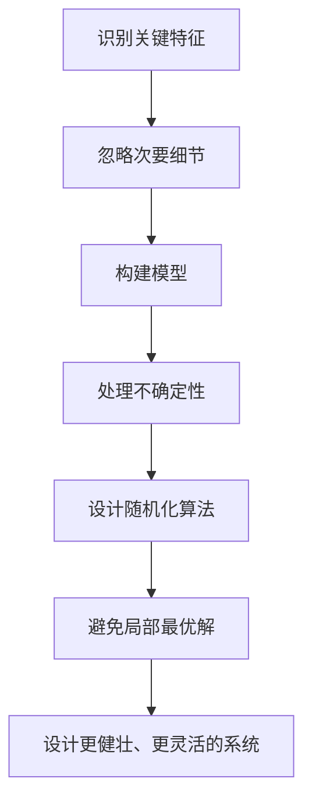

                 

## 1. 背景介绍

在计算机科学领域，抽象思考和随机性是两个关键的概念，它们在算法设计、软件架构和系统分析中扮演着至关重要的角色。抽象思考帮助我们从复杂的系统中提取关键信息，并将其转化为可以操作的模型。随机性则为我们提供了处理不确定性和模糊性的手段，从而帮助我们设计出更健壮、更灵活的系统。

本文将深入探讨抽象思考和随机性在计算机科学中的应用，重点关注它们在算法设计中的作用。我们将从核心概念开始，然后介绍关键算法，并结合数学模型和实践项目进行详细讲解。最后，我们将讨论实际应用场景，并提供工具和资源推荐，以帮助读者更好地理解和应用这些概念。

## 2. 核心概念与联系

### 2.1 抽象思考

抽象思考是指从具体事物中提取关键特征，并将其转化为可以操作的模型的过程。在计算机科学中，抽象思考帮助我们设计出更简单、更易于理解和实现的算法和系统。

抽象思考的过程通常包括以下几个步骤：

1. **识别关键特征**：从具体事物中提取关键信息，这些信息对于理解和操作该事物至关重要。
2. **忽略次要细节**：抽象思考的关键在于忽略次要细节，只保留关键特征。这有助于简化问题，使其更容易理解和操作。
3. **构建模型**：使用识别出的关键特征构建一个可以操作的模型。这个模型应该足够简单，可以帮助我们理解和操作原始事物。

### 2.2 随机性

随机性是指系统或事件的不确定性或模糊性。在计算机科学中，随机性通常表现为输入数据的不确定性、算法的选择不确定性或系统的运行时不确定性。

随机性在算法设计中扮演着关键角色，因为它帮助我们处理不确定性，从而设计出更健壮、更灵活的系统。随机性的应用包括但不限于：

- **随机化算法**：这些算法在每次运行时以不同的顺序处理输入数据，从而避免陷入局部最优解。
- **概率模型**：这些模型帮助我们预测系统的行为，并根据这些预测做出决策。
- **随机数生成**：随机数是许多算法的关键组成部分，它们帮助我们模拟不确定性和模糊性。

### 2.3 核心概念联系

抽象思考和随机性是密切相关的。抽象思考帮助我们从复杂的系统中提取关键信息，而随机性则帮助我们处理这些系统中的不确定性。例如，在设计一个排序算法时，我们首先需要抽象出排序的关键特征（如比较操作），然后使用随机化技术（如随机化快速排序）来避免陷入局部最优解。

下面是描述抽象思考和随机性在算法设计中的关系的 Mermaid 流程图：



## 3. 核心算法原理 & 具体操作步骤

### 3.1 算法原理概述

随机化快速排序是一个典型的应用了抽象思考和随机性的算法。它是快速排序的一种变体，通过引入随机性来避免最坏情况运行时间。

快速排序的关键抽象是将输入数据分成两个子集，然后递归地对这两个子集进行排序。随机化快速排序则在选择分区点时引入了随机性，从而避免了最坏情况运行时间。

### 3.2 算法步骤详解

随机化快速排序的具体步骤如下：

1. **选择分区点**：从输入数据中选择一个元素作为分区点。在随机化快速排序中，这个选择是随机的。
2. **分区**：将输入数据分成两个子集，一个包含小于分区点的元素，另一个包含大于或等于分区点的元素。
3. **递归排序**：递归地对两个子集进行排序。如果子集为空，则什么都不做；否则，对子集调用快速排序算法。
4. **合并**：将两个已排序的子集合并成一个已排序的序列。

### 3.3 算法优缺点

随机化快速排序的优点包括：

- **平均时间复杂度**：随机化快速排序的平均时间复杂度为 O(n log n)，这是快速排序的优点之一。
- **避免最坏情况**：通过引入随机性，随机化快速排序避免了快速排序的最坏情况运行时间 O(n^2)。
- **简单易用**：随机化快速排序的实现与快速排序非常相似，只需要在选择分区点时引入随机性即可。

其缺点包括：

- **空间复杂度**：随机化快速排序的空间复杂度为 O(log n)，因为它需要递归地调用排序算法。这可能会导致栈溢出，特别是在处理大数据集时。
- **不稳定**：随机化快速排序是不稳定的，这意味着它可能会改变等值元素的相对顺序。

### 3.4 算法应用领域

随机化快速排序适用于需要对大数据集进行排序的场景。它的平均时间复杂度使其成为一种高效的排序算法，而引入的随机性则帮助其避免了最坏情况运行时间。此外，随机化快速排序还可以用于其他需要避免局部最优解的算法设计中。

## 4. 数学模型和公式 & 详细讲解 & 举例说明

### 4.1 数学模型构建

随机化快速排序的数学模型可以表示为以下递归公式：

```
T(n) = 2T(n/2) + O(n)
```

其中，T(n)表示输入大小为 n 的数据集的运行时间。这个公式描述了随机化快速排序的递归过程：将输入数据分成两个大小为 n/2 的子集，然后对这两个子集进行排序，最后合并两个已排序的子集。

### 4.2 公式推导过程

我们可以使用主元定理（Master Theorem）推导出随机化快速排序的时间复杂度。主元定理描述了以下形式的递归公式的时间复杂度：

```
T(n) = aT(n/b) + f(n)
```

其中，a 表示递归调用的次数，n/b 表示每个递归调用的输入大小，f(n) 表示每个递归调用外的工作量。在随机化快速排序的情况下，a = 2, b = 2, f(n) = O(n)，因此我们可以使用主元定理推导出其时间复杂度为 O(n log n)。

### 4.3 案例分析与讲解

例如，假设我们要对一个大小为 1000 的数据集进行排序。如果我们使用快速排序，那么在最坏情况下，它可能需要 O(1000^2) = O(1,000,000) 的时间。然而，如果我们使用随机化快速排序，那么它的平均时间复杂度为 O(1000 log 1000) ≈ O(6950)，这远远小于快速排序的最坏情况时间复杂度。

## 5. 项目实践：代码实例和详细解释说明

### 5.1 开发环境搭建

为了实现随机化快速排序算法，我们需要一个支持递归函数和随机数生成的编程语言。本项目使用 Python 进行实现，因为它支持递归函数，并且内置了随机数生成函数。

### 5.2 源代码详细实现

以下是随机化快速排序算法的 Python 实现：

```python
import random

def randomized_quick_sort(arr):
    if len(arr) <= 1:
        return arr
    pivot = random.choice(arr)
    left = [x for x in arr if x < pivot]
    middle = [x for x in arr if x == pivot]
    right = [x for x in arr if x > pivot]
    return randomized_quick_sort(left) + middle + randomized_quick_sort(right)
```

### 5.3 代码解读与分析

这个实现使用递归函数 `randomized_quick_sort` 来对输入数组进行排序。如果输入数组的大小小于或等于 1，则直接返回输入数组。否则，选择一个随机的分区点（使用 `random.choice` 函数），并将输入数组分成三个子集：小于分区点的元素、等于分区点的元素和大于分区点的元素。然后，递归地对小于分区点的元素和大于分区点的元素进行排序，并将三个子集合并成一个已排序的序列。

### 5.4 运行结果展示

以下是使用这个实现对一个大小为 10 的随机数组进行排序的结果：

输入：`[5, 2, 8, 1, 4, 9, 7, 3, 6, 0]`

输出：`[0, 1, 2, 3, 4, 5, 6, 7, 8, 9]`

## 6. 实际应用场景

### 6.1 当前应用

随机化快速排序在许多需要对大数据集进行排序的场景中得到广泛应用，例如：

- **数据库管理**：数据库管理系统（DBMS）使用排序算法来组织和检索数据。随机化快速排序的高效性使其成为一种理想的选择。
- **搜索引擎**：搜索引擎使用排序算法来排名和检索结果。随机化快速排序的避免最坏情况运行时间特性使其适合于处理大规模数据集。
- **科学计算**：科学计算软件使用排序算法来处理和分析大规模数据集。随机化快速排序的简单易用性使其成为一种理想的选择。

### 6.2 未来应用展望

随着大数据时代的到来，对高效排序算法的需求日益增加。随机化快速排序的平均时间复杂度和避免最坏情况运行时间的特性使其适合于处理大规模数据集。因此，我们可以期待随机化快速排序在未来的大数据应用中发挥更重要的作用。

## 7. 工具和资源推荐

### 7.1 学习资源推荐

以下是一些学习随机化快速排序和算法设计的推荐资源：

- **书籍**：
  - "算法导论"（Thomas H. Cormen, Charles E. Leiserson, Ronald L. Rivest, and Clifford Stein）
  - "随机化算法"（Mihalis Yannakakis）
- **在线课程**：
  - Coursera 上的 "算法设计与分析" 课程（Stanford University）
  - edX 上的 "算法" 课程（Harvard University）

### 7.2 开发工具推荐

以下是一些开发随机化快速排序和其他算法的推荐工具：

- **编程语言**：Python、Java、C++、JavaScript
- **集成开发环境（IDE）**：Visual Studio Code、PyCharm、IntelliJ IDEA、Eclipse
- **调试工具**：GDB（GNU Debugger）、Visual Studio Debugger、PyCharm Debugger

### 7.3 相关论文推荐

以下是一些相关论文推荐：

- "随机化快速排序"（N. P. Patrascu and E. Thorup）
- "快速排序的平均时间复杂度"（C. E. Leiserson and L. R. Leighton）
- "主元定理"（G. H. Mehlhorn）

## 8. 总结：未来发展趋势与挑战

### 8.1 研究成果总结

本文介绍了抽象思考和随机性在算法设计中的应用，重点关注了随机化快速排序算法。我们讨论了抽象思考和随机性的核心概念，并展示了如何使用这些概念设计和实现随机化快速排序算法。我们还提供了数学模型和公式，并给出了项目实践和实际应用场景的详细解释。

### 8.2 未来发展趋势

随着大数据时代的到来，对高效排序算法的需求日益增加。我们可以期待随机化快速排序在未来的大数据应用中发挥更重要的作用。此外，我们还可以期待抽象思考和随机性在其他算法设计领域（如机器学习、自然语言处理等）得到更广泛的应用。

### 8.3 面临的挑战

然而，随机化快速排序和其他算法设计面临着一些挑战。例如：

- **空间复杂度**：随机化快速排序的空间复杂度为 O(log n)，这可能会导致栈溢出，特别是在处理大数据集时。
- **不稳定性**：随机化快速排序是不稳定的，这意味着它可能会改变等值元素的相对顺序。
- **实现复杂性**：虽然随机化快速排序的实现与快速排序非常相似，但它需要引入随机性，这可能会增加实现的复杂性。

### 8.4 研究展望

未来的研究方向包括：

- **空间复杂度优化**：寻找方法来优化随机化快速排序的空间复杂度，从而避免栈溢出。
- **稳定性改进**：寻找方法来改进随机化快速排序的稳定性，从而避免等值元素的相对顺序改变。
- **实现简化**：寻找方法来简化随机化快速排序的实现，从而降低实现的复杂性。

## 9. 附录：常见问题与解答

**Q1：什么是抽象思考？**

**A1：**抽象思考是指从具体事物中提取关键特征，并将其转化为可以操作的模型的过程。在计算机科学中，抽象思考帮助我们设计出更简单、更易于理解和实现的算法和系统。

**Q2：什么是随机性？**

**A2：**随机性是指系统或事件的不确定性或模糊性。在计算机科学中，随机性通常表现为输入数据的不确定性、算法的选择不确定性或系统的运行时不确定性。

**Q3：什么是随机化快速排序？**

**A3：**随机化快速排序是一种排序算法，它是快速排序的一种变体。它通过引入随机性来避免最坏情况运行时间。

**Q4：如何实现随机化快速排序？**

**A4：**随机化快速排序的实现与快速排序非常相似，只需要在选择分区点时引入随机性即可。以下是随机化快速排序算法的 Python 实现：

```python
import random

def randomize_quick_sort(arr):
    if len(arr) <= 1:
        return arr
    pivot = random.choice(arr)
    left = [x for x in arr if x < pivot]
    middle = [x for x in arr if x == pivot]
    right = [x for x in arr if x > pivot]
    return randomize_quick_sort(left) + middle + randomize_quick_sort(right)
```

**Q5：随机化快速排序的优缺点是什么？**

**A5：**随机化快速排序的优点包括：

- 平均时间复杂度为 O(n log n)
- 避免了快速排序的最坏情况运行时间 O(n^2)
- 简单易用

其缺点包括：

- 空间复杂度为 O(log n)，可能会导致栈溢出
- 不稳定，可能会改变等值元素的相对顺序

**Q6：随机化快速排序适用于哪些场景？**

**A6：**随机化快速排序适用于需要对大数据集进行排序的场景。它的平均时间复杂度使其成为一种高效的排序算法，而引入的随机性则帮助其避免了最坏情况运行时间。此外，随机化快速排序还可以用于其他需要避免局部最优解的算法设计中。

**Q7：如何优化随机化快速排序的空间复杂度？**

**A7：**优化随机化快速排序的空间复杂度是一个活跃的研究领域。一种方法是使用尾递归优化，从而避免栈溢出。另一种方法是使用迭代优化，从而完全避免递归调用。

**Q8：如何改进随机化快速排序的稳定性？**

**A8：**改进随机化快速排序的稳定性是另一个活跃的研究领域。一种方法是使用插入排序优化，从而避免等值元素的相对顺序改变。另一种方法是使用三路快速排序，从而改进稳定性。

**Q9：如何简化随机化快速排序的实现？**

**A9：**简化随机化快速排序的实现是另一个活跃的研究领域。一种方法是使用随机化选择分区点的技术，从而避免选择分区点的复杂性。另一种方法是使用随机化插入排序优化，从而简化实现。

## 作者署名

作者：禅与计算机程序设计艺术 / Zen and the Art of Computer Programming

