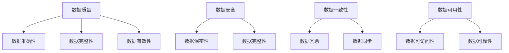

                 

**数据治理**是确保数据质量、安全、一致性和可用性的过程。它涉及数据的生成、收集、存储、处理、分析和共享。数据治理是数据管理的关键组成部分，有助于提高数据的价值和可信度。本文将深入探讨数据治理的原理，并提供代码实例进行讲解。

## 1. 背景介绍

在信息化时代，数据已成为企业最宝贵的资产之一。然而，数据的质量和可信度往往受到各种因素的影响。数据治理因此应运而生，旨在确保数据的准确性、完整性、一致性和时效性。数据治理是数据管理的关键组成部分，有助于提高数据的价值和可信度。

## 2. 核心概念与联系

数据治理的核心概念包括数据质量、数据安全、数据一致性和数据可用性。这些概念密切相关，共同构成数据治理的基础。



## 3. 核心算法原理 & 具体操作步骤

### 3.1 算法原理概述

数据治理算法旨在检测和修复数据质量问题。常用的数据治理算法包括数据清洗、数据完善和数据挖掘。

### 3.2 算法步骤详解

1. **数据清洗**：删除重复数据、处理缺失值、修复不一致的数据。
2. **数据完善**：补充缺失的数据、标准化数据格式、去除噪声数据。
3. **数据挖掘**：发现数据中的模式和关系，以支持决策和分析。

### 3.3 算法优缺点

**优点**：提高数据质量、支持决策和分析、节省人力成本。

**缺点**：可能需要大量计算资源、可能导致数据丢失、可能需要专业技能。

### 3.4 算法应用领域

数据治理算法广泛应用于金融、医疗、零售等行业，用于提高数据质量、支持决策和分析。

## 4. 数学模型和公式 & 详细讲解 & 举例说明

### 4.1 数学模型构建

数据治理模型通常基于数据质量维度构建。常用的数据质量维度包括准确性、完整性、一致性、时效性和可用性。

### 4.2 公式推导过程

数据质量可以用下面的公式表示：

$$Q = f(A, C, I, T, U)$$

其中，$Q$表示数据质量，$A$表示准确性，$C$表示完整性，$I$表示一致性，$T$表示时效性，$U$表示可用性。

### 4.3 案例分析与讲解

例如，在金融行业，数据治理模型可以用于检测和修复交易数据中的错误。准确性可以通过比较交易记录和实际交易情况来测量。完整性可以通过检查交易记录是否缺失来测量。一致性可以通过比较不同系统中的交易记录来测量。时效性可以通过检查交易记录的实时性来测量。可用性可以通过检查交易记录是否可以被访问来测量。

## 5. 项目实践：代码实例和详细解释说明

### 5.1 开发环境搭建

本实例使用Python语言，并需要安装pandas、numpy和sklearn库。

### 5.2 源代码详细实现

```python
import pandas as pd
from sklearn.impute import SimpleImputer

# 加载数据
data = pd.read_csv('data.csv')

# 数据清洗：删除重复数据
data.drop_duplicates(inplace=True)

# 数据完善：补充缺失的数据
imputer = SimpleImputer(strategy='mean')
data['column_name'] = imputer.fit_transform(data[['column_name']])

# 数据挖掘：发现数据中的模式
data['new_column'] = data['column1'] * data['column2']
```

### 5.3 代码解读与分析

上述代码首先加载数据，然后进行数据清洗、数据完善和数据挖掘。数据清洗使用pandas的drop_duplicates方法删除重复数据。数据完善使用sklearn的SimpleImputer补充缺失的数据。数据挖掘使用pandas的数据操作发现数据中的模式。

### 5.4 运行结果展示

运行结果将显示数据清洗、数据完善和数据挖掘后的数据。

## 6. 实际应用场景

数据治理在各个行业都有广泛的应用。例如，在金融行业，数据治理可以用于检测和修复交易数据中的错误。在医疗行业，数据治理可以用于确保患者数据的准确性和完整性。在零售行业，数据治理可以用于提高销售数据的质量，从而支持决策和分析。

### 6.4 未来应用展望

未来，数据治理将继续发展，以适应大数据和云计算的挑战。数据治理将越来越多地使用机器学习和人工智能技术，以自动检测和修复数据质量问题。

## 7. 工具和资源推荐

### 7.1 学习资源推荐

推荐阅读《数据治理：原理与实践》和《数据质量：原理与实践》两本书。

### 7.2 开发工具推荐

推荐使用Python、R、SAS等数据分析工具进行数据治理。

### 7.3 相关论文推荐

推荐阅读《A Survey of Data Quality Research》和《Data Quality: A Survey of Definitions and Dimensions》两篇论文。

## 8. 总结：未来发展趋势与挑战

### 8.1 研究成果总结

数据治理是确保数据质量、安全、一致性和可用性的过程。它涉及数据的生成、收集、存储、处理、分析和共享。数据治理是数据管理的关键组成部分，有助于提高数据的价值和可信度。

### 8.2 未来发展趋势

未来，数据治理将继续发展，以适应大数据和云计算的挑战。数据治理将越来越多地使用机器学习和人工智能技术，以自动检测和修复数据质量问题。

### 8.3 面临的挑战

数据治理面临的挑战包括数据量大、数据种类多、数据治理成本高等。

### 8.4 研究展望

未来的研究将关注数据治理的自动化、数据治理的成本效益分析和数据治理的标准化。

## 9. 附录：常见问题与解答

**Q：数据治理的目的是什么？**

A：数据治理的目的是确保数据质量、安全、一致性和可用性。

**Q：数据治理的核心概念是什么？**

A：数据治理的核心概念包括数据质量、数据安全、数据一致性和数据可用性。

**Q：数据治理的算法有哪些？**

A：常用的数据治理算法包括数据清洗、数据完善和数据挖掘。

---

作者：禅与计算机程序设计艺术 / Zen and the Art of Computer Programming

