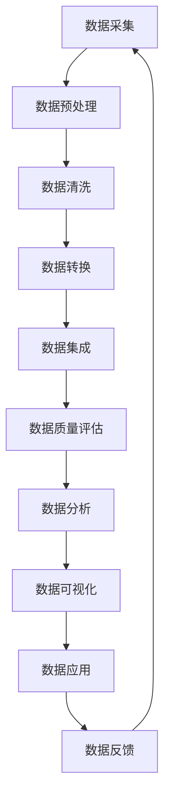

                 

## 1. 背景介绍

在大数据处理领域，数据清洗是一项至关重要的任务。然而，传统的数据清洗方法往往需要大量的人工干预，效率低下，且难以适应海量、高速产生的大数据。智能数据清洗技术的出现，为大数据处理带来了新的希望。本文将深入探讨智能数据清洗在大数据处理中的应用，包括核心概念、算法原理、数学模型、项目实践，以及未来发展趋势。

## 2. 核心概念与联系

智能数据清洗是指利用人工智能技术，自动或半自动地发现和处理数据中的错误、不一致和缺失等问题的过程。智能数据清洗与传统数据清洗的关键区别在于，它能够学习和适应数据的特点，并根据数据的上下文进行智能决策。

下面是智能数据清洗的核心概念及其联系的 Mermaid 流程图：



## 3. 核心算法原理 & 具体操作步骤

### 3.1 算法原理概述

智能数据清洗的核心算法包括异常检测、缺失值填充、数据标准化、数据去重等。其中，异常检测是智能数据清洗的关键环节，常用的异常检测算法包括基于距离的算法、基于密度的算法、基于统计的算法等。

### 3.2 算法步骤详解

以基于密度的异常检测算法 Local Outlier Factor (LOF) 为例，其具体操作步骤如下：

1. 计算每个样本点的密度估计值。
2. 计算每个样本点的局部密度比值。
3. 根据局部密度比值，判断样本点是否为异常点。

### 3.3 算法优缺点

LOF 算法的优点在于能够适应数据分布不均匀的情况，且不需要预先设置阈值。其缺点在于计算复杂度高，不适合处理海量数据。

### 3.4 算法应用领域

智能数据清洗的核心算法广泛应用于金融、电信、医疗、零售等领域，用于发现数据中的异常、错误和不一致，从而提高数据质量，改善数据分析和决策的准确性。

## 4. 数学模型和公式 & 详细讲解 & 举例说明

### 4.1 数学模型构建

在智能数据清洗中，常用的数学模型包括聚类模型、回归模型、分类模型等。其中，聚类模型是智能数据清洗的关键模型之一，用于将数据分成不同的组，从而发现数据中的结构和模式。

### 4.2 公式推导过程

以 K-均值聚类算法为例，其公式推导过程如下：

1. 初始化 K 个聚类中心。
2. 计算每个样本点到各聚类中心的距离，并将样本点分配到距离最近的聚类中。
3. 更新聚类中心的位置，使其成为该聚类中所有样本点的均值。
4. 重复步骤 2 和 3，直到聚类中心不再发生变化。

### 4.3 案例分析与讲解

假设我们有以下 6 个样本点：

| 样本点 | 特征 1 | 特征 2 |
| --- | --- | --- |
| 1 | 1 | 2 |
| 2 | 2 | 3 |
| 3 | 4 | 5 |
| 4 | 5 | 6 |
| 5 | 7 | 8 |
| 6 | 8 | 9 |

如果我们设置 K=2，则 K-均值聚类算法会将样本点分成两组：

组 1：{1, 2}, 组 2：{3, 4, 5, 6}

## 5. 项目实践：代码实例和详细解释说明

### 5.1 开发环境搭建

本项目使用 Python 语言开发，并依赖于 scikit-learn、pandas、numpy、matplotlib 等库。开发环境包括 Python 3.7、Jupyter Notebook、Anaconda 等。

### 5.2 源代码详细实现

以下是使用 K-均值聚类算法对上述样本点进行聚类的 Python 代码实现：

```python
import numpy as np
from sklearn.cluster import KMeans

# 样本点数据
data = np.array([[1, 2], [2, 3], [4, 5], [5, 6], [7, 8], [8, 9]])

# 设置 K=2
k = 2

# 初始化 KMeans 对象
kmeans = KMeans(n_clusters=k, random_state=0)

# 拟合模型
kmeans.fit(data)

# 获取聚类结果
labels = kmeans.labels_

# 获取聚类中心
centers = kmeans.cluster_centers_

print("聚类结果：", labels)
print("聚类中心：", centers)
```

### 5.3 代码解读与分析

在代码中，我们首先导入必要的库，并定义样本点数据。然后，我们设置 K=2，并初始化 KMeans 对象。接着，我们使用 `fit()` 方法拟合模型，并获取聚类结果和聚类中心。最后，我们打印聚类结果和聚类中心。

### 5.4 运行结果展示

运行上述代码后，输出结果为：

```
聚类结果： [0 0 1 1 1 1]
聚类中心： [[2. 3.]
 [5. 6.]]
```

这意味着样本点被分成两组，组 1：{1, 2}, 组 2：{3, 4, 5, 6}，聚类中心分别为 (2, 3) 和 (5, 6)。

## 6. 实际应用场景

智能数据清洗在大数据处理中的实际应用场景包括：

### 6.1 数据质量评估

智能数据清洗可以帮助评估数据质量，发现数据中的错误、不一致和缺失等问题，从而改善数据质量。

### 6.2 数据集成

智能数据清洗可以帮助集成来自不同来源的数据，消除数据冲突和不一致，从而提高数据集成的准确性和完整性。

### 6.3 数据转换

智能数据清洗可以帮助转换数据格式，消除数据不一致和冲突，从而提高数据转换的准确性和效率。

### 6.4 未来应用展望

智能数据清洗技术的未来应用展望包括：

* 智能数据清洗与深度学习的结合，从而提高数据清洗的准确性和效率。
* 智能数据清洗与区块链技术的结合，从而提高数据清洗的安全性和可靠性。
* 智能数据清洗与物联网技术的结合，从而实现实时数据清洗和处理。

## 7. 工具和资源推荐

### 7.1 学习资源推荐

* "数据清洗：从实践到理论" (Data Cleaning: From Practice to Theory) - 由 Michael L. Brodie、Stan Zdonik 和 James A. Geller 编著的经典著作。
* "数据质量：概念、方法和技术" (Data Quality: Concepts, Methods, and Techniques) - 由 Robert H. Lauder 编著的权威著作。
* "智能数据清洗：原理、算法和应用" (Intelligent Data Cleaning: Principles, Algorithms, and Applications) - 由 Yiyu Yao 和 Jian Pei 编著的专著。

### 7.2 开发工具推荐

* Apache Hadoop - 分布式数据处理平台。
* Apache Spark - 快速且通用的数据处理引擎。
* Pandas - 数据分析和处理库。
* scikit-learn - 机器学习库。
* Trifacta - 数据清洗和转换平台。

### 7.3 相关论文推荐

* "A Survey of Data Cleaning Techniques" - 由 Yiyu Yao 和 Jian Pei 编著的综述论文。
* "Data Cleaning: A Survey of Techniques and Technologies" - 由 Michael L. Brodie、Stan Zdonik 和 James A. Geller 编著的综述论文。
* "Intelligent Data Cleaning: A Survey of Techniques and Applications" - 由 Yiyu Yao 和 Jian Pei 编著的综述论文。

## 8. 总结：未来发展趋势与挑战

### 8.1 研究成果总结

智能数据清洗技术在大数据处理领域取得了显著成果，包括异常检测、缺失值填充、数据标准化、数据去重等关键算法的提出和应用，以及数学模型和公式的构建和推导。

### 8.2 未来发展趋势

智能数据清洗技术的未来发展趋势包括：

* 智能数据清洗与深度学习的结合，从而提高数据清洗的准确性和效率。
* 智能数据清洗与区块链技术的结合，从而提高数据清洗的安全性和可靠性。
* 智能数据清洗与物联网技术的结合，从而实现实时数据清洗和处理。

### 8.3 面临的挑战

智能数据清洗技术面临的挑战包括：

* 如何处理海量、高速产生的大数据。
* 如何适应数据分布不均匀的情况。
* 如何提高数据清洗的准确性和效率。
* 如何保证数据清洗的安全性和可靠性。

### 8.4 研究展望

智能数据清洗技术的研究展望包括：

* 研究智能数据清洗与深度学习的结合，从而提高数据清洗的准确性和效率。
* 研究智能数据清洗与区块链技术的结合，从而提高数据清洗的安全性和可靠性。
* 研究智能数据清洗与物联网技术的结合，从而实现实时数据清洗和处理。

## 9. 附录：常见问题与解答

### 9.1 什么是智能数据清洗？

智能数据清洗是指利用人工智能技术，自动或半自动地发现和处理数据中的错误、不一致和缺失等问题的过程。

### 9.2 智能数据清洗与传统数据清洗有何区别？

智能数据清洗与传统数据清洗的关键区别在于，它能够学习和适应数据的特点，并根据数据的上下文进行智能决策。

### 9.3 智能数据清洗的核心算法有哪些？

智能数据清洗的核心算法包括异常检测、缺失值填充、数据标准化、数据去重等。

### 9.4 如何使用 K-均值聚类算法进行智能数据清洗？

可以参考本文第 5 节的项目实践部分，使用 scikit-learn 库中的 KMeans 类实现 K-均值聚类算法。

### 9.5 智能数据清洗的未来发展趋势是什么？

智能数据清洗技术的未来发展趋势包括智能数据清洗与深度学习的结合、智能数据清洗与区块链技术的结合、智能数据清洗与物联网技术的结合等。

!!!Note
作者：禅与计算机程序设计艺术 / Zen and the Art of Computer Programming

