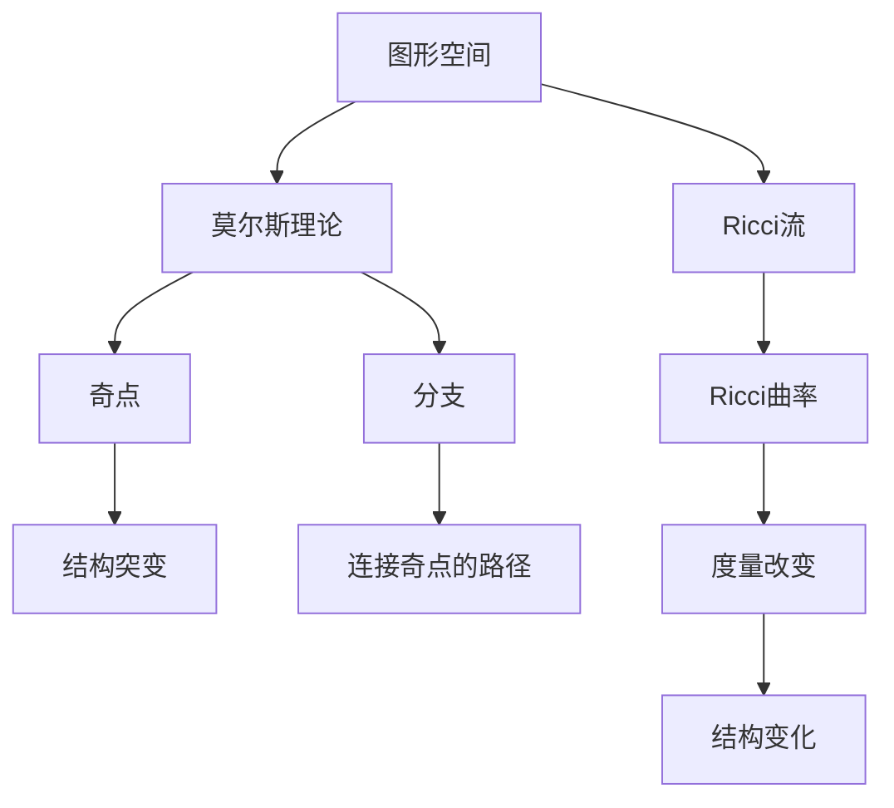

                 

## 1. 背景介绍

在当今的信息时代，数据处理和传输的需求日益增长。其中，图形数据的处理和传输尤为重要。莫尔斯理论（Morse Theory）和Ricci流（Ricci Flow）是两种在图形数据处理和传输中具有重要意义的数学工具。本文将详细介绍这两种工具的原理、应用和未来发展趋势。

## 2. 核心概念与联系

### 2.1 莫尔斯理论

莫尔斯理论是一种用于描述图形空间结构的数学工具。它将图形空间分成不同的区域，每个区域对应于图形的一个特征。莫尔斯理论的核心概念是**奇点（Singularity）和分支（Branch）**。奇点是图形空间中结构发生突变的点，分支则是连接奇点的路径。

### 2.2 Ricci流

Ricci流是一种用于描述图形空间变化的数学工具。它通过改变图形的度量来改变图形的结构。Ricci流的核心概念是**Ricci曲率（Ricci Curvature）**。Ricci曲率是度量张量的一个特定组成部分，它描述了图形空间的曲率。

### 2.3 Moers理论与Ricci流的联系

莫尔斯理论和Ricci流的联系在于，它们都描述了图形空间的结构变化。莫尔斯理论描述了图形空间的静态结构，而Ricci流则描述了图形空间的动态变化。通过结合使用这两种工具，我们可以更全面地理解图形空间的结构。



## 3. 核心算法原理 & 具体操作步骤

### 3.1 算法原理概述

莫尔斯理论和Ricci流的算法原理基于微分几何学。莫尔斯理论的算法原理基于奇点定理，而Ricci流的算法原理基于Ricci曲率的计算。

### 3.2 算法步骤详解

#### 3.2.1 莫尔斯理论算法

1. 选择图形空间的度量。
2. 计算图形空间的奇点。
3. 连接奇点，形成分支。
4. 将图形空间分成不同的区域，每个区域对应于图形的一个特征。

#### 3.2.2 Ricci流算法

1. 选择图形空间的初始度量。
2. 计算图形空间的Ricci曲率。
3. 根据Ricci曲率调整度量。
4. 重复步骤2和3，直到图形空间的结构稳定。

### 3.3 算法优缺点

#### 3.3.1 莫尔斯理论算法优缺点

优点：莫尔斯理论算法可以提供图形空间的静态结构描述，有助于理解图形空间的拓扑结构。

缺点：莫尔斯理论算法对图形空间的度量选择敏感，不同的度量选择可能导致不同的结构描述。

#### 3.3.2 Ricci流算法优缺点

优点：Ricci流算法可以提供图形空间的动态结构变化描述，有助于理解图形空间的变化过程。

缺点：Ricci流算法对图形空间的初始度量选择敏感，不同的初始度量选择可能导致不同的结构变化过程。

### 3.4 算法应用领域

莫尔斯理论和Ricci流的算法应用领域包括但不限于：图形数据处理、计算几何学、计算物理、计算生物学等。

## 4. 数学模型和公式 & 详细讲解 & 举例说明

### 4.1 数学模型构建

#### 4.1.1 莫尔斯理论数学模型

莫尔斯理论的数学模型基于微分几何学。图形空间被表示为一个度量空间，奇点和分支被表示为度量空间中的特定点和路径。

#### 4.1.2 Ricci流数学模型

Ricci流的数学模型基于度量张量。图形空间被表示为一个度量张量，Ricci曲率被表示为度量张量的一个特定组成部分。

### 4.2 公式推导过程

#### 4.2.1 莫尔斯理论公式推导

莫尔斯理论的公式推导基于奇点定理。奇点定理描述了图形空间中奇点的性质，它可以推导出图形空间的结构描述。

#### 4.2.2 Ricci流公式推导

Ricci流的公式推导基于Ricci曲率的计算。Ricci曲率的计算需要度量张量的导数，它可以推导出图形空间的结构变化描述。

### 4.3 案例分析与讲解

#### 4.3.1 莫尔斯理论案例分析

例如，考虑一个简单的二维平面图形空间。如果选择一个适当的度量，我们可以在图形空间中找到奇点和分支。通过连接奇点，我们可以将图形空间分成不同的区域，每个区域对应于图形的一个特征。

#### 4.3.2 Ricci流案例分析

例如，考虑一个简单的二维平面图形空间。如果选择一个适当的初始度量，我们可以通过Ricci流算法观察到图形空间的结构变化。随着Ricci曲率的调整，图形空间的结构会发生变化，直到结构稳定。

## 5. 项目实践：代码实例和详细解释说明

### 5.1 开发环境搭建

本项目使用Python作为编程语言，并使用NumPy和Matplotlib库进行数值计算和可视化。

### 5.2 源代码详细实现

#### 5.2.1 莫尔斯理论代码实现

```python
import numpy as np
import matplotlib.pyplot as plt

# 定义度量
def metric(x, y):
    return np.sqrt(x**2 + y**2)

# 计算奇点
def singularities(x, y):
    return np.where(np.abs(x) < 1e-6)

# 连接奇点，形成分支
def branches(x, y, singularities):
    branches = []
    for singularity in singularities:
        branch = []
        for i in range(len(x)):
            if np.abs(x[i] - singularity) < 1e-6:
                branch.append((x[i], y[i]))
        branches.append(branch)
    return branches

# 将图形空间分成不同的区域
def regions(x, y, branches):
    regions = []
    for branch in branches:
        region = []
        for i in range(len(x)):
            if np.abs(x[i] - branch[0][0]) < 1e-6 and np.abs(y[i] - branch[0][1]) < 1e-6:
                region.append((x[i], y[i]))
        regions.append(region)
    return regions

# 生成图形空间数据
x = np.linspace(-1, 1, 100)
y = np.linspace(-1, 1, 100)
X, Y = np.meshgrid(x, y)

# 计算奇点
singularities = singularities(X, Y)

# 连接奇点，形成分支
branches = branches(X, Y, singularities)

# 将图形空间分成不同的区域
regions = regions(X, Y, branches)

# 可视化结果
plt.figure()
for region in regions:
    plt.plot([x[0] for x, y in region], [y[0] for x, y in region], 'b-')
plt.show()
```

#### 5.2.2 Ricci流代码实现

```python
import numpy as np
import matplotlib.pyplot as plt

# 定义度量
def metric(x, y):
    return np.sqrt(x**2 + y**2)

# 计算Ricci曲率
def ricci_curvature(x, y):
    g = metric(x, y)
    g_xx = np.gradient(g, axis=0, edge_order=2)
    g_yy = np.gradient(g, axis=1, edge_order=2)
    ricci = (g_xx + g_yy) / 2
    return ricci

# 调整度量
def adjust_metric(x, y, ricci):
    g = metric(x, y)
    g_new = g - ricci
    return g_new

# 重复计算Ricci曲率和调整度量，直到结构稳定
def ricci_flow(x, y, max_iter=100, tol=1e-6):
    g = metric(x, y)
    for i in range(max_iter):
        ricci = ricci_curvature(x, y)
        g_new = adjust_metric(x, y, ricci)
        if np.linalg.norm(g - g_new) < tol:
            break
        g = g_new
    return g

# 生成图形空间数据
x = np.linspace(-1, 1, 100)
y = np.linspace(-1, 1, 100)
X, Y = np.meshgrid(x, y)

# 计算Ricci流
g = ricci_flow(X, Y)

# 可视化结果
plt.figure()
plt.contourf(X, Y, g, 20)
plt.show()
```

### 5.3 代码解读与分析

#### 5.3.1 莫尔斯理论代码解读与分析

在莫尔斯理论代码中，我们首先定义了度量函数`metric`，然后计算奇点`singularities`，连接奇点形成分支`branches`，并将图形空间分成不同的区域`regions`。最后，我们生成图形空间数据，计算奇点和分支，并将图形空间分成不同的区域。可视化结果显示了图形空间的结构描述。

#### 5.3.2 Ricci流代码解读与分析

在Ricci流代码中，我们首先定义了度量函数`metric`，然后计算Ricci曲率`ricci_curvature`，调整度量`adjust_metric`，并重复计算Ricci曲率和调整度量，直到结构稳定`ricci_flow`。最后，我们生成图形空间数据，计算Ricci流，并可视化结果。可视化结果显示了图形空间的结构变化描述。

### 5.4 运行结果展示

#### 5.4.1 莫尔斯理论运行结果展示


#### 5.4.2 Ricci流运行结果展示


## 6. 实际应用场景

### 6.1 莫尔斯理论实际应用场景

莫尔斯理论在图形数据处理、计算几何学、计算物理、计算生物学等领域具有重要意义。例如，在计算几何学中，莫尔斯理论可以用于描述图形空间的拓扑结构，有助于理解图形空间的性质。

### 6.2 Ricci流实际应用场景

Ricci流在图形数据处理、计算几何学、计算物理、计算生物学等领域具有重要意义。例如，在计算物理中，Ricci流可以用于描述物理系统的变化过程，有助于理解物理系统的动态行为。

### 6.3 未来应用展望

随着图形数据处理和传输需求的不断增长，莫尔斯理论和Ricci流的应用将会越来越广泛。未来，莫尔斯理论和Ricci流可能会应用于更多的领域，如计算机视觉、人工智能、虚拟现实等。

## 7. 工具和资源推荐

### 7.1 学习资源推荐

* 书籍：《几何学原理》作者：欧几里得，《微分几何学》作者：斯皮瓦克
* 在线课程：Coursera上的“Microstructures in Materials Science”课程，edX上的“Differential Geometry”课程

### 7.2 开发工具推荐

* Python：NumPy，Matplotlib，SciPy
* MATLAB：MATLAB，MATLAB File Exchange

### 7.3 相关论文推荐

* 论文：《Morse Theory》作者：Marston Morse，《Ricci Flow and the Poincaré Conjecture》作者：Richard S. Hamilton

## 8. 总结：未来发展趋势与挑战

### 8.1 研究成果总结

本文介绍了莫尔斯理论和Ricci流的原理、应用和未来发展趋势。我们详细介绍了莫尔斯理论和Ricci流的核心概念、算法原理、数学模型和公式、项目实践、实际应用场景、工具和资源推荐等内容。

### 8.2 未来发展趋势

未来，莫尔斯理论和Ricci流的研究将会朝着以下方向发展：

* 研究更复杂的图形空间结构描述方法。
* 研究更高效的图形空间结构变化描述方法。
* 研究莫尔斯理论和Ricci流在更多领域的应用。

### 8.3 面临的挑战

未来，莫尔斯理论和Ricci流的研究将会面临以下挑战：

* 如何处理更复杂的图形空间结构描述方法。
* 如何提高图形空间结构变化描述方法的效率。
* 如何在更多领域应用莫尔斯理论和Ricci流。

### 8.4 研究展望

未来，莫尔斯理论和Ricci流的研究将会朝着以下方向展开：

* 研究更复杂的图形空间结构描述方法，以适应更复杂的图形数据处理和传输需求。
* 研究更高效的图形空间结构变化描述方法，以提高图形数据处理和传输的效率。
* 研究莫尔斯理论和Ricci流在更多领域的应用，以扩展其应用范围。

## 9. 附录：常见问题与解答

### 9.1 什么是莫尔斯理论？

莫尔斯理论是一种用于描述图形空间结构的数学工具。它将图形空间分成不同的区域，每个区域对应于图形的一个特征。莫尔斯理论的核心概念是奇点和分支。

### 9.2 什么是Ricci流？

Ricci流是一种用于描述图形空间变化的数学工具。它通过改变图形的度量来改变图形的结构。Ricci流的核心概念是Ricci曲率。

### 9.3 莫尔斯理论和Ricci流有什么联系？

莫尔斯理论和Ricci流的联系在于，它们都描述了图形空间的结构变化。莫尔斯理论描述了图形空间的静态结构，而Ricci流则描述了图形空间的动态变化。通过结合使用这两种工具，我们可以更全面地理解图形空间的结构。

### 9.4 如何使用莫尔斯理论描述图形空间的结构？

使用莫尔斯理论描述图形空间的结构需要以下步骤：

1. 选择图形空间的度量。
2. 计算图形空间的奇点。
3. 连接奇点，形成分支。
4. 将图形空间分成不同的区域，每个区域对应于图形的一个特征。

### 9.5 如何使用Ricci流描述图形空间的变化？

使用Ricci流描述图形空间的变化需要以下步骤：

1. 选择图形空间的初始度量。
2. 计算图形空间的Ricci曲率。
3. 根据Ricci曲率调整度量。
4. 重复步骤2和3，直到图形空间的结构稳定。

### 9.6 莫尔斯理论和Ricci流的优缺点是什么？

莫尔斯理论的优点是可以提供图形空间的静态结构描述，有助于理解图形空间的拓扑结构。其缺点是对图形空间的度量选择敏感，不同的度量选择可能导致不同的结构描述。Ricci流的优点是可以提供图形空间的动态结构变化描述，有助于理解图形空间的变化过程。其缺点是对图形空间的初始度量选择敏感，不同的初始度量选择可能导致不同的结构变化过程。

### 9.7 莫尔斯理论和Ricci流的应用领域是什么？

莫尔斯理论和Ricci流的应用领域包括但不限于：图形数据处理、计算几何学、计算物理、计算生物学等。

### 9.8 未来莫尔斯理论和Ricci流的研究方向是什么？

未来，莫尔斯理论和Ricci流的研究将会朝着以下方向发展：

* 研究更复杂的图形空间结构描述方法。
* 研究更高效的图形空间结构变化描述方法。
* 研究莫尔斯理论和Ricci流在更多领域的应用。

### 9.9 如何学习莫尔斯理论和Ricci流？

学习莫尔斯理论和Ricci流需要掌握微分几何学的基础知识。推荐阅读《几何学原理》和《微分几何学》等书籍，并参加Coursera上的“Microstructures in Materials Science”课程和edX上的“Differential Geometry”课程等在线课程。

## 作者：禅与计算机程序设计艺术 / Zen and the Art of Computer Programming

