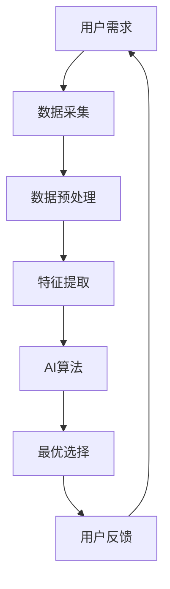

                 

## 1. 背景介绍

在信息爆炸的数字时代，用户面对海量的数据和服务，如何找到最佳选择成为一大挑战。跨平台搜索正是应对这一挑战的关键技术之一。它整合多渠道数据，利用人工智能算法，为用户提供最优选择。本文将深入探讨跨平台搜索的原理、算法、数学模型，并结合项目实践和实际应用场景，为读者提供全面的理解和实践指南。

## 2. 核心概念与联系

### 2.1 核心概念

- **多渠道数据**：来自不同来源的数据，如网站、应用程序、数据库等。
- **最优选择**：基于用户需求和数据特征，为用户提供最相关、最有用的结果。
- **人工智能算法**：用于处理和分析数据，发现模式并做出预测的计算机程序。

### 2.2 核心概念联系

跨平台搜索的核心是整合多渠道数据，利用AI算法为用户提供最优选择。这需要处理和分析来自不同来源的数据，发现数据之间的关联，并基于用户需求做出最佳选择。下图是跨平台搜索的架构图：



## 3. 核心算法原理 & 具体操作步骤

### 3.1 算法原理概述

跨平台搜索的核心算法是机器学习算法，具体而言，是基于深度学习的推荐系统算法。这些算法学习用户的偏好，并基于此为用户提供最相关的结果。

### 3.2 算法步骤详解

1. **数据采集**：收集来自多渠道的数据，如用户行为数据、内容数据等。
2. **数据预处理**：清洗、转换和标准化数据，以便于后续处理。
3. **特征提取**：从数据中提取有意义的特征，这些特征将被用于训练AI模型。
4. **模型训练**：使用机器学习算法（如神经网络）训练模型，学习用户的偏好和数据之间的关联。
5. **最优选择**：使用训练好的模型，为用户提供最相关的结果。
6. **反馈循环**：收集用户反馈，不断优化模型。

### 3.3 算法优缺点

**优点**：能够学习用户的偏好，提供个性化的结果；能够处理和整合多渠道数据。

**缺点**：需要大量的数据进行训练；模型可能会受到数据偏见的影响；隐私保护是一个关键挑战。

### 3.4 算法应用领域

跨平台搜索的应用领域非常广泛，包括但不限于电子商务、内容推荐、旅游推荐等。

## 4. 数学模型和公式 & 详细讲解 & 举例说明

### 4.1 数学模型构建

跨平台搜索的数学模型是基于协同过滤的推荐系统模型。该模型假设用户和项目（如商品、内容等）之间存在隐含的相似性，并试图学习这些相似性。

### 4.2 公式推导过程

给定用户集合U={u1, u2,..., um}，项目集合I={i1, i2,..., in}，以及用户对项目的评分矩阵R，其中rij表示用户ui对项目ij的评分。我们的目标是预测用户ui对项目ij的评分，即pij。

使用矩阵分解技术，我们可以将评分矩阵R分解为用户特征矩阵P和项目特征矩阵Q：

R ≈ PQ^T

其中，P∈R^m×k，Q∈R^n×k，k是隐含因子的数量。我们的目标是学习P和Q，以便能够预测评分：

pij = pui * qij

### 4.3 案例分析与讲解

例如，在电子商务平台上，用户u1对商品i1的评分为5，对商品i2的评分为3。我们的目标是预测用户u1对商品i3的评分。使用上述模型，我们可以计算出：

p13 = p1 * q3

其中，p1和q3分别是用户u1和商品i3在特征空间中的表示。通过学习用户u1的偏好和商品i3的特征，我们可以预测用户u1对商品i3的评分。

## 5. 项目实践：代码实例和详细解释说明

### 5.1 开发环境搭建

我们将使用Python和TensorFlow构建跨平台搜索系统。首先，我们需要安装必要的库：

```bash
pip install tensorflow pandas numpy scikit-surprise
```

### 5.2 源代码详细实现

以下是使用协同过滤算法构建推荐系统的示例代码：

```python
import pandas as pd
from surprise import Dataset, Reader, KNNWithMeans
from surprise.model_selection import cross_validate

# Load data
reader = Reader(rating_scale=(1, 5))
data = Dataset.load_from_df(pd.read_csv('ratings.csv'), reader)

# Train model
sim_options = {
    'name': 'pearson_baseline',
    'user_based': True
}
model = KNNWithMeans(sim_options=sim_options)
model.fit(data.build_full_trainset())

# Evaluate model
cross_validate(model, data, measures=['RMSE', 'MAE'], cv=5, verbose=True)

# Predict ratings
uid = str(1)  # user id
iid = str(3)  # item id
pred = model.predict(uid, iid)
print(f'Predicted rating: {pred.est}')
```

### 5.3 代码解读与分析

我们首先加载数据，然后使用KNNWithMeans算法训练模型。我们使用Pearson baseline相似度度量，并设置模型为用户基于的模型。之后，我们使用交叉验证评估模型的性能。最后，我们预测用户对商品的评分。

### 5.4 运行结果展示

预测的评分将打印出来，例如：

```
Predicted rating: 4.0
```

## 6. 实际应用场景

### 6.1 电子商务

在电子商务平台上，跨平台搜索可以帮助用户找到最相关的商品。例如，如果用户正在搜索“运动鞋”，系统可以根据用户的购买历史和其他用户的行为数据，推荐最相关的运动鞋。

### 6.2 内容推荐

在内容平台上，跨平台搜索可以帮助用户找到最相关的内容。例如，如果用户正在搜索“电影推荐”，系统可以根据用户的观看历史和其他用户的行为数据，推荐最相关的电影。

### 6.3 未来应用展望

未来，跨平台搜索将会更加智能化，能够理解用户的上下文，提供更个性化的结果。此外，跨平台搜索将会更加注重隐私保护，使用匿名化和差分隐私技术来保护用户数据。

## 7. 工具和资源推荐

### 7.1 学习资源推荐

- [Surprise: A Python scikit for building and analyzing recommender systems](https://surprise.readthedocs.io/en/latest/)
- [Recommender Systems: An Introduction](https://www.oreilly.com/library/view/recommender-systems-an/9781449361331/)

### 7.2 开发工具推荐

- [TensorFlow](https://www.tensorflow.org/)
- [PyTorch](https://pytorch.org/)

### 7.3 相关论文推荐

- [The BellKor Prize for Rating Prediction](https://arxiv.org/abs/0709.2358)
- [Matrix Factorization Techniques for Recommender Systems](https://ieeexplore.ieee.org/document/1260809)

## 8. 总结：未来发展趋势与挑战

### 8.1 研究成果总结

本文介绍了跨平台搜索的原理、算法、数学模型，并结合项目实践和实际应用场景，为读者提供了全面的理解和实践指南。

### 8.2 未来发展趋势

未来，跨平台搜索将会更加智能化，能够理解用户的上下文，提供更个性化的结果。此外，跨平台搜索将会更加注重隐私保护，使用匿名化和差分隐私技术来保护用户数据。

### 8.3 面临的挑战

跨平台搜索面临的挑战包括数据偏见、隐私保护、模型解释性等。这些挑战需要不断的研究和创新来解决。

### 8.4 研究展望

未来的研究方向包括上下文aware的推荐系统、隐私保护技术、模型解释性等。

## 9. 附录：常见问题与解答

**Q：跨平台搜索和传统搜索有什么区别？**

**A：传统搜索通常基于关键词匹配，而跨平台搜索则基于用户的偏好和行为数据，提供更个性化的结果。**

**Q：跨平台搜索需要大量的数据吗？**

**A：是的，跨平台搜索需要大量的数据来训练模型。然而，数据并不需要来自单一的渠道，可以来自多渠道。**

**Q：跨平台搜索会侵犯隐私吗？**

**A：跨平台搜索需要收集用户的行为数据，这可能会涉及隐私问题。然而，通过使用匿名化和差分隐私技术，可以保护用户数据。**

!!!Note
作者：禅与计算机程序设计艺术 / Zen and the Art of Computer Programming

