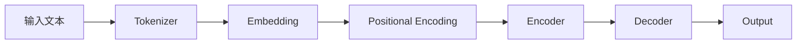

                 

**大语言模型（LLM）在金融服务中的应用正在迅速发展，为银行业带来了个性化、智能化和高效化的新机遇。本文将探讨LLM在银行业的核心应用，包括客户服务、风险管理和营销等领域。我们将深入剖析LLM的核心概念、算法原理，并提供数学模型和实践项目的详细讲解。最后，我们还将讨论LLM在银行业的实际应用场景、工具和资源推荐，以及未来发展趋势和挑战。**

## 1. 背景介绍

在当今数字化的世界里，银行业正在经历一场根本性的转变。客户期望更个性化、更智能化和更便捷的金融服务。大语言模型（LLM）的出现为银行业提供了满足这些期望的新途径。LLM是一种先进的机器学习模型，能够理解、生成和交流人类语言，从而为银行业带来了革命性的变化。

## 2. 核心概念与联系

### 2.1 大语言模型（LLM）的定义

大语言模型（LLM）是一种深度学习模型，旨在理解和生成人类语言。它通过学习大量文本数据来建立语言的统计模型，从而能够预测下一个单词、生成文本、回答问题和进行对话。

### 2.2 LLM在银行业的应用

LLM在银行业的应用包括客户服务、风险管理和营销等领域。在客户服务领域，LLM可以提供24/7的智能客服，帮助客户解决问题、提供建议和进行交易。在风险管理领域，LLM可以分析文本数据，识别欺诈行为和风险因素。在营销领域，LLM可以个性化地推荐产品和服务，并提供有针对性的营销信息。

### 2.3 LLM架构原理

LLM的核心是一种名为“transformer”的架构，它使用自注意力机制来处理输入序列。以下是LLM架构的Mermaid流程图：

## 3. 核心算法原理 & 具体操作步骤

### 3.1 算法原理概述

LLM的核心算法是transformer架构，它使用自注意力机制来处理输入序列。自注意力机制允许模型在处理输入序列时考虑到上下文信息，从而提高模型的理解和生成能力。

### 3.2 算法步骤详解

LLM的算法步骤包括：

1. **Tokenizer**：将输入文本转换为标记（token）序列。
2. **Embedding**：将标记转换为向量表示。
3. **Positional Encoding**：为向量表示添加位置信息。
4. **Encoder**：使用自注意力机制处理输入序列，生成上下文表示。
5. **Decoder**：使用自注意力机制和上下文表示生成输出序列。

### 3.3 算法优缺点

LLM的优点包括理解和生成人类语言的能力、个性化的客户服务和风险管理能力。然而，LLM也存在一些缺点，包括对大量数据的需求、计算资源的消耗和模型泛化能力的限制。

### 3.4 算法应用领域

LLM在银行业的应用领域包括客户服务、风险管理和营销。在客户服务领域，LLM可以提供24/7的智能客服，帮助客户解决问题、提供建议和进行交易。在风险管理领域，LLM可以分析文本数据，识别欺诈行为和风险因素。在营销领域，LLM可以个性化地推荐产品和服务，并提供有针对性的营销信息。

## 4. 数学模型和公式 & 详细讲解 & 举例说明

### 4.1 数学模型构建

LLM的数学模型是基于transformer架构构建的。transformer架构使用自注意力机制来处理输入序列。自注意力机制可以表示为：

$$Attention(Q, K, V) = softmax\left(\frac{QK^T}{\sqrt{d_k}}\right)V$$

其中，$Q$, $K$, $V$分别是查询、键和值向量，$d_k$是键向量的维度。

### 4.2 公式推导过程

自注意力机制的推导过程如下：

1. 计算查询、键和值向量的内积，并除以键向量的维度的平方根。
2. 使用softmax函数对上一步的结果进行缩放，得到注意力权重。
3. 使用注意力权重对值向量进行加权求和，得到自注意力的输出。

### 4.3 案例分析与讲解

例如，在客户服务领域，LLM可以使用自注意力机制来处理客户的查询，并生成相应的回复。假设客户的查询是“如何申请信用卡”，LLM可以使用自注意

