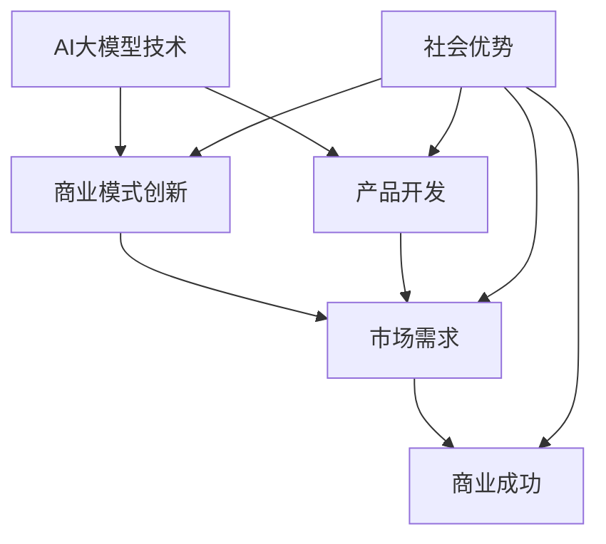

                 

## 1. 背景介绍

当前，人工智能（AI）大模型如火如荼地发展，其在各个领域的应用也日益广泛。然而，如何利用社会优势创业，将AI大模型转化为商业成功，是一个亟待解决的问题。本文将从技术、商业和社会角度出发，探讨AI大模型创业的机遇和挑战，并提供一些实用的建议。

## 2. 核心概念与联系

### 2.1 AI大模型

AI大模型是指具有数十亿甚至数千亿参数的模型，能够理解、生成和交流人类语言，并展示出类似人类的推理和创造力。这些模型通过大量的数据和计算资源训练而成，具有强大的泛化能力。

### 2.2 社会优势

社会优势是指创业者可以利用的外部条件，包括市场需求、政策支持、资金投入、人才储备等。这些优势可以帮助创业者降低创业成本，提高成功概率。

### 2.3 AI大模型创业

AI大模型创业是指利用AI大模型技术，结合社会优势，创建新的商业模式和产品，从而实现商业成功的过程。

下图是AI大模型创业的架构图，展示了技术、商业和社会三个维度的关系：



## 3. 核心算法原理 & 具体操作步骤

### 3.1 算法原理概述

AI大模型的核心是Transformer模型（Vaswani et al., 2017），它使用自注意力机制（Self-Attention）和位置编码（Positional Encoding）来处理序列数据。自注意力机制允许模型关注输入序列的不同部分，位置编码则帮助模型理解序列的顺序。

### 3.2 算法步骤详解

1. **数据预处理**：收集和清洗数据，并将其转换为模型可以接受的格式。
2. **模型构建**：构建Transformer模型，包括编码器和解码器，并添加适当的预训练任务（如语言模型训练）和微调任务（如特定领域的任务）。
3. **模型训练**：使用大量数据和计算资源训练模型，优化模型参数。
4. **模型评估**：评估模型性能，并进行调优。
5. **部署和应用**：将模型部署到生产环境，并开发相应的应用程序。

### 3.3 算法优缺点

**优点**：

* 具有强大的泛化能力，可以理解和生成人类语言。
* 可以在各种任务上进行微调，适应不同的应用场景。
* 可以通过训练数据的增加而不断改进。

**缺点**：

* 训练和部署成本高，需要大量的计算资源和数据。
* 存在过度拟合和泛化不足的风险。
* 缺乏解释性，模型的决策过程难以理解。

### 3.4 算法应用领域

AI大模型的应用领域非常广泛，包括自然语言处理（NLP）、计算机视觉、生物信息学、材料科学等。在商业领域，AI大模型可以应用于客户服务、内容创作、市场营销、智能搜索等。

## 4. 数学模型和公式 & 详细讲解 & 举例说明

### 4.1 数学模型构建

Transformer模型的数学模型如下：

* **自注意力机制**：给定查询（Query）、键（Key）和值（Value）向量，自注意力机制计算每个位置的输出如下：

  $$
  \text{Attention}(Q, K, V) = \text{softmax}\left(\frac{QK^T}{\sqrt{d_k}}\right)V
  $$

* **位置编码**：位置编码使用正弦和余弦函数生成，公式如下：

  $$
  \text{PE}_{2i}(p) = \sin\left(\frac{p}{10000^{2i/d_{\text{model}}}}\right)
  $$

  $$
  \text{PE}_{2i+1}(p) = \cos\left(\frac{p}{10000^{2i/d_{\text{model}}}}\right)
  $$

  其中，$p$是位置，$i$是维度，$d_{\text{model}}$是模型维度。

### 4.2 公式推导过程

自注意力机制的推导过程如下：

1. 计算查询、键和值向量的点积，并除以方差调节因子（$\sqrt{d_k}$）：

   $$
   \text{Score}(Q, K) = \frac{QK^T}{\sqrt{d_k}}
   $$

2. 使用softmax函数对分数进行归一化：

   $$
   \text{Attention\_weights} = \text{softmax}(\text{Score})
   $$

3. 计算输出，即注意力权重乘以值向量：

   $$
   \text{Output} = \text{Attention\_weights} \cdot V
   $$

位置编码的推导过程如上所示，是通过正弦和余弦函数生成的。

### 4.3 案例分析与讲解

例如，在NLP任务中，给定一段文本，模型需要理解文本的含义，并生成相应的输出。自注意力机制允许模型关注文本的不同部分，位置编码则帮助模型理解文本的顺序。通过训练大量数据，模型可以学习到语言规则和语义关系，从而生成合理的输出。

## 5. 项目实践：代码实例和详细解释说明

### 5.1 开发环境搭建

要开发AI大模型，需要搭建一个强大的开发环境。推荐使用Python作为编程语言，并安装以下库：

* PyTorch或TensorFlow：用于构建和训练模型。
* Hugging Face Transformers：提供预训练的Transformer模型和工具。
* Datasets：提供大量的预处理数据集。

### 5.2 源代码详细实现

以下是一个简单的Transformer模型实现示例：

```python
import torch
import torch.nn as nn
import torch.nn.functional as F

class Transformer(nn.Module):
    def __init__(self, d_model, n_head, n_layers, vocab_size):
        super(Transformer, self).__init__()
        self.embedding = nn.Embedding(vocab_size, d_model)
        self.pos_encoding = PositionalEncoding(d_model)
        self.encoder = nn.TransformerEncoder(
            nn.TransformerEncoderLayer(d_model, n_head), n_layers)
        self.decoder = nn.Linear(d_model, vocab_size)

    def forward(self, src):
        src = self.embedding(src) * torch.sqrt(torch.tensor(0.02))
        src = self.pos_encoding(src)
        output = self.encoder(src)
        output = self.decoder(output)
        return output
```

### 5.3 代码解读与分析

* `Transformer`类继承自`nn.Module`，是模型的主体。
* `embedding`层用于将输入token转换为模型可以接受的向量表示。
* `pos_encoding`层用于添加位置编码。
* `encoder`层是Transformer编码器，由多个`TransformerEncoderLayer`组成。
* `decoder`层是线性层，用于将编码器输出转换为输出空间。

### 5.4 运行结果展示

在训练和评估模型后，可以展示模型的运行结果，例如生成的文本或预测的标签。

## 6. 实际应用场景

### 6.1 当前应用

AI大模型当前已广泛应用于各个领域，包括：

* **客户服务**：提供智能客服，帮助客户解决问题。
* **内容创作**：生成文章、诗歌、代码等。
* **市场营销**：个性化推荐、广告创意等。
* **智能搜索**：改进搜索结果，提供更相关的信息。

### 6.2 未来应用展望

未来，AI大模型有望在以下领域取得突破：

* **多模式学习**：结合文本、图像、音频等多模式数据，实现更强大的理解和生成能力。
* **知识图谱**：构建和完善知识图谱，帮助模型理解世界。
* **解释性AI**：开发更解释性的模型，帮助人们理解模型的决策过程。

## 7. 工具和资源推荐

### 7.1 学习资源推荐

* **课程**：斯坦福大学的“CS224n：Natural Language Processing with Deep Learning”课程。
* **书籍**：“Attention is All You Need”论文和“Natural Language Processing with Python”书籍。
* **在线资源**：Hugging Face的Transformers库和文档。

### 7.2 开发工具推荐

* **开发环境**：Google Colab、Jupyter Notebook等。
* **数据集**：Hugging Face Datasets库。
* **模型训练**：PyTorch、TensorFlow等深度学习框架。

### 7.3 相关论文推荐

* “Attention is All You Need”论文（Vaswani et al., 2017）
* “BERT: Pre-training of Deep Bidirectional Transformers for Language Understanding”论文（Devlin et al., 2019）
* “T5: Text-to-Text Transfer Transformer”论文（Raffel et al., 2020）

## 8. 总结：未来发展趋势与挑战

### 8.1 研究成果总结

AI大模型在自然语言处理和其他领域取得了显著成就，但仍面临挑战。

### 8.2 未来发展趋势

未来，AI大模型将朝着多模式学习、知识图谱和解释性AI等方向发展。

### 8.3 面临的挑战

* **计算资源**：训练和部署大模型需要大量的计算资源。
* **数据隐私**：大模型需要大量的数据，但收集和使用数据时必须考虑隐私问题。
* **偏见和公平**：模型可能会受到训练数据的偏见影响，导致不公平的结果。

### 8.4 研究展望

未来的研究将聚焦于开发更强大、更解释性、更公平的AI大模型。

## 9. 附录：常见问题与解答

**Q：AI大模型需要多少计算资源？**

A：训练和部署大模型需要大量的计算资源，包括GPU、TPU等。例如，训练BERT模型需要数千个GPU小时。

**Q：AI大模型是否会取代人类？**

A：AI大模型可以完成许多任务，但它们并不能取代人类。人类和AI大模型各有优势，可以互补合作。

**Q：AI大模型是否会导致失业？**

A：AI大模型会改变就业市场，但不会导致大规模失业。新的岗位会出现，需要人们学习新的技能。

!!!Note
作者：禅与计算机程序设计艺术 / Zen and the Art of Computer Programming

