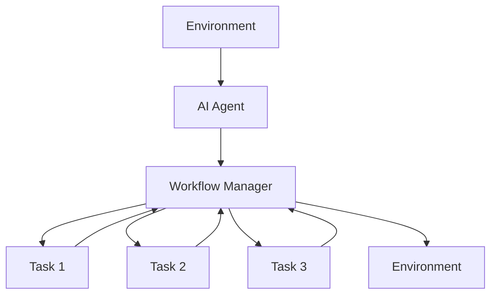
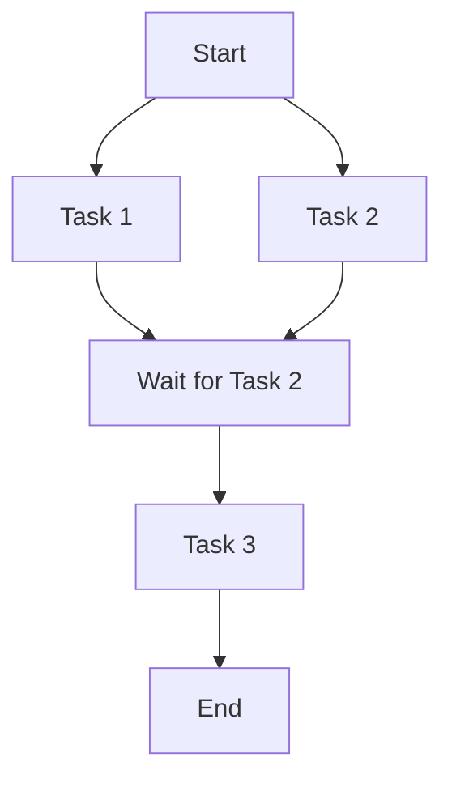
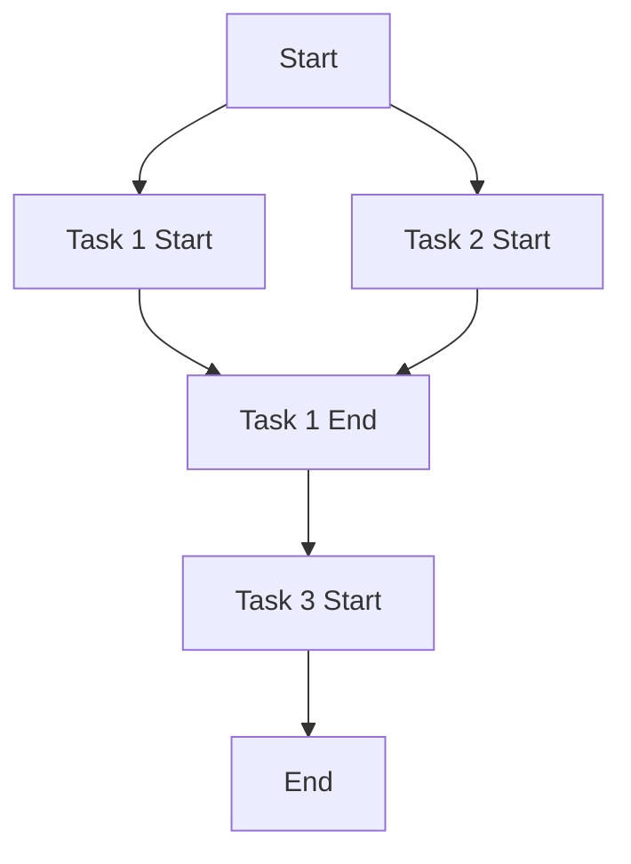

                 

- AI代理
- 工作流
- 可拓展性
- 微服务
- 事件驱动
- 状态机
- 容错

## 1. 背景介绍

在当今快速变化的商业环境中，自动化和智能化已经成为企业提高效率和竞争力的关键。人工智能（AI）代理是实现自动化和智能化的关键组成部分，它们可以执行一系列任务，从而减轻人类工作量，提高效率。然而，构建可扩展的AI代理工作流架构是一个挑战，因为它需要考虑系统的可靠性、可伸缩性和可维护性。

## 2. 核心概念与联系

### 2.1 AI代理

AI代理是一种软件实体，它可以感知环境，并根据其内部状态和外部输入做出决策。AI代理可以是智能体、机器人、虚拟助手等形式。

### 2.2 工作流

工作流是一系列有序的任务，这些任务需要协调和控制才能完成。工作流可以是业务流程、制造流程、计算流程等。

### 2.3 可拓展性

可拓展性是指系统能够在不中断服务的情况下扩展其容量或能力的能力。在AI代理工作流的上下文中，可拓展性意味着系统能够处理更多的任务，支持更多的代理，或执行更复杂的任务。

下面是AI代理工作流架构的Mermaid流程图：



## 3. 核心算法原理 & 具体操作步骤

### 3.1 算法原理概述

AI代理工作流架构的核心是工作流管理器（Workflow Manager），它负责协调和控制AI代理执行的任务。工作流管理器可以使用状态机或事件驱动的方式来实现。

### 3.2 算法步骤详解

#### 3.2.1 状态机

状态机是一种有限状态自动机，它可以表示系统的状态和转换。在AI代理工作流中，状态机可以表示工作流的状态，如等待、执行、完成等。状态机的转换可以由AI代理的决策驱动。

#### 3.2.2 事件驱动

事件驱动是一种基于事件的编程范式，它可以表示系统的动态行为。在AI代理工作流中，事件驱动可以表示任务的开始、结束、失败等事件。事件驱动的优势是它可以实现松耦合的系统，因为事件处理器可以独立于事件源。

### 3.3 算法优缺点

#### 3.3.1 状态机

状态机的优点是它可以清晰地表示系统的状态和转换，从而使系统更容易理解和维护。状态机的缺点是它可能会导致系统变得僵化，因为状态机的转换是固定的。

#### 3.3.2 事件驱动

事件驱动的优点是它可以实现松耦合的系统，因为事件处理器可以独立于事件源。事件驱动的缺点是它可能会导致系统变得复杂，因为事件处理器需要协调和同步。

### 3.4 算法应用领域

AI代理工作流架构可以应用于各种领域，如制造业、金融业、医疗保健业等。例如，在制造业中，AI代理可以执行生产任务，如机器维护、质量控制等。在金融业中，AI代理可以执行交易任务，如股票交易、债券交易等。在医疗保健业中，AI代理可以执行诊断任务，如图像分析、病理分析等。

## 4. 数学模型和公式 & 详细讲解 & 举例说明

### 4.1 数学模型构建

数学模型可以用于表示AI代理工作流的状态和转换。例如，状态机可以表示为有向图，其中节点表示状态，边表示转换。事件驱动可以表示为事件流，其中事件表示系统的动态行为。

### 4.2 公式推导过程

数学模型的公式可以用于描述AI代理工作流的行为。例如，状态机的转换可以表示为转移函数，事件驱动的事件处理可以表示为函数映射。

### 4.3 案例分析与讲解

例如，考虑一个简单的AI代理工作流，其中AI代理需要执行三个任务：任务1、任务2和任务3。任务1和任务2是并行执行的，任务3需要等待任务1和任务2完成后才能执行。状态机可以表示为：



事件驱动可以表示为：



## 5. 项目实践：代码实例和详细解释说明

### 5.1 开发环境搭建

开发环境需要安装Python、Docker和Kubernetes。此外，还需要安装一些库，如TensorFlow、PyTorch和Kubeflow。

### 5.2 源代码详细实现

以下是一个简单的AI代理工作流的源代码实现，使用状态机的方式：

```python
from transitions import Machine

class AIAgent:
    def __init__(self):
        self.machine = Machine(model=self, states=['idle', 'task1', 'task2', 'task3'], transitions=[
            {'trigger':'start_task1','source': 'idle', 'dest': 'task1'},
            {'trigger':'start_task2','source': 'idle', 'dest': 'task2'},
            {'trigger': 'complete_task1','source': 'task1', 'dest': 'idle'},
            {'trigger': 'complete_task2','source': 'task2', 'dest': 'idle'},
            {'trigger':'start_task3','source': 'idle', 'dest': 'task3'},
            {'trigger': 'complete_task3','source': 'task3', 'dest': 'idle'}
        ])

    def start_task1(self):
        # 执行任务1
        pass

    def complete_task1(self):
        # 完成任务1
        pass

    def start_task2(self):
        # 执行任务2
        pass

    def complete_task2(self):
        # 完成任务2
        pass

    def start_task3(self):
        # 执行任务3
        pass

    def complete_task3(self):
        # 完成任务3
        pass
```

### 5.3 代码解读与分析

代码使用了Transitions库来实现状态机。AI代理的状态有四种：空闲、任务1、任务2和任务3。转换有六种：开始任务1、开始任务2、完成任务1、完成任务2、开始任务3和完成任务3。每个转换都有相应的方法来执行任务。

### 5.4 运行结果展示

运行结果将显示AI代理的状态转换，从空闲状态开始，执行任务1和任务2，等待任务1和任务2完成后执行任务3，最后回到空闲状态。

## 6. 实际应用场景

AI代理工作流架构可以应用于各种实际场景，如：

### 6.1 制造业

在制造业中，AI代理可以执行生产任务，如机器维护、质量控制等。工作流可以表示为状态机，其中状态表示生产的不同阶段，转换表示生产的不同步骤。

### 6.2 金融业

在金融业中，AI代理可以执行交易任务，如股票交易、债券交易等。工作流可以表示为事件驱动，其中事件表示交易的不同阶段，事件处理器表示交易的不同步骤。

### 6.3 医疗保健业

在医疗保健业中，AI代理可以执行诊断任务，如图像分析、病理分析等。工作流可以表示为状态机，其中状态表示诊断的不同阶段，转换表示诊断的不同步骤。

### 6.4 未来应用展望

未来，AI代理工作流架构可以应用于更复杂的场景，如自动驾驶、空间任务等。此外，AI代理工作流架构可以与其他技术结合，如区块链、物联网等，从而实现更智能、更安全、更可靠的系统。

## 7. 工具和资源推荐

### 7.1 学习资源推荐

* "人工智能：一种现代方法"（Artificial Intelligence: A Modern Approach）是一本经典的AI教科书，可以帮助读者理解AI的基本概念和算法。
* "设计模式：可复用面向对象软件的基础"（Design Patterns: Elements of Reusable Object-Oriented Software）是一本经典的软件设计书籍，可以帮助读者理解软件设计的基本概念和模式。
* "可伸缩软件架构"（Scalable Software Architecture）是一本关于软件架构的书籍，可以帮助读者理解软件架构的基本概念和设计原则。

### 7.2 开发工具推荐

* TensorFlow是一个开源的机器学习平台，可以用于构建和训练AI模型。
* PyTorch是一个开源的机器学习库，可以用于构建和训练AI模型。
* Kubeflow是一个开源的机器学习平台，可以用于部署和管理AI模型。

### 7.3 相关论文推荐

* "A Survey of Workflow Management Systems"是一篇关于工作流管理系统的综述论文，可以帮助读者理解工作流管理的基本概念和技术。
* "A Survey of AI Planning Systems"是一篇关于AI规划系统的综述论文，可以帮助读者理解AI规划的基本概念和技术。
* "A Survey of AI Agent Architectures"是一篇关于AI代理架构的综述论文，可以帮助读者理解AI代理的基本概念和架构。

## 8. 总结：未来发展趋势与挑战

### 8.1 研究成果总结

本文介绍了AI代理工作流架构的核心概念、算法原理、数学模型和应用场景。本文还提供了一个简单的AI代理工作流的源代码实现，使用状态机的方式。

### 8.2 未来发展趋势

未来，AI代理工作流架构将朝着更智能、更可靠、更可扩展的方向发展。例如，AI代理将能够学习和适应环境，从而实现更智能的决策。此外，AI代理工作流架构将与其他技术结合，如区块链、物联网等，从而实现更安全、更可靠的系统。

### 8.3 面临的挑战

然而，AI代理工作流架构也面临着一些挑战。例如，AI代理需要处理不确定性和模糊性，从而实现更可靠的决策。此外，AI代理工作流架构需要考虑系统的可伸缩性和可维护性，从而实现更可扩展的系统。

### 8.4 研究展望

未来的研究将关注AI代理工作流架构的智能化、可靠性和可扩展性。例如，研究将关注AI代理的学习和适应能力，从而实现更智能的决策。此外，研究将关注AI代理工作流架构的可伸缩性和可维护性，从而实现更可扩展的系统。

## 9. 附录：常见问题与解答

### 9.1 什么是AI代理？

AI代理是一种软件实体，它可以感知环境，并根据其内部状态和外部输入做出决策。

### 9.2 什么是工作流？

工作流是一系列有序的任务，这些任务需要协调和控制才能完成。

### 9.3 什么是可拓展性？

可拓展性是指系统能够在不中断服务的情况下扩展其容量或能力的能力。

### 9.4 状态机和事件驱动有什么区别？

状态机是一种有限状态自动机，它可以表示系统的状态和转换。事件驱动是一种基于事件的编程范式，它可以表示系统的动态行为。

### 9.5 AI代理工作流架构有哪些应用场景？

AI代理工作流架构可以应用于制造业、金融业、医疗保健业等领域。未来，AI代理工作流架构可以应用于更复杂的场景，如自动驾驶、空间任务等。

!!!Note
作者：禅与计算机程序设计艺术 / Zen and the Art of Computer Programming

