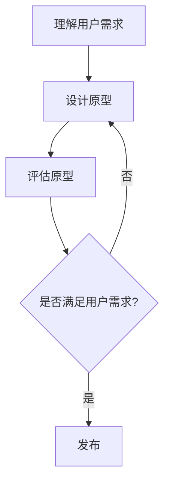

                 

## 1. 背景介绍

在当今数字化时代，用户体验（UX）已成为产品成功的关键因素。用户期望系统简单易用，能够快速学习并有效完成任务。因此，设计友好、易用的人机界面（HMI）至关重要。本文将深入探讨以用户为中心的设计理念，提供指南和最佳实践，帮助读者创建出色的用户体验。

## 2. 核心概念与联系

### 2.1 用户中心设计（User-Centered Design, UCD）

UCD是一种设计理念，将用户需求置于设计过程的核心。它强调早期 вов入用户，并持续收集和应用用户反馈。以下是UCD的关键活动：

1. 理解和分析用户及其需求
2. 设计和原型开发
3. 评估和迭代



### 2.2 可用性（Usability）

可用性是指用户能够有效、高效、满意地使用系统来完成任务的程度。它由以下五个属性组成：

1. 学习性：用户学习新系统的难易程度
2. 效率：用户完成任务所需的时间和资源
3. 记忆性：用户重新使用系统时记忆性能
4. 错误率：用户在使用系统时犯错的频率
5. 满意度：用户对系统的主观满意度

## 3. 核心算法原理 & 具体操作步骤

### 3.1 算法原理概述

在设计HMI时，我们需要考虑到用户的认知和行为特性。认知工程学（Cognitive Engineering）提供了相关原理，帮助我们设计出更易用的系统。其中一个关键算法是认知负荷模型（Cognitive Load Theory）。

### 3.2 算法步骤详解

认知负荷模型的目标是最小化用户在学习和使用系统时的认知负荷。以下是应用该模型的步骤：

1. 识别用户任务和需求
2. 确定系统任务-属性对应关系
3. 评估认知负荷
4. 优化设计以减少认知负荷

### 3.3 算法优缺点

**优点：**

* 提高了用户的学习效率和任务完成效率
* 降低了用户的错误率和沮丧感
* 促进了用户对系统的满意度

**缺点：**

* 需要大量的用户研究和测试
* 可能会增加设计和开发成本
* 并非所有用户都遵循认知工程学原理

### 3.4 算法应用领域

认知工程学原理广泛应用于人机交互设计，包括：

* 网站和移动应用设计
* 信息可视化
* 信息架构设计
* 系统导航设计

## 4. 数学模型和公式 & 详细讲解 & 举例说明

### 4.1 数学模型构建

在设计HMI时，我们可以使用信息架构模型（Information Architecture Model）来组织和表示信息。其中一个常用模型是卡迪夫模型（Card Sorting Model），它基于用户对信息的认知结构来组织信息。

### 4.2 公式推导过程

卡迪夫模型的推导过程如下：

1. 收集用户对信息的认知结构数据
2. 使用聚类算法（如K-means）对数据进行分组
3. 根据分组结果构建信息架构

### 4.3 案例分析与讲解

假设我们要为一家电子商务网站设计信息架构。我们收集了100名用户对产品类别的认知结构数据，并使用K-means算法对数据进行了分组。结果如下：

| 类别 | 中心词 |
| --- | --- |
| 电子产品 | 手机、平板电脑 |
| 服装 | T恤、牛仔裤 |
| 家居用品 | 家具、床上用品 |
| 体育用品 | 运动鞋、健身器材 |

根据这些结果，我们可以构建如下信息架构：

* 主页
	+ 电子产品
		- 手机
		- 平板电脑
	+ 服装
		- T恤
		- 牛仔裤
	+ 家居用品
		- 家具
		- 床上用品
	+ 体育用品
		- 运动鞋
		- 健身器材

## 5. 项目实践：代码实例和详细解释说明

### 5.1 开发环境搭建

为实现卡迪夫模型，我们需要以下开发环境：

* Python 3.8+
* Scikit-learn库（用于K-means聚类）
* Pandas库（用于数据处理）
* Matplotlib库（用于数据可视化）

### 5.2 源代码详细实现

以下是使用Python实现卡迪夫模型的示例代码：

```python
import pandas as pd
from sklearn.cluster import KMeans
import matplotlib.pyplot as plt

# 加载用户数据
data = pd.read_csv('user_data.csv')

# 选取相关特征
X = data.iloc[:, 1:]

# 使用K-means聚类
kmeans = KMeans(n_clusters=4, random_state=0).fit(X)

# 获取聚类结果
labels = kmeans.labels_
centers = kmeans.cluster_centers_

# 可视化聚类结果
plt.scatter(X.iloc[:, 0], X.iloc[:, 1], c=labels, cmap='viridis')
plt.scatter(centers[:, 0], centers[:, 1], c='red', s=200, alpha=0.5)
plt.show()
```

### 5.3 代码解读与分析

在代码中，我们首先加载用户数据，然后选取相关特征。我们使用K-means聚类算法对数据进行分组，并获取聚类结果。最后，我们使用Matplotlib可视化聚类结果。

### 5.4 运行结果展示

运行代码后，我们将得到一个包含4个聚类中心的散点图。每个数据点的颜色表示其所属的聚类。聚类中心用红色表示，并标记为更大的圆点。

## 6. 实际应用场景

### 6.1 当前应用

卡迪夫模型广泛应用于信息架构设计，帮助设计师创建更易于导航和使用的网站和应用程序。它还被用于信息可视化和用户研究领域。

### 6.2 未来应用展望

随着人工智能和机器学习技术的发展，卡迪夫模型可以与这些技术结合，实现更智能和个性化的信息架构设计。此外，它还可以应用于虚拟现实和增强现实领域，帮助设计更易于使用的交互式系统。

## 7. 工具和资源推荐

### 7.1 学习资源推荐

* 书籍：《信息架构：蓝图》（Information Architecture: Blueprints）作者：Peter Morville 和 Louis Rosenfeld
* 在线课程：Coursera上的“信息架构设计”课程

### 7.2 开发工具推荐

* Sketch
* Figma
* Adobe XD
* Axure

### 7.3 相关论文推荐

* “卡迪夫模型：一种基于用户认知结构的信息架构设计方法”（Card Sorting: A Method for Designing the Information Architecture of User-Centered Systems）作者：James A. Bennett 和 Michael J. Flanagan

## 8. 总结：未来发展趋势与挑战

### 8.1 研究成果总结

本文介绍了以用户为中心的设计理念，重点关注了认知工程学原理和卡迪夫模型。我们还提供了实现卡迪夫模型的Python示例代码。

### 8.2 未来发展趋势

未来，人机交互设计将继续朝着更个性化、更智能和更无缝的方向发展。人工智能和机器学习技术将在设计过程中发挥更大的作用。

### 8.3 面临的挑战

设计友好、易用的人机界面面临的挑战包括：

* 用户多样性：设计必须适应各种用户需求和技能水平
* 技术限制：某些技术限制了设计的可能性
* 资源限制：设计和开发成本可能会限制项目的规模和范围

### 8.4 研究展望

未来的研究将关注以下领域：

* 个性化和适应性设计
* 无缝和无感知的人机交互
* 可访问性和包容性设计

## 9. 附录：常见问题与解答

**Q1：什么是用户中心设计？**

A1：用户中心设计（UCD）是一种设计理念，将用户需求置于设计过程的核心。它强调早期 вов入用户，并持续收集和应用用户反馈。

**Q2：什么是可用性？**

A2：可用性是指用户能够有效、高效、满意地使用系统来完成任务的程度。它由学习性、效率、记忆性、错误率和满意度五个属性组成。

**Q3：什么是认知工程学？**

A3：认知工程学（Cognitive Engineering）是一门学科，研究人与系统之间的交互，以设计出更易用的系统。它提供了认知负荷模型等原理，帮助我们设计出更易用的系统。

**Q4：什么是卡迪夫模型？**

A4：卡迪夫模型（Card Sorting Model）是一种信息架构模型，基于用户对信息的认知结构来组织信息。它使用聚类算法对用户数据进行分组，并根据分组结果构建信息架构。

---

作者：禅与计算机程序设计艺术 / Zen and the Art of Computer Programming

