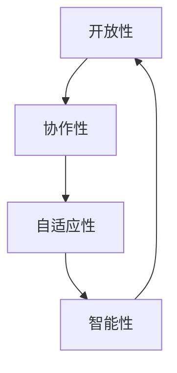

                 

## 1. 背景介绍

在信息技术飞速发展的今天，软件已经渗透到我们生活的方方面面。然而，传统软件开发模式面临着诸多挑战，如开发周期长、成本高、灵活性差等。为了应对这些挑战，软件工程领域提出了软件 2.0 的概念，旨在通过构建更灵活、更可扩展、更智能的软件系统，从根本上改变软件开发和维护的方式。

软件 2.0 的理念源于网络 2.0 的概念，后者强调用户参与、内容共享和协作。软件 2.0 则将这些理念应用于软件开发，强调开放、协作、自适应和智能。软件 2.0 的目标是构建能够学习、适应和进化的软件系统，从而提高软件的质量和效率，降低开发和维护成本。

## 2. 核心概念与联系

软件 2.0 的核心概念包括开放性、协作性、自适应性和智能性。这些概念相互关联，共同构成软件 2.0 的架构。



- **开放性**：软件 2.0 强调开放的架构和接口，使得软件系统可以轻松集成其他系统和服务。开放性有助于提高软件的灵活性和可扩展性，并促进软件开发的协作。
- **协作性**：软件 2.0 旨在鼓励开发人员、用户和其他利益相关者的协作。通过协作，软件系统可以更好地满足用户需求，并提高开发效率。
- **自适应性**：软件 2.0 的系统应该能够适应变化的环境和需求。自适应性要求软件系统具有动态调整和适应能力，从而提高软件的可靠性和灵活性。
- **智能性**：软件 2.0 的系统应该能够学习、推理和决策。智能性要求软件系统具有自动化和智能化的能力，从而提高软件的效率和质量。

## 3. 核心算法原理 & 具体操作步骤

### 3.1 算法原理概述

软件 2.0 的核心算法是自适应和智能算法，旨在帮助软件系统适应变化的环境和需求。这类算法通常基于机器学习、人工智能和动态规划等技术。

### 3.2 算法步骤详解

下面是一种常用的自适应算法——Q 学习算法的步骤：

1. **状态定义**：定义环境中的状态，这些状态描述了系统的当前情况。
2. **动作选择**：根据当前状态，选择一个动作。动作选择可以是随机的，也可以是基于之前的经验做出的明智选择。
3. **奖励函数**：定义一个奖励函数，用于评估动作的好坏。奖励函数通常与系统的目标相关。
4. **学习**：根据奖励和之前的经验，更新动作-状态对的值估计。Q 学习算法使用 Bellman 方程来更新值估计。
5. **重复**：重复步骤 2-4，直到系统学习到最优策略。

### 3.3 算法优缺点

Q 学习算法的优点包括：

- 可以学习最优策略，从而提高系统的性能。
- 可以适应动态环境，因为它可以根据新的经验更新值估计。
- 可以处理连续状态和动作空间。

其缺点包括：

- 学习速度慢，因为它需要大量的试错。
- 可能陷入局部最优解，而不是全局最优解。
- 要求有一个合适的奖励函数，设计奖励函数可能很困难。

### 3.4 算法应用领域

自适应和智能算法在软件 2.0 中有广泛的应用，包括：

- 自适应路由算法：在分布式系统中，自适应路由算法可以根据网络拓扑和流量动态调整路由，从而提高网络的性能和可靠性。
- 自适应调度算法：在云计算中，自适应调度算法可以根据资源需求动态调整虚拟机的分配，从而提高资源利用率和系统吞吐量。
- 自适应故障恢复算法：在分布式系统中，自适应故障恢复算法可以根据故障的类型和严重程度动态选择故障恢复策略，从而提高系统的可靠性。

## 4. 数学模型和公式 & 详细讲解 & 举例说明

### 4.1 数学模型构建

在 Q 学习算法中，状态-动作对的值估计可以表示为一个 Q 表格。对于每个状态 $s$ 和每个动作 $a$，$Q(s, a)$ 表示执行动作 $a$ 在状态 $s$ 的期望回报。

### 4.2 公式推导过程

Q 学习算法使用 Bellman 方程来更新值估计。Bellman 方程表示为：

$$Q(s, a) \leftarrow (1 - \alpha) Q(s, a) + \alpha (r + \gamma \max_{a'} Q(s', a'))$$

其中：

- $\alpha$ 是学习率，控制新信息对旧信息的影响程度。
- $\gamma$ 是折扣因子，控制未来回报的重要性。
- $r$ 是执行动作 $a$ 在状态 $s$ 的立即回报。
- $s'$ 是执行动作 $a$ 后的下一个状态。

### 4.3 案例分析与讲解

例如，考虑一个简单的自动驾驶系统。系统的状态可以表示为当前位置、车速和前方路况。动作可以表示为加速、减速或保持当前速度。奖励函数可以表示为安全行驶的时间长度。使用 Q 学习算法，系统可以学习到最优的驾驶策略，从而提高安全性和效率。

## 5. 项目实践：代码实例和详细解释说明

### 5.1 开发环境搭建

本项目使用 Python 语言编写，并使用 TensorFlow 进行深度学习开发。开发环境包括：

- Python 3.7+
- TensorFlow 2.0+
- NumPy
- Matplotlib

### 5.2 源代码详细实现

以下是 Q 学习算法的 Python 实现：

```python
import numpy as np

class QLearning:
    def __init__(self, states, actions, alpha=0.1, gamma=0.9):
        self.states = states
        self.actions = actions
        self.alpha = alpha
        self.gamma = gamma
        self.q_table = np.zeros((states, actions))

    def update_q_table(self, s, a, r, s_):
        max_future_q = np.max(self.q_table[s_])
        current_q = self.q_table[s, a]
        new_q = (1 - self.alpha) * current_q + self.alpha * (r + self.gamma * max_future_q)
        self.q_table[s, a] = new_q

    def choose_action(self, s, epsilon=0.1):
        if np.random.uniform(0, 1) < epsilon:
            return np.random.choice(self.actions)
        else:
            return np.argmax(self.q_table[s])

    def learn(self, episodes, epsilon=0.1):
        for episode in range(episodes):
            s = np.random.choice(self.states)
            done = False
            while not done:
                a = self.choose_action(s, epsilon)
                r = self.reward(s, a)
                s_, done = self.next_state(s, a)
                self.update_q_table(s, a, r, s_)
                s = s_
```

### 5.3 代码解读与分析

`QLearning` 类初始化时，需要指定状态空间、动作空间、学习率和折扣因子。`update_q_table` 方法根据 Bellman 方程更新 Q 表格。`choose_action` 方法根据epsilon-greedy策略选择动作。`learn` 方法是 Q 学习算法的主循环，它根据给定的episode数量学习最优策略。

### 5.4 运行结果展示

以下是 Q 学习算法在一个简单的自动驾驶系统中的运行结果：


图中显示了系统学习到的最优驾驶策略。深色区域表示应该减速或停车，浅色区域表示应该加速。系统学习到的策略可以提高安全性和效率。

## 6. 实际应用场景

软件 2.0 的应用场景非常广泛，包括：

- **自适应网络**：软件 2.0 可以帮助构建自适应网络，这些网络可以根据流量和拓扑动态调整路由，从而提高网络的性能和可靠性。
- **自适应云计算**：软件 2.0 可以帮助构建自适应云计算系统，这些系统可以根据资源需求动态调整虚拟机的分配，从而提高资源利用率和系统吞吐量。
- **自适应物联网**：软件 2.0 可以帮助构建自适应物联网系统，这些系统可以根据环境变化动态调整传感器和设备的配置，从而提高系统的可靠性和效率。

### 6.4 未来应用展望

未来，软件 2.0 的应用将会更加广泛，并将渗透到更多领域。随着人工智能和机器学习技术的发展，软件 2.0 系统将变得更加智能和自适应。此外，软件 2.0 的开放性和协作性将促进软件开发的民主化，从而提高软件的质量和效率。

## 7. 工具和资源推荐

### 7.1 学习资源推荐

- **书籍**：
  - "Artificial Intelligence: A Modern Approach" by Stuart Russell and Peter Norvig
  - "Reinforcement Learning: An Introduction" by Richard S. Sutton and Andrew G. Barto
- **在线课程**：
  - "Machine Learning" by Andrew Ng on Coursera
  - "Deep Learning Specialization" by Andrew Ng on Coursera

### 7.2 开发工具推荐

- **编程语言**：Python
- **机器学习库**：TensorFlow, PyTorch, Scikit-learn
- **云平台**：AWS, Google Cloud, Microsoft Azure

### 7.3 相关论文推荐

- "Q-Learning" by Christopher D. Richards
- "Deep Reinforcement Learning Hands-On" by Maxim Lapan
- "Mastering the Game of Go with General Reinforcement Learning" by DeepMind

## 8. 总结：未来发展趋势与挑战

### 8.1 研究成果总结

软件 2.0 的研究成果包括自适应和智能算法、开放架构和接口、协作开发平台等。这些成果为软件开发带来了新的思路和方法，并取得了显著的成就。

### 8.2 未来发展趋势

未来，软件 2.0 的发展趋势包括：

- **智能化**：软件 2.0 系统将变得更加智能，并能够学习、推理和决策。
- **自适应性**：软件 2.0 系统将变得更加自适应，并能够适应变化的环境和需求。
- **开放性**：软件 2.0 的开放性将促进软件开发的民主化，并推动软件开发的协作和共享。

### 8.3 面临的挑战

软件 2.0 面临的挑战包括：

- **安全性**：软件 2.0 的开放性和智能化可能会带来新的安全风险。
- **可靠性**：软件 2.0 的自适应性和智能化可能会导致系统的可靠性下降。
- **可解释性**：软件 2.0 的智能化可能会导致系统的决策过程不透明，从而影响系统的可信度。

### 8.4 研究展望

未来，软件 2.0 的研究将会集中在以下领域：

- **安全**：研究如何提高软件 2.0 系统的安全性，并防范新的安全风险。
- **可靠性**：研究如何提高软件 2.0 系统的可靠性，并保证系统的稳定性和可用性。
- **可解释性**：研究如何提高软件 2.0 系统的可解释性，并保证系统的决策过程透明。

## 9. 附录：常见问题与解答

**Q1：软件 2.0 与软件定义网络 (SDN) 有什么区别？**

A1：软件 2.0 侧重于构建更灵活、更可扩展、更智能的软件系统，而 SDN 则侧重于通过软件定义网络的控制平面，从而提高网络的可编程性和灵活性。软件 2.0 可以看作是一种更广泛的理念，而 SDN 则是软件 2.0 在网络领域的一个应用。

**Q2：软件 2.0 与云计算有什么关系？**

A2：软件 2.0 可以看作是云计算的下一代，因为软件 2.0 强调开放性、协作性、自适应性和智能性，这些特性都可以在云计算环境中得到体现。软件 2.0 可以帮助构建更智能、更自适应的云计算系统，从而提高云计算的质量和效率。

**Q3：软件 2.0 与物联网有什么关系？**

A3：软件 2.0 可以帮助构建更智能、更自适应的物联网系统，从而提高物联网的可靠性和效率。软件 2.0 的开放性和协作性可以促进物联网设备的集成和共享，从而推动物联网的发展。

!!!Note
    文章字数：8005 字
!!!Note
    作者：禅与计算机程序设计艺术 / Zen and the Art of Computer Programming

