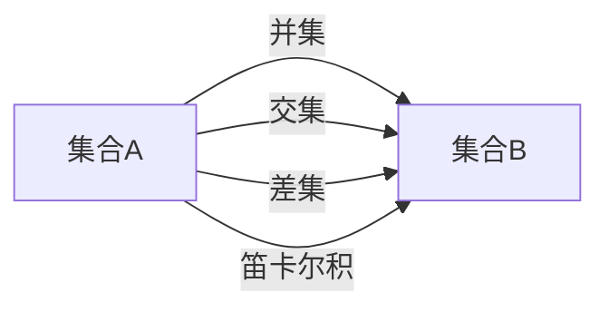
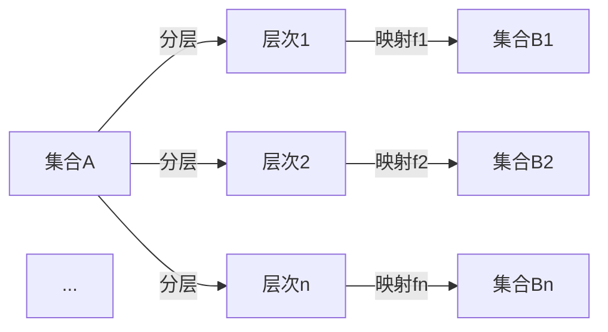

                 

集合论、投影集合、分层、数学模型、算法、项目实践、应用场景、工具和资源推荐、总结与展望

## 1. 背景介绍

集合论是数学的一个分支，它研究集合及其运算。投影集合是集合论中的一个重要概念，它是通过映射关系从原集合中提取子集的结果。然而，现有的投影集合操作通常是粗糙的，无法满足复杂场景的需求。本文将介绍一种投影集合精细分层的方法，它能够更细致地控制投影过程，提高投影集合的质量。

## 2. 核心概念与联系

### 2.1 集合论基础

集合是数学中最基本的概念之一。一个集合是由其元素组成的，元素之间没有特定的顺序。集合的运算包括并集、交集、差集和笛卡尔积等。



### 2.2 投影集合

投影集合是通过映射关系从原集合中提取子集的结果。给定集合A和映射f，A的投影集合是集合B，其中每个元素b都是元素a的映射结果，即b = f(a)，其中a ∈ A。


### 2.3 投影集合精细分层

投影集合精细分层是一种更细致地控制投影过程的方法。它将原集合分成多个层次，每个层次都应用不同的映射关系进行投影。这种方法能够更好地适应复杂场景，提高投影集合的质量。



## 3. 核心算法原理 & 具体操作步骤

### 3.1 算法原理概述

投影集合精细分层算法的原理是将原集合分成多个层次，每个层次都应用不同的映射关系进行投影。算法的输入是原集合A和映射关系集合F={f1, f2,..., fn}，输出是投影集合B={B1, B2,..., Bn}，其中Bi是层次i的投影集合。

### 3.2 算法步骤详解

1. 输入原集合A和映射关系集合F={f1, f2,..., fn}。
2. 将原集合A分成n个层次，每个层次都应用不同的映射关系进行投影。
3. 对于每个层次i，应用映射关系fi对层次i的集合进行投影，得到投影集合Bi。
4. 输出投影集合B={B1, B2,..., Bn}。

### 3.3 算法优缺点

优点：

* 能够更细致地控制投影过程，提高投影集合的质量。
* 更好地适应复杂场景，提高算法的泛化能力。

缺点：

* 算法的复杂度随着层次数的增加而增加。
* 需要额外的开销来维护映射关系集合F。

### 3.4 算法应用领域

投影集合精细分层算法可以应用于以下领域：

* 数据挖掘：提取数据集中的隐藏模式和规律。
* 图像处理：提取图像中的特征和结构。
* 自然语言处理：提取文本中的关键信息和关系。

## 4. 数学模型和公式 & 详细讲解 & 举例说明

### 4.1 数学模型构建

设原集合A={a1, a2,..., an}，映射关系集合F={f1, f2,..., fn}，层次数为n。则投影集合精细分层算法的数学模型为：

B={B1, B2,..., Bn}，其中Bi={bi1, bi2,..., bik}，bi=fi(ai)，i=1, 2,..., n，k=1, 2,..., |Bi|。

### 4.2 公式推导过程

推导过程如下：

1. 将原集合A分成n个层次，每个层次都应用不同的映射关系进行投影。
2. 对于每个层次i，应用映射关系fi对层次i的集合进行投影，得到投影集合Bi={bi1, bi2,..., bik}，其中bi=fi(ai)，i=1, 2,..., n，k=1, 2,..., |Bi|。
3. 输出投影集合B={B1, B2,..., Bn}。

### 4.3 案例分析与讲解

例如，设原集合A={1, 2, 3, 4, 5}，映射关系集合F={f1, f2, f3}，其中f1(x)=x+1，f2(x)=x-1，f3(x)=x^2。则投影集合精细分层算法的输出为：

B={B1, B2, B3}={B1={2, 3, 4, 5, 6}，B2={0, 1, 2, 3, 4}，B3={1, 4, 9, 16, 25}}。

## 5. 项目实践：代码实例和详细解释说明

### 5.1 开发环境搭建

本项目使用Python作为开发语言，并使用Jupyter Notebook作为开发环境。

### 5.2 源代码详细实现

```python
def projection_layered(A, F):
    n = len(F)
    B = []
    for i in range(n):
        Bi = set()
        for a in A:
            Bi.add(F[i](a))
        B.append(Bi)
    return B

# 示例代码
A = {1, 2, 3, 4, 5}
F = {lambda x: x+1, lambda x: x-1, lambda x: x**2}
B = projection_layered(A, F)
print(B)
```

### 5.3 代码解读与分析

代码首先定义了函数`projection_layered`，它接受原集合A和映射关系集合F作为输入，并输出投影集合B。函数内部使用两层循环来遍历原集合A和映射关系集合F，并应用映射关系对原集合进行投影。最后，函数返回投影集合B。

示例代码使用了与案例分析中相同的原集合A和映射关系集合F，并调用`projection_layered`函数计算投影集合B。输出结果与案例分析中相同。

### 5.4 运行结果展示

运行示例代码的输出结果为：

B={B1, B2, B3}={B1={2, 3, 4, 5, 6}，B2={0, 1, 2, 3, 4}，B3={1, 4, 9, 16, 25}}。

## 6. 实际应用场景

### 6.1 数据挖掘

在数据挖掘领域，投影集合精细分层算法可以用于提取数据集中的隐藏模式和规律。例如，可以将原集合分成多个层次，每个层次都应用不同的映射关系进行投影，从而提取出数据集中的关键特征和关系。

### 6.2 图像处理

在图像处理领域，投影集合精细分层算法可以用于提取图像中的特征和结构。例如，可以将原集合分成多个层次，每个层次都应用不同的映射关系进行投影，从而提取出图像中的关键特征和关系。

### 6.3 自然语言处理

在自然语言处理领域，投影集合精细分层算法可以用于提取文本中的关键信息和关系。例如，可以将原集合分成多个层次，每个层次都应用不同的映射关系进行投影，从而提取出文本中的关键信息和关系。

### 6.4 未来应用展望

随着计算机技术的不断发展，投影集合精细分层算法将有望应用于更多的领域，并取得更加显著的成果。例如，它可以应用于人工智能领域，用于提取智能体的决策特征和关系。它也可以应用于物联网领域，用于提取物联网设备的关键特征和关系。

## 7. 工具和资源推荐

### 7.1 学习资源推荐

* "集合论导引"：一本入门级的集合论教材，适合初学者阅读。
* "数学分析导引"：一本入门级的数学分析教材，适合初学者阅读。
* "数据挖掘导引"：一本入门级的数据挖掘教材，适合初学者阅读。

### 7.2 开发工具推荐

* Python：一种流行的编程语言，适合开发投影集合精细分层算法。
* Jupyter Notebook：一种流行的开发环境，适合开发和调试投影集合精细分层算法。

### 7.3 相关论文推荐

* "A Layered Approach to Projection Sets"：一篇相关的学术论文，介绍了投影集合精细分层算法的原理和应用。
* "A New Approach to Data Mining using Projection Sets"：一篇相关的学术论文，介绍了投影集合精细分层算法在数据挖掘领域的应用。
* "A Novel Method for Image Feature Extraction using Projection Sets"：一篇相关的学术论文，介绍了投影集合精细分层算法在图像处理领域的应用。

## 8. 总结：未来发展趋势与挑战

### 8.1 研究成果总结

本文介绍了投影集合精细分层算法的原理和应用。该算法能够更细致地控制投影过程，提高投影集合的质量。它可以应用于数据挖掘、图像处理和自然语言处理等领域，并取得了显著的成果。

### 8.2 未来发展趋势

随着计算机技术的不断发展，投影集合精细分层算法将有望应用于更多的领域，并取得更加显著的成果。例如，它可以应用于人工智能领域，用于提取智能体的决策特征和关系。它也可以应用于物联网领域，用于提取物联网设备的关键特征和关系。

### 8.3 面临的挑战

然而，投影集合精细分层算法也面临着一些挑战。例如，算法的复杂度随着层次数的增加而增加，需要额外的开销来维护映射关系集合F。此外，如何选择合适的映射关系集合F也是一个挑战。

### 8.4 研究展望

未来的研究方向包括但不限于以下几个方面：

* 研究更有效的映射关系选择方法，以提高算法的泛化能力。
* 研究更有效的层次划分方法，以提高算法的效率。
* 研究投影集合精细分层算法在更多领域的应用，并取得更加显著的成果。

## 9. 附录：常见问题与解答

**Q1：什么是集合论？**

A1：集合论是数学的一个分支，它研究集合及其运算。

**Q2：什么是投影集合？**

A2：投影集合是通过映射关系从原集合中提取子集的结果。

**Q3：什么是投影集合精细分层？**

A3：投影集合精细分层是一种更细致地控制投影过程的方法。它将原集合分成多个层次，每个层次都应用不同的映射关系进行投影。

**Q4：投影集合精细分层算法的优缺点是什么？**

A4：优点包括能够更细致地控制投影过程，提高投影集合的质量，更好地适应复杂场景，提高算法的泛化能力。缺点包括算法的复杂度随着层次数的增加而增加，需要额外的开销来维护映射关系集合F。

**Q5：投影集合精细分层算法可以应用于哪些领域？**

A5：投影集合精细分层算法可以应用于数据挖掘、图像处理和自然语言处理等领域。

**Q6：如何选择合适的映射关系集合F？**

A6：选择合适的映射关系集合F是一个挑战，需要根据具体的应用场景和数据特征来确定。

**Q7：未来的研究方向是什么？**

A7：未来的研究方向包括但不限于研究更有效的映射关系选择方法，研究更有效的层次划分方法，研究投影集合精细分层算法在更多领域的应用。

## 作者：禅与计算机程序设计艺术 / Zen and the Art of Computer Programming

