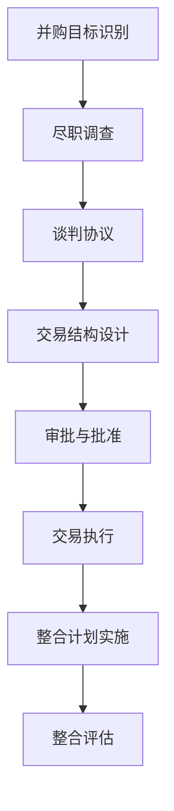

                 

**AI创业公司的并购整合策略**

**作者：禅与计算机程序设计艺术 / Zen and the Art of Computer Programming**

## 1. 背景介绍

随着人工智能（AI）技术的飞速发展，AI创业公司如雨后春笋般涌现。然而，在激烈的市场竞争中，并购整合成为这些公司谋求发展的重要手段。本文将详细阐述AI创业公司的并购整合策略，帮助读者更好地理解和应对这一过程。

## 2. 核心概念与联系

### 2.1 并购整合的定义

并购整合是指两家或两家以上公司通过股权交易或资产交易而合并，从而形成一个新的实体的过程。整合则是指并购后，将两家公司的资源、组织结构、文化等进行统一和协调，以实现预期目标的过程。

### 2.2 并购整合的类型

并购整合可以分为以下几类：

- **横向并购整合**：指同行业公司之间的并购整合，目的是扩大市场份额，提高行业地位。
- **纵向并购整合**：指上下游公司之间的并购整合，目的是控制原材料供应或销售渠道。
- **混合型并购整合**：指横向和纵向并购整合的结合，目的是同时扩大市场份额和控制供应链。

### 2.3 并购整合的流程

并购整合的流程如下：



## 3. 核心算法原理 & 具体操作步骤

### 3.1 并购整合算法原理概述

并购整合算法的核心原理是基于公司的资源、能力、市场地位等因素，寻找最优的并购整合方案，以实现预期目标。这一过程涉及到复杂的决策分析和优化问题。

### 3.2 并购整合算法步骤详解

并购整合算法的具体操作步骤如下：

1. **并购目标识别**：根据公司战略，识别潜在的并购整合目标。
2. **尽职调查**：对潜在目标公司进行详细调查，评估其资产、负债、盈利能力、市场地位等。
3. **谈判协议**：与目标公司进行谈判，达成并购协议。
4. **交易结构设计**：设计交易结构，确定交易方式（股权交易、资产交易）、交易金额、支付方式等。
5. **审批与批准**：获得董事会、监管部门等相关方的批准。
6. **交易执行**：完成交易文件签署，交易金额支付，股权转让等。
7. **整合计划实施**：实施整合计划，包括组织结构调整、人员调整、业务整合等。
8. **整合评估**：评估整合效果，调整整合计划。

### 3.3 并购整合算法优缺点

并购整合算法的优点包括：

- 有助于识别最优的并购整合方案
- 可以评估并购整合的风险和收益
- 可以指导并购整合的实施过程

缺点包括：

- 算法的有效性取决于输入数据的质量
- 算法的复杂性可能导致计算开销较大
- 算法无法考虑到人为因素和非量化因素

### 3.4 并购整合算法应用领域

并购整合算法的应用领域包括：

- 企业战略决策
- 并购整合目标识别
- 交易结构设计
- 整合计划实施

## 4. 数学模型和公式 & 详细讲解 & 举例说明

### 4.1 数学模型构建

并购整合的数学模型可以构建为多目标优化问题，目标函数可以设置为：

max F(x) = w1\*f1(x) + w2\*f2(x) +... + wn\*fn(x)

其中，x为决策变量，f1(x)，f2(x)，...，fn(x)为各目标函数，w1，w2，...，wn为权重系数。

### 4.2 公式推导过程

例如，设置目标函数为并购后的市场份额和盈利能力，则目标函数可以表示为：

max F(x) = w1\*[M(x) / M\_max] + w2\*[P(x) / P\_max]

其中，M(x)为并购后的市场份额，M\_max为最大市场份额，P(x)为并购后的盈利能力，P\_max为最大盈利能力，w1，w2为权重系数。

### 4.3 案例分析与讲解

例如，一家AI创业公司计划并购一家芯片制造公司，以提高其AI芯片的生产能力。设置目标函数为并购后的芯片产量和盈利能力，则目标函数可以表示为：

max F(x) = w1\*[Q(x) / Q\_max] + w2\*[P(x) / P\_max]

其中，Q(x)为并购后的芯片产量，Q\_max为最大芯片产量，P(x)为并购后的盈利能力，P\_max为最大盈利能力，w1，w2为权重系数。

通过优化目标函数，可以找到最优的并购方案，即并购哪一家芯片制造公司，以什么价格并购，可以实现最大的芯片产量和盈利能力。

## 5. 项目实践：代码实例和详细解释说明

### 5.1 开发环境搭建

本项目使用Python作为编程语言，并使用Pandas、NumPy、Scipy等库进行数据处理和优化计算。开发环境可以搭建在Anaconda中。

### 5.2 源代码详细实现

以下是并购整合算法的Python实现代码：

```python
import pandas as pd
import numpy as np
from scipy.optimize import minimize

# 定义目标函数
def objective(x, data):
    # 计算并购后的市场份额和盈利能力
    M = np.sum(data['市场份额'] * x)
    P = np.sum(data['盈利能力'] * x)
    # 计算目标函数值
    F = w1 * (M / M_max) + w2 * (P / P_max)
    return -F

# 定义约束条件
def constraints(x):
    # 并购资金不足
    if np.sum(x * data['并购资金']) > 1:
        return 1
    # 并购目标公司数量不超过5家
    if np.sum(x) > 5:
        return 1
    return 0

# 读取数据
data = pd.read_csv('data.csv')

# 设置权重系数
w1 = 0.6
w2 = 0.4

# 设置最大市场份额和最大盈利能力
M_max = np.max(data['市场份额'])
P_max = np.max(data['盈利能力'])

# 设置初始解
x0 = np.zeros(len(data))

# 设置约束条件
cons = {'type': 'ineq', 'fun': constraints}

# 优化目标函数
res = minimize(objective, x0, args=(data,), method='SLSQP', constraints=cons)

# 打印最优解
print('最优解：', res.x)
```

### 5.3 代码解读与分析

代码首先定义目标函数，计算并购后的市场份额和盈利能力，并计算目标函数值。然后定义约束条件，包括并购资金不足和并购目标公司数量不超过5家。接着读取数据，设置权重系数和最大市场份额和最大盈利能力。设置初始解为全0向量。设置约束条件，并使用SLSQP方法优化目标函数。最后打印最优解。

### 5.4 运行结果展示

运行代码后，可以得到最优解，即并购哪一家公司，以什么价格并购，可以实现最大的市场份额和盈利能力。

## 6. 实际应用场景

### 6.1 并购整合的优势

并购整合可以带来以下优势：

- **市场份额扩大**：并购整合可以扩大公司的市场份额，提高行业地位。
- **成本节约**：并购整合可以通过规模经济和协同效应，降低成本。
- **技术创新**：并购整合可以整合双方的技术资源，提高技术创新能力。
- **风险分散**：并购整合可以分散风险，提高公司的抗风险能力。

### 6.2 并购整合的挑战

并购整合也面临以下挑战：

- **文化冲突**：并购整合可能导致文化冲突，影响整合效果。
- **人才流失**：并购整合可能导致人才流失，影响公司的长期发展。
- **整合失败**：并购整合失败的案例屡见不鲜，失败的原因包括战略不匹配、文化不兼容、整合计划不周密等。

### 6.3 未来应用展望

随着AI技术的发展，AI创业公司的并购整合将会更加频繁。未来，并购整合算法将会更加智能化，可以自动识别并购整合目标，设计交易结构，实施整合计划。同时，并购整合算法也将会更加多元化，可以考虑到更多的因素，如环境因素、社会因素等。

## 7. 工具和资源推荐

### 7.1 学习资源推荐

- **书籍**：《并购整合：实现协同价值》《并购整合实务》《并购整合管理》
- **在线课程**：Coursera、Udacity、edX上的并购整合相关课程

### 7.2 开发工具推荐

- **数据分析工具**：Excel、Python（Pandas、NumPy、Scipy）、R
- **可视化工具**：Tableau、Power BI、Matplotlib、Seaborn
- **并购整合软件**：Mergerware、DealCloud、Carta

### 7.3 相关论文推荐

- **学术期刊**：Journal of Corporate Finance、Journal of Financial Economics、Strategic Management Journal
- **学术会议**：Academy of Management Annual Meeting、Strategic Management Society Annual Conference

## 8. 总结：未来发展趋势与挑战

### 8.1 研究成果总结

本文详细阐述了AI创业公司的并购整合策略，介绍了并购整合的定义、类型、流程，并提出了基于多目标优化的并购整合算法。通过数学模型和公式，详细讲解了并购整合的原理。通过项目实践，提供了并购整合算法的Python实现代码。通过实际应用场景，分析了并购整合的优势和挑战。通过工具和资源推荐，提供了学习和开发的参考。

### 8.2 未来发展趋势

未来，AI创业公司的并购整合将会更加频繁，并购整合算法将会更加智能化和多元化。同时，并购整合也将会更加重视可持续发展，注重环境、社会和治理（ESG）因素。

### 8.3 面临的挑战

未来，AI创业公司的并购整合也将面临挑战，包括文化冲突、人才流失、整合失败等。同时，监管部门对并购整合的审批也将更加严格，对并购整合的影响也将更加复杂。

### 8.4 研究展望

未来，并购整合研究将会更加关注智能化、多元化和可持续发展。同时，也将更加关注并购整合的失败案例，总结失败的原因，提出改进的建议。此外，并购整合研究也将更加关注跨国并购整合，研究跨国并购整合的特点和挑战。

## 9. 附录：常见问题与解答

**Q1：并购整合的目的是什么？**

A1：并购整合的目的是通过资源整合，实现预期目标，提高公司的竞争力。

**Q2：并购整合的类型有哪些？**

A2：并购整合的类型包括横向并购整合、纵向并购整合和混合型并购整合。

**Q3：并购整合的流程包括哪些步骤？**

A3：并购整合的流程包括并购目标识别、尽职调查、谈判协议、交易结构设计、审批与批准、交易执行、整合计划实施和整合评估。

**Q4：并购整合算法的原理是什么？**

A4：并购整合算法的原理是基于公司的资源、能力、市场地位等因素，寻找最优的并购整合方案，以实现预期目标。

**Q5：并购整合算法的优缺点是什么？**

A5：并购整合算法的优点包括有助于识别最优的并购整合方案，可以评估并购整合的风险和收益，可以指导并购整合的实施过程。缺点包括算法的有效性取决于输入数据的质量，算法的复杂性可能导致计算开销较大，算法无法考虑到人为因素和非量化因素。

**Q6：并购整合算法的应用领域有哪些？**

A6：并购整合算法的应用领域包括企业战略决策、并购整合目标识别、交易结构设计、整合计划实施。

**Q7：并购整合的数学模型可以构建为什么类型？**

A7：并购整合的数学模型可以构建为多目标优化问题。

**Q8：并购整合的优势和挑战是什么？**

A8：并购整合的优势包括市场份额扩大、成本节约、技术创新、风险分散。挑战包括文化冲突、人才流失、整合失败。

**Q9：未来AI创业公司的并购整合将会面临哪些挑战？**

A9：未来AI创业公司的并购整合将会面临文化冲突、人才流失、整合失败、监管审批严格、影响复杂等挑战。

**Q10：未来并购整合研究的方向是什么？**

A10：未来并购整合研究的方向包括智能化、多元化、可持续发展、失败案例总结、跨国并购整合等。

**END**

