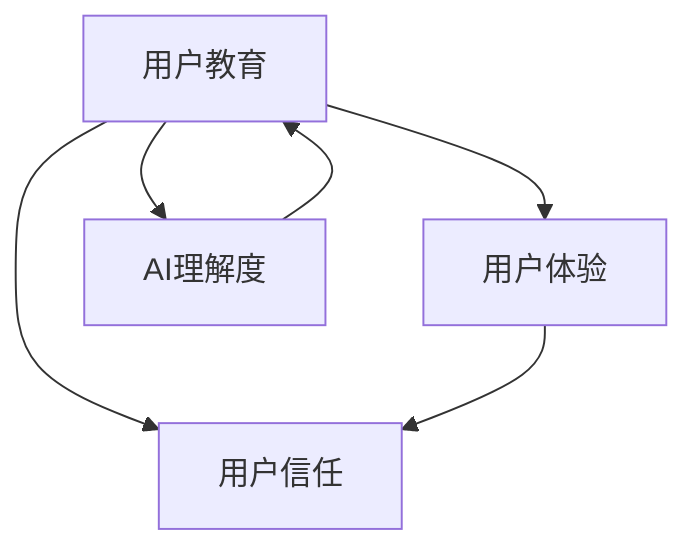

                 

**AI创业公司的用户教育策略**

**作者：禅与计算机程序设计艺术 / Zen and the Art of Computer Programming**

## 1. 背景介绍

随着人工智能（AI）技术的飞速发展，越来越多的创业公司涌入这个市场。然而，与其他技术相比，AI存在着独特的挑战：用户对其原理和应用的理解有限。因此，AI创业公司需要开发出色的用户教育策略，帮助用户理解并信任其产品。本文将深入探讨AI创业公司的用户教育策略，提供实用的指南和最佳实践。

## 2. 核心概念与联系

在开发用户教育策略之前，我们需要理解几个核心概念及其联系。下面是这些概念的简要描述和它们的关系：

- **用户教育（User Education）**：帮助用户理解并有效使用产品的过程。
- **用户体验（User Experience）**：用户与产品交互时的总体印象。
- **用户信任（User Trust）**：用户对产品及其提供者的信任感。
- **AI理解度（AI Literacy）**：用户对AI原理、应用和局限性的理解。

这些概念密切相关：用户教育有助于提高用户体验，从而增强用户信任；而提高AI理解度则是用户教育的关键目标之一。

## 3. 核心算法原理 & 具体操作步骤

### 3.1 算法原理概述

用户教育策略的核心是帮助用户理解AI算法的原理。这包括解释算法的输入、输出、工作原理，以及其在特定应用中的作用。

### 3.2 算法步骤详解

1. **选择合适的算法**：选择最适合您的产品和用户需求的AI算法。
2. **解释算法原理**：使用简单易懂的语言解释算法的工作原理。避免使用过于技术化的术语。
3. **提供示例**：使用示例帮助用户理解算法的输入、输出和工作过程。
4. **展示算法在产品中的应用**：展示算法如何帮助用户解决实际问题或提高产品体验。

### 3.3 算法优缺点

在解释算法原理时，也要讨论其优缺点。这有助于用户理解算法的局限性，并帮助他们正确地期待和使用产品。

### 3.4 算法应用领域

解释算法在哪些领域和应用中运行，以及它如何帮助用户。这有助于用户理解算法的价值，并帮助他们将其集成到自己的工作流程中。

## 4. 数学模型和公式 & 详细讲解 & 举例说明

### 4.1 数学模型构建

AI算法通常基于数学模型构建。解释这些模型的关键组成部分，以及它们如何帮助算法做出决策。

### 4.2 公式推导过程

解释模型背后的数学公式，并推导出它们是如何得出结果的。使用简单的语言和示例，帮助用户理解公式的含义。

### 4.3 案例分析与讲解

使用真实世界的案例分析，展示模型和公式如何帮助算法做出决策。这有助于用户理解算法的实际应用，并帮助他们信任其结果。

## 5. 项目实践：代码实例和详细解释说明

### 5.1 开发环境搭建

提供开发环境的详细说明，包括软件、库和工具。这有助于用户在自己的环境中复制和修改代码。

### 5.2 源代码详细实现

提供详细的源代码，并解释每个关键部分的作用。使用注释帮助用户理解代码的流程。

### 5.3 代码解读与分析

解释代码的关键部分，并分析其性能和效率。这有助于用户理解代码的优缺点，并帮助他们改进自己的代码。

### 5.4 运行结果展示

展示代码的运行结果，并解释这些结果的含义。这有助于用户理解代码的输出，并帮助他们信任其结果。

## 6. 实际应用场景

### 6.1 当前应用场景

解释算法在当前产品中的应用场景。展示它如何帮助用户解决实际问题，并提高产品体验。

### 6.2 未来应用展望

讨论算法在未来的应用潜力。解释它如何随着技术的发展而发展，并帮助用户理解其长期价值。

## 7. 工具和资源推荐

### 7.1 学习资源推荐

推荐学习AI和算法的在线资源，如课程、文档和论文。这有助于用户深入理解算法的原理和应用。

### 7.2 开发工具推荐

推荐开发AI算法的工具和库。解释这些工具的优缺点，并帮助用户选择最适合自己的工具。

### 7.3 相关论文推荐

推荐相关的学术论文，以帮助用户深入理解算法的原理和应用。解释这些论文的关键发现，并帮助用户理解其意义。

## 8. 总结：未来发展趋势与挑战

### 8.1 研究成果总结

总结本文的关键发现和建议。解释这些发现如何帮助AI创业公司开发出色的用户教育策略。

### 8.2 未来发展趋势

讨论AI技术的未来发展趋势，以及这些趋势对用户教育的影响。解释AI创业公司如何适应这些趋势，并保持其竞争力。

### 8.3 面临的挑战

解释AI创业公司在用户教育方面面临的挑战。解释这些挑战如何影响用户信任和产品成功。

### 8.4 研究展望

提出未来的研究方向，以帮助AI创业公司更好地理解和教育用户。解释这些研究如何帮助AI创业公司保持其竞争力。

## 9. 附录：常见问题与解答

提供常见问题的解答，帮助用户理解AI算法的原理和应用。解释这些问题的答案如何帮助用户信任产品。

## 结束语

用户教育是AI创业公司成功的关键。通过理解核心概念、开发有效的算法和数学模型、提供项目实践和实际应用场景、推荐工具和资源，AI创业公司可以开发出色的用户教育策略。通过这些策略，AI创业公司可以帮助用户理解并信任其产品，从而提高产品成功的可能性。

