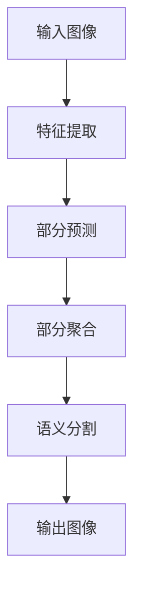

                 

**Parti原理与代码实例讲解**

**作者：禅与计算机程序设计艺术 / Zen and the Art of Computer Programming**

## 1. 背景介绍

在当今的计算机视觉领域，图像分割是一个关键且具有挑战性的任务。Parti是一种基于学习的图像分割方法，它通过学习图像的语义部分来实现。Parti的提出是为了解决传统方法在处理复杂场景时的局限性，并提供一种更灵活和准确的图像分割解决方案。

## 2. 核心概念与联系

Parti的核心概念是学习图像的语义部分，并使用这些部分来指导图像分割。Parti的架构如下图所示：

在Parti中，首先从输入图像中提取特征，然后预测图像的语义部分。这些部分被聚合以生成语义分割结果，最后输出分割图像。

## 3. 核心算法原理 & 具体操作步骤

### 3.1 算法原理概述

Parti的核心原理是使用一个端到端的深度学习模型来学习图像的语义部分，并使用这些部分来指导图像分割。Parti使用一个编码器-解码器架构，其中编码器提取图像特征，解码器预测图像的语义部分并生成分割结果。

### 3.2 算法步骤详解

1. **特征提取**：Parti使用一个预训练的深度学习模型（如ResNet）来提取图像特征。这些特征表示图像的低级和高级特征，如边缘、纹理和形状。
2. **部分预测**：Parti使用一个全连接层来预测图像的语义部分。每个部分表示图像中的一个语义对象，如汽车、树木或建筑物。
3. **部分聚合**：Parti使用一个注意力机制来聚合预测的部分。注意力机制帮助模型关注图像中最相关的部分，并忽略不相关的部分。
4. **语义分割**：Parti使用一个解码器来生成图像的语义分割结果。解码器使用聚合的部分来指导分割，并生成一个语义分割图像。
5. **输出**：Parti输出一个语义分割图像，其中每个像素被标记为图像中的一个语义对象。

### 3.3 算法优缺点

**优点**：

* Parti提供了一种更灵活和准确的图像分割解决方案。
* Parti可以处理复杂的场景，其中图像包含多个语义对象。
* Parti使用端到端的深度学习模型，可以学习图像的复杂特征。

**缺点**：

* Parti需要大量的标记数据来训练模型。
* Parti的计算成本高，需要大量的计算资源来训练和推理模型。
* Parti的泛化能力有限，需要大量的数据来适应新的场景。

### 3.4 算法应用领域

Parti可以应用于各种计算机视觉任务，如自动驾驶、机器人导航、图像分类和目标检测。Parti可以帮助这些任务更准确地理解图像中的语义对象，从而提高任务的性能。

## 4. 数学模型和公式 & 详细讲解 & 举例说明

### 4.1 数学模型构建

Parti的数学模型是一个端到端的深度学习模型，它使用编码器-解码器架构来学习图像的语义部分。Parti的数学模型可以表示为：

$$f(x) = g(h(x), p(x))$$

其中，$x$是输入图像，$h(x)$是编码器提取的特征，$p(x)$是预测的语义部分，$g(.,.)$是解码器，$f(x)$是输出的语义分割图像。

### 4.2 公式推导过程

Parti的数学模型可以使用反向传播算法来训练。在训练过程中，Parti使用交叉熵损失函数来优化模型参数，以最小化预测分割结果和真实分割结果之间的差异。数学公式表示为：

$$L = -\sum_{i=1}^{N}y_{i}\log(\hat{y}_{i})$$

其中，$N$是图像中的像素数，$y_{i}$是真实分割结果，$

