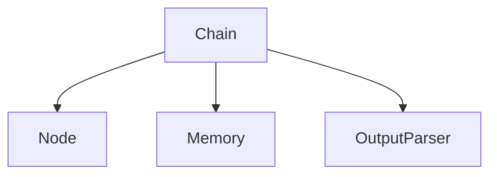

                 

**LangChain编程：从入门到实践】开发环境准备**

**作者：禅与计算机程序设计艺术 / Zen and the Art of Computer Programming**

## 1. 背景介绍

LangChain是一个开源项目，提供了构建大型语言模型应用的工具集。它旨在简化与语言模型交互的过程，并提供了丰富的示例和文档。本文将指导您设置LangChain的开发环境，以便您可以开始构建自己的应用。

## 2. 核心概念与联系

LangChain的核心概念包括链（Chain）、节点（Node）、记忆（Memory）、和输出处理器（OutputParser）。它们的关系如下：



- **Chain**：一系列节点的组合，用于构建复杂的应用。
- **Node**：与语言模型交互的单元，可以是提示（Prompt）、函数调用（Function）、或其他节点。
- **Memory**：用于在节点之间共享信息的组件。
- **OutputParser**：用于解析语言模型输出的组件。

## 3. 核心算法原理 & 具体操作步骤

### 3.1 算法原理概述

LangChain的算法原理基于链式结构，每个节点处理输入，生成输出，并将其传递给下一个节点。记忆组件在节点之间共享信息，输出处理器则负责解析语言模型的输出。

### 3.2 算法步骤详解

1. 定义节点：每个节点负责特定的任务，如提示用户输入、调用函数、或处理语言模型输出。
2. 组成链：将节点组合成链，定义链的输入和输出。
3. 设置记忆：配置记忆组件，以在节点之间共享信息。
4. 配置输出处理器：设置输出处理器，以解析语言模型的输出。
5. 运行链：提供输入，运行链，并处理输出。

### 3.3 算法优缺点

**优点**：
- 简化了与语言模型的交互。
- 提供了丰富的示例和文档。
- 易于扩展和定制。

**缺点**：
- 学习曲线相对陡峭。
- 需要对Python和语言模型有一定的理解。

### 3.4 算法应用领域

LangChain适用于任何需要与语言模型交互的应用，包括聊天机器人、问答系统、代码生成器，甚至可以用于构建自动化测试工具。

## 4. 数学模型和公式 & 详细讲解 & 举例说明

LangChain的数学模型基于语言模型的数学模型。语言模型通常是一种神经网络，其目标是预测下一个单词，给定上下文。LangChain使用这些模型来生成文本，并与之交互。

### 4.1 数学模型构建

语言模型的数学模型通常基于循环神经网络（RNN）、长短期记忆网络（LSTM）、或.transformer架构。这些模型学习从输入（上下文）预测输出（下一个单词）的能力。

### 4.2 公式推导过程

语言模型的数学模型通常使用反向传播算法进行训练。给定一组输入-输出对，模型调整其权重以最小化预测误差。具体细节超出了本文的范围，但可以在相关文献中找到。

### 4.3 案例分析与讲解

假设我们要构建一个简单的聊天机器人，它使用语言模型来生成回复。我们可以使用LangChain来构建这个应用。我们的节点可能包括：

- **UserInputNode**：提示用户输入。
- **ChatModelNode**：使用语言模型生成回复。
- **OutputParserNode**：解析语言模型的输出。

我们可以组成一个链，并设置记忆组件来共享用户输入和模型输出。当用户输入时，我们运行链，并显示模型的输出。

## 5. 项目实践：代码实例和详细解释说明

### 5.1 开发环境搭建

1. 安装Python（>=3.8）：<https://www.python.org/downloads/>
2. 创建并激活虚拟环境：
   ```
   python -m venv venv
   source venv/bin/activate  # 在Windows上使用'venv\Scripts\activate'
   ```
3. 安装LangChain：
   ```
   pip install langchain
   ```

### 5.2 源代码详细实现

以下是一个简单的聊天机器人示例：

```python
from langchain import PromptTemplate, LLMChain
from langchain.agents import load_tools, initialize_agent

# 定义提示模板
template = "你是一个聊天机器人。用户输入：{user_input}。请生成一个友好的回复。"
prompt = PromptTemplate(input_variables=["user_input"], template=template)

# 加载语言模型
llm = load_tools(["serpapi"])[0].llm

# 初始化链
chain = LLMChain(llm=llm, prompt=prompt)

# 运行链
output = chain.run("你好")
print(output)
```

### 5.3 代码解读与分析

我们首先导入所需的模块，然后定义一个提示模板，用于指导语言模型生成回复。我们加载一个语言模型，并初始化一个链，该链使用我们的提示模板和语言模型。最后，我们运行链，并打印输出。

### 5.4 运行结果展示

当您运行上述代码时，语言模型应该生成一个友好的回复，例如：

```
你好！有什么可以帮到你的吗？
```

## 6. 实际应用场景

LangChain可以应用于各种场景，从简单的聊天机器人到复杂的问答系统。它还可以用于构建代码生成器、自动化测试工具，甚至可以用于构建自动化文档生成系统。

### 6.1 当前应用

LangChain当前正在被用于构建各种语言模型应用。它的灵活性和易于扩展的设计使其成为构建这些应用的理想工具。

### 6.2 未来应用展望

LangChain的未来应用可能包括构建更复杂的应用，如自动化客户服务系统、智能家居控制系统，甚至可以用于构建自动化新闻编辑系统。

## 7. 工具和资源推荐

### 7.1 学习资源推荐

- LangChain文档：<https://python.langchain.com/en/latest/>
- LangChain GitHub页面：<https://github.com/hwchase17/langchain>
- 语言模型的数学模型：<https://towardsdatascience.com/language-models-the-transformation-that-will-change-the-world-9e4a52776dae>

### 7.2 开发工具推荐

- Jupyter Notebook：<https://jupyter.org/>
- Visual Studio Code：<https://code.visualstudio.com/>
- PyCharm：<https://www.jetbrains.com/pycharm/>

### 7.3 相关论文推荐

- "Attention Is All You Need"：<https://arxiv.org/abs/1706.03762>
- "Language Models are Few-Shot Learners"：<https://arxiv.org/abs/2005.14165>

## 8. 总结：未来发展趋势与挑战

### 8.1 研究成果总结

LangChain是一个强大的工具，它简化了与语言模型的交互，并提供了丰富的示例和文档。它的设计使其易于扩展和定制，这使其成为构建大型语言模型应用的理想工具。

### 8.2 未来发展趋势

LangChain的未来发展趋势可能包括集成更多的语言模型、提供更多的示例和文档，并改进其记忆和输出处理组件。

### 8.3 面临的挑战

LangChain面临的挑战包括学习曲线相对陡峭、需要对Python和语言模型有一定的理解，以及保持与不断发展的语言模型领域同步。

### 8.4 研究展望

LangChain的研究展望包括扩展其功能以支持更多的语言模型、改进其记忆和输出处理组件，并提供更多的示例和文档。

## 9. 附录：常见问题与解答

**Q：LangChain支持哪些语言模型？**

A：LangChain支持各种语言模型，包括但不限于Transformers、Falcon、和Pythia。

**Q：我可以在LangChain上构建商业应用吗？**

A：是的，LangChain是开源的，您可以在其上构建商业应用。然而，您需要遵循其许可证条款。

**Q：LangChain的记忆组件如何工作？**

A：LangChain的记忆组件使用一个简单的字典来在节点之间共享信息。您可以配置记忆的大小和过期时间。

## 结束语

LangChain是一个强大的工具，它简化了与语言模型的交互，并提供了丰富的示例和文档。它的设计使其易于扩展和定制，这使其成为构建大型语言模型应用的理想工具。无论您是想构建一个简单的聊天机器人还是一个复杂的问答系统，LangChain都是一个值得考虑的选择。

**作者：禅与计算机程序设计艺术 / Zen and the Art of Computer Programming**

