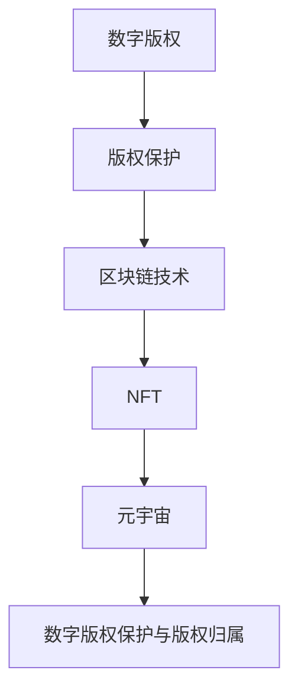

                 

数字版权、元宇宙、区块链、非同质化代币（NFT）、版权归属、版权保护、版权交易

## 1. 背景介绍

随着元宇宙的兴起，数字资产的价值和重要性日益凸显。其中，数字版权作为一种虚拟资产，其版权归属和保护问题变得尤为突出。本文将从技术角度出发，探讨元宇宙中的数字版权保护和版权归属的新形式。

## 2. 核心概念与联系

### 2.1 数字版权与版权保护

数字版权是指数字化的版权，它赋予版权所有者在数字环境中对其作品进行复制、发行、表演、展示、执行、广播、传输和通过信息网络向公众提供的独家权利。数字版权保护是指通过技术手段保护数字版权不受侵犯的措施。

### 2.2 区块链与非同质化代币（NFT）

区块链是一种去中心化的分布式账本技术，它具有透明、安全、不可篡改等特点。非同质化代币（NFT）是一种基于区块链技术的数字资产，它具有唯一性、不可替代性和可交易性等特点。NFT可以用来表示数字版权，从而实现数字版权的版权归属和保护。

### 2.3 元宇宙与数字版权

元宇宙是一个由数字化世界构成的虚拟宇宙，它将虚拟世界和现实世界连接起来。在元宇宙中，数字版权作为一种虚拟资产，其版权归属和保护问题变得尤为突出。通过区块链技术和NFT，可以实现元宇宙中的数字版权保护和版权归属的新形式。



## 3. 核心算法原理 & 具体操作步骤

### 3.1 算法原理概述

数字版权保护和版权归属的新形式，可以通过区块链技术和NFT来实现。具体而言，可以将数字版权作为NFT发行，并记录在区块链上。通过区块链的不可篡改性和透明性，可以实现数字版权的版权归属和保护。同时，通过NFT的唯一性和可交易性，可以实现数字版权的交易和转让。

### 3.2 算法步骤详解

1. 将数字版权作为NFT发行，并记录在区块链上。发行NFT时，需要指定NFT的所有者、版权所有者和版权信息等元数据。
2. 通过区块链的不可篡改性和透明性，实现数字版权的版权归属和保护。任何人都可以通过查询区块链来获取数字版权的版权信息和所有者信息。
3. 通过NFT的唯一性和可交易性，实现数字版权的交易和转让。数字版权的所有者可以通过出售NFT来转让数字版权，买家可以通过购买NFT来获得数字版权的所有权。

### 3.3 算法优缺点

优点：

* 通过区块链技术和NFT，可以实现数字版权的版权归属和保护，防止版权侵权。
* 通过NFT的唯一性和可交易性，可以实现数字版权的交易和转让，提高数字版权的流动性。
* 通过区块链的透明性，可以实现数字版权的公开性和可追溯性。

缺点：

* 区块链技术和NFT的应用还处于初级阶段，其安全性和可靠性还有待进一步提高。
* NFT的发行和交易需要支付一定的手续费，这可能会增加数字版权的交易成本。
* 当前的区块链技术和NFT还没有得到广泛的应用和认可，其法律效力还有待进一步确立。

### 3.4 算法应用领域

数字版权保护和版权归属的新形式，可以应用于各种数字资产的版权保护和交易，例如数字艺术品、数字音乐、数字视频等。此外，它还可以应用于虚拟世界中的数字资产，例如虚拟房产、虚拟服装等。

## 4. 数学模型和公式 & 详细讲解 & 举例说明

### 4.1 数学模型构建

数字版权保护和版权归属的新形式，可以通过区块链技术和NFT来实现。数学模型可以描述区块链技术和NFT的工作原理。例如，区块链技术可以通过有限状态机（FSM）模型来描述，NFT可以通过代币模型来描述。

### 4.2 公式推导过程

数字版权保护和版权归属的新形式，可以通过区块链技术和NFT来实现。公式可以描述区块链技术和NFT的工作原理。例如，区块链技术可以通过哈希函数来描述，NFT可以通过代币平衡方程来描述。

### 4.3 案例分析与讲解

例如，数字艺术品的版权保护和交易，可以通过区块链技术和NFT来实现。数字艺术品的版权所有者可以将其作为NFT发行，并记录在区块链上。买家可以通过购买NFT来获得数字艺术品的所有权。通过区块链的不可篡改性和透明性，可以实现数字艺术品的版权归属和保护。通过NFT的唯一性和可交易性，可以实现数字艺术品的交易和转让。

## 5. 项目实践：代码实例和详细解释说明

### 5.1 开发环境搭建

要实现数字版权保护和版权归属的新形式，需要搭建区块链开发环境。常用的区块链开发环境包括以太坊、EOS、Hyperledger Fabric等。本文以以太坊为例，介绍如何搭建区块链开发环境。

### 5.2 源代码详细实现

以下是一个简单的NFT合约代码实例，该合约定义了NFT的发行和转让功能。该合约使用Solidity语言编写，并部署在以太坊区块链上。

```solidity
// SPDX-License-Identifier: MIT
pragma solidity ^0.8.0;

import "@openzeppelin/contracts/token/ERC721/ERC721.sol";
import "@openzeppelin/contracts/utils/Counters.sol";
import "@openzeppelin/contracts/access/Ownable.sol";

contract MyNFT is ERC721, Ownable {
    using Counters for Counters.Counter;
    Counters.Counter private _tokenIds;

    string public constant name = "MyNFT";
    string public constant symbol = "MNFT";

    constructor() ERC721("MyNFT", "MNFT") {}

    function mint(string memory tokenURI) public onlyOwner returns (uint) {
        _tokenIds.increment();

        uint newItemId = _tokenIds.current;
        _mint(msg.sender, newItemId);
        _setTokenURI(newItemId, tokenURI);

        return newItemId;
    }

    function transferFrom(address from, address to, uint tokenId) public override {
        super.transferFrom(from, to, tokenId);
    }
}
```

### 5.3 代码解读与分析

该合约定义了NFT的发行和转让功能。合约使用OpenZeppelin库中的ERC721合约和Ownable合约，实现了NFT的标准功能。合约定义了mint函数，用于发行新的NFT。发行新的NFT时，需要指定NFT的URI，该URI指向NFT的元数据。合约还定义了transferFrom函数，用于转让NFT。转让NFT时，需要指定转让方、接收方和NFT的ID。

### 5.4 运行结果展示

部署该合约后，版权所有者可以调用mint函数来发行新的NFT。发行新的NFT时，需要指定NFT的URI，该URI指向NFT的元数据。版权所有者还可以调用transferFrom函数来转让NFT。转让NFT时，需要指定转让方、接收方和NFT的ID。通过查询区块链，任何人都可以获取NFT的版权信息和所有者信息。

## 6. 实际应用场景

### 6.1 数字艺术品版权保护

数字艺术品的版权保护是数字版权保护的一个重要应用场景。数字艺术品的版权所有者可以将其作为NFT发行，并记录在区块链上。买家可以通过购买NFT来获得数字艺术品的所有权。通过区块链的不可篡改性和透明性，可以实现数字艺术品的版权归属和保护。通过NFT的唯一性和可交易性，可以实现数字艺术品的交易和转让。

### 6.2 虚拟世界中的数字资产版权保护

虚拟世界中的数字资产，例如虚拟房产、虚拟服装等，其版权保护也是数字版权保护的一个重要应用场景。虚拟世界中的数字资产的版权所有者可以将其作为NFT发行，并记录在区块链上。买家可以通过购买NFT来获得虚拟世界中的数字资产的所有权。通过区块链的不可篡改性和透明性，可以实现虚拟世界中的数字资产的版权归属和保护。通过NFT的唯一性和可交易性，可以实现虚拟世界中的数字资产的交易和转让。

### 6.3 未来应用展望

随着元宇宙的兴起，数字版权保护和版权归属的新形式将变得越来越重要。未来，数字版权保护和版权归属的新形式将应用于更多的数字资产，例如虚拟世界中的数字资产、数字音乐、数字视频等。此外，数字版权保护和版权归属的新形式还将应用于跨境版权保护和版权交易，从而实现全球版权保护和版权交易的新形式。

## 7. 工具和资源推荐

### 7.1 学习资源推荐

* [以太坊白皮书](https://ethereum.org/en/whitepaper/)
* [Solidity语言文档](https://docs.soliditylang.org/en/latest/)
* [OpenZeppelin库](https://openzeppelin.com/)
* [区块链技术与应用](https://book.feixiaohao.com/detail/5e42442714955c0014409757)

### 7.2 开发工具推荐

* [Remix IDE](https://remix.ethereum.org/)
* [Truffle](https://truffleframework.com/)
* [Ganache](https://truffleframework.com/ganache)
* [MetaMask](https://metamask.io/)

### 7.3 相关论文推荐

* [ERC-721 Non-Fungible Token Standard](https://eips.ethereum.org/EIPS/eip-721)
* [A Non-Fungible Token Standard for DeFi](https://arxiv.org/abs/2007.05533)
* [Blockchain-based Digital Rights Management](https://ieeexplore.ieee.org/document/8454474)

## 8. 总结：未来发展趋势与挑战

### 8.1 研究成果总结

本文从技术角度出发，探讨了元宇宙中的数字版权保护和版权归属的新形式。通过区块链技术和NFT，可以实现数字版权的版权归属和保护。通过NFT的唯一性和可交易性，可以实现数字版权的交易和转让。本文还介绍了数字版权保护和版权归属的新形式的算法原理、数学模型和公式、项目实践和实际应用场景。

### 8.2 未来发展趋势

未来，数字版权保护和版权归属的新形式将变得越来越重要。随着元宇宙的兴起，数字版权保护和版权归属的新形式将应用于更多的数字资产，例如虚拟世界中的数字资产、数字音乐、数字视频等。此外，数字版权保护和版权归属的新形式还将应用于跨境版权保护和版权交易，从而实现全球版权保护和版权交易的新形式。

### 8.3 面临的挑战

数字版权保护和版权归属的新形式还面临着一些挑战。首先，区块链技术和NFT的应用还处于初级阶段，其安全性和可靠性还有待进一步提高。其次，NFT的发行和交易需要支付一定的手续费，这可能会增加数字版权的交易成本。再次，当前的区块链技术和NFT还没有得到广泛的应用和认可，其法律效力还有待进一步确立。

### 8.4 研究展望

未来，数字版权保护和版权归属的新形式的研究将朝着以下方向展开：

* 研究区块链技术和NFT的安全性和可靠性，提高数字版权保护和版权归属的新形式的安全性和可靠性。
* 研究降低NFT发行和交易成本的新方法，提高数字版权交易的便利性。
* 研究跨境版权保护和版权交易的新方法，实现全球版权保护和版权交易的新形式。
* 研究元宇宙中的数字版权保护和版权归属的新形式的法律效力，确立数字版权保护和版权归属的新形式的法律地位。

## 9. 附录：常见问题与解答

**Q1：什么是数字版权？**

数字版权是指数字化的版权，它赋予版权所有者在数字环境中对其作品进行复制、发行、表演、展示、执行、广播、传输和通过信息网络向公众提供的独家权利。

**Q2：什么是区块链技术？**

区块链是一种去中心化的分布式账本技术，它具有透明、安全、不可篡改等特点。

**Q3：什么是非同质化代币（NFT）？**

非同质化代币（NFT）是一种基于区块链技术的数字资产，它具有唯一性、不可替代性和可交易性等特点。NFT可以用来表示数字版权，从而实现数字版权的版权归属和保护。

**Q4：什么是元宇宙？**

元宇宙是一个由数字化世界构成的虚拟宇宙，它将虚拟世界和现实世界连接起来。

**Q5：数字版权保护和版权归属的新形式有哪些优缺点？**

优点：通过区块链技术和NFT，可以实现数字版权的版权归属和保护，防止版权侵权。通过NFT的唯一性和可交易性，可以实现数字版权的交易和转让，提高数字版权的流动性。通过区块链的透明性，可以实现数字版权的公开性和可追溯性。缺点：区块链技术和NFT的应用还处于初级阶段，其安全性和可靠性还有待进一步提高。NFT的发行和交易需要支付一定的手续费，这可能会增加数字版权的交易成本。当前的区块链技术和NFT还没有得到广泛的应用和认可，其法律效力还有待进一步确立。

**Q6：数字版权保护和版权归属的新形式有哪些应用场景？**

数字版权保护和版权归属的新形式可以应用于各种数字资产的版权保护和交易，例如数字艺术品、数字音乐、数字视频等。此外，它还可以应用于虚拟世界中的数字资产，例如虚拟房产、虚拟服装等。

**Q7：数字版权保护和版权归属的新形式面临哪些挑战？**

数字版权保护和版权归属的新形式面临的挑战包括：区块链技术和NFT的安全性和可靠性还有待进一步提高，NFT的发行和交易需要支付一定的手续费，当前的区块链技术和NFT还没有得到广泛的应用和认可，其法律效力还有待进一步确立。

**Q8：数字版权保护和版权归属的新形式的未来发展趋势是什么？**

未来，数字版权保护和版权归属的新形式将变得越来越重要。随着元宇宙的兴起，数字版权保护和版权归属的新形式将应用于更多的数字资产，例如虚拟世界中的数字资产、数字音乐、数字视频等。此外，数字版权保护和版权归属的新形式还将应用于跨境版权保护和版权交易，从而实现全球版权保护和版权交易的新形式。

**Q9：数字版权保护和版权归属的新形式的研究展望是什么？**

未来，数字版权保护和版权归属的新形式的研究将朝着以下方向展开：研究区块链技术和NFT的安全性和可靠性，研究降低NFT发行和交易成本的新方法，研究跨境版权保护和版权交易的新方法，研究元宇宙中的数字版权保护和版权归属的新形式的法律效力。

## 作者署名

作者：禅与计算机程序设计艺术 / Zen and the Art of Computer Programming

