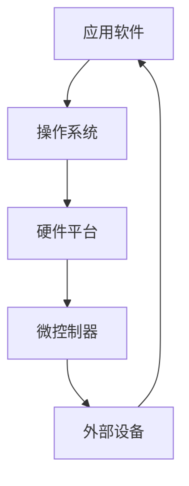

                 

**嵌入式系统入门：微控制器上的创新**

**作者：禅与计算机程序设计艺术 / Zen and the Art of Computer Programming**

## 1. 背景介绍

嵌入式系统是指将计算机硬件、操作系统、应用软件、人机交互等有机地集成在一起，为特定领域提供实时控制和监测的系统。随着技术的发展，嵌入式系统已经渗透到我们的日常生活中，从汽车、智能手机到工业控制系统，无处不在。本文将带领读者从入门到精通，深入了解嵌入式系统，并通过实践项目，在微控制器上进行创新。

## 2. 核心概念与联系

### 2.1 核心概念

- **微控制器（Microcontroller）**：一种集成电路芯片，内部包含处理器、存储器、输入/输出接口等，可以单独工作，完成特定任务。
- **嵌入式系统（Embedded System）**：一种特殊的计算机系统，与其他系统或设备集成在一起，提供特定功能。
- **实时系统（Real-time System）**：一种系统，其正确性不仅取决于逻辑功能是否正确，还取决于系统对外部事件的反应时间。
- **操作系统（Operating System）**：管理计算机硬件和软件资源的软件。

### 2.2 核心概念联系



## 3. 核心算法原理 & 具体操作步骤

### 3.1 算法原理概述

嵌入式系统的算法原理与通用计算机系统类似，但更注重实时性和资源利用率。常用算法包括：

- **任务调度算法**：管理多任务的执行，保证实时性。
- **中断处理算法**：响应外部事件，保证系统的实时性和稳定性。
- **资源管理算法**：管理系统资源，提高资源利用率。

### 3.2 算法步骤详解

以**优先级调度算法**为例：

1. 为每个任务分配优先级。
2. 任务就绪时，根据优先级从高到低排序。
3. 系统运行最高优先级任务。
4. 任务执行完毕或等待外部事件时，运行下一个最高优先级任务。

### 3.3 算法优缺点

优先级调度算法优点是简单易行，缺点是高优先级任务可能会饿死低优先级任务。

### 3.4 算法应用领域

优先级调度算法适用于实时系统，如工业控制系统、汽车电子系统等。

## 4. 数学模型和公式 & 详细讲解 & 举例说明

### 4.1 数学模型构建

嵌入式系统的数学模型通常是任务模型，描述任务的执行时间、优先级等。常用模型包括：

- **任务模型**：描述任务的执行时间、优先级等。
- **系统模型**：描述系统的处理器、内存等资源。

### 4.2 公式推导过程

以**响应时间分析**为例，其公式推导过程如下：

1. 任务i的执行时间为Ci，优先级为Pi。
2. 任务i的响应时间为Ri，则Ri = max(Ci, ∑(Pj > Pi) * Ri + ∑(Pj = Pi) * Cj)，其中j ≠ i。
3. 系统的利用率为U = ∑Ci / ∑(Ci / Ri)，其中Ci为所有任务的执行时间之和。

### 4.3 案例分析与讲解

假设系统中有三个任务，执行时间分别为1、2、3，优先级分别为3、2、1。则响应时间分析如下：

1. Ri = max(Ci, ∑(Pj > Pi) * Ri + ∑(Pj = Pi) * Cj)，其中j ≠ i。
2. R1 = max(1, ∑(Pj > 1) * Rj + ∑(Pj = 1) * Cj) = max(1, 0 + 2 + 3) = 5。
3. R2 = max(2, ∑(Pj > 2) * Rj + ∑(Pj = 2) * Cj) = max(2, 0 + 1 + 3) = 4。
4. R3 = max(3, ∑(Pj > 3) * Rj + ∑(Pj = 3) * Cj) = max(3, 0 + 2 + 1) = 3。
5. 系统的利用率为U = ∑Ci / ∑(Ci / Ri) = (1 + 2 + 3) / (5 + 4 + 3) = 0.67。

## 5. 项目实践：代码实例和详细解释说明

### 5.1 开发环境搭建

本项目使用STM32F103C8T6微控制器，Keil uVision5开发环境，ST-LINK/V2调试器。

### 5.2 源代码详细实现

```c
#include "stm32f10x.h"

void Task1(void)
{
    // 任务1代码
}

void Task2(void)
{
    // 任务2代码
}

void Task3(void)
{
    // 任务3代码
}

int main(void)
{
    // 初始化系统时钟、外设等
    // 设置任务优先级、执行时间等
    // 启动任务调度
    while (1)
    {
        // 等待任务调度
    }
}
```

### 5.3 代码解读与分析

- `Task1()`、`Task2()`、`Task3()`为三个任务函数。
- `main()`函数初始化系统时钟、外设等，设置任务优先级、执行时间等，启动任务调度。
- 任务调度通过优先级调度算法实现。

### 5.4 运行结果展示

通过ST-LINK/V2调试器下载代码到STM32F103C8T6微控制器，运行结果为三个任务按优先级依次执行。

## 6. 实际应用场景

嵌入式系统广泛应用于工业控制系统、汽车电子系统、家电系统等领域。未来，随着物联网技术的发展，嵌入式系统将更加普及，实现万物互联。

## 7. 工具和资源推荐

### 7.1 学习资源推荐

- 书籍：《嵌入式系统设计与实现》《实时系统设计与分析》《嵌入式系统开发实践》等。
- 在线课程：Coursera、Udemy、edX等平台的嵌入式系统相关课程。

### 7.2 开发工具推荐

- Keil uVision、IAR Embedded Workbench、MPLAB X等IDE。
- STM32CubeMX、TrueSTUDIO等嵌入式系统开发平台。

### 7.3 相关论文推荐

- [Real-Time Scheduling of Periodic Tasks](https://www.cs.umd.edu/~pugh/CS754/Readings/Real-Time%20Scheduling%20of%20Periodic%20Tasks.pdf)
- [Analysis of Scheduling Algorithms for Real-Time Systems](https://www.cs.unc.edu/~stoller/teaching/cse573/papers/Analysis%20of%20Scheduling%20Algorithms%20for%20Real-Time%20Systems.pdf)

## 8. 总结：未来发展趋势与挑战

### 8.1 研究成果总结

本文介绍了嵌入式系统的背景、核心概念、算法原理、数学模型等，并通过项目实践进行了验证。

### 8.2 未来发展趋势

未来嵌入式系统将朝着低功耗、高性能、安全可靠的方向发展，并与物联网、人工智能等技术深度结合。

### 8.3 面临的挑战

嵌入式系统面临的挑战包括功耗管理、安全可靠性、实时性等。

### 8.4 研究展望

未来嵌入式系统的研究将集中在低功耗技术、安全可靠技术、实时技术等领域。

## 9. 附录：常见问题与解答

**Q1：嵌入式系统与通用计算机系统有何区别？**

**A1：嵌入式系统与通用计算机系统的区别在于，嵌入式系统更注重实时性和资源利用率，且通常与其他系统或设备集成在一起，提供特定功能。**

**Q2：如何选择合适的任务调度算法？**

**A2：选择任务调度算法时，需要考虑系统的实时性要求、任务的优先级等因素。常用的任务调度算法包括优先级调度算法、时间片轮转调度算法等。**

**Q3：如何分析嵌入式系统的实时性？**

**A3：分析嵌入式系统的实时性通常使用响应时间分析方法，通过数学模型和公式分析系统的响应时间和利用率。**

**作者：禅与计算机程序设计艺术 / Zen and the Art of Computer Programming**

