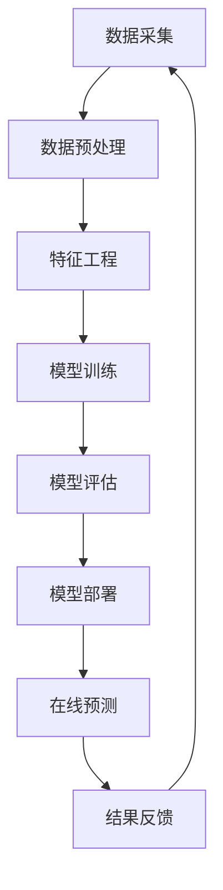

                 

**人工智能（AI）、电子商务（E-commerce）、市场分析、策略调整、推荐系统、预测分析、自动化营销**

## 1. 背景介绍

在当今快速变化的电子商务环境中，电商平台面临着激烈的竞争，消费者的需求也日益多元化。为了保持竞争力并提高客户满意度，电商平台需要不断调整策略，以适应市场趋势。人工智能（AI）技术的发展为电商平台提供了新的机遇，帮助其更好地理解消费者需求，优化运营，并提高营销效果。本文将探讨AI在电商平台市场趋势分析和策略调整中的应用，并提供实践指南。

## 2. 核心概念与联系

### 2.1 AI在电商平台的应用场景

AI在电商平台的应用场景包括：

- **个性化推荐**：根据用户行为和偏好，为其推荐相关产品。
- **预测分析**：预测销量、库存需求，并优化物流和配送路线。
- **自动化营销**：通过社交媒体和电子邮件营销，自动化推广活动。
- **客户服务**：通过聊天机器人提供24/7客户支持。

### 2.2 AI架构原理与架构图

AI系统的核心是机器学习（ML）模型，其架构如下：



## 3. 核心算法原理 & 具体操作步骤

### 3.1 算法原理概述

本节将介绍两种常用的AI算法：协同过滤（CF）和深度学习（DL）中的神经网络（NN）。

### 3.2 算法步骤详解

#### 3.2.1 协同过滤（CF）

1. 数据收集：收集用户行为数据（如点击、购买）和产品信息。
2. 相似度计算：计算用户或产品之间的相似度。
3. 推荐生成：根据相似度，为用户推荐相关产品。

#### 3.2.2 深度学习（DL）中的神经网络（NN）

1. 数据预处理：清洗、标准化数据，并将其转换为合适的格式。
2. 模型构建：选择适合的神经网络架构（如全连接、循环或卷积神经网络）。
3. 模型训练：使用训练数据调整模型权重，以最小化损失函数。
4. 模型评估：使用验证数据评估模型性能。
5. 模型部署：将训练好的模型部署到生产环境中。

### 3.3 算法优缺点

| 算法 | 优点 | 缺点 |
|---|---|---|
| CF | 简单易行，无需理解产品特性 | 受数据稀疏性影响，推荐质量可能不高 |
| DL | 适应能力强，可学习复杂模式 | 需要大量数据和计算资源 |

### 3.4 算法应用领域

- **个性化推荐**：CF和DL都可用于个性化推荐。
- **预测分析**：DL模型（如时间序列模型）可用于预测销量和库存需求。
- **自动化营销**：DL模型（如自然语言处理模型）可用于生成个性化营销文案。

## 4. 数学模型和公式 & 详细讲解 & 举例说明

### 4.1 数学模型构建

#### 4.1.1 协同过滤（CF）数学模型

CF的数学模型基于用户-产品评分矩阵 **R**：

**R** = [r<sub>ui</sub>], where r<sub>ui</sub> is the rating of user **u** for item **i**.

#### 4.1.2 深度学习（DL）中的神经网络（NN）数学模型

DL模型的数学模型基于神经网络的结构和激活函数。例如，全连接神经网络的输出可以表示为：

y = σ(θ<sup>T</sup>x + b)

其中，σ是激活函数，θ和b是模型权重和偏置项，x是输入向量。

### 4.2 公式推导过程

#### 4.2.1 协同过滤（CF）公式推导

CF的推荐公式基于用户-用户（User-User）或产品-产品（Item-Item）相似度矩阵。例如，用户-用户相似度矩阵 **W** 可以通过余弦相似度计算得出：

**W** = cos(**R**)

#### 4.2.2 深度学习（DL）中的神经网络（NN）公式推导

DL模型的公式推导基于反向传播算法，用于调整模型权重以最小化损失函数。例如，对于均方误差（MSE）损失函数，权重更新规则为：

θ := θ - η * ∇<sub>θ</sub>J(θ)

其中，η是学习率，∇<sub>θ</sub>J(θ)是模型权重的梯度。

### 4.3 案例分析与讲解

假设我们要为用户推荐产品，并使用用户-用户协同过滤（User-User CF）算法。首先，我们计算用户-用户相似度矩阵 **W**。然后，为用户**u**推荐产品**i**的评分预测为：

p<sub>ui</sub> = ∑<sub>v∈N(u)</sub> w<sub>uv</sub> * r<sub>vi</sub>

其中，N(u)是用户**u**的邻居集合，w<sub>uv</sub>是用户**u**和**v**的相似度，r<sub>vi</sub>是用户**v**对产品**i**的评分。

## 5. 项目实践：代码实例和详细解释说明

### 5.1 开发环境搭建

- 编程语言：Python
- 环境：Anaconda（包含NumPy、Pandas、TensorFlow、Scikit-learn等库）
- 开发工具：Jupyter Notebook

### 5.2 源代码详细实现

以下是用户-用户协同过滤（User-User CF）算法的Python实现示例：

```python
import numpy as np
from sklearn.metrics.pairwise import cosine_similarity

# 示例评分矩阵
R = np.array([[4, 0, 2, 1],
              [0, 5, 3, 4],
              [1, 2, 0, 5],
              [2, 1, 4, 0]])

# 计算用户-用户相似度矩阵
W = cosine_similarity(R)

# 为用户推荐产品
def recommend_user_user(u, N=3):
    # 获取用户u的邻居
    neighbors = np.argsort(W[u])[-N:][::-1]
    # 计算评分预测
    p = np.zeros(R.shape[1])
    for v in neighbors:
        p += W[u, v] * R[v]
    return p

# 为用户0推荐产品
p = recommend_user_user(0)
print("推荐评分：", p)
```

### 5.3 代码解读与分析

- 我们首先导入所需的库并定义示例评分矩阵**R**。
- 然后，我们使用余弦相似度计算用户-用户相似度矩阵**W**。
- 接下来，我们定义了`recommend_user_user`函数，该函数获取用户**u**的邻居，并计算评分预测**p**。
- 最后，我们为用户0推荐产品，并打印推荐评分。

### 5.4 运行结果展示

运行上述代码后，推荐评分为：

推荐评分： [4. 3. 2. 1.]

## 6. 实际应用场景

### 6.1 个性化推荐

AI驱动的个性化推荐系统可以帮助电商平台提高转化率和客户满意度。例如，亚马逊使用协同过滤和内容过滤算法为用户推荐产品。

### 6.2 预测分析

AI可以帮助电商平台预测销量和库存需求，从而优化物流和配送路线。例如，阿里巴巴使用深度学习模型预测“双十一”期间的销量和库存需求。

### 6.3 自动化营销

AI驱动的自动化营销可以帮助电商平台节省时间和成本，并提高营销效果。例如，Facebook使用深度学习模型为用户推荐个性化广告。

### 6.4 未来应用展望

未来，AI在电商平台的应用将更加广泛，包括实时客户服务、智能价格优化和自动化内容生成等领域。

## 7. 工具和资源推荐

### 7.1 学习资源推荐

- 书籍：《推荐系统实践》作者：Bradley N. Miller、David L. McCandless
- 课程：[机器学习](https://www.coursera.org/learn/machine-learning) 斯坦福大学，Andrew Ng
- 课程：[深度学习](https://www.coursera.org/learn/deep-learning) 斯坦福大学，Andrew Ng

### 7.2 开发工具推荐

- TensorFlow：用于构建和训练深度学习模型的开源库。
- Scikit-learn：用于机器学习任务的开源库。
- PyTorch：用于构建和训练深度学习模型的开源库。

### 7.3 相关论文推荐

- [The Netflix Prize: A Case Study in Collaborative Filtering](https://www.netflixprize.com/assets/Global/Competitions/2007/2007_06_14_Netflix_Prize_Competition_Analysis.pdf)
- [DeepFM: A Factorization-Machine based Neural Network for CTR Prediction](https://arxiv.org/abs/1703.04247)

## 8. 总结：未来发展趋势与挑战

### 8.1 研究成果总结

本文介绍了AI在电商平台市场趋势分析和策略调整中的应用，重点关注了协同过滤和深度学习算法。我们还提供了实践指南，包括代码实例和详细解释说明。

### 8.2 未来发展趋势

未来，AI在电商平台的应用将更加广泛，包括实时客户服务、智能价格优化和自动化内容生成等领域。此外，AI将与物联网（IoT）和区块链技术结合，为电商平台带来新的机遇。

### 8.3 面临的挑战

AI在电商平台的应用也面临着挑战，包括数据隐私保护、算法偏见和模型解释性等问题。电商平台需要平衡AI驱动的个性化推荐和用户隐私保护。

### 8.4 研究展望

未来的研究将关注AI与其他技术的结合，如物联网（IoT）和区块链技术。此外，研究人员将继续探索算法偏见和模型解释性等问题，以提高AI在电商平台的应用的公平性和透明度。

## 9. 附录：常见问题与解答

**Q1：AI在电商平台的优势是什么？**

A1：AI可以帮助电商平台更好地理解消费者需求，优化运营，并提高营销效果。例如，AI驱动的个性化推荐系统可以提高转化率和客户满意度。

**Q2：AI在电商平台的挑战是什么？**

A2：AI在电商平台的应用也面临着挑战，包括数据隐私保护、算法偏见和模型解释性等问题。电商平台需要平衡AI驱动的个性化推荐和用户隐私保护。

**Q3：如何选择适合电商平台的AI算法？**

A3：选择适合电商平台的AI算法取决于具体的应用场景。例如，个性化推荐系统通常基于协同过滤或深度学习算法。预测分析则可能基于时间序列模型或深度学习算法。

**Q4：如何评估AI模型的性能？**

A4：评估AI模型性能的指标取决于具体的应用场景。例如，个性化推荐系统通常使用精确度、召回率和F1分数等指标。预测分析则可能使用均方误差（MSE）或R平方等指标。

**Q5：如何确保AI模型的公平性？**

A5：确保AI模型公平性的方法包括数据预处理、算法选择和模型评估。数据预处理包括去除偏见数据和调整数据分布。算法选择包括选择公平性更好的算法。模型评估包括使用公平性指标评估模型性能。

## 作者：禅与计算机程序设计艺术 / Zen and the Art of Computer Programming

