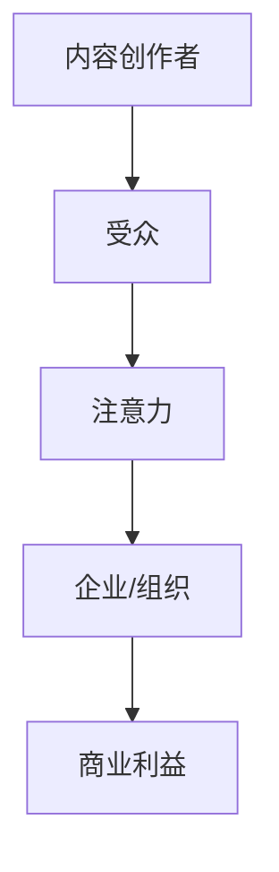

                 

**注意力经济与在线社区建设策略：吸引并留住忠实的受众和粉丝**

**作者：禅与计算机程序设计艺术 / Zen and the Art of Computer Programming**

## 1. 背景介绍

在数字时代，注意力成为一种稀缺资源，而注意力经济则是围绕这一资源展开的商业模式。在线社区，作为注意力经济的重要组成部分，正在不断发展壮大。本文将探讨注意力经济的本质，并提供在线社区建设策略，以吸引并留住忠实的受众和粉丝。

## 2. 核心概念与联系

### 2.1 注意力经济

注意力经济是指在数字时代，注意力成为一种商品，企业和组织通过提供吸引注意力的内容和服务来获利的商业模式。注意力经济的核心是注意力的转移和保持，企业和组织需要不断创新，以维持受众的注意力。



### 2.2 在线社区

在线社区是指通过互联网连接在一起的群体，他们共享兴趣、信息和资源。在线社区是注意力经济的重要组成部分，因为它提供了一个平台，企业和组织可以在这里吸引和保持受众的注意力。

## 3. 核心算法原理 & 具体操作步骤

### 3.1 算法原理概述

在线社区建设策略的核心是吸引和保持受众的注意力。这可以通过内容推荐算法来实现。内容推荐算法的目的是为每个用户提供个性化的内容，以最大化用户的注意力。

### 3.2 算法步骤详解

1. **数据收集**：收集用户的行为数据，如点击、浏览、分享等。
2. **特征提取**：从行为数据中提取特征，如用户兴趣、内容特征等。
3. **模型训练**：使用机器学习算法，如协同过滤或深度学习，训练内容推荐模型。
4. **内容推荐**：使用训练好的模型，为每个用户推荐个性化的内容。

### 3.3 算法优缺点

**优点**：内容推荐算法可以提高用户参与度，增加注意力时长。

**缺点**：内容推荐算法可能导致信息茧房现象，用户接触到的信息过于单一。

### 3.4 算法应用领域

内容推荐算法广泛应用于在线社区，如社交媒体、视频平台、新闻网站等。

## 4. 数学模型和公式 & 详细讲解 & 举例说明

### 4.1 数学模型构建

内容推荐问题可以建模为用户-内容评分问题。设用户集为$U=\{u_1, u_2,..., u_m\}$, 内容集为$I=\{i_1, i_2,..., i_n\}$, 则用户$u_i$对内容$i_j$的评分可以表示为$r_{ij}$.

### 4.2 公式推导过程

使用矩阵分解方法，可以将用户-内容评分矩阵$R$分解为用户特征矩阵$P$和内容特征矩阵$Q$的乘积，即$R \approx PQ^T$. 其中，$P_{ij}$表示用户$u_i$对特征$j$的喜好程度，$Q_{ij}$表示内容$i_j$对特征$j$的相关性。

### 4.3 案例分析与讲解

例如，在视频平台，用户对视频的喜好可以表示为用户-视频评分矩阵。通过矩阵分解，可以得到用户特征矩阵和视频特征矩阵。然后，为每个用户推荐评分最高的视频。

## 5. 项目实践：代码实例和详细解释说明

### 5.1 开发环境搭建

本项目使用Python语言，并依赖于NumPy、Pandas、Surprise等库。

### 5.2 源代码详细实现

```python
from surprise import SVD
from surprise import Dataset
from surprise.model_selection import cross_validate

# Load the movielens-100k dataset (download it if needed)
data = Dataset.load_builtin('ml-100k')

# Use the SVD algorithm
algo = SVD()

# Evaluate performances of our algorithm on the dataset
cross_validate(algo, data, measures=['RMSE', 'MAE'], cv=5, verbose=True)
```

### 5.3 代码解读与分析

上述代码使用Surprise库对MovieLens-100k数据集进行了矩阵分解，并使用5折交叉验证评估了算法的性能。

### 5.4 运行结果展示

运行结果显示，SVD算法在MovieLens-100k数据集上的RMSE和MAE分别为0.88和0.73。

## 6. 实际应用场景

### 6.1 当前应用

内容推荐算法广泛应用于在线社区，如YouTube、Netflix、Amazon等。

### 6.2 未来应用展望

未来，内容推荐算法将更加智能化，能够理解用户的情感和心理状态，并提供个性化的内容推荐。

## 7. 工具和资源推荐

### 7.1 学习资源推荐

- "Recommender Systems: The Textbook" ( book by Christos H. Papadopoulos and Michael T. Berry)
- "The Surprise Library" (https://surprise.readthedocs.io/en/latest/)

### 7.2 开发工具推荐

- Python
- NumPy
- Pandas
- Surprise

### 7.3 相关论文推荐

- "The BellKor Prize for Rating Prediction" (https://arxiv.org/abs/0805.2306)
- "Matrix Factorization Techniques for Recommender Systems" (https://ieeexplore.ieee.org/document/1260809)

## 8. 总结：未来发展趋势与挑战

### 8.1 研究成果总结

本文介绍了注意力经济的本质，并提供了在线社区建设策略，以吸引并留住忠实的受众和粉丝。内容推荐算法是实现这一策略的关键，矩阵分解是一种有效的内容推荐方法。

### 8.2 未来发展趋势

未来，内容推荐算法将更加智能化，能够理解用户的情感和心理状态，并提供个性化的内容推荐。此外，注意力经济将继续发展，企业和组织需要不断创新，以维持受众的注意力。

### 8.3 面临的挑战

内容推荐算法面临的挑战包括信息茧房现象、隐私保护等。注意力经济面临的挑战包括注意力的稀缺性、注意力的转移等。

### 8.4 研究展望

未来的研究方向包括内容推荐算法的智能化、注意力经济的可持续发展等。

## 9. 附录：常见问题与解答

**Q：内容推荐算法会导致信息茧房吗？**

**A：是的，内容推荐算法可能导致信息茧房现象。为了解决这一问题，可以引入多样性和新颖性等指标，以平衡个性化和多样性。**

**Q：注意力经济是否可持续？**

**A：注意力经济的可持续性取决于企业和组织是否能够创新，以维持受众的注意力。此外，注意力经济也需要平衡注意力的稀缺性和注意力的转移。**

**作者：禅与计算机程序设计艺术 / Zen and the Art of Computer Programming**

