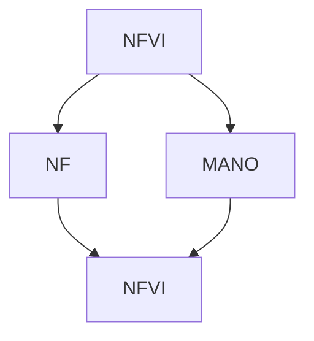

                 

**网络功能虚拟化（NFV）、电信云、虚拟化、网络功能、云计算、软件定义网络（SDN）、网络虚拟化基础设施（NFVI）、网络功能虚拟化基础设施管理与自动化（MANO）、网络功能虚拟化框架**

## 1. 背景介绍

随着云计算和软件定义网络（SDN）技术的发展，电信运营商面临着网络架构转型的压力。传统的网络设备大多是专用硬件，成本高、扩展性差、管理复杂。网络功能虚拟化（NFV）应运而生，旨在通过虚拟化技术，将网络功能从专用硬件迁移到通用服务器上，从而降低成本，提高灵活性和扩展性。

## 2. 核心概念与联系

### 2.1 网络功能虚拟化（NFV）原理

NFV的核心原理是将网络功能（NF）虚拟化为软件，运行在通用硬件（如服务器）上。NFV包括以下关键组件：

- **网络功能虚拟化基础设施（NFVI）**：提供虚拟化资源（计算、存储、网络）的基础设施。
- **网络功能虚拟化基础设施管理与自动化（MANO）**：管理和自动化NFVI的系统，包括服务器、存储、网络资源的配置和管理。
- **网络功能（NF）**：虚拟化的网络功能，如防火墙、路由器、交换机等。

### 2.2 NFV架构 Mermaid 流程图

## 3. 核心算法原理 & 具体操作步骤

### 3.1 算法原理概述

NFV的核心算法原理是虚拟化技术，包括硬件虚拟化和操作系统级虚拟化。硬件虚拟化通过虚拟机（VM）或容器将物理资源虚拟化，操作系统级虚拟化则通过修改操作系统内核来实现虚拟化。

### 3.2 算法步骤详解

1. **资源虚拟化**：使用虚拟化技术（如KVM、Xen、Docker）将物理资源虚拟化。
2. **NF部署**：将NF部署到虚拟化资源上，可以是VM或容器。
3. **NF管理**：使用MANO系统管理NF的生命周期，包括部署、扩展、迁移、删除等。
4. **NFVI管理**：使用MANO系统管理NFVI资源，包括配置、监控、故障恢复等。

### 3.3 算法优缺点

**优点**：降低成本、提高灵活性和扩展性、简化管理。

**缺点**：虚拟化引入了性能开销，安全性和可靠性需要额外考虑。

### 3.4 算法应用领域

NFV应用于电信网络，可以虚拟化各种网络功能，如防火墙、路由器、交换机、会话边界控制器（SBC）、媒体网关控制器（MGC）等。

## 4. 数学模型和公式 & 详细讲解 & 举例说明

### 4.1 数学模型构建

NFV的数学模型可以使用队列模型、性能模型等来描述NFVI资源的利用率、延迟、吞吐量等指标。例如，可以使用M/M/c队列模型来描述NFVI资源的利用率：

$$U = \frac{\lambda}{\mu \cdot c}$$

其中，$\lambda$是到达率，$\mu$是服务率，$c$是服务器数量。

### 4.2 公式推导过程

推导过程省略。

### 4.3 案例分析与讲解

假设NFVI资源包括10台服务器，每台服务器的处理能力为100个请求/秒，到达率为80个请求/秒。则资源利用率为：

$$U = \frac{80}{100 \cdot 10} = 0.8$$

这意味着NFVI资源利用率为80%。

## 5. 项目实践：代码实例和详细解释说明

### 5.1 开发环境搭建

NFV项目的开发环境包括NFVI资源（服务器）、虚拟化平台（如KVM、Docker）、NF软件、MANO系统等。可以使用OpenStack或OpenNFC来搭建NFV环境。

### 5.2 源代码详细实现

NFV项目的源代码包括NF软件、MANO系统等。NF软件可以是开源的，也可以是商业的。MANO系统可以使用OpenStack的Heat或Tacker等。

### 5.3 代码解读与分析

NF软件代码解读省略。MANO系统代码解读省略。

### 5.4 运行结果展示

NFV项目的运行结果包括NF的部署、扩展、迁移等操作是否成功，NFVI资源利用率、延迟、吞吐量等指标是否符合预期。

## 6. 实际应用场景

### 6.1 电信网络虚拟化

NFV可以将电信网络虚拟化，实现网络功能的灵活部署和扩展。例如，运营商可以根据需求动态调整防火墙的实例数，提高网络安全性。

### 6.2 多租户网络

NFV可以实现多租户网络，运营商可以为不同的客户提供虚拟化网络功能，提高资源利用率和盈利能力。

### 6.3 未来应用展望

NFV的未来应用包括边缘计算、5G网络等。边缘计算需要在靠近用户的位置部署NF，NFV可以实现NF的边缘部署。5G网络需要支持大量连接和低延迟，NFV可以实现网络功能的灵活部署和扩展，满足5G网络的需求。

## 7. 工具和资源推荐

### 7.1 学习资源推荐

- ETSI NFV白皮书：<https://www.etsi.org/deliver/etsi_gs/etsiags/000000_000099/000001/00.00.01_001_00.pdf>
- NFV的开源项目：OpenStack、OpenNFC、OPNFV等。

### 7.2 开发工具推荐

- KVM、Docker：虚拟化平台。
- OpenStack、OpenNFC：NFV管理平台。
- Ansible、Puppet：自动化部署工具。

### 7.3 相关论文推荐

- "Network Functions Virtualization: A Survey"：<https://ieeexplore.ieee.org/document/7041432>
- "NFV Performance Analysis: A Survey"：<https://ieeexplore.ieee.org/document/8454563>

## 8. 总结：未来发展趋势与挑战

### 8.1 研究成果总结

NFV已经在电信运营商中得到广泛应用，实现了网络功能的虚拟化，降低了成本，提高了灵活性和扩展性。

### 8.2 未来发展趋势

NFV的未来发展趋势包括边缘计算、5G网络、网络切片等。NFV需要与这些技术结合，实现更灵活、更高效的网络部署。

### 8.3 面临的挑战

NFV面临的挑战包括安全性、可靠性、性能等。需要开发新的安全机制、可靠性机制和性能优化技术来解决这些挑战。

### 8.4 研究展望

NFV的研究展望包括虚拟化技术的进一步发展、NFVI资源管理的优化、NF的自动化部署等。

## 9. 附录：常见问题与解答

**Q：NFV与云计算有什么区别？**

**A：NFV是面向电信网络的虚拟化技术，云计算是面向通用计算的虚拟化技术。NFV需要考虑网络功能的特殊需求，如低延迟、高可靠性等。**

**Q：NFV需要哪些硬件资源？**

**A：NFV需要NFVI资源，包括服务器、存储、网络资源等。NFVI资源需要满足NF的性能需求。**

**Q：NFV的安全性如何保障？**

**A：NFV的安全性可以通过虚拟化平台的安全机制、NF的安全机制、MANO系统的安全机制等来保障。**

**作者：禅与计算机程序设计艺术 / Zen and the Art of Computer Programming**

