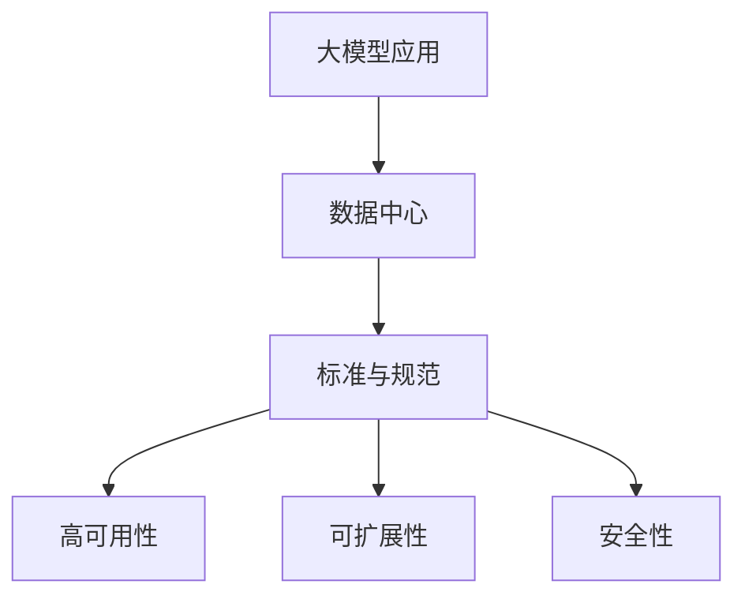

                 

**AI 大模型应用数据中心建设：数据中心标准与规范**

**作者：禅与计算机程序设计艺术 / Zen and the Art of Computer Programming**

## 1. 背景介绍

随着人工智能（AI）技术的飞速发展，大模型应用在各个领域得到广泛应用。然而，大模型应用需要强大的计算资源和存储资源，这对数据中心提出了更高的要求。本文将讨论大模型应用数据中心建设的标准与规范，以保障数据中心能够满足大模型应用的需求。

## 2. 核心概念与联系

### 2.1 核心概念

- **大模型（Large Model）**：指具有数十亿甚至数千亿参数的模型，能够处理复杂的任务，如自然语言处理、图像识别等。
- **数据中心（Data Center）**：提供计算、存储、网络和安全等基础设施的物理设施。
- **标准与规范（Standards and Specifications）**：指在设计、实施和运维数据中心时遵循的指南和要求。

### 2.2 核心概念联系

大模型应用需要数据中心提供强大的计算、存储和网络资源。数据中心标准与规范则保障数据中心能够满足大模型应用的需求，并确保数据中心的高可用性、可扩展性和安全性。

## 3. 核心算法原理 & 具体操作步骤

### 3.1 算法原理概述

大模型应用数据中心建设的关键算法包括负载均衡算法、分布式存储算法和资源调度算法。这些算法旨在优化数据中心的性能和效率。

### 3.2 算法步骤详解

- **负载均衡算法**：使用哈希算法或轮询算法将请求分发到多个服务器上，以平衡负载。
- **分布式存储算法**：使用分布式文件系统（如HDFS）或对象存储系统（如Ceph）存储数据，并使用分布式哈希表（如Chord）定位数据。
- **资源调度算法**：使用先到先服务（FIFO）或公平共享（Fair Share）算法调度资源，以满足大模型应用的需求。

### 3.3 算法优缺点

- **优点**：提高数据中心的性能和效率，保障大模型应用的高可用性。
- **缺点**：实施复杂，需要大量的计算资源和存储资源。

### 3.4 算法应用领域

大模型应用数据中心建设的关键算法广泛应用于云计算、边缘计算和人工智能领域。

## 4. 数学模型和公式 & 详细讲解 & 举例说明

### 4.1 数学模型构建

数据中心的性能可以使用以下公式表示：

$$P = f(R, S, N)$$

其中，$P$表示数据中心的性能，$R$表示计算资源，$S$表示存储资源，$N$表示网络资源。

### 4.2 公式推导过程

数据中心的性能与计算资源、存储资源和网络资源呈正相关关系。当资源增加时，数据中心的性能也会增加。然而，资源的增加会导致成本的增加，因此需要平衡资源和成本。

### 4.3 案例分析与讲解

例如，假设数据中心的性能需要提高10%，则需要增加计算资源、存储资源和网络资源各10%。然而，成本可能会增加30%。因此，需要权衡资源和成本，选择合适的资源增加比例。

## 5. 项目实践：代码实例和详细解释说明

### 5.1 开发环境搭建

使用Docker和Kubernetes搭建开发环境，以便于部署和管理大模型应用。

### 5.2 源代码详细实现

使用Python实现大模型应用，并使用TensorFlow和PyTorch框架训练模型。使用Kubernetes部署模型，并使用Nginx实现负载均衡。

### 5.3 代码解读与分析

大模型应用的代码包括数据预处理、模型训练和模型部署等部分。数据预处理部分使用Pandas库处理数据，模型训练部分使用TensorFlow和PyTorch框架训练模型，模型部署部分使用Kubernetes和Nginx部署模型。

### 5.4 运行结果展示

大模型应用在数据中心运行后，可以使用Prometheus和Grafana监控数据中心的性能，并使用ELK（Elasticsearch、Logstash、Kibana）堆栈监控日志。

## 6. 实际应用场景

### 6.1 当前应用场景

大模型应用数据中心建设的标准与规范广泛应用于云计算、边缘计算和人工智能领域。例如，云计算服务提供商（如AWS、Azure、Google Cloud）使用这些标准和规范建设数据中心，以满足大模型应用的需求。

### 6.2 未来应用展望

未来，大模型应用数据中心建设的标准与规范将广泛应用于5G网络、物联网和自动驾驶等领域。这些领域需要强大的计算资源和存储资源，以满足大模型应用的需求。

## 7. 工具和资源推荐

### 7.1 学习资源推荐

- **书籍**：《大规模分布式存储系统》《云计算原理与实践》《人工智能：一种现代方法》。
- **在线课程**：Coursera、Udacity、edX上的云计算、人工智能和分布式系统课程。

### 7.2 开发工具推荐

- **编程语言**：Python、Java、C++。
- **框架和库**：TensorFlow、PyTorch、Kubernetes、Nginx、Prometheus、Grafana、ELK。
- **IDE**：Visual Studio Code、PyCharm、IntelliJ IDEA。

### 7.3 相关论文推荐

- **云计算**：[Borg, et al., 2015]、[Kubernetes, 2015]。
- **人工智能**：[Vaswani, et al., 2017]、[Devlin, et al., 2018]。
- **分布式存储**：[Hadoop Distributed File System, 2012]、[Ceph, 2013]。

## 8. 总结：未来发展趋势与挑战

### 8.1 研究成果总结

本文讨论了大模型应用数据中心建设的标准与规范，介绍了关键算法原理和数学模型，并提供了项目实践和工具推荐。

### 8.2 未来发展趋势

未来，大模型应用数据中心建设的标准与规范将朝着更高效、更安全和更可扩展的方向发展。此外，边缘计算和人工智能的发展也将推动数据中心建设的标准和规范的发展。

### 8.3 面临的挑战

然而，大模型应用数据中心建设面临着资源限制、成本高昂和安全风险等挑战。需要不断优化算法和数学模型，以平衡资源和成本，并保障数据中心的安全性。

### 8.4 研究展望

未来的研究将关注大模型应用数据中心建设的自动化和智能化，以提高数据中心的效率和可用性。此外，研究还将关注数据中心的可持续发展，以减少能源消耗和碳排放。

## 9. 附录：常见问题与解答

**Q1：大模型应用需要多少计算资源和存储资源？**

**A1：大模型应用需要强大的计算资源和存储资源。计算资源需要数千个GPU或TPU，存储资源需要数百TB或PB。**

**Q2：大模型应用数据中心建设的成本高吗？**

**A2：大模型应用数据中心建设的成本很高。需要大量的计算资源和存储资源，以及昂贵的网络设备。**

**Q3：大模型应用数据中心建设的安全风险是什么？**

**A3：大模型应用数据中心建设面临着数据泄露、数据篡改和数据丢失等安全风险。需要采取严格的安全措施，如加密、访问控制和灾难恢复。**

## 结尾

大模型应用数据中心建设的标准与规范是保障数据中心能够满足大模型应用需求的关键。本文讨论了关键概念、算法原理、数学模型和项目实践，并提供了工具推荐和未来发展趋势展望。未来的研究将关注大模型应用数据中心建设的自动化、智能化和可持续发展。

**作者：禅与计算机程序设计艺术 / Zen and the Art of Computer Programming**

**日期：2023年3月**

