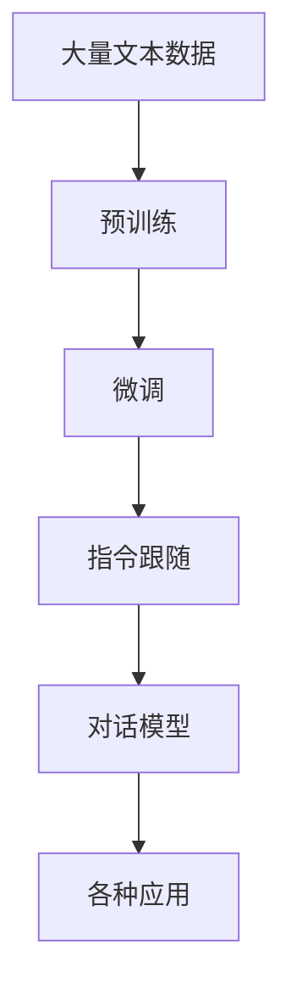

                 

**AI大模型创业：如何实现未来盈利？**

**作者：禅与计算机程序设计艺术 / Zen and the Art of Computer Programming**

## 1. 背景介绍

当前，人工智能（AI）和大模型（LLM）正在各行各业引发革命。这些模型在理解、生成和处理人类语言方面取得了惊人的进展，为各种应用提供了新的可能性。然而，如何将这些技术转化为成功的创业项目并实现盈利，仍然是一个挑战。本文将探讨AI大模型创业的关键因素，提供指南帮助创业者成功创立并运营基于大模型的企业。

## 2. 核心概念与联系

### 2.1 AI大模型的定义

AI大模型是一种人工神经网络，通过学习大量文本数据来理解和生成人类语言。它们具有广泛的理解和推理能力，可以应用于各种任务，如文本生成、翻译、问答系统和代码生成等。

### 2.2 关键概念

- **预训练（Pre-training）**：大模型在学习大量文本数据之前，没有特定的任务或标签。
- **微调（Fine-tuning）**：在预训练之后，大模型可以在特定任务上进行微调，以改善其性能。
- **指令跟随（Instruction following）**：大模型可以理解和执行特定的指令，以生成所需的输出。
- **对话模型（Dialog models）**：大模型可以参与对话，模拟人类与人交流的方式。

### 2.3 核心概念联系图

## 3. 核心算法原理 & 具体操作步骤

### 3.1 算法原理概述

大模型的核心是Transformer架构（Vaswani et al., 2017），它使用自注意力机制（Self-attention）来处理输入序列。大模型通过在Transformer上进行预训练和微调，学习理解和生成人类语言的能力。

### 3.2 算法步骤详解

1. **数据收集**：收集大量的文本数据，用于预训练大模型。
2. **预训练**：使用收集的数据预训练大模型，使其学习语言表示。
3. **微调**：在预训练之后，对大模型进行微调，以改善其在特定任务上的性能。
4. **指令跟随**：使用指令数据集微调大模型，以改善其理解和执行指令的能力。
5. **对话模型**：使用对话数据集微调大模型，以改善其参与对话的能力。

### 3.3 算法优缺点

**优点**：

- 广泛的理解和推理能力
- 可以应用于各种任务
- 可以通过微调适应特定的应用领域

**缺点**：

- 需要大量的计算资源进行预训练和微调
- 存在偏见和不准确性的风险
- 缺乏解释性，难以理解其决策过程

### 3.4 算法应用领域

大模型可以应用于各种领域，包括：

- 文本生成：小说、新闻文章、代码等
- 翻译：将一种语言翻译为另一种语言
- 问答系统：回答用户的问题
- 代码生成：生成程序代码
- 对话系统：模拟人类与人交流

## 4. 数学模型和公式 & 详细讲解 & 举例说明

### 4.1 数学模型构建

大模型的数学模型基于Transformer架构，其关键组件是自注意力机制。给定输入序列**X** = [x₁, x₂,..., xₙ]，自注意力机制计算每个位置的表示，如下所示：

**Q** = **XW**ᵢᵢᵢᵢᵢᵢᵢᵢᵢᵢᵢᵢᵢᵢᵢᵢᵢᵢᵢᵢᵢᵢᵢᵢᵢᵢᵢᵢᵢᵢᵢᵢᵢᵢᵢᵢᵢᵢᵢᵢᵢᵢᵢᵢᵢᵢᵢᵢᵢᵢᵢᵢᵢᵢᵢᵢᵢᵢᵢᵢᵢᵢᵢᵢᵢᵢᵢᵢᵢᵢᵢᵢᵢᵢᵢᵢᵢᵢᵢᵢᵢᵢᵢᵢᵢᵢᵢᵢᵢᵢᵢᵢᵢᵢᵢᵢᵢᵢᵢᵢᵢᵢᵢᵢᵢᵢᵢᵢᵢᵢᵢᵢᵢᵢᵢᵢᵢᵢᵢᵢᵢᵢᵢᵢᵢᵢᵢᵢᵢᵢᵢᵢᵢᵢᵢᵢᵢᵢᵢᵢᵢᵢᵢᵢᵢᵢᵢᵢᵢᵢᵢᵢᵢᵢᵢᵢᵢᵢᵢᵢᵢᵢᵢᵢᵢᵢᵢᵢᵢᵢᵢᵢᵢᵢᵢᵢᵢᵢᵢᵢᵢᵢᵢᵢᵢᵢᵢᵢᵢᵢᵢᵢᵢᵢᵢᵢᵢᵢᵢᵢᵢᵢᵢᵢᵢᵢᵢᵢᵢᵢᵢᵢᵢᵢᵢᵢᵢᵢᵢᵢᵢᵢᵢᵢᵢᵢᵢᵢᵢᵢᵢᵢᵢᵢᵢᵢᵢᵢᵢᵢᵢᵢᵢᵢᵢᵢᵢᵢᵢᵢᵢᵢᵢᵢᵢᵢᵢᵢᵢᵢᵢᵢᵢᵢᵢᵢᵢᵢᵢᵢᵢᵢᵢᵢᵢᵢᵢᵢᵢᵢᵢᵢᵢᵢᵢᵢᵢᵢᵢᵢᵢᵢᵢᵢᵢᵢᵢᵢᵢᵢᵢᵢᵢᵢᵢᵢᵢᵢᵢᵢᵢᵢᵢᵢᵢᵢᵢᵢᵢᵢᵢᵢᵢᵢᵢᵢᵢᵢᵢᵢᵢᵢᵢᵢᵢᵢᵢᵢᵢᵢᵢᵢᵢᵢᵢᵢᵢᵢᵢᵢᵢᵢᵢᵢᵢᵢᵢᵢᵢᵢᵢᵢᵢᵢᵢᵢᵢᵢᵢᵢᵢᵢᵢᵢᵢᵢᵢᵢᵢᵢᵢᵢᵢᵢᵢᵢᵢᵢᵢᵢᵢᵢᵢᵢᵢᵢᵢᵢᵢᵢᵢᵢᵢᵢᵢᵢᵢᵢᵢᵢᵢᵢᵢᵢᵢᵢᵢᵢᵢᵢᵢᵢᵢᵢᵢᵢᵢᵢᵢᵢᵢᵢᵢᵢᵢᵢᵢᵢᵢᵢᵢᵢᵢᵢᵢᵢᵢᵢᵢᵢᵢᵢᵢᵢᵢᵢᵢᵢᵢᵢᵢᵢᵢᵢᵢᵢᵢᵢᵢᵢᵢᵢᵢᵢᵢᵢᵢᵢᵢᵢᵢᵢᵢᵢᵢᵢᵢᵢᵢᵢᵢᵢᵢᵢᵢᵢᵢᵢᵢᵢᵢᵢᵢᵢᵢᵢᵢᵢᵢᵢᵢᵢᵢᵢᵢᵢᵢᵢᵢᵢᵢᵢᵢᵢᵢᵢᵢᵢᵢᵢᵢᵢᵢᵢᵢᵢᵢᵢᵢᵢᵢᵢᵢᵢᵢᵢᵢᵢᵢᵢᵢᵢᵢᵢᵢᵢᵢᵢᵢᵢᵢᵢᵢᵢᵢᵢᵢᵢᵢᵢᵢᵢᵢᵢᵢᵢᵢᵢᵢᵢᵢᵢᵢᵢᵢᵢᵢᵢᵢᵢᵢᵢᵢᵢᵢᵢᵢᵢᵢᵢᵢᵢᵢᵢᵢᵢᵢᵢᵢᵢᵢᵢᵢᵢᵢᵢᵢᵢᵢᵢᵢᵢᵢᵢᵢᵢᵢᵢᵢᵢᵢᵢᵢᵢᵢᵢᵢᵢᵢᵢᵢᵢᵢᵢᵢᵢᵢᵢᵢᵢᵢᵢᵢᵢᵢᵢᵢᵢᵢᵢᵢᵢᵢᵢᵢᵢᵢᵢᵢᵢᵢᵢᵢᵢᵢᵢᵢᵢᵢᵢᵢᵢᵢᵢᵢᵢᵢᵢᵢᵢᵢᵢᵢᵢᵢᵢᵢᵢᵢᵢᵢᵢᵢᵢᵢᵢᵢᵢᵢᵢᵢᵢᵢᵢᵢᵢᵢᵢᵢᵢᵢᵢᵢᵢᵢᵢᵢᵢᵢᵢᵢᵢᵢᵢᵢᵢᵢᵢᵢᵢᵢᵢᵢᵢᵢᵢᵢᵢᵢᵢᵢᵢᵢᵢᵢᵢᵢᵢᵢᵢᵢᵢᵢᵢᵢᵢᵢᵢᵢᵢᵢᵢᵢᵢᵢᵢᵢᵢᵢᵢᵢᵢᵢᵢᵢᵢᵢᵢᵢᵢᵢᵢᵢᵢᵢᵢᵢᵢᵢᵢᵢᵢᵢᵢᵢᵢᵢᵢᵢᵢᵢᵢᵢᵢᵢᵢᵢᵢᵢᵢᵢᵢᵢᵢᵢᵢᵢᵢᵢᵢᵢᵢᵢᵢᵢᵢᵢᵢᵢᵢᵢᵢᵢᵢᵢᵢᵢᵢᵢᵢᵢᵢᵢᵢᵢᵢᵢᵢᵢᵢᵢᵢᵢᵢᵢᵢᵢᵢᵢᵢᵢᵢᵢᵢᵢᵢᵢᵢᵢᵢᵢᵢᵢᵢᵢᵢᵢᵢᵢᵢᵢᵢᵢᵢᵢᵢᵢᵢᵢᵢᵢᵢᵢᵢᵢᵢᵢᵢᵢᵢᵢᵢᵢᵢᵢᵢᵢᵢᵢᵢᵢᵢᵢᵢᵢᵢᵢᵢᵢᵢᵢᵢᵢᵢᵢᵢᵢᵢᵢᵢᵢᵢᵢᵢᵢᵢᵢᵢᵢᵢᵢᵢᵢᵢᵢᵢᵢᵢᵢᵢᵢᵢᵢᵢᵢᵢᵢᵢᵢᵢᵢᵢᵢᵢᵢᵢᵢᵢᵢᵢᵢᵢᵢᵢᵢᵢᵢᵢᵢᵢᵢᵢᵢᵢᵢᵢᵢᵢᵢᵢᵢᵢᵢᵢᵢᵢᵢᵢᵢᵢᵢᵢᵢᵢᵢᵢᵢᵢᵢᵢᵢᵢᵢᵢᵢᵢᵢᵢᵢᵢᵢᵢᵢᵢᵢᵢᵢᵢᵢᵢᵢᵢᵢᵢᵢᵢᵢᵢᵢᵢᵢᵢᵢᵢᵢᵢᵢᵢᵢᵢᵢᵢᵢᵢᵢᵢᵢᵢᵢᵢᵢᵢᵢᵢᵢᵢᵢᵢᵢᵢᵢᵢᵢᵢᵢᵢᵢᵢᵢᵢᵢᵢᵢᵢᵢᵢᵢᵢᵢᵢᵢᵢᵢᵢᵢᵢᵢᵢᵢᵢᵢᵢᵢᵢᵢᵢᵢᵢᵢᵢᵢᵢᵢᵢᵢᵢᵢᵢᵢᵢᵢᵢᵢᵢᵢᵢᵢᵢᵢᵢᵢᵢᵢᵢᵢᵢᵢᵢᵢᵢᵢᵢᵢᵢᵢᵢᵢᵢᵢᵢᵢᵢᵢᵢᵢᵢᵢᵢᵢᵢᵢᵢᵢᵢᵢᵢᵢᵢᵢᵢᵢᵢᵢᵢᵢᵢᵢᵢᵢᵢᵢᵢᵢᵢᵢᵢᵢᵢᵢᵢᵢᵢᵢᵢᵢᵢᵢᵢᵢᵢᵢᵢᵢᵢᵢᵢᵢᵢᵢᵢᵢᵢᵢᵢᵢᵢᵢᵢᵢᵢᵢᵢᵢᵢᵢᵢᵢᵢᵢᵢᵢᵢᵢᵢᵢᵢᵢᵢᵢᵢᵢᵢᵢᵢᵢᵢᵢᵢᵢᵢᵢᵢᵢᵢᵢᵢᵢᵢᵢᵢᵢᵢᵢᵢᵢᵢᵢᵢᵢᵢᵢᵢᵢᵢᵢᵢᵢᵢᵢᵢᵢᵢᵢᵢᵢᵢᵢᵢᵢᵢᵢᵢᵢᵢᵢᵢᵢᵢᵢᵢᵢᵢᵢᵢᵢᵢᵢᵢᵢᵢᵢᵢᵢᵢᵢᵢᵢᵢᵢᵢᵢᵢᵢᵢᵢᵢᵢᵢᵢᵢᵢᵢᵢᵢᵢᵢᵢᵢᵢᵢᵢᵢᵢᵢᵢᵢᵢᵢᵢᵢᵢᵢᵢᵢᵢᵢᵢᵢᵢᵢᵢᵢᵢᵢᵢᵢᵢᵢᵢᵢᵢᵢᵢᵢᵢᵢᵢᵢᵢᵢᵢᵢᵢᵢᵢᵢᵢᵢᵢᵢᵢᵢᵢᵢᵢᵢᵢᵢᵢᵢᵢᵢᵢᵢᵢᵢᵢᵢᵢᵢᵢᵢᵢᵢᵢᵢᵢᵢᵢᵢᵢᵢᵢᵢᵢᵢᵢᵢᵢᵢᵢᵢᵢᵢᵢᵢᵢᵢᵢᵢᵢᵢᵢᵢᵢᵢᵢᵢᵢᵢᵢᵢᵢᵢᵢᵢᵢᵢᵢᵢᵢᵢᵢᵢᵢᵢᵢᵢᵢᵢᵢᵢᵢᵢᵢᵢᵢᵢᵢᵢᵢᵢᵢᵢᵢᵢᵢᵢᵢᵢᵢᵢᵢᵢᵢᵢᵢᵢᵢᵢᵢᵢᵢᵢᵢᵢᵢᵢᵢᵢᵢᵢᵢᵢᵢᵢᵢᵢᵢᵢᵢᵢᵢᵢᵢᵢᵢᵢᵢᵢᵢᵢᵢᵢᵢᵢᵢᵢᵢᵢᵢᵢᵢᵢᵢᵢᵢᵢᵢᵢᵢᵢᵢᵢᵢᵢᵢᵢᵢᵢᵢᵢᵢᵢᵢᵢᵢᵢᵢᵢᵢᵢᵢᵢᵢᵢᵢᵢᵢᵢᵢᵢᵢᵢᵢᵢᵢᵢᵢᵢᵢᵢᵢᵢᵢᵢᵢᵢᵢᵢᵢᵢᵢᵢᵢᵢᵢᵢᵢᵢᵢᵢᵢᵢᵢᵢᵢᵢᵢᵢᵢᵢᵢᵢᵢᵢᵢᵢᵢᵢᵢᵢᵢᵢᵢᵢᵢᵢᵢᵢᵢᵢᵢᵢᵢᵢᵢᵢᵢᵢᵢᵢᵢᵢᵢᵢᵢᵢᵢᵢᵢᵢᵢᵢᵢᵢᵢᵢᵢᵢᵢᵢᵢᵢᵢᵢᵢᵢᵢᵢᵢᵢᵢᵢᵢᵢᵢᵢᵢᵢᵢᵢᵢᵢᵢᵢᵢᵢᵢᵢᵢᵢᵢᵢᵢᵢᵢᵢᵢᵢᵢᵢᵢᵢᵢᵢᵢᵢᵢᵢᵢᵢᵢᵢᵢᵢᵢᵢᵢᵢᵢᵢᵢᵢᵢᵢᵢᵢᵢᵢᵢᵢᵢᵢᵢᵢᵢᵢᵢᵢᵢᵢᵢᵢᵢᵢᵢᵢᵢᵢᵢᵢᵢᵢᵢᵢᵢᵢᵢᵢᵢᵢᵢᵢᵢᵢᵢᵢᵢᵢᵢᵢᵢᵢᵢᵢᵢᵢᵢᵢᵢᵢᵢᵢᵢᵢᵢᵢᵢᵢᵢᵢᵢᵢᵢᵢᵢᵢᵢᵢᵢᵢᵢᵢᵢᵢᵢᵢᵢᵢᵢᵢᵢᵢᵢᵢᵢᵢᵢᵢᵢᵢᵢᵢᵢᵢᵢᵢᵢᵢᵢᵢᵢᵢᵢᵢᵢᵢᵢᵢᵢᵢᵢᵢᵢᵢᵢᵢᵢᵢᵢᵢᵢᵢᵢᵢᵢᵢᵢᵢᵢᵢᵢᵢᵢᵢᵢᵢᵢᵢᵢᵢᵢᵢᵢᵢᵢᵢᵢᵢᵢᵢᵢᵢᵢᵢᵢᵢᵢᵢᵢᵢᵢᵢᵢᵢᵢᵢᵢᵢᵢᵢᵢᵢᵢᵢᵢᵢᵢᵢᵢᵢᵢᵢᵢᵢᵢᵢᵢᵢᵢᵢᵢᵢᵢᵢᵢᵢᵢᵢᵢᵢᵢᵢᵢᵢᵢᵢᵢᵢᵢᵢᵢᵢᵢᵢᵢᵢᵢᵢᵢᵢᵢᵢᵢᵢᵢᵢᵢᵢᵢᵢᵢᵢᵢᵢᵢᵢᵢᵢᵢᵢᵢᵢᵢᵢᵢᵢᵢᵢᵢᵢᵢᵢᵢᵢᵢᵢᵢᵢᵢᵢᵢᵢᵢᵢᵢᵢᵢᵢᵢᵢᵢᵢᵢᵢᵢᵢᵢᵢᵢᵢᵢᵢᵢᵢᵢᵢᵢᵢᵢᵢᵢᵢᵢᵢᵢᵢᵢᵢᵢᵢᵢᵢᵢᵢᵢᵢᵢᵢᵢᵢᵢᵢᵢᵢᵢᵢᵢᵢᵢᵢᵢᵢᵢᵢᵢᵢᵢᵢᵢᵢᵢᵢᵢᵢᵢᵢᵢᵢᵢᵢᵢᵢᵢᵢᵢᵢᵢᵢᵢᵢᵢᵢᵢᵢᵢᵢᵢᵢᵢᵢᵢᵢᵢᵢᵢᵢᵢᵢᵢᵢᵢᵢᵢᵢᵢᵢᵢᵢᵢᵢᵢᵢᵢᵢᵢᵢᵢᵢᵢᵢᵢᵢᵢᵢᵢᵢᵢᵢᵢᵢᵢᵢᵢᵢᵢᵢᵢᵢᵢᵢᵢᵢᵢᵢᵢᵢᵢᵢᵢᵢᵢᵢᵢᵢᵢᵢᵢᵢᵢᵢᵢᵢᵢᵢᵢᵢᵢᵢᵢᵢᵢᵢᵢᵢᵢᵢᵢᵢᵢᵢᵢᵢᵢᵢᵢᵢᵢᵢᵢᵢᵢᵢᵢᵢᵢᵢᵢᵢᵢᵢᵢᵢᵢᵢᵢᵢᵢᵢᵢᵢᵢᵢᵢᵢᵢᵢᵢᵢᵢᵢᵢᵢᵢᵢᵢᵢᵢᵢᵢᵢᵢᵢᵢᵢᵢᵢᵢᵢᵢᵢᵢᵢᵢᵢᵢᵢᵢᵢᵢᵢᵢᵢᵢᵢᵢᵢᵢᵢᵢᵢᵢᵢᵢᵢᵢᵢᵢᵢᵢᵢᵢᵢᵢᵢᵢᵢᵢᵢᵢᵢᵢᵢᵢᵢᵢᵢᵢᵢᵢᵢᵢᵢᵢᵢᵢᵢᵢᵢᵢᵢᵢᵢᵢᵢᵢᵢᵢᵢᵢᵢᵢᵢᵢᵢᵢᵢᵢᵢᵢᵢᵢᵢᵢᵢᵢᵢ�

