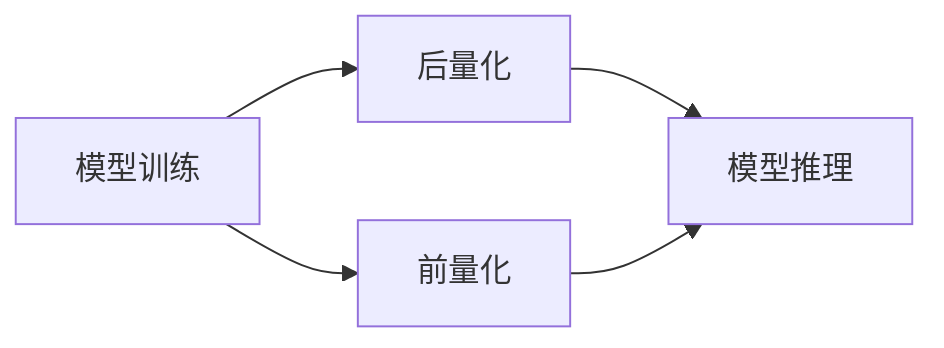

                 

## AI模型量化：平衡性能和精度

> 关键词：模型量化、模型压缩、模型部署、模型性能、模型精度、模型推理

## 1. 背景介绍

随着深度学习的发展，模型的复杂度和参数数量也在不断增加。这些大型模型在训练和推理时需要大量的计算资源和内存，这给模型的部署和推理带来了挑战。模型量化（Model Quantization）是一种将模型参数从高精度数据类型（如FP32或FP16）转换为低精度数据类型（如INT8或INT16）的技术，以平衡模型的性能和精度。

## 2. 核心概念与联系

模型量化的目标是保持模型的精度，同时减小模型的内存 footprint 和推理时间。模型量化通常分为两种方法：后量化（Post-Training Quantization）和前量化（Pre-Training Quantization）。后量化是在模型训练完成后进行量化，而前量化则在模型训练的过程中进行量化。

**Mermaid 代码：**

## 3. 核心算法原理 & 具体操作步骤

### 3.1 算法原理概述

模型量化的核心原理是将模型参数从高精度数据类型转换为低精度数据类型。这可以通过量化模型的权重、激活值或两者来实现。量化后的模型需要一个量化参数（Scale）来恢复原始模型的精度。

### 3.2 算法步骤详解

1. **选择量化目标**：选择要量化的模型参数（权重、激活值或两者）。
2. **选择量化位宽**：选择量化后的数据类型（INT8、INT16、FP16等）。
3. **量化模型**：使用量化算法将模型参数转换为低精度数据类型。
4. **计算量化参数**：计算量化参数（Scale）以恢复原始模型的精度。
5. **模型推理**：使用量化模型进行推理。

### 3.3 算法优缺点

**优点：**

* 减小模型内存 footprint。
* 减少模型推理时间。
* 降低模型部署成本。

**缺点：**

* 量化后的模型精度可能会略微下降。
* 量化过程可能需要大量的计算资源。

### 3.4 算法应用领域

模型量化在各种需要部署大型模型的领域都有应用，例如：

* 移动设备：模型量化可以减小模型的内存 footprint，从而提高移动设备上的模型推理速度。
* 边缘设备：模型量化可以减少模型推理时间，从而提高边缘设备上的实时性。
* 云端服务：模型量化可以减小模型的内存 footprint，从而提高云端服务的吞吐量。

## 4. 数学模型和公式 & 详细讲解 & 举例说明

### 4.1 数学模型构建

设模型参数为$x$, 量化后的参数为$\hat{x}$, 量化参数为$S$, 量化位宽为$n$, 量化后的数据类型为$D$.

则量化后的参数可以表示为：

$$\hat{x} = \text{round}\left(\frac{x}{S}\right)$$

其中，$\text{round}(\cdot)$是四舍五入函数，$\frac{x}{S}$是模型参数的缩放版本。

### 4.2 公式推导过程

量化参数$S$可以通过以下公式计算：

$$S = \frac{\text{max}(|x|)}{\text{max\_value}(D)}$$

其中，$\text{max}(|x|)$是模型参数的最大绝对值，$\text{max\_value}(D)$是量化后数据类型$D$的最大值。

### 4.3 案例分析与讲解

例如，假设模型参数$x = 127.5$, 量化位宽$n = 8$, 量化后的数据类型$D = \text{INT8}$.

则量化参数$S = \frac{\text{max}(|x|)}{\text{max\_value}(D)} = \frac{127.5}{127} = 1$.

量化后的参数$\hat{x} = \text{round}\left(\frac{x}{S}\right) = \text{round}\left(\frac{127.5}{1}

