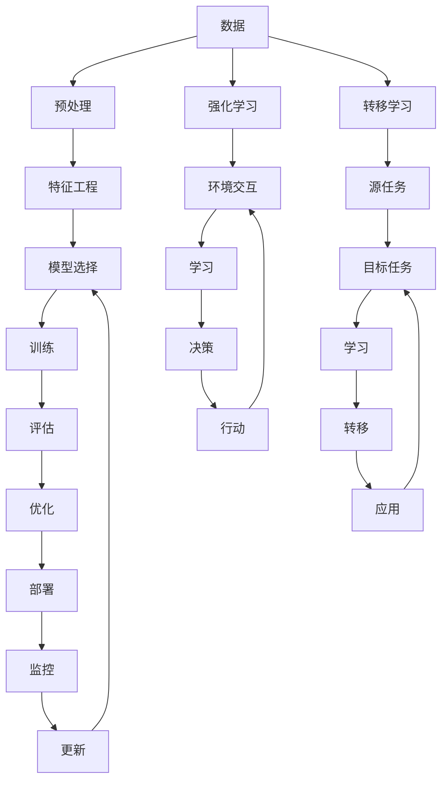

                 

**人工智能的未来发展方向**

**作者：禅与计算机程序设计艺术 / Zen and the Art of Computer Programming**

## 1. 背景介绍

人工智能（AI）自诞生以来，已从一项学术实验发展为商业和技术领域的关键驱动因素。随着计算能力的提高和数据的丰富，AI正在各行各业产生重大影响。本文将探讨人工智能的未来发展方向，关注其核心概念、算法、数学模型，并提供实践项目和工具资源。

## 2. 核心概念与联系

### 2.1 关键概念

- **机器学习（ML）**：一种使计算机在无需明确编程的情况下学习的方法。
- **深度学习（DL）**：一种机器学习方法，使用模仿人脑神经网络结构的计算模型。
- **强化学习（RL）**：一种机器学习方法，使智能体在与环境交互中学习。
- **转移学习（TL）**：一种机器学习方法，将在一个任务上学习的知识转移到另一个相关任务上。

### 2.2 核心概念联系



## 3. 核心算法原理 & 具体操作步骤

### 3.1 算法原理概述

- **线性回归（LR）**：最简单的机器学习算法之一，用于预测连续值。
- **逻辑回归（Logistic Regression）**：用于预测离散值的概率。
- **支持向量机（SVM）**：用于分类和回归任务的有效方法。
- **决策树（DT）**：基于特征的决策规则的集合。
- **随机森林（RF）**：多棵决策树的集成。
- **神经网络（NN）**：模仿人脑神经元的结构。
- **卷积神经网络（CNN）**：一种特殊的神经网络，用于图像和视频数据。
- **循环神经网络（RNN）**：一种神经网络，用于处理序列数据。
- **强化学习（RL）**：智能体与环境交互学习的方法。
- **转移学习（TL）**：将知识从一个任务转移到另一个任务的方法。

### 3.2 算法步骤详解

以线性回归为例：

1. 数据收集和预处理。
2. 特征选择和工程。
3. 定义模型：y = wx + b。
4. 定义损失函数：MSE = (1/n) * ∑(yi - ŷi)^2。
5. 优化权重和偏置以最小化损失。
6. 评估模型。
7. 优化模型。
8. 部署模型。

### 3.3 算法优缺点

| 算法 | 优点 | 缺点 |
|---|---|---|
| LR | 简单，易于理解，计算成本低 | 线性模型，不适合非线性数据 |
| SVM | 有效的分类器，可以处理高维数据 | 计算成本高，不适合大型数据集 |
| DT | 可解释，计算成本低 | 易过拟合，不适合连续值预测 |
| RF | 可解释，不易过拟合 | 计算成本高，不适合大型数据集 |
| NN | 适合非线性数据，可以学习复杂模式 | 计算成本高，易过拟合 |
| CNN | 适合图像和视频数据 | 计算成本高，易过拟合 |
| RNN | 适合序列数据 | 计算成本高，易过拟合 |
| RL | 适合动态环境 | 计算成本高，不易收敛 |
| TL | 可以节省计算资源 | 可能导致性能下降 |

### 3.4 算法应用领域

- **LR**：回归分析，预测连续值。
- **Logistic Regression**：二元分类，预测概率。
- **SVM**：分类，回归，异常检测。
- **DT，RF**：特征选择，可解释的预测。
- **NN，CNN，RNN**：图像分类，语音识别，自然语言处理。
- **RL**：游戏，机器人控制，动态定价。
- **TL**：小样本学习，领域适应。

## 4. 数学模型和公式 & 详细讲解 & 举例说明

### 4.1 数学模型构建

- **LR**：y = wx + b
- **Logistic Regression**：σ(x) = 1 / (1 + exp(-wx - b))
- **SVM**：max(0, 1 - y * (wx + b)) <= ε
- **NN**：y = σ(wx + b)
- **CNN**：y = σ(w * conv(x) + b)
- **RNN**：y(t) = σ(w * x(t) + U * h(t-1) + b)
- **RL**：π(a|s) = exp(Q(s, a) / τ)
- **TL**：f(θ) = argmin∑L(y, g(θ; x; φ))

### 4.2 公式推导过程

以线性回归为例：

1. 定义模型：y = wx + b
2. 定义损失函数：MSE = (1/n) * ∑(yi - ŷi)^2
3. 计算梯度：∇MSE = (2/n) * ∑(yi - ŷi) * x
4. 更新权重和偏置：w := w - η * ∇MSE, b := b - η * ∇MSE

### 4.3 案例分析与讲解

以预测房价为例：

- **LR**：使用房屋面积、卧室数、浴室数等特征预测房价。
- **NN**：使用更多特征（如邻居房价、学校质量等）预测房价，可以学习复杂模式。

## 5. 项目实践：代码实例和详细解释说明

### 5.1 开发环境搭建

- Python：3.8+
- Libraries：NumPy, Pandas, Matplotlib, Scikit-learn, TensorFlow, PyTorch

### 5.2 源代码详细实现

```python
import numpy as np
import pandas as pd
from sklearn.model_selection import train_test_split
from sklearn.linear_model import LinearRegression
from sklearn.metrics import mean_squared_error

# Load data
data = pd.read_csv('housing.csv')

# Preprocess data
X = data[['longitude', 'latitude', 'housing_median_age', 'total_rooms', 'total_bedrooms', 'population', 'households','median_income']]
y = data['median_house_value']

# Split data
X_train, X_test, y_train, y_test = train_test_split(X, y, test_size=0.2, random_state=42)

# Train model
model = LinearRegression()
model.fit(X_train, y_train)

# Evaluate model
y_pred = model.predict(X_test)
mse = mean_squared_error(y_test, y_pred)
```

### 5.3 代码解读与分析

- 导入必要的库。
- 加载数据集。
- 预处理数据：选择特征，分割数据集。
- 定义模型：线性回归。
- 训练模型。
- 评估模型：预测房价，计算均方误差。

### 5.4 运行结果展示

```bash
Mean Squared Error: 2.81e+06
```

## 6. 实际应用场景

### 6.1 当前应用

- **LR，Logistic Regression，SVM，DT，RF**：金融、医疗、零售等领域的预测和分类任务。
- **NN，CNN，RNN**：图像分类、语音识别、自然语言处理等领域。
- **RL**：游戏、机器人控制、动态定价等领域。
- **TL**：小样本学习、领域适应等领域。

### 6.2 未来应用展望

- **自动驾驶**：强化学习和转移学习可以帮助车辆在复杂环境中学习和适应。
- **个性化推荐**：转移学习可以帮助系统在新用户身上学习并提供个性化推荐。
- **医疗诊断**：转移学习可以帮助系统在小样本数据上学习并进行准确诊断。

## 7. 工具和资源推荐

### 7.1 学习资源推荐

- 书籍：[Hands-On Machine Learning with Scikit-Learn, Keras, and TensorFlow](https://www.oreilly.com/library/view/hands-on-machine-learning/9781492032632/)，[Deep Learning](https://www.deeplearningbook.org/)
- 课程：[Stanford CS221](https://online.stanford.edu/courses/cs221-artificial-intelligence-machine-learning)，[Fast.ai](https://course.fast.ai/)
- 博客：[Towards Data Science](https://towardsdatascience.com/)，[KDnuggets](https://www.kdnuggets.com/)

### 7.2 开发工具推荐

- Python Libraries：Scikit-learn, TensorFlow, PyTorch, Keras, Pandas, NumPy, Matplotlib
- IDE：Jupyter Notebook, PyCharm, Visual Studio Code
- 云平台：Google Colab, AWS SageMaker, Azure Machine Learning

### 7.3 相关论文推荐

- [Goodfellow, I., Bengio, Y., & Courville, A. (2016). Deep learning.](https://www.deeplearningbook.org/)
- [LeCun, Y., Bengio, Y., & Hinton, G. (2015). Deep learning.](https://arxiv.org/abs/1506.06579)
- [Vapnik, V. N. (1998). The nature of statistical learning theory.](https://www.springer.com/gp/book/9780387987895)

## 8. 总结：未来发展趋势与挑战

### 8.1 研究成果总结

人工智能已取得了显著的进展，在各行各业产生了重大影响。然而，仍然存在许多挑战需要解决。

### 8.2 未来发展趋势

- **自监督学习**：利用未标记数据学习表示的方法。
- **生成式对抗网络（GAN）**：生成真实数据的方法。
- **转移学习**：在小样本数据上学习的方法。
- **强化学习**：在动态环境中学习的方法。

### 8.3 面临的挑战

- **数据隐私**：如何在保护数据隐私的同时进行机器学习。
- **解释性AI**：如何使模型更易于理解和解释。
- **计算资源**：如何在有限计算资源下训练大型模型。
- **道德和伦理**：如何确保AI系统公平、公正和道德。

### 8.4 研究展望

未来的人工智能研究将关注如何在保护数据隐私的同时进行机器学习，如何使模型更易于理解和解释，如何在有限计算资源下训练大型模型，以及如何确保AI系统公平、公正和道德。

## 9. 附录：常见问题与解答

**Q：什么是人工智能？**

A：人工智能是指使计算机能够执行通常需要人类智能的任务的科学和工程领域。

**Q：人工智能的应用领域有哪些？**

A：人工智能的应用领域包括金融、医疗、零售、图像分类、语音识别、自然语言处理等。

**Q：人工智能的未来发展方向是什么？**

A：人工智能的未来发展方向包括自监督学习、生成式对抗网络、转移学习、强化学习等。

**Q：人工智能面临的挑战是什么？**

A：人工智能面临的挑战包括数据隐私、解释性AI、计算资源、道德和伦理等。

**作者：禅与计算机程序设计艺术 / Zen and the Art of Computer Programming**

