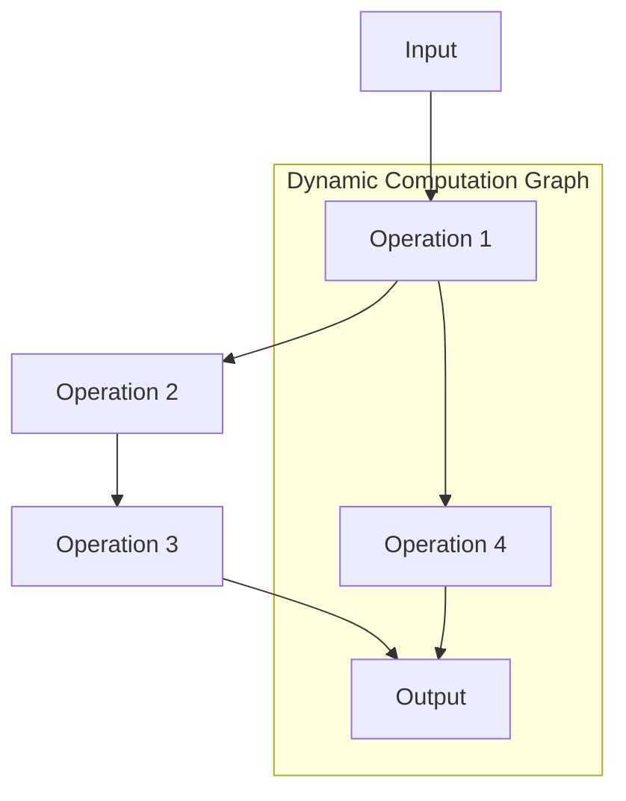

                 

**Pytorch 动态计算图：灵活的构建神经网络**

**作者：禅与计算机程序设计艺术 / Zen and the Art of Computer Programming**

## 1. 背景介绍

在深度学习领域，构建神经网络的灵活性和效率至关重要。PyTorch 通过其动态计算图（Dynamic Computation Graph）提供了这种灵活性。本文将深入探讨 PyTorch 的动态计算图，并展示如何使用它灵活地构建神经网络。

## 2. 核心概念与联系

### 2.1 静态计算图 vs 动态计算图

- **静态计算图（Static Computation Graph）**：在构建图时就确定了所有节点和边，无法在运行时修改。TensorFlow 使用静态计算图。
- **动态计算图（Dynamic Computation Graph）**：可以在运行时动态修改图，添加或删除节点和边。PyTorch 使用动态计算图。


### 2.2 PyTorch 的动态计算图

PyTorch 的动态计算图允许在运行时动态创建和修改计算图。这使得 PyTorch 非常灵活，可以用于研究和开发新的深度学习架构。



## 3. 核心算法原理 & 具体操作步骤

### 3.1 算法原理概述

PyTorch 的动态计算图是通过在运行时动态创建和修改计算图来实现的。当我们定义一个神经网络时，PyTorch 会创建一个计算图，该图描述了如何计算输出。在运行时，PyTorch 可以动态修改这个图。

### 3.2 算法步骤详解

1. **定义计算图**：当我们定义一个神经网络时，PyTorch 会创建一个计算图。
2. **运行计算图**：当我们调用 `forward` 方法时，PyTorch 会运行计算图，计算输出。
3. **动态修改计算图**：在运行时，我们可以动态修改计算图。例如，我们可以添加或删除操作，或改变数据流。

### 3.3 算法优缺点

**优点**：

- **灵活性**：动态计算图允许我们在运行时动态修改计算图，这对于研究和开发新的深度学习架构非常有用。
- **调试方便**：动态计算图使得调试变得更加容易，因为我们可以在运行时检查和修改计算图。

**缺点**：

- **效率**：动态计算图的灵活性来自于在运行时动态修改计算图，这会导致一些开销，使得 PyTorch 的运行速度略慢于 TensorFlow。
- **内存使用**：动态计算图会使用更多的内存，因为 PyTorch 需要保存计算图的状态。

### 3.4 算法应用领域

动态计算图在以下领域非常有用：

- **研究新的深度学学习架构**：动态计算图允许我们动态修改计算图，这对于研究新的深度学习架构非常有用。
- **调试**：动态计算图使得调试变得更加容易，因为我们可以在运行时检查和修改计算图。
- **动态网络**：动态计算图允许我们构建动态网络，这些网络的结构可以在运行时动态修改。

## 4. 数学模型和公式 & 详细讲解 & 举例说明

### 4.1 数学模型构建

在 PyTorch 中，我们使用 `torch.nn.Module` 类来构建神经网络。当我们定义一个神经网络时，PyTorch 会创建一个计算图，该图描述了如何计算输出。

```python
import torch
import torch.nn as nn

class Net(nn.Module):
    def __init__(self):
        super(Net, self).__init__()
        self.fc1 = nn.Linear(16, 32)
        self.fc2 = nn.Linear(32, 10)

    def forward(self, x):
        x = torch.relu(self.fc1(x))
        x = self.fc2(x)
        return x

net = Net()
```

### 4.2 公式推导过程

当我们调用 `forward` 方法时，PyTorch 会运行计算图，计算输出。计算图描述了如何计算输出，它是由神经网络的层组成的有向无环图（Directed Acyclic Graph，DAG）。

### 4.3 案例分析与讲解

让我们看一个例子，说明如何使用动态计算图来构建一个动态网络。

```python
class DynamicNet(nn.Module):
    def __init__(self, input_size, hidden_size, output_size):
        super(DynamicNet, self).__init__()
        self.input_size = input_size
        self.hidden_size = hidden_size
        self.output_size = output_size

    def forward(self, x):
        # 创建一个动态计算图
        graph = torch.nn.Sequential()

        # 添加第一个全连接层
        graph.add_module('fc1', nn.Linear(self.input_size, self.hidden_size))
        x = torch.relu(graph(x))

        # 添加第二个全连接层
        graph.add_module('fc2', nn.Linear(self.hidden_size, self.output_size))
        x = graph(x)

        return x

net = DynamicNet(16, 32, 10)
```

在上面的例子中，我们构建了一个动态网络。我们使用 `torch.nn.Sequential` 来创建一个动态计算图，并动态添加全连接层。这允许我们在运行时动态修改网络的结构。

## 5. 项目实践：代码实例和详细解释说明

### 5.1 开发环境搭建

要开始使用 PyTorch，我们需要安装 PyTorch 和其他必要的库。我们可以使用以下命令安装 PyTorch：

```bash
pip install torch torchvision
```

### 5.2 源代码详细实现

让我们实现一个动态网络，该网络的结构可以在运行时动态修改。

```python
import torch
import torch.nn as nn

class DynamicNet(nn.Module):
    def __init__(self, input_size, hidden_size, output_size):
        super(DynamicNet, self).__init__()
        self.input_size = input_size
        self.hidden_size = hidden_size
        self.output_size = output_size
        self.graph = torch.nn.Sequential()

    def add_layer(self, in_size, out_size, activation):
        self.graph.add_module('fc', nn.Linear(in_size, out_size))
        if activation =='relu':
            self.graph.add_module('relu', nn.ReLU())
        elif activation =='sigmoid':
            self.graph.add_module('sigmoid', nn.Sigmoid())

    def forward(self, x):
        return self.graph(x)

# 创建一个动态网络
net = DynamicNet(16, 32, 10)

# 添加两个全连接层
net.add_layer(16, 32,'relu')
net.add_layer(32, 10, None)

# 打印网络结构
print(net)
```

### 5.3 代码解读与分析

在上面的代码中，我们定义了一个动态网络 `DynamicNet`。我们使用 `torch.nn.Sequential` 来创建一个动态计算图 `graph`，并动态添加全连接层。我们还定义了一个方法 `add_layer`，该方法允许我们动态添加全连接层和激活函数。

### 5.4 运行结果展示

当我们运行上面的代码时，PyTorch 会创建一个动态计算图，并动态添加两个全连接层。打印网络结构时，我们可以看到动态计算图的结构。

```
DynamicNet(
  (graph): Sequential(
    (fc): Linear(in_features=16, out_features=32, bias=True)
    (relu): ReLU()
    (fc_1): Linear(in_features=32, out_features=10, bias=True)
  )
)
```

## 6. 实际应用场景

### 6.1 当前应用

动态计算图在以下领域有实际应用：

- **研究新的深度学习架构**：动态计算图允许我们动态修改计算图，这对于研究新的深度学习架构非常有用。
- **调试**：动态计算图使得调试变得更加容易，因为我们可以在运行时检查和修改计算图。
- **动态网络**：动态计算图允许我们构建动态网络，这些网络的结构可以在运行时动态修改。

### 6.2 未来应用展望

动态计算图的未来应用包括：

- **自适应网络**：动态计算图允许我们构建自适应网络，这些网络可以根据数据动态修改其结构。
- **元学习**：动态计算图可以用于元学习，元学习是一种学习如何学习的方法。动态计算图允许我们动态修改计算图，这对于研究元学习非常有用。

## 7. 工具和资源推荐

### 7.1 学习资源推荐

- **PyTorch 官方文档**：<https://pytorch.org/docs/stable/index.html>
- **PyTorch  tutorials**：<https://pytorch.org/tutorials/>
- **Fast.ai 的 PyTorch 课程**：<https://course.fast.ai/>

### 7.2 开发工具推荐

- **Jupyter Notebook**：<https://jupyter.org/>
- **PyCharm**：<https://www.jetbrains.com/pycharm/>
- **Visual Studio Code**：<https://code.visualstudio.com/>

### 7.3 相关论文推荐

- **Dynamic Neural Networks for Image Classification and Depth Estimation from a Single Image**：<https://arxiv.org/abs/1704.06888>
- **Dynamic Routing Between Capsules**：<https://arxiv.org/abs/1710.09829>

## 8. 总结：未来发展趋势与挑战

### 8.1 研究成果总结

本文介绍了 PyTorch 的动态计算图，并展示了如何使用它灵活地构建神经网络。我们还讨论了动态计算图的优缺点，并提供了一个项目实践的例子。

### 8.2 未来发展趋势

动态计算图的未来发展趋势包括：

- **自适应网络**：动态计算图允许我们构建自适应网络，这些网络可以根据数据动态修改其结构。
- **元学习**：动态计算图可以用于元学习，元学习是一种学习如何学习的方法。动态计算图允许我们动态修改计算图，这对于研究元学习非常有用。

### 8.3 面临的挑战

动态计算图面临的挑战包括：

- **效率**：动态计算图的灵活性来自于在运行时动态修改计算图，这会导致一些开销，使得 PyTorch 的运行速度略慢于 TensorFlow。
- **内存使用**：动态计算图会使用更多的内存，因为 PyTorch 需要保存计算图的状态。

### 8.4 研究展望

动态计算图的研究展望包括：

- **新的动态网络架构**：我们可以研究新的动态网络架构，这些架构可以根据数据动态修改其结构。
- **动态计算图的优化**：我们可以研究如何优化动态计算图，以提高其运行速度和内存使用效率。

## 9. 附录：常见问题与解答

**Q：动态计算图和静态计算图有什么区别？**

A：静态计算图在构建图时就确定了所有节点和边，无法在运行时修改。动态计算图可以在运行时动态修改图，添加或删除节点和边。

**Q：动态计算图有什么优点和缺点？**

A：动态计算图的优点包括灵活性和调试方便。动态计算图的缺点包括效率和内存使用。

**Q：动态计算图有哪些实际应用？**

A：动态计算图在研究新的深度学习架构、调试和动态网络等领域有实际应用。

**Q：动态计算图的未来发展趋势是什么？**

A：动态计算图的未来发展趋势包括自适应网络和元学习。

**Q：动态计算图面临的挑战是什么？**

A：动态计算图面临的挑战包括效率和内存使用。

**Q：动态计算图的研究展望是什么？**

A：动态计算图的研究展望包括新的动态网络架构和动态计算图的优化。

## 作者署名

作者：禅与计算机程序设计艺术 / Zen and the Art of Computer Programming

