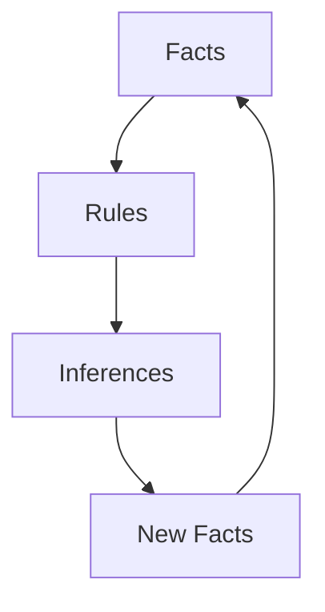
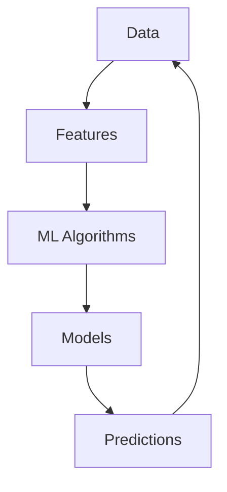

                 

人工智能（AI）、理性知识（Logic）、感性知识（Empirics）、机器学习（ML）、深度学习（DL）、知识表示（KR）、推理（Inference）、数据驱动（Data-driven）、人类认知（Cognition）

## 1. 背景介绍

人工智能自诞生以来，就一直在追求理解和模仿人类认知的各个方面。其中，理性知识和感性知识是人类认知的两个基本组成部分。理性知识是基于逻辑推理和形式化规则的知识，而感性知识则是基于经验和数据的知识。本文将探讨人工智能在获取和利用这两种知识方面的进展，并讨论其在未来的发展趋势。

## 2. 核心概念与联系

### 2.1 理性知识

理性知识是基于逻辑推理和形式化规则的知识，它描述了世界的本质规律和因果关系。在人工智能中，理性知识通常通过知识表示和推理系统来表示和处理。常见的知识表示方法包括第一阶段逻辑（FOL）、description logics（DL）和ontologies。推理系统则包括前向推理（Forward Chaining）和后向推理（Backward Chaining）等。

### 2.2 感性知识

感性知识是基于经验和数据的知识，它描述了世界的表象特征和统计规律。在人工智能中，感性知识通常通过机器学习算法来获取和处理。常见的机器学习算法包括监督学习（Supervised Learning）、无监督学习（Unsupervised Learning）和强化学习（Reinforcement Learning）。其中，深度学习是一种特殊的机器学习方法，它通过模拟人类大脑的神经网络结构来学习和处理数据。

### 2.3 理性知识和感性知识的联系

理性知识和感性知识是相辅相成的，它们共同构成了人类认知的基础。理性知识提供了世界的本质规律和因果关系，而感性知识则提供了世界的表象特征和统计规律。通过将理性知识和感性知识结合起来，人工智能可以更好地理解和模仿人类认知。

## 3. 核心算法原理 & 具体操作步骤

### 3.1  算法原理概述

人工智能获取和利用理性知识和感性知识的核心算法包括逻辑推理算法和机器学习算法。逻辑推理算法用于处理理性知识，而机器学习算法用于处理感性知识。这两种算法可以结合起来，构成一种新的算法框架，用于更好地理解和模仿人类认知。

### 3.2  算法步骤详解

#### 3.2.1 逻辑推理算法

逻辑推理算法的步骤如下：

1. 知识表示：将理性知识表示为形式化规则和事实。
2. 推理：使用推理系统从形式化规则和事实中推导出新的事实。
3. 更新：将新的事实添加到知识库中，更新知识表示。

#### 3.2.2 机器学习算法

机器学习算法的步骤如下：

1. 数据预处理：对数据进行清洗、标注和特征提取。
2. 模型选择：选择合适的机器学习算法。
3. 训练：使用训练数据训练模型。
4. 测试：使用测试数据评估模型的性能。
5. 更新：根据模型的性能调整算法参数，并重新训练模型。

#### 3.2.3 结合逻辑推理和机器学习

将逻辑推理和机器学习结合起来的算法框架的步骤如下：

1. 数据预处理：对数据进行清洗、标注和特征提取。
2. 知识表示：将理性知识表示为形式化规则和事实。
3. 训练：使用训练数据训练机器学习模型。
4. 推理：使用推理系统从形式化规则和事实中推导出新的事实。
5. 更新：将新的事实添加到知识库中，更新知识表示。
6. 测试：使用测试数据评估模型的性能。
7. 反馈：根据模型的性能调整算法参数，并重新训练模型。

### 3.3  算法优缺点

逻辑推理算法的优点包括：

* 可以处理形式化规则和事实，描述世界的本质规律和因果关系。
* 可以进行严格的推理，保证推理结果的正确性。
* 可以自动推导出新的事实，扩展知识库。

逻辑推理算法的缺点包括：

* 依赖于形式化规则和事实，难以处理模糊和不确定的知识。
* 计算复杂度高，难以处理大规模的知识库。

机器学习算法的优点包括：

* 可以从数据中学习到感性知识，描述世界的表象特征和统计规律。
* 可以处理大规模的数据，适应复杂的环境。
* 可以自动调整算法参数，适应不同的任务。

机器学习算法的缺点包括：

* 依赖于数据，难以处理模糊和不确定的知识。
* 计算复杂度高，难以处理大规模的数据。

结合逻辑推理和机器学习的算法框架的优点包括：

* 可以结合理性知识和感性知识，更好地理解和模仿人类认知。
* 可以自动推导出新的事实，扩展知识库。
* 可以自动调整算法参数，适应不同的任务。

结合逻辑推理和机器学习的算法框架的缺点包括：

* 计算复杂度高，难以处理大规模的知识库和数据。
* 依赖于数据和形式化规则，难以处理模糊和不确定的知识。

### 3.4  算法应用领域

逻辑推理算法和机器学习算法在人工智能的各个领域都有广泛的应用，包括自然语言处理（NLP）、计算机视觉（CV）、机器人导航（Robot Navigation）和自动驾驶（Autonomous Driving）等。结合逻辑推理和机器学习的算法框架则可以更好地理解和模仿人类认知，应用于人工智能的高级任务，如常识推理（Common Sense Reasoning）、知识图谱（Knowledge Graph）构建和人机协作（Human-Robot Collaboration）等。

## 4. 数学模型和公式 & 详细讲解 & 举例说明

### 4.1  数学模型构建

#### 4.1.1 逻辑推理模型

逻辑推理模型通常基于第一阶段逻辑（FOL）或description logics（DL）构建。FOL是一种强大的逻辑系统，可以表示复杂的推理规则和事实。DL则是一种更简单的逻辑系统，可以表示更大规模的知识库。下面是一个简单的FOL推理规则的例子：

$$
\text{All humans are mortal} \land \text{Socrates is human} \Rightarrow \text{Socrates is mortal}
$$

#### 4.1.2 机器学习模型

机器学习模型通常基于线性回归（Linear Regression）、逻辑回归（Logistic Regression）、支持向量机（SVM）或神经网络（NN）构建。下面是一个简单的线性回归模型的例子：

$$
y = \beta_0 + \beta_1x_1 + \beta_2x_2 + \cdots + \beta_nx_n + \epsilon
$$

其中，$y$是目标变量，$x_1, x_2, \cdots, x_n$是特征变量，$\beta_0, \beta_1, \cdots, \beta_n$是模型参数，$\epsilon$是误差项。

### 4.2  公式推导过程

#### 4.2.1 逻辑推理公式推导

逻辑推理公式推导的过程基于模式匹配和替换。下面是上述FOL推理规则的推导过程：

1. 从规则中提取前提和结论：
$$
\text{All humans are mortal} \land \text{Socrates is human} \Rightarrow \text{Socrates is mortal}
$$
2. 将结论的主语替换为前提的主语：
$$
\text{All humans are mortal} \land \text{Socrates is human} \Rightarrow \text{Socrates is mortal}
$$
3. 将前提的谓语替换为结论的谓语：
$$
\text{All humans are mortal} \land \text{Socrates is human} \Rightarrow \text{Socrates is mortal}
$$
4. 将前提的量词替换为结论的量词：
$$
\text{All humans are mortal} \land \text{Socrates is human} \Rightarrow \text{All humans are mortal}
$$
5. 将前提的连接词替换为结论的连接词：
$$
\text{All humans are mortal} \land \text{Socrates is human} \Rightarrow \text{Socrates is mortal}
$$

#### 4.2.2 机器学习公式推导

机器学习公式推导的过程基于梯度下降（Gradient Descent）或反向传播（Backpropagation）。下面是上述线性回归模型的参数推导过程：

1. 定义损失函数（Loss Function）：
$$
L = \frac{1}{n}\sum_{i=1}^{n}(y_i - \hat{y}_i)^2
$$
其中，$y_i$是真实值，$

