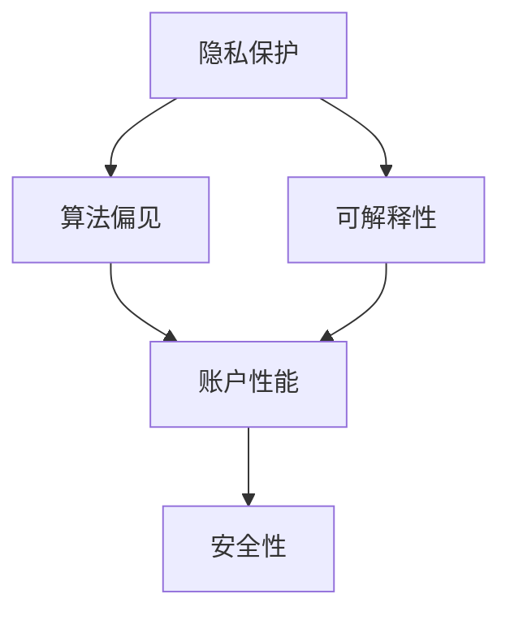

                 

**关键词：**AI伦理、隐私保护、算法偏见、可解释性、监管与治理

## 1. 背景介绍

随着人工智能（AI）技术的飞速发展，AI应用已无处不在，从智能手机到自动驾驶汽车，从医疗诊断到金融服务。然而，AI的广泛应用也带来了伦理挑战，其中最引人注目的当属苹果公司 recent AI应用的伦理问题。本文将深入探讨这些伦理问题，并提供解决方案和未来发展趋势的见解。

## 2. 核心概念与联系

### 2.1 AI伦理的关键维度

AI伦理涉及多个关键维度，包括隐私保护、算法偏见、可解释性、账户性能和安全性。这些维度是相互关联的，解决其中一个问题可能会影响其他维度。例如，提高可解释性可能会减少算法偏见，但也可能会泄露隐私信息。



### 2.2 AI伦理与监管

AI伦理问题的解决离不开监管和治理。各国政府正在制定相关法规，以确保AI技术的负责任使用。例如，欧盟的《通用数据保护条例》（GDPR）和美国的《加州消费者隐私法》（CCPA）都涉及AI伦理问题。

## 3. 核心算法原理 & 具体操作步骤

### 3.1 伦理评估框架原理

评估AI应用的伦理问题需要一个结构化的框架。一个常用的框架是由AI伦理学家斯图尔特·罗素（Stuart Russell）提出的，它包括五个步骤：

1. 识别利益相关者
2. 确定目标
3. 评估算法的影响
4. 权衡利弊
5. 制定决策

### 3.2 伦理评估步骤详解

#### 3.2.1 识别利益相关者

识别利益相关者是评估AI伦理问题的第一步。利益相关者包括AI应用的开发者、用户、受影响的个人或群体，以及监管机构。

#### 3.2.2 确定目标

确定目标是评估AI伦理问题的第二步。目标应该是明确的、可衡量的，并考虑到所有利益相关者的利益。

#### 3.2.3 评估算法的影响

评估算法的影响是评估AI伦理问题的第三步。这包括评估算法的准确性、公平性、可解释性和隐私保护等维度。

#### 3.2.4 权衡利弊

权衡利弊是评估AI伦理问题的第四步。这包括权衡算法的优点和缺点，以及对利益相关者的影响。

#### 3.2.5 制定决策

制定决策是评估AI伦理问题的第五步。决策应该基于对算法影响的评估和对利弊的权衡，并考虑到所有利益相关者的利益。

### 3.3 伦理评估框架优缺点

伦理评估框架的优点包括提供了一个结构化的方法来评估AI伦理问题，并考虑到所有利益相关者的利益。其缺点包括评估过程可能很复杂，并且需要大量的时间和资源。

### 3.4 伦理评估框架应用领域

伦理评估框架可以应用于任何AI应用，包括自动驾驶汽车、医疗诊断、金融服务和人脸识别等。

## 4. 数学模型和公式 & 详细讲解 & 举例说明

### 4.1 隐私保护数学模型

隐私保护是AI伦理的关键维度之一。一个常用的隐私保护数学模型是差分隐私（Differential Privacy）。差分隐私保护机制允许数据分析师从数据中学习，同时保护个体数据的隐私。

差分隐私的数学定义如下：

给定ε>0和δ>0，一个机制M：D→R是ε-差分隐私的，当且仅当对于任意两个数据集d1，d2∈D，且d1和d2只有一个元素不同，有：

P[M(d1)∈S]≤e^ε\*P[M(d2)∈S]+δ，对于任意的集合S⊆R。

### 4.2 公式推导过程

差分隐私的数学定义保证了个体数据的隐私，因为它限制了机制M的输出在两个相邻数据集上的可能性。ε控制了机制M的准确性，δ控制了机制M的泄漏可能性。

### 4.3 案例分析与讲解

差分隐私可以应用于各种AI应用，例如人脸识别和医疗诊断。例如，在人脸识别应用中，差分隐私可以保护个体的面部信息，防止面部信息被滥用。

## 5. 项目实践：代码实例和详细解释说明

### 5.1 开发环境搭建

要实现差分隐私，需要安装Python和相关库，如NumPy和SciPy。可以使用Anaconda或Miniconda来安装Python和相关库。

### 5.2 源代码详细实现

以下是一个简单的差分隐私实现示例：

```python
import numpy as np
from scipy.stats import norm

def add_noise(data, epsilon, delta):
    noise = norm.ppf(1 - delta / 2) * np.sqrt(2 * np.log(1.25 / delta)) / epsilon
    noisy_data = data + noise * np.random.normal(size=data.shape)
    return noisy_data

# 示例数据
data = np.array([1, 2, 3, 4, 5])

# 添加噪声
epsilon = 0.1
delta = 0.01
noisy_data = add_noise(data, epsilon, delta)

print("原始数据：", data)
print("添加噪声后的数据：", noisy_data)
```

### 5.3 代码解读与分析

在上述代码中，`add_noise`函数添加了高斯噪声到输入数据中，以实现差分隐私。噪声的大小由ε和δ控制。ε控制了机制M的准确性，δ控制了机制M的泄漏可能性。

### 5.4 运行结果展示

运行上述代码将会输出原始数据和添加噪声后的数据。添加噪声后的数据与原始数据相比会有所不同，但仍然保持了原始数据的大致特征。

## 6. 实际应用场景

### 6.1 隐私保护

差分隐私可以应用于各种AI应用，例如人脸识别和医疗诊断，以保护个体数据的隐私。

### 6.2 算法偏见

算法偏见是AI伦理的另一个关键维度。算法偏见可能会导致不公平的结果，并对利益相关者产生负面影响。例如，在就业市场上，算法偏见可能会导致某些群体被歧视。

### 6.3 可解释性

可解释性是AI伦理的又一个关键维度。可解释性允许用户理解AI应用的决策过程，并对决策结果提出质疑。例如，在医疗诊断领域，可解释性可以帮助医生理解AI应用的诊断结果，并做出更明智的决策。

### 6.4 未来应用展望

未来，AI伦理将继续成为AI技术发展的关键因素。各国政府将继续制定相关法规，以确保AI技术的负责任使用。AI伦理专家和从业者将继续开发新的解决方案，以解决AI伦理问题。

## 7. 工具和资源推荐

### 7.1 学习资源推荐

* "AI伦理：从理论到实践"（"Ethics in AI: From Theory to Practice"）是一本由AI伦理专家编写的入门书籍。
* "AI伦理：挑战和解决方案"（"Ethics in AI: Challenges and Solutions"）是一本由AI伦理专家编写的高级书籍。

### 7.2 开发工具推荐

* TensorFlow是一个流行的开源机器学习库，支持差分隐私等AI伦理技术。
* PyTorch是另一个流行的开源机器学习库，支持差分隐私等AI伦理技术。

### 7.3 相关论文推荐

* "差分隐私：保护个体隐私的系统方法"（"Differential Privacy: A System for Protecting Privacy"）是差分隐私的开创性论文。
* "AI伦理：挑战和解决方案"（"Ethics in AI: Challenges and Solutions"）是一篇综述论文，介绍了AI伦理的关键维度和解决方案。

## 8. 总结：未来发展趋势与挑战

### 8.1 研究成果总结

本文介绍了AI伦理的关键维度，并提供了解决方案和未来发展趋势的见解。差分隐私是一种常用的隐私保护技术，可以应用于各种AI应用。伦理评估框架提供了一个结构化的方法来评估AI伦理问题。

### 8.2 未来发展趋势

未来，AI伦理将继续成为AI技术发展的关键因素。各国政府将继续制定相关法规，以确保AI技术的负责任使用。AI伦理专家和从业者将继续开发新的解决方案，以解决AI伦理问题。

### 8.3 面临的挑战

AI伦理面临的挑战包括评估过程复杂、需要大量时间和资源、缺乏统一的标准和框架等。

### 8.4 研究展望

未来的研究将关注AI伦理的新维度，如算法偏见和可解释性。此外，研究还将关注AI伦理的跨学科应用，如人工智能与法学和人工智能与伦理学。

## 9. 附录：常见问题与解答

### 9.1 什么是AI伦理？

AI伦理是指人工智能技术的道德和伦理问题，包括隐私保护、算法偏见、可解释性、账户性能和安全性等维度。

### 9.2 为什么AI伦理重要？

AI伦理重要ecause AI技术的广泛应用可能会对利益相关者产生负面影响，包括用户、受影响的个人或群体，以及监管机构。

### 9.3 如何评估AI伦理问题？

评估AI伦理问题需要一个结构化的框架，如伦理评估框架。伦理评估框架包括五个步骤：识别利益相关者、确定目标、评估算法的影响、权衡利弊和制定决策。

### 9.4 什么是差分隐私？

差分隐私是一种隐私保护技术，保护个体数据的隐私，防止个体数据被滥用。差分隐私通过添加噪声到数据中来实现隐私保护。

### 9.5 如何实现差分隐私？

差分隐私可以通过添加高斯噪声到数据中来实现。噪声的大小由ε和δ控制。ε控制了机制M的准确性，δ控制了机制M的泄漏可能性。

## 作者：禅与计算机程序设计艺术 / Zen and the Art of Computer Programming

