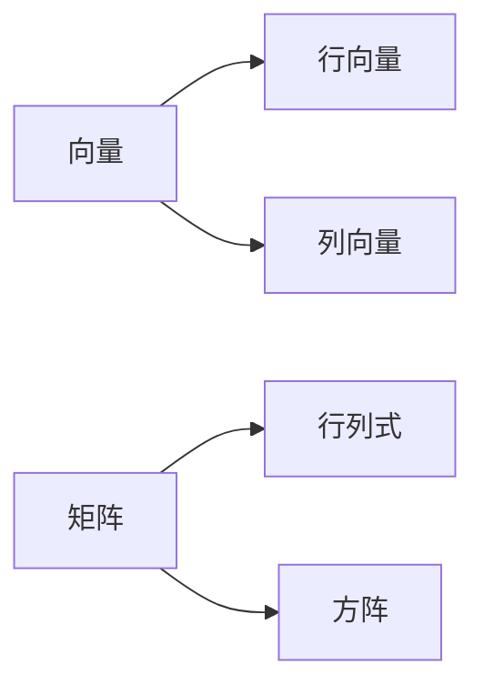

                 

线性代数、矩阵、向量、线性运算、行列式、矩阵乘法、矩阵逆、线性方程组

## 1. 背景介绍

线性代数是数学的一个分支，它研究向量和矩阵的线性运算。线性代数在计算机科学、工程、物理、化学等领域有着广泛的应用。本文将介绍线性代数的核心概念，重点讲解线性运算，并通过具体的算法和数学模型进行详细阐述。最后，我们将通过项目实践和实际应用场景，展示线性代数在计算机科学中的应用。

## 2. 核心概念与联系

### 2.1 向量与矩阵

向量和矩阵是线性代数的基本概念。向量是具有方向和大小的量，通常用箭头表示。矩阵是由行和列组成的数组，通常用大写字母表示。



### 2.2 线性运算

线性运算是指向量和矩阵之间的乘法运算。线性运算满足结合律、交换律和 distributive law。

## 3. 核心算法原理 & 具体操作步骤

### 3.1 算法原理概述

线性运算的核心算法是矩阵乘法和矩阵逆。矩阵乘法是指将两个矩阵相乘，得到一个新的矩阵。矩阵逆是指将矩阵进行逆运算，得到一个新的矩阵，使得原矩阵与其逆矩阵相乘等于单位矩阵。

### 3.2 算法步骤详解

#### 3.2.1 矩阵乘法

矩阵乘法的步骤如下：

1. 确保两个矩阵的维度相容，即第一个矩阵的列数等于第二个矩阵的行数。
2. 将第一个矩阵的每一行与第二个矩阵的每一列相乘，并将结果相加，得到新矩阵的元素。
3. 重复步骤2，直到计算出新矩阵的所有元素。

#### 3.2.2 矩阵逆

矩阵逆的步骤如下：

1. 计算矩阵的行列式，判断矩阵是否可逆。
2. 如果矩阵可逆，则计算矩阵的伴随矩阵。
3. 计算伴随矩阵的行列式，并取其倒数。
4. 将伴随矩阵的每一行每一列的元素相乘，并将结果相加，得到新矩阵的元素。
5. 将新矩阵的每一行每一列的元素相乘，并将结果相加，得到矩阵的逆。

### 3.3 算法优缺点

矩阵乘法的优点是可以将两个矩阵的信息结合起来，得到一个新的矩阵。缺点是计算量较大，时间复杂度为O(n^3)，其中n为矩阵的阶数。矩阵逆的优点是可以将矩阵进行逆运算，得到一个新的矩阵，使得原矩阵与其逆矩阵相乘等于单位矩阵。缺点是计算量较大，时间复杂度为O(n^3)，并且不是所有的矩阵都可逆。

### 3.4 算法应用领域

线性运算在计算机科学中有着广泛的应用。例如，在机器学习中，线性回归算法就是基于线性运算的。在图形学中，线性运算用于计算变换矩阵，将物体从三维空间投影到二维平面上。在密码学中，线性运算用于设计密码算法，例如RSA算法。

## 4. 数学模型和公式 & 详细讲解 & 举例说明

### 4.1 数学模型构建

线性运算的数学模型是矩阵乘法和矩阵逆。矩阵乘法的数学模型为：

$$
A \cdot B = \begin{bmatrix} a_{11} & a_{12} & \cdots & a_{1n} \\ a_{21} & a_{22} & \cdots & a_{2n} \\ \vdots & \vdots & \ddots & \vdots \\ a_{m1} & a_{m2} & \cdots & a_{mn} \end{bmatrix} \begin{bmatrix} b_{11} & b_{12} & \cdots & b_{1p} \\ b_{21} & b_{22} & \cdots & b_{2p} \\ \vdots & \vdots & \ddots & \vdots \\ b_{n1} & b_{n2} & \cdots & b_{np} \end{bmatrix} = \begin{bmatrix} c_{11} & c_{12} & \cdots & c_{1p} \\ c_{21} & c_{22} & \cdots & c_{2p} \\ \vdots & \vdots & \ddots & \vdots \\ c_{m1} & c_{m2} & \cdots & c_{mp} \end{bmatrix}
$$

矩阵逆的数学模型为：

$$
A^{-1} = \frac{1}{det(A)} \begin{bmatrix} a_{11} & a_{12} & \cdots & a_{1n} \\ a_{21} & a_{22} & \cdots & a_{2n} \\ \vdots & \vdots & \ddots & \vdots \\ a_{n1} & a_{n2} & \cdots & a_{nn} \end{bmatrix}^T
$$

其中，$det(A)$表示矩阵$A$的行列式，$A^T$表示矩阵$A$的转置。

### 4.2 公式推导过程

#### 4.2.1 矩阵乘法公式推导

矩阵乘法的公式推导过程如下：

1. 将第一个矩阵的每一行与第二个矩阵的每一列相乘，得到一个新的矩阵。
2. 将新矩阵的每一行每一列的元素相加，得到新矩阵的元素。
3. 重复步骤2，直到计算出新矩阵的所有元素。

#### 4.2.2 矩阵逆公式推导

矩阵逆的公式推导过程如下：

1. 计算矩阵的行列式，判断矩阵是否可逆。
2. 如果矩阵可逆，则计算矩阵的伴随矩阵。
3. 计算伴随矩阵的行列式，并取其倒数。
4. 将伴随矩阵的每一行每一列的元素相乘，并将结果相加，得到新矩阵的元素。
5. 将新矩阵的每一行每一列的元素相乘，并将结果相加，得到矩阵的逆。

### 4.3 案例分析与讲解

例如，计算矩阵$A$和矩阵$B$的乘积：

$$
A = \begin{bmatrix} 1 & 2 \\ 3 & 4 \end{bmatrix}, B = \begin{bmatrix} 5 & 6 \\ 7 & 8 \end{bmatrix}
$$

则：

$$
A \cdot B = \begin{bmatrix} 1 & 2 \\ 3 & 4 \end{bmatrix} \begin{bmatrix} 5 & 6 \\ 7 & 8 \end{bmatrix} = \begin{bmatrix} 19 & 22 \\ 43 & 50 \end{bmatrix}
$$

再例如，计算矩阵$A$的逆：

$$
A = \begin{bmatrix} 1 & 2 \\ 3 & 4 \end{bmatrix}
$$

则：

$$
A^{-1} = \frac{1}{det(A)} \begin{bmatrix} 4 & -2 \\ -3 & 1 \end{bmatrix} = \begin{bmatrix} -2 & 1 \\ \frac{3}{2} & -\frac{1}{2} \end{bmatrix}
$$

## 5. 项目实践：代码实例和详细解释说明

### 5.1 开发环境搭建

本项目使用Python语言开发，并使用NumPy库进行矩阵运算。因此，需要安装Python和NumPy库。可以使用以下命令安装：

```bash
pip install numpy
```

### 5.2 源代码详细实现

以下是矩阵乘法和矩阵逆的Python代码实现：

```python
import numpy as np

# 矩阵乘法
def matrix_multiply(A, B):
    return np.dot(A, B)

# 矩阵逆
def matrix_inverse(A):
    return np.linalg.inv(A)

# 示例
A = np.array([[1, 2], [3, 4]])
B = np.array([[5, 6], [7, 8]])
print("A * B = ", matrix_multiply(A, B))
print("A^{-1} = ", matrix_inverse(A))
```

### 5.3 代码解读与分析

在代码中，我们使用NumPy库的`dot`函数实现矩阵乘法，并使用`linalg.inv`函数实现矩阵逆。在示例中，我们定义了两个2x2矩阵$A$和$B$，并计算 loro

