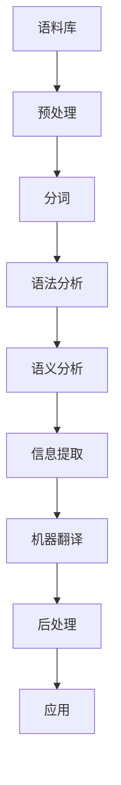

                 

**关键词：**自然语言理解、机器翻译、语言模型、神经网络、深度学习

## 1. 背景介绍

自然语言处理（Natural Language Processing，NLP）是计算机科学领域的一个重要分支，旨在使计算机能够理解、分析和生成人类语言。NLP的目标是建立能够处理和理解人类语言的计算机程序，以便于人机交互，信息检索，机器翻译等应用。

## 2. 核心概念与联系

NLP的核心概念包括语法分析、语义分析、信息提取、机器翻译等。这些概念相互关联，共同构成了NLP的整体架构。下面是NLP核心概念的Mermaid流程图：



## 3. 核心算法原理 & 具体操作步骤

### 3.1 算法原理概述

NLP的核心算法包括统计模型和深度学习模型。统计模型基于语料库的统计信息，而深度学习模型则学习语料库中的语言规律。

### 3.2 算法步骤详解

NLP算法的一般步骤包括：

1. 预处理：清洗数据，去除无用信息。
2. 分词：将文本分成单词或词汇。
3. 标记化：给单词或词汇打上标签，如名词、动词等。
4. 语法分析：根据语法规则，分析句子结构。
5. 语义分析：理解句子的意思。
6. 信息提取：从文本中提取有用信息。
7. 机器翻译：将一种语言翻译成另一种语言。
8. 后处理：对翻译结果进行修正和润色。

### 3.3 算法优缺点

统计模型优点是简单易懂，缺点是需要大量的标注数据。深度学习模型优点是可以学习复杂的语言规律，缺点是需要大量的计算资源。

### 3.4 算法应用领域

NLP的应用领域包括搜索引擎、信息检索、机器翻译、语音识别、智能客服等。

## 4. 数学模型和公式 & 详细讲解 & 举例说明

### 4.1 数学模型构建

NLP的数学模型包括语言模型、翻译模型等。语言模型是一种统计模型，用于预测下一个单词。翻译模型则用于预测目标语言的单词。

### 4.2 公式推导过程

语言模型的数学公式为：

$$P(w_{t+1}|w_t, w_{t-1},..., w_1) = \frac{count(w_{t+1}, w_t, w_{t-1},..., w_1)}{count(w_t, w_{t-1},..., w_1)}$$

其中，$w_{t+1}$是下一个单词，$w_t, w_{t-1},..., w_1$是前面的单词，$count()$是计数函数。

### 4.3 案例分析与讲解

例如，如果我们有以下语料库：

```
I love my dog.
I love my cat.
I love my bird.
```

那么，根据上述公式，我们可以计算出：

$$P(love|I) = \frac{2}{3}$$

$$P(dog|love) = \frac{1}{2}$$

## 5. 项目实践：代码实例和详细解释说明

### 5.1 开发环境搭建

NLP项目的开发环境包括Python、NLTK、Spacy等库。

### 5.2 源代码详细实现

以下是一个简单的分词示例：

```python
import nltk
nltk.download('punkt')

text = "I love my dog."
tokens = nltk.word_tokenize(text)
print(tokens)
```

### 5.3 代码解读与分析

这段代码使用NLTK库对文本进行分词。`nltk.word_tokenize()`函数将文本分成单词。

### 5.4 运行结果展示

运行这段代码的结果是：

```
['I', 'love','my', 'dog', '.']
```

## 6. 实际应用场景

### 6.1 当前应用

NLP当前的应用包括搜索引擎、信息检索、机器翻译、语音识别、智能客服等。

### 6.2 未来应用展望

未来，NLP有望在人工智能、自动驾驶、虚拟现实等领域得到更广泛的应用。

## 7. 工具和资源推荐

### 7.1 学习资源推荐

推荐阅读《自然语言处理入门》和《统计自然语言处理》。

### 7.2 开发工具推荐

推荐使用Python、NLTK、Spacy等库。

### 7.3 相关论文推荐

推荐阅读《Attention Is All You Need》和《BERT: Pre-training of Deep Bidirectional Transformers for Language Understanding》。

## 8. 总结：未来发展趋势与挑战

### 8.1 研究成果总结

NLP的研究成果包括统计模型、深度学习模型等。

### 8.2 未来发展趋势

未来，NLP的发展趋势包括多模式NLP、跨语言NLP等。

### 8.3 面临的挑战

NLP面临的挑战包括语料库的匮乏、模型的泛化能力等。

### 8.4 研究展望

未来，NLP的研究方向包括解释性NLP、可控NLP等。

## 9. 附录：常见问题与解答

**Q：NLP的目标是什么？**

**A：NLP的目标是建立能够处理和理解人类语言的计算机程序，以便于人机交互，信息检索，机器翻译等应用。**

**Q：NLP的核心概念包括哪些？**

**A：NLP的核心概念包括语法分析、语义分析、信息提取、机器翻译等。**

**Q：NLP的应用领域包括哪些？**

**A：NLP的应用领域包括搜索引擎、信息检索、机器翻译、语音识别、智能客服等。**

**作者：禅与计算机程序设计艺术 / Zen and the Art of Computer Programming**

