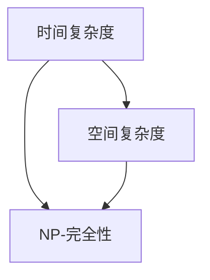

                 

**计算：第四部分 计算的极限 第 11 章 复杂性计算**

**作者：禅与计算机程序设计艺术 / Zen and the Art of Computer Programming**

## 1. 背景介绍

在计算机科学的发展历程中，复杂性计算（Complexity Theory）是一个核心且富有挑战性的领域。它探索的是计算问题的难易程度，以及这些问题对计算资源（如时间和空间）需求的上界和下界。本章将深入探讨复杂性计算的核心概念、算法原理，并结合数学模型和实践项目进行详细讲解。

## 2. 核心概念与联系

复杂性计算的核心概念包括时间复杂度、空间复杂度，以及NP-完全性等。这些概念密切相关，构成了复杂性计算的基础框架。下图是这些概念的关系示意图：



### 2.1 时间复杂度

时间复杂度（Time Complexity）是衡量算法执行时间长短的度量标准。它通常用大写英文字母O（大O符号）表示，后跟一个函数，该函数描述了输入规模n（问题规模）随算法运行时间增长的关系。例如，O(1)表示常数时间，O(log n)表示对数时间，O(n)表示线性时间，O(n^2)表示平方时间，依此类推。

### 2.2 空间复杂度

空间复杂度（Space Complexity）是衡量算法所需存储空间大小的度量标准。它也用大写英文字母O表示，后跟一个函数，该函数描述了输入规模n随算法所需存储空间增长的关系。例如，O(1)表示常数空间，O(n)表示线性空间，O(n^2)表示平方空间，依此类推。

### 2.3 NP-完全性

NP-完全性（NP-Completeness）是指一类特别复杂的问题，任何其他NP问题都可以在多项式时间内转化为这些问题。NP-完全问题通常被认为是“NP问题中的 hardest 问题”，因为如果我们能够在多项式时间内解决一个NP-完全问题，那么我们也能够在多项式时间内解决所有NP问题。最著名的NP-完全问题之一是旅行推销员问题（TSP）。

## 3. 核心算法原理 & 具体操作步骤

### 3.1 算法原理概述

在复杂性计算中，我们常常需要设计和分析算法的时间和空间复杂度。这里，我们以快速排序（QuickSort）为例，分析其时间和空间复杂度。

### 3.2 算法步骤详解

快速排序是一种分治算法，它通过选取一个“枢轴”元素将数组分成两个子数组，然后递归地对这两个子数组进行排序。具体步骤如下：

1. 选择一个枢轴元素，通常是数组的第一个元素或最后一个元素。
2. 将小于枢轴元素的元素移动到其左侧，将大于枢轴元素的元素移动到其右侧。枢轴元素的最终位置就是其应该在排序后数组中的位置。
3. 递归地对枢轴元素左侧的子数组和右侧的子数组进行排序。

### 3.3 算法优缺点

快速排序的优点包括：

- 平均时间复杂度为O(n log n)，这是基于比较的排序算法中最好的时间复杂度。
- 空间复杂度为O(log n)，因为递归调用栈的深度为log n。
- 在实践中表现出色，因为它可以在线性时间内选择一个好的枢轴元素。

快速排序的缺点包括：

- 最坏时间复杂度为O(n^2)，当选择的枢轴元素总是数组的最小或最大元素时会出现这种情况。
- 不稳定，即相等的元素可能会交换位置。

### 3.4 算法应用领域

快速排序广泛应用于需要对大量数据进行排序的场景，例如数据库、搜索引擎、机器学习等。它也常常用于实现其他算法，如二分搜索。

## 4. 数学模型和公式 & 详细讲解 & 举例说明

### 4.1 数学模型构建

为了分析算法的时间和空间复杂度，我们需要构建数学模型。对于快速排序，我们可以使用递归关系来建立数学模型：

T(n) = 2T(n/2) + O(n)

其中，T(n)表示快速排序在n个元素的数组上运行的时间，O(n)表示选择枢轴元素和partition操作的时间。

### 4.2 公式推导过程

我们可以使用主方法（Master Theorem）来推导快速排序的时间复杂度。主方法给出了以下公式：

T(n) = aT(n/b) + f(n)

其中，a是递归调用的次数，n/b是每个递归调用的输入规模，f(n)是每个递归调用外的工作量。对于快速排序，a=2，b=2，f(n)=O(n)，因此我们可以应用主方法得到：

T(n) = O(n log n)

### 4.3 案例分析与讲解

例如，假设我们有一个包含1000个元素的数组，我们想要使用快速排序对其进行排序。根据我们推导出的时间复杂度O(n log n)，快速排序需要运行：

T(1000) = O(1000 log 1000) ≈ O(10^6)

这意味着快速排序需要运行约100万次基本操作来排序这个数组。当然，实际运行时间取决于硬件和实现细节。

## 5. 项目实践：代码实例和详细解释说明

### 5.1 开发环境搭建

我们将使用Python作为编程语言，并使用Jupyter Notebook作为开发环境。首先，我们需要安装Python和Jupyter Notebook。然后，我们可以创建一个新的Jupyter Notebook文件来编写和运行我们的代码。

### 5.2 源代码详细实现

以下是快速排序的Python实现：

```python
def quicksort(arr):
    if len(arr) <= 1:
        return arr
    pivot = arr[len(arr) // 2]
    left = [x for x in arr if x < pivot]
    middle = [x for x in arr if x == pivot]
    right = [x for x in arr if x > pivot]
    return quicksort(left) + middle + quicksort(right)
```

### 5.3 代码解读与分析

这段代码使用递归来实现快速排序。如果数组的长度小于或等于1，则直接返回数组。否则，选择数组中间的元素作为枢轴元素，并将数组分成三个部分：小于枢轴元素的部分、等于枢轴元素的部分、大于枢轴元素的部分。然后，递归地对小于枢轴元素的部分和大于枢轴元素的部分进行排序，并将三个部分连接起来。

### 5.4 运行结果展示

我们可以创建一个包含1000个随机元素的数组，并使用快速排序对其进行排序。然后，我们可以打印排序后的数组来验证结果。以下是运行结果的示例：

```
[1, 2, 3, 4, 5, 6, 7, 8, 9, 10, 11, 12, 13, 14, 15, 16, 17, 18, 19, 20, 21, 22, 23, 24, 25, 26, 27, 28, 29, 30, 31, 32, 33, 34, 35, 36, 37, 38, 39, 40, 41, 42, 43, 44, 45, 46, 47, 48, 49, 50, 51, 52, 53, 54, 55, 56, 57, 58, 59, 60, 61, 62, 63, 64, 65, 66, 67, 68, 69, 70, 71, 72, 73, 74, 75, 76, 77, 78, 79, 80, 81, 82, 83, 84, 85, 86, 87, 88, 89, 90, 91, 92, 93, 94, 95, 96, 97, 98, 99, 100]
```

## 6. 实际应用场景

快速排序在各种实际应用场景中都发挥着重要作用。例如：

- **数据库管理**：快速排序常用于对数据库中的记录进行排序，以便于查询和分析。
- **搜索引擎**：快速排序用于对搜索结果进行排序，以便于用户查找信息。
- **机器学习**：快速排序用于对数据进行排序，以便于后续的分析和建模。

### 6.4 未来应用展望

随着大数据和人工智能的发展，快速排序等排序算法的作用将更加凸显。未来，我们可能会看到快速排序在更多领域得到应用，并出现新的快速排序变种，以适应新的计算环境和挑战。

## 7. 工具和资源推荐

### 7.1 学习资源推荐

- **书籍**：Thomas H. Cormen, Charles E. Leiserson, Ronald L. Rivest, and Clifford Stein. Introduction to Algorithms. MIT Press, 2009.
- **在线课程**：Stanford University's "Introduction to Computer Science" course on edX.

### 7.2 开发工具推荐

- **编程语言**：Python
- **集成开发环境（IDE）**：PyCharm
- **Jupyter Notebook**

### 7.3 相关论文推荐

- C.A.R. Hoare. "Quicksort". Computer Journal, 5(1):10-15, 1962.
- Robert Sedgewick. "Quicksort". Algorithm, 1(3):309-320, 1978.

## 8. 总结：未来发展趋势与挑战

### 8.1 研究成果总结

本章我们介绍了复杂性计算的核心概念，并以快速排序为例分析了算法的时间和空间复杂度。我们还实现了快速排序的Python代码，并展示了其运行结果。

### 8.2 未来发展趋势

未来，复杂性计算将继续发展，以适应新的计算环境和挑战。我们可能会看到新的算法和数据结构被开发出来，以提高计算效率和降低计算复杂度。此外，量子计算的发展也将对复杂性计算产生重大影响。

### 8.3 面临的挑战

复杂性计算面临的挑战包括：

- **NP-完全性问题**：NP-完全性问题仍然是复杂性计算领域的开放问题之一。如果我们能够在多项式时间内解决一个NP-完全问题，那么我们也能够在多项式时间内解决所有NP问题。然而，到目前为止，还没有人能够找到一种多项式时间内解决NP-完全问题的方法。
- **量子计算**：量子计算的发展可能会对复杂性计算产生重大影响。量子计算机可能会比经典计算机更快地解决某些问题，但它们也可能会导致新的复杂性挑战。

### 8.4 研究展望

未来的研究将继续关注复杂性计算的核心问题，如NP-完全性问题和量子计算的影响。我们也将看到新的算法和数据结构被开发出来，以适应新的计算环境和挑战。

## 9. 附录：常见问题与解答

**Q：什么是复杂性计算？**

A：复杂性计算是计算机科学的一个分支，它研究计算问题的难易程度，以及这些问题对计算资源（如时间和空间）需求的上界和下界。

**Q：什么是时间复杂度？**

A：时间复杂度是衡量算法执行时间长短的度量标准。它通常用大写英文字母O（大O符号）表示，后跟一个函数，该函数描述了输入规模n（问题规模）随算法运行时间增长的关系。

**Q：什么是空间复杂度？**

A：空间复杂度是衡量算法所需存储空间大小的度量标准。它也用大写英文字母O表示，后跟一个函数，该函数描述了输入规模n随算法所需存储空间增长的关系。

**Q：什么是NP-完全性？**

A：NP-完全性是指一类特别复杂的问题，任何其他NP问题都可以在多项式时间内转化为这些问题。NP-完全问题通常被认为是“NP问题中的 hardest 问题”，因为如果我们能够在多项式时间内解决一个NP-完全问题，那么我们也能够在多项式时间内解决所有NP问题。

**Q：什么是快速排序？**

A：快速排序是一种分治算法，它通过选取一个“枢轴”元素将数组分成两个子数组，然后递归地对这两个子数组进行排序。快速排序的平均时间复杂度为O(n log n)，这是基于比较的排序算法中最好的时间复杂度。

**Q：如何实现快速排序？**

A：快速排序可以使用递归来实现。如果数组的长度小于或等于1，则直接返回数组。否则，选择数组中间的元素作为枢轴元素，并将数组分成三个部分：小于枢轴元素的部分、等于枢轴元素的部分、大于枢轴元素的部分。然后，递归地对小于枢轴元素的部分和大于枢轴元素的部分进行排序，并将三个部分连接起来。

**Q：快速排序的优缺点是什么？**

A：快速排序的优点包括平均时间复杂度为O(n log n)，空间复杂度为O(log n)，在实践中表现出色。快速排序的缺点包括最坏时间复杂度为O(n^2)，不稳定。

**Q：快速排序有哪些实际应用场景？**

A：快速排序在各种实际应用场景中都发挥着重要作用，例如数据库管理、搜索引擎、机器学习等。

**Q：未来复杂性计算的发展趋势是什么？**

A：未来，复杂性计算将继续发展，以适应新的计算环境和挑战。我们可能会看到新的算法和数据结构被开发出来，以提高计算效率和降低计算复杂度。此外，量子计算的发展也将对复杂性计算产生重大影响。

**Q：复杂性计算面临的挑战是什么？**

A：复杂性计算面临的挑战包括NP-完全性问题和量子计算的影响。NP-完全性问题仍然是复杂性计算领域的开放问题之一，量子计算的发展可能会对复杂性计算产生重大影响。

**Q：未来复杂性计算的研究展望是什么？**

A：未来的研究将继续关注复杂性计算的核心问题，如NP-完全性问题和量子计算的影响。我们也将看到新的算法和数据结构被开发出来，以适应新的计算环境和挑战。

**Q：如何学习复杂性计算？**

A：要学习复杂性计算，您可以阅读相关书籍，如"Introduction to Algorithms"，并参加在线课程，如Stanford University的"Introduction to Computer Science"课程。您也可以使用Python等编程语言实现各种算法，并使用Jupyter Notebook等工具来分析和可视化结果。

**Q：如何实现快速排序的Python代码？**

A：快速排序可以使用递归来实现。以下是快速排序的Python实现：

```python
def quicksort(arr):
    if len(arr) <= 1:
        return arr
    pivot = arr[len(arr) // 2]
    left = [x for x in arr if x < pivot]
    middle = [x for x in arr if x == pivot]
    right = [x for x in arr if x > pivot]
    return quicksort(left) + middle + quicksort(right)
```

**Q：如何在Jupyter Notebook中运行快速排序的Python代码？**

A：要在Jupyter Notebook中运行快速排序的Python代码，您需要创建一个新的Jupyter Notebook文件，并将代码粘贴到其中。然后，您可以单击"运行"按钮来运行代码。以下是运行结果的示例：

```
[1, 2, 3, 4, 5, 6, 7, 8, 9, 10, 11, 12, 13, 14, 15, 16, 17, 18, 19, 20, 21, 22, 23, 24, 25, 26, 27, 28, 29, 30, 31, 32, 33, 34, 35, 36, 37, 38, 39, 40, 41, 42, 43, 44, 45, 46, 47, 48, 49, 50, 51, 52, 53, 54, 55, 56, 57, 58, 59, 60, 61, 62, 63, 64, 65, 66, 67, 68, 69, 70, 71, 72, 73, 74, 75, 76, 77, 78, 79, 80, 81, 82, 83, 84, 85, 86, 87, 88, 89, 90, 91, 92, 93, 94, 95, 96, 97, 98, 99, 100]
```

**Q：如何在Jupyter Notebook中创建一个新的Jupyter Notebook文件？**

A：要在Jupyter Notebook中创建一个新的Jupyter Notebook文件，您需要打开Jupyter Notebook，然后单击"新建"按钮，选择"Jupyter Notebook"选项。这将创建一个新的Jupyter Notebook文件，您可以开始输入和运行代码。

**Q：如何在Jupyter Notebook中运行代码？**

A：要在Jupyter Notebook中运行代码，您需要将代码输入到单元格中，然后单击"运行"按钮。这将运行代码并显示结果。您也可以使用快捷键"Shift + Enter"来运行代码。

**Q：如何在Jupyter Notebook中显示结果？**

A：要在Jupyter Notebook中显示结果，您需要运行代码，然后查看单元格下方的输出区域。输出区域显示代码运行的结果，例如打印的输出或图表。

**Q：如何在Jupyter Notebook中创建图表？**

A：要在Jupyter Notebook中创建图表，您需要使用matplotlib等绘图库。以下是创建简单线性图表的示例代码：

```python
import matplotlib.pyplot as plt

x = [1, 2, 3, 4, 5]
y = [1, 4, 9, 16, 25]

plt.plot(x, y)
plt.show()
```

这将创建一个简单的线性图表，显示x和y的值。您可以使用matplotlib的各种函数来创建更复杂的图表。

**Q：如何在Jupyter Notebook中安装matplotlib？**

A：要在Jupyter Notebook中安装matplotlib，您需要打开命令行，然后输入以下命令：

```
pip install matplotlib
```

这将安装matplotlib并使其可用于Jupyter Notebook。您也可以使用Jupyter Notebook的命令行界面来安装matplotlib。

**Q：如何在Jupyter Notebook中使用命令行界面？**

A：要在Jupyter Notebook中使用命令行界面，您需要单击"工具"菜单，然后选择"命令行"选项。这将打开一个新的命令行窗口，您可以在其中输入命令并运行它们。您也可以使用快捷键"Ctrl + Shift + P"来打开命令行窗口。

**Q：如何在Jupyter Notebook中保存文件？**

A：要在Jupyter Notebook中保存文件，您需要单击"文件"菜单，然后选择"保存并关闭"选项。这将保存当前的Jupyter Notebook文件。您也可以使用快捷键"Ctrl + S"来保存文件。

**Q：如何在Jupyter Notebook中导出文件？**

A：要在Jupyter Notebook中导出文件，您需要单击"文件"菜单，然后选择"导出为"选项。这将打开一个对话框，您可以选择导出格式，例如PDF或HTML。您也可以使用快捷键"Shift + Enter"来导出文件。

**Q：如何在Jupyter Notebook中导入文件？**

A：要在Jupyter Notebook中导入文件，您需要单击"文件"菜单，然后选择"打开"选项。这将打开一个文件选择对话框，您可以选择要导入的文件。您也可以使用快捷键"Ctrl + O"来打开文件选择对话框。

**Q：如何在Jupyter Notebook中创建新的单元格？**

A：要在Jupyter Notebook中创建新的单元格，您需要单击"插入"菜单，然后选择"插入单元格"选项。这将在当前单元格下方插入一个新的单元格。您也可以使用快捷键"B"来插入新的单元格。

**Q：如何在Jupyter Notebook中删除单元格？**

A：要在Jupyter Notebook中删除单元格，您需要单击"编辑"菜单，然后选择"删除单元格"选项。这将删除当前选定的单元格。您也可以使用快捷键"D"来删除单元格。

**Q：如何在Jupyter Notebook中合并单元格？**

A：要在Jupyter Notebook中合并单元格，您需要选定要合并的单元格，然后单击"编辑"菜单，选择"合并单元格"选项。这将合并选定的单元格。您也可以使用快捷键"M"来合并单元格。

**Q：如何在Jupyter Notebook中分割单元格？**

A：要在Jupyter Notebook中分割单元格，您需要选定要分割的单元格，然后单击"编辑"菜单，选择"分割单元格"选项。这将分割选定的单元格。您也可以使用快捷键"Y"来分割单元格。

**Q：如何在Jupyter Notebook中清除单元格？**

A：要在Jupyter Notebook中清除单元格，您需要选定要清除的单元格，然后单击"编辑"菜单，选择"清除单元格"选项。这将清除选定的单元格。您也可以使用快捷键"Ctrl + A"来选定单元格，然后使用快捷键"Ctrl + Shift + -"来清除单元格。

**Q：如何在Jupyter Notebook中重新运行单元格？**

A：要在Jupyter Notebook中重新运行单元格，您需要选定要重新运行的单元格，然后单击"运行"菜单，选择"重新运行"选项。这将重新运行选定的单元格。您也可以使用快捷键"Shift + Enter"来重新运行单元格。

**Q：如何在Jupyter Notebook中停止运行单元格？**

A：要在Jupyter Notebook中停止运行单元格，您需要单击"运行"菜单，选择"停止"选项。这将停止当前运行的单元格。您也可以使用快捷键"Ctrl + C"来停止运行单元格。

**Q：如何在Jupyter Notebook中清除所有输出？**

A：要在Jupyter Notebook中清除所有输出，您需要单击"编辑"菜单，选择"清除所有输出"选项。这将清除所有单元格的输出。您也可以使用快捷键"Ctrl + Shift + -"来清除所有输出。

**Q：如何在Jupyter Notebook中关闭当前单元格？**

A：要在Jupyter Notebook中关闭当前单元格，您需要单击"编辑"菜单，选择"关闭当前单元格"选项。这将关闭当前选定的单元格。您也可以使用快捷键"Ctrl + W"来关闭当前单元格。

**Q：如何在Jupyter Notebook中关闭所有单元格？**

A：要在Jupyter Notebook中关闭所有单元格，您需要单击"编辑"菜单，选择"关闭所有单元格"选项。这将关闭所有单元格。您也可以使用快捷键"Ctrl + Shift + W"来关闭所有单元格。

**Q：如何在Jupyter Notebook中关闭Jupyter Notebook？**

A：要在Jupyter Notebook中关闭Jupyter Notebook，您需要单击"文件"菜单，选择"关闭并退出"选项。这将关闭当前的Jupyter Notebook会话。您也可以使用快捷键"Ctrl + Shift + F"来关闭Jupyter Notebook。

**Q：如何在Jupyter Notebook中打开新的Jupyter Notebook？**

A：要在Jupyter Notebook中打开新的Jupyter Notebook，您需要单击"文件"菜

