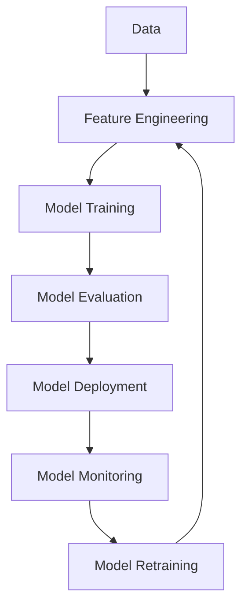

                 

**AI infra**, **MLOps**, **CI/CD**, **AIOps**, **Branding**, **Storytelling**, **AI Productization**

## 1. 背景介绍

在当今快速发展的AI时代，AI基础设施（AI infra）已成为企业成功部署和管理AI模型的关键。然而，构建和管理AI基础设施并非易事，需要考虑的因素包括模型训练、部署、监控、管理和扩展等。本文将介绍贾扬清策略产品展示品牌构建的方法，帮助企业讲好AI基础设施的故事，从而实现AI产品化。

## 2. 核心概念与联系

### 2.1 MLOps与AI基础设施

MLOps（Machine Learning Operations）是一种持续集成/持续部署（CI/CD）的方法，用于管理和部署机器学习模型。MLOps是AI基础设施的关键组成部分，它确保模型的可靠性、可扩展性和可维护性。

### 2.2 AI产品化

AI产品化是指将AI模型转化为可交付的产品，以满足客户需求。AI产品化需要考虑模型的可靠性、可扩展性和用户体验等因素。

### 2.3 AI基础设施与品牌构建

AI基础设施是AI产品化的基础，它为模型提供了可靠的运行环境。品牌构建则是讲好AI基础设施故事的关键，它帮助企业建立品牌形象，吸引客户和合作伙伴。

## 3. 核心算法原理 & 具体操作步骤

### 3.1 算法原理概述

贾扬清策略产品展示品牌构建算法基于故事讲述的原理，它将AI基础设施的复杂性转化为易于理解的故事，从而帮助企业构建品牌形象。

### 3.2 算法步骤详解

1. **识别关键要素**：识别AI基础设施的关键要素，如模型训练、部署、监控等。
2. **构建故事框架**：构建故事框架，将关键要素转化为故事的情节。
3. **讲述故事**：使用清晰简洁的语言讲述故事，突出AI基础设施的优势和价值。
4. **传播故事**：通过各种渠道传播故事，如网站、博客、社交媒体等。
5. **评估和优化**：评估故事的效果，并根据反馈进行优化。

### 3.3 算法优缺点

**优点**：帮助企业构建品牌形象，提高AI基础设施的可理解性。

**缺点**：故事的有效性取决于讲述者的技巧和受众的理解能力。

### 3.4 算法应用领域

贾扬清策略产品展示品牌构建算法适用于任何需要讲述复杂故事的领域，如AI、大数据、云计算等。

## 4. 数学模型和公式 & 详细讲解 & 举例说明

### 4.1 数学模型构建

故事讲述的数学模型可以表示为：

$$Story = f(Characters, Plot, Conflict, Resolution)$$

其中，Characters表示故事的角色，Plot表示故事的情节，Conflict表示故事的矛盾冲突，Resolution表示故事的解决方案。

### 4.2 公式推导过程

故事的有效性可以通过受众的理解度和满意度来衡量。理解度可以表示为：

$$Understanding = g(Clarity, Simplicity, Relevance)$$

其中，Clarity表示故事的清晰度，Simplicity表示故事的简单性，Relevance表示故事的相关性。满意度可以表示为：

$$Satisfaction = h(Engagement, Emotion, Value)$$

其中，Engagement表示故事的参与度，Emotion表示故事引起的情感共鸣，Value表示故事的价值。

### 4.3 案例分析与讲解

例如，一家AI公司想要讲述其AI基础设施的故事。故事的角色可以是AI模型、数据、开发人员等。情节可以是模型训练、部署、监控等。矛盾冲突可以是模型的可靠性、可扩展性等。解决方案可以是AI基础设施的优势和价值。

## 5. 项目实践：代码实例和详细解释说明

### 5.1 开发环境搭建

开发环境需要包括编写故事的文本编辑器和故事传播的渠道，如网站、博客等。

### 5.2 源代码详细实现

故事的源代码是文本内容，可以使用Markdown格式编写。故事的传播渠道需要使用相应的平台提供的API或工具。

### 5.3 代码解读与分析

故事的代码解读需要分析故事的结构、语言和风格。故事的传播渠道需要分析平台的功能和特性。

### 5.4 运行结果展示

故事的运行结果是故事的传播效果，可以通过受众的反馈和理解度、满意度来衡量。

## 6. 实际应用场景

### 6.1 当前应用

贾扬清策略产品展示品牌构建算法已被广泛应用于AI、大数据、云计算等领域，帮助企业构建品牌形象，提高AI基础设施的可理解性。

### 6.2 未来应用展望

未来，贾扬清策略产品展示品牌构建算法将随着AI技术的发展而发展，帮助企业讲述更复杂、更有说服力的故事。

## 7. 工具和资源推荐

### 7.1 学习资源推荐

推荐阅读《故事：人类的基本技能》和《说服力：影响他人从而改变一切》等书籍。

### 7.2 开发工具推荐

推荐使用Markdown编辑器和各种故事传播平台的API或工具。

### 7.3 相关论文推荐

推荐阅读《MLOps: Bringing Machine Learning to AI Operations》和《The AI Infrastructure Landscape》等论文。

## 8. 总结：未来发展趋势与挑战

### 8.1 研究成果总结

贾扬清策略产品展示品牌构建算法帮助企业构建品牌形象，提高AI基础设施的可理解性。

### 8.2 未来发展趋势

未来，贾扬清策略产品展示品牌构建算法将随着AI技术的发展而发展，帮助企业讲述更复杂、更有说服力的故事。

### 8.3 面临的挑战

挑战包括故事的有效性取决于讲述者的技巧和受众的理解能力，以及故事传播渠道的选择和利用等。

### 8.4 研究展望

未来的研究将关注故事讲述技巧的提高、故事传播渠道的创新和故事效果的评估等。

## 9. 附录：常见问题与解答

**Q：贾扬清策略产品展示品牌构建算法适用于哪些领域？**

**A：贾扬清策略产品展示品牌构建算法适用于任何需要讲述复杂故事的领域，如AI、大数据、云计算等。**

**Q：贾扬清策略产品展示品牌构建算法的优缺点是什么？**

**A：贾扬清策略产品展示品牌构建算法的优点是帮助企业构建品牌形象，提高AI基础设施的可理解性。缺点是故事的有效性取决于讲述者的技巧和受众的理解能力。**

**Q：贾扬清策略产品展示品牌构建算法的未来发展趋势是什么？**

**A：未来，贾扬清策略产品展示品牌构建算法将随着AI技术的发展而发展，帮助企业讲述更复杂、更有说服力的故事。**

**作者：禅与计算机程序设计艺术 / Zen and the Art of Computer Programming**

