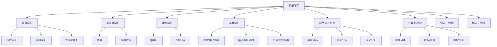

                 

人工智能、软件2.0、哲学、本质、算法、数学模型、项目实践、实际应用场景、工具和资源推荐、总结与展望

## 1. 背景介绍

在信息技术飞速发展的今天，人工智能（AI）已经渗透到我们的日常生活中，从搜索引擎到自动驾驶汽车，从智能手表到医疗诊断系统，AI无处不在。然而，什么是人工智能？它的本质是什么？随着软件从1.0时代向2.0时代转型，人工智能也面临着新的挑战和机遇。本文将从哲学的角度出发，探讨人工智能的本质，并就软件2.0的发展进行哲学思考。

## 2. 核心概念与联系

人工智能的本质是什么？这个问题可以从不同的角度进行回答。从哲学角度看，人工智能的本质是模拟人类智能的一种计算机程序。这种程序能够理解自然语言、识别物体、推理判断，并像人类一样学习和适应环境。从计算机科学角度看，人工智能的本质是一系列算法，这些算法能够从数据中学习，并利用学习到的知识进行预测和决策。

人工智能的核心概念包括：机器学习、深度学习、自然语言处理、计算机视觉、强人工智能和弱人工智能等。这些概念是相互联系的，共同构成了人工智能的体系结构。下面是人工智能核心概念的Mermaid流程图：

## 3. 核心算法原理 & 具体操作步骤

### 3.1 算法原理概述

人工智能的核心是算法，算法是解决问题的一种步骤清晰的计算方法。人工智能算法的原理是从数据中学习，并利用学习到的知识进行预测和决策。常见的人工智能算法包括：线性回归、逻辑回归、支持向量机、决策树、随机森林、神经网络等。

### 3.2 算法步骤详解

以线性回归为例，其具体操作步骤如下：

1. 数据预处理：收集数据，清洗数据，并将数据转换为适合算法的格式。
2. 特征选择：选择影响目标变量的特征，并剔除无关特征。
3. 模型构建：构建线性回归模型，并对模型进行训练。
4. 模型评估：评估模型的性能，并调整模型参数。
5. 预测：利用训练好的模型进行预测。

### 3.3 算法优缺点

线性回归算法优点包括：简单易懂、计算快速、结果可解释。缺点包括：只适合线性关系的数据、对异常值敏感、不能处理高维数据。

### 3.4 算法应用领域

线性回归算法广泛应用于预测分析、回归分析、数据挖掘等领域。例如，可以利用线性回归预测房价、股价、销量等。

## 4. 数学模型和公式 & 详细讲解 & 举例说明

### 4.1 数学模型构建

线性回归的数学模型是：$Y = \beta_0 + \beta_1X_1 + \beta_2X_2 + \ldots + \beta_nX_n + \epsilon$, 其中$Y$是目标变量，$X_1, X_2, \ldots, X_n$是特征变量，$\beta_0, \beta_1, \ldots, \beta_n$是模型参数，$\epsilon$是误差项。

### 4.2 公式推导过程

线性回归模型的参数可以通过最小二乘法来求解。最小二乘法的目标是最小化误差平方和，即$\min\sum_{i=1}^{n}(y_i - \hat{y}_i)^2$, 其中$y_i$是实际值，$

