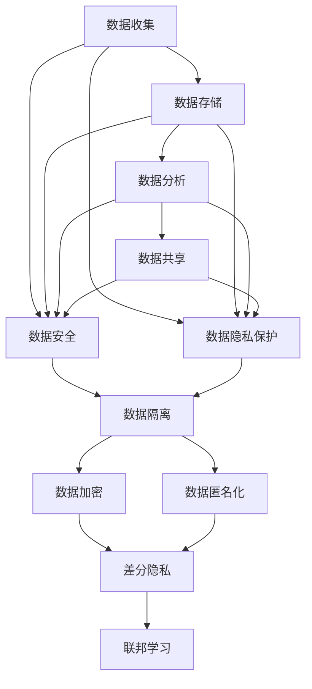

                 

**AI DMP 数据基建：数据安全与隐私保护**

> 关键词：数据管理平台（DMP）、数据安全、数据隐私保护、数据匿名化、差分隐私、联邦学习、数据隔离、数据加密

## 1. 背景介绍

随着数据的爆炸式增长和人工智能（AI）技术的发展，企业和组织对数据的需求也日益增加。数据管理平台（DMP）作为数据治理的关键基础设施，在数据收集、存储、分析和共享等环节发挥着至关重要的作用。然而，数据安全和隐私保护问题日益突出，亟需解决。本文将深入探讨AI DMP在数据安全和隐私保护方面的关键概念、算法原理、数学模型、项目实践和实际应用场景，并提供工具和资源推荐，以期为读者提供全面的参考。

## 2. 核心概念与联系

### 2.1 数据安全与隐私保护

数据安全指的是保护数据免受未授权访问、泄露、篡改或删除的措施。数据隐私保护则是保护个人敏感信息免受滥用和未经授权的访问。在AI DMP中，数据安全和隐私保护是密不可分的，需要综合考虑。



### 2.2 AI DMP 架构

AI DMP 的核心架构包括数据收集、数据存储、数据分析和数据共享等模块。数据安全和隐私保护贯穿整个架构，通过数据隔离、数据加密、数据匿名化、差分隐私和联邦学习等技术手段实现。

## 3. 核心算法原理 & 具体操作步骤

### 3.1 算法原理概述

数据安全和隐私保护涉及多种算法，包括数据隔离、数据加密、数据匿名化、差分隐私和联邦学习等。本节将简要介绍这些算法的原理。

### 3.2 算法步骤详解

#### 3.2.1 数据隔离

数据隔离是指将数据分成不同的环境或区域，限制对数据的访问。常见的数据隔离技术包括：

1. 物理隔离：将数据存储在不同的服务器或存储设备上。
2. 逻辑隔离：使用虚拟化技术将数据分隔开来。
3. 角色隔离：根据用户的角色和权限限制对数据的访问。

#### 3.2.2 数据加密

数据加密是指使用密钥将数据转换为不可读的形式，以保护数据免受未授权访问。常见的数据加密技术包括：

1. 对称加密：使用相同的密钥进行加密和解密。
2. 非对称加密：使用公钥和私钥进行加密和解密。
3. 密钥管理：安全地生成、存储和分发密钥。

#### 3.2.3 数据匿名化

数据匿名化是指删除或修改数据中的敏感信息，以保护个人隐私。常见的数据匿名化技术包括：

1. 标识符删除：删除数据中的标识符，如姓名、地址和电话号码。
2. 通用化：将数据分组并使用统计信息替换原始数据。
3. 杂交：将数据与其他数据集合合并，以隐藏个人身份。

#### 3.2.4 差分隐私

差分隐私是一种保护隐私的技术，它允许对数据进行分析，同时限制对单个数据点的影响。差分隐私的基本原理是添加噪声，以保护数据的敏感信息。差分隐私的算法步骤包括：

1. 定义隐私预算：设置一个值，表示可以容忍的隐私损失。
2. 添加噪声：根据隐私预算，添加噪声到数据中。
3. 进行分析：使用噪声数据进行分析。

#### 3.2.5 联邦学习

联邦学习是一种分布式机器学习技术，允许模型在数据保持本地的情况下进行训练。联邦学习的算法步骤包括：

1. 数据分布：将数据分布在多个客户端上。
2. 模型初始化：初始化模型参数。
3. 模型更新：客户端使用本地数据更新模型参数。
4. 参数聚合：聚合客户端的模型参数更新。
5. 模型评估：评估聚合模型的性能。

### 3.3 算法优缺点

数据隔离、数据加密、数据匿名化、差分隐私和联邦学习等技术各有优缺点。数据隔离和数据加密可以有效防止数据泄露，但可能会导致数据利用率降低。数据匿名化可以保护个人隐私，但可能会导致数据精确度降低。差分隐私可以保护隐私，但会引入噪声，从而降低数据分析的准确性。联邦学习可以保护数据隐私，但需要客户端之间的协作和信任。

### 3.4 算法应用领域

数据安全和隐私保护技术在各个领域都有广泛的应用，包括金融、医疗、零售和公共部门等。例如，在金融领域，数据隔离和数据加密可以防止数据泄露和滥用。在医疗领域，数据匿名化和差分隐私可以保护患者隐私。在零售领域，联邦学习可以保护客户数据隐私，同时进行数据分析。

## 4. 数学模型和公式 & 详细讲解 & 举例说明

### 4.1 数学模型构建

数据安全和隐私保护涉及多种数学模型，包括差分隐私模型和联邦学习模型。本节将简要介绍这些模型的构建。

#### 4.1.1 差分隐私模型

差分隐私模型的数学基础是信息论和概率论。差分隐私模型的构建包括：

1. 定义隐私损失：设置一个值，表示可以容忍的隐私损失。
2. 定义噪声分布：选择一个噪声分布，根据隐私损失添加噪声。
3. 定义差分隐私保证：保证对任意两个数据点的差异，添加的噪声足以保护隐私。

#### 4.1.2 联邦学习模型

联邦学习模型的数学基础是机器学习和优化理论。联邦学习模型的构建包括：

1. 定义模型参数：选择模型参数，如神经网络的权重和偏置。
2. 定义损失函数：选择一个损失函数，如交叉熵或均方误差。
3. 定义优化算法：选择一个优化算法，如梯度下降或随机梯度下降。

### 4.2 公式推导过程

#### 4.2.1 差分隐私公式推导

差分隐私的公式推导过程如下：

1. 定义隐私损失：设置一个值ε，表示可以容忍的隐私损失。ε越小，隐私保护越好。
2. 定义噪声分布：选择一个噪声分布，如高斯分布或拉普拉斯分布。噪声分布的方差δ与ε成反比。
3. 定义差分隐私保证：保证对任意两个数据点x和x'，添加的噪声足以保护隐私。差分隐私保证可以表示为：

    P[M(x) ∈ S] ≤ e^ε \* P[M(x') ∈ S] + δ

    其中，M(x)表示添加噪声后的数据，S表示数据集，e表示自然对数的基数，ε表示隐私损失，δ表示失败概率。

#### 4.2.2 联邦学习公式推导

联邦学习的公式推导过程如下：

1. 定义模型参数：设置模型参数θ，如神经网络的权重和偏置。
2. 定义损失函数：选择一个损失函数L，如交叉熵或均方误差。损失函数表示模型的性能。
3. 定义优化算法：选择一个优化算法，如梯度下降或随机梯度下降。优化算法的目的是最小化损失函数。
4. 定义联邦学习过程：客户端使用本地数据更新模型参数，然后聚合客户端的模型参数更新。联邦学习过程可以表示为：

    θ_{t+1} = θ_t - η \* ∇L(θ_t; x_i, y_i)

    其中，θ_t表示第t次迭代的模型参数，η表示学习率，∇L表示损失函数的梯度，x_i和y_i表示客户端的数据。

### 4.3 案例分析与讲解

#### 4.3.1 差分隐私案例分析

假设我们有一个包含1000个数据点的数据集，我们想要保护隐私损失ε为0.1。我们选择高斯分布作为噪声分布，并计算噪声分布的方差δ。根据差分隐私公式，我们有：

δ = (e^ε - 1) / (2 \* σ^2)

其中，σ表示高斯分布的标准差。我们可以计算出δ为0.004。这意味着，添加噪声后，对任意两个数据点的差异，失败概率为0.004。

#### 4.3.2 联邦学习案例分析

假设我们有100个客户端，每个客户端有100个数据点。我们选择神经网络作为模型，交叉熵作为损失函数，并设置学习率为0.01。我们可以使用随机梯度下降算法进行模型训练。根据联邦学习公式，我们有：

θ_{t+1} = θ_t - η \* ∇L(θ_t; x_i, y_i)

其中，θ_t表示第t次迭代的模型参数，η表示学习率，∇L表示损失函数的梯度，x_i和y_i表示客户端的数据。我们可以计算出模型参数的更新，并聚合客户端的模型参数更新。

## 5. 项目实践：代码实例和详细解释说明

### 5.1 开发环境搭建

要实现数据安全和隐私保护，我们需要搭建开发环境。我们推荐使用Python作为编程语言，并安装以下库：

* NumPy：用于数值计算。
* Pandas：用于数据处理。
* Scikit-learn：用于机器学习。
* TensorFlow或PyTorch：用于深度学习。
* PySyft：用于联邦学习。

### 5.2 源代码详细实现

以下是差分隐私和联邦学习的简单代码实现示例。

#### 5.2.1 差分隐私实现

```python
import numpy as np
from scipy.stats import norm

def add_noise(data, epsilon, delta):
    # 计算噪声分布的标准差
    sigma = np.sqrt((np.exp(epsilon) - 1) / (2 * delta))
    # 生成噪声
    noise = norm.rvs(scale=sigma, size=data.shape)
    # 添加噪声到数据中
    noisy_data = data + noise
    return noisy_data

# 示例数据
data = np.random.rand(1000)
# 设置隐私损失和失败概率
epsilon = 0.1
delta = 0.004
# 添加噪声到数据中
noisy_data = add_noise(data, epsilon, delta)
```

#### 5.2.2 联邦学习实现

```python
import numpy as np
import tensorflow as tf
from tensorflow.keras.models import Sequential
from tensorflow.keras.layers import Dense
from tensorflow.keras.optimizers import SGD

def train_model(client_data, global_model):
    # 客户端数据
    x_train, y_train = client_data
    # 复制全局模型
    client_model = tf.keras.models.clone_model(global_model)
    # 编译客户端模型
    client_model.compile(optimizer=SGD(learning_rate=0.01), loss='categorical_crossentropy', metrics=['accuracy'])
    # 训练客户端模型
    client_model.fit(x_train, y_train, epochs=10, batch_size=32)
    # 返回客户端模型的参数更新
    return client_model.get_weights() - global_model.get_weights()

# 示例客户端数据
client_data = (np.random.rand(100, 10), np.random.randint(2, size=(100, 1)))
# 创建全局模型
global_model = Sequential()
global_model.add(Dense(10, input_dim=10, activation='relu'))
global_model.add(Dense(1, activation='sigmoid'))
# 训练全局模型
global_model.compile(optimizer=SGD(learning_rate=0.01), loss='binary_crossentropy', metrics=['accuracy'])
# 客户端训练模型
client_weights = train_model(client_data, global_model)
# 更新全局模型参数
global_model.set_weights(global_model.get_weights() + client_weights)
```

### 5.3 代码解读与分析

#### 5.3.1 差分隐私代码解读

在差分隐私代码中，我们首先计算噪声分布的标准差，然后生成噪声，并添加噪声到数据中。添加噪声的目的是保护数据隐私，但会导致数据精确度降低。

#### 5.3.2 联邦学习代码解读

在联邦学习代码中，我们首先创建全局模型，然后客户端训练模型，并返回模型参数更新。客户端训练模型的目的是保护数据隐私，但需要客户端之间的协作和信任。

### 5.4 运行结果展示

差分隐私和联邦学习的运行结果取决于数据集和模型参数。我们可以使用各种评估指标，如准确率、精确度、召回率和F1分数，来评估模型的性能。

## 6. 实际应用场景

数据安全和隐私保护在各个领域都有广泛的应用，包括金融、医疗、零售和公共部门等。以下是一些实际应用场景：

### 6.1 金融领域

在金融领域，数据安全和隐私保护至关重要。数据隔离和数据加密可以防止数据泄露和滥用。差分隐私和联邦学习可以保护客户数据隐私，同时进行数据分析。

### 6.2 医疗领域

在医疗领域，数据安全和隐私保护也至关重要。数据匿名化和差分隐私可以保护患者隐私。联邦学习可以保护患者数据隐私，同时进行数据分析。

### 6.3 零售领域

在零售领域，数据安全和隐私保护也很重要。差分隐私和联邦学习可以保护客户数据隐私，同时进行数据分析。

### 6.4 未来应用展望

随着数据的爆炸式增长和人工智能技术的发展，数据安全和隐私保护将变得越来越重要。差分隐私和联邦学习等技术将在各个领域得到广泛应用。此外，区块链技术也将在数据安全和隐私保护方面发挥重要作用。

## 7. 工具和资源推荐

### 7.1 学习资源推荐

以下是一些学习资源推荐：

* 书籍：
	+ "Privacy Preserving Data Mining" by Xue Liu and Jian Pei
	+ "Differential Privacy: A Survey of Results" by Cynthia Dwork
	+ "Federated Learning: Challenges, Methods, and Future Directions" by Petar Stojanov, et al.
* 在线课程：
	+ "Privacy Engineering" by Coursera
	+ "Federated Learning" by edX

### 7.2 开发工具推荐

以下是一些开发工具推荐：

* PySyft：用于联邦学习的开源库。
* TensorFlow Federated：用于联邦学习的开源库。
* OpenMined：用于隐私保护的开源平台。
* Monero：用于隐私保护的加密货币。

### 7.3 相关论文推荐

以下是一些相关论文推荐：

* "Differential Privacy: A Survey of Results" by Cynthia Dwork
* "Federated Learning: Challenges, Methods, and Future Directions" by Petar Stojanov, et al.
* "Privacy-Preserving Machine Learning with Differential Privacy" by Nicolas Papernot, et al.
* "Federated Learning: Strategies for Improving Communication Efficiency" by Petar Stojanov, et al.

## 8. 总结：未来发展趋势与挑战

### 8.1 研究成果总结

本文介绍了数据安全和隐私保护的关键概念、算法原理、数学模型、项目实践和实际应用场景。我们讨论了数据隔离、数据加密、数据匿名化、差分隐私和联邦学习等技术，并提供了代码实现示例。

### 8.2 未来发展趋势

数据安全和隐私保护将是未来的关键挑战之一。差分隐私和联邦学习等技术将在各个领域得到广泛应用。此外，区块链技术也将在数据安全和隐私保护方面发挥重要作用。

### 8.3 面临的挑战

数据安全和隐私保护面临着多种挑战，包括：

* 数据泄露：数据泄露可能导致个人隐私信息泄露。
* 数据滥用：数据滥用可能导致个人隐私信息被滥用。
* 数据精确度：数据匿名化和差分隐私等技术可能会导致数据精确度降低。
* 客户端信任：联邦学习需要客户端之间的信任，否则可能会导致数据泄露。

### 8.4 研究展望

未来的研究将关注以下领域：

* 差分隐私的改进：研究更有效的差分隐私技术，以保护隐私同时保持数据精确度。
* 联邦学习的改进：研究更有效的联邦学习技术，以保护隐私同时提高模型性能。
* 区块链技术的应用：研究区块链技术在数据安全和隐私保护方面的应用。
* 多模式学习：研究如何在多模式数据集上进行隐私保护。

## 9. 附录：常见问题与解答

以下是一些常见问题与解答：

* **Q：什么是数据安全？**
A：数据安全指的是保护数据免受未授权访问、泄露、篡改或删除的措施。
* **Q：什么是数据隐私保护？**
A：数据隐私保护指的是保护个人敏感信息免受滥用和未经授权的访问。
* **Q：什么是差分隐私？**
A：差分隐私是一种保护隐私的技术，它允许对数据进行分析，同时限制对单个数据点的影响。
* **Q：什么是联邦学习？**
A：联邦学习是一种分布式机器学习技术，允许模型在数据保持本地的情况下进行训练。
* **Q：什么是数据隔离？**
A：数据隔离是指将数据分成不同的环境或区域，限制对数据的访问。
* **Q：什么是数据加密？**
A：数据加密是指使用密钥将数据转换为不可读的形式，以保护数据免受未授权访问。

## 作者署名

作者：禅与计算机程序设计艺术 / Zen and the Art of Computer Programming

